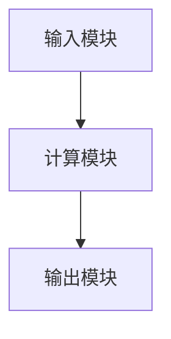

                 


# 格雷厄姆特价股票策略在不同公司治理模式下的效果

> **关键词**：格雷厄姆策略、价值投资、公司治理模式、股价表现、投资策略  
> **摘要**：本文探讨格雷厄姆特价股票策略在不同公司治理模式下的效果。通过分析家族企业、分散股份制和国有控股公司等不同治理模式下的股价表现，结合数学模型和实际案例，揭示公司治理对投资策略的影响。文章从理论到实践，系统分析格雷厄姆策略的应用场景，并提出优化建议。

---

## 引言

在金融投资领域，格雷厄姆的价值投资策略以其独特的方法论和长期有效性著称。然而，公司在不同治理模式下表现的差异，使得这一策略在实际应用中面临诸多挑战。本文旨在分析格雷厄姆策略在不同公司治理模式下的效果，探讨其在实际投资中的适用性和调整策略。

---

## 第一部分: 格雷厄姆特价股票策略的背景与核心概念

### 第1章: 格雷厄姆投资策略的核心概念

#### 1.1 价值投资的定义与核心理念

价值投资是一种以低于内在价值的价格买入优质股票的投资策略。格雷厄姆在其著作《证券分析》中提出，投资者应关注公司的基本面，寻找市场价格低于内在价值的股票。其核心理念包括：

- **安全边际**：购买价格远低于内在价值的股票，以降低风险。
- **内在价值**：通过基本面分析计算出的公司股票的合理价值。

#### 1.2 公司治理模式的多样性

公司治理模式影响公司的决策效率和管理结构，常见的模式包括：

- **家族企业**：控制权集中，决策效率高，但可能存在管理风险。
- **分散股份制**：股权分散，决策透明，但可能面临内部人控制的问题。
- **国有控股公司**：政府控制，政策导向明显，但市场灵活性可能受限。

#### 1.3 格雷厄姆策略的核心要素与边界

格雷厄姆策略的核心要素包括低市盈率、低市净率和高股息率。其边界条件包括公司财务状况稳健、行业地位稳固等。

---

## 第二部分: 格雷厄姆策略的核心原理与数学模型

### 第2章: 格雷厄姆策略的数学模型与公式

#### 2.1 内在价值计算公式

$$V = \frac{E}{(1 + r)^n}$$

其中，\( E \) 是未来现金流，\( r \) 是折现率，\( n \) 是时间跨度。

#### 2.2 安全边际计算

$$\text{安全边际} = \text{内在价值} - \text{市场价格}$$

#### 2.3 市盈率与市净率比较

市盈率 = $$\frac{\text{股价}}{\text{每股收益}}$$

市净率 = $$\frac{\text{股价}}{\text{每股净资产}}$$

---

## 第三部分: 不同公司治理模式下的股价表现分析

### 第3章: 家族企业治理模式下的股价表现

#### 3.1 家族企业的特点

- 控制权集中，决策效率高。
- 通常具有较高的股东忠诚度，但可能存在家族决策的局限性。

#### 3.2 格雷厄姆策略在家族企业中的应用

通过低市盈率和低市净率筛选，结合安全边际，选择具有潜力的家族企业股票。

---

### 第4章: 分散股份制公司的股价表现

#### 4.1 分散股份制的特点

- 股权分散，决策透明。
- 更容易受到市场波动影响。

#### 4.2 格雷厄姆策略的应用

通过分析公司基本面，寻找被低估的股票，注重股息率和财务稳定性。

---

### 第5章: 国有控股公司的股价表现

#### 5.1 国有控股公司的特点

- 受政策影响较大，市场灵活性较低。
- 股东结构复杂，可能存在效率问题。

#### 5.2 格雷厄姆策略的应用

关注财务稳健、股息率高的公司，同时考虑政策风险。

---

## 第四部分: 系统分析与架构设计方案

### 第6章: 格雷厄姆策略的系统架构设计

#### 6.1 数据收集与处理

- 数据来源：历史股价、财务报表、公司治理结构。
- 数据处理：清洗、转换和特征提取。

#### 6.2 系统功能设计

- **输入模块**：接收公司数据。
- **计算模块**：计算内在价值和安全边际。
- **输出模块**：生成投资建议。

#### 6.3 系统架构图



---

## 第五部分: 项目实战与案例分析

### 第7章: 格雷厄姆策略的实战应用

#### 7.1 环境配置

安装Python和相关库（如pandas、numpy）。

#### 7.2 核心代码实现

```python
import pandas as pd

def calculate_intrinsic_value(eps, growth_rate, discount_rate):
    return eps / (1 + discount_rate) ** growth_rate

def calculate_margin(stock_price, intrinsic_value):
    return intrinsic_value - stock_price
```

#### 7.3 数据处理与分析

分析不同治理模式下的股票数据，计算安全边际，筛选潜在投资标的。

---

## 结论

格雷厄姆策略在不同公司治理模式下的效果因公司治理结构而异。家族企业和国有控股公司可能存在较高的政策风险，而分散股份制公司受市场波动影响较大。投资者应根据公司治理模式调整策略，注重基本面分析和风险控制。

---

## 作者

作者：AI天才研究院/AI Genius Institute & 禅与计算机程序设计艺术/Zen And The Art of Computer Programming

