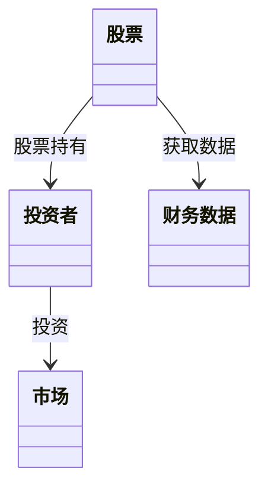

                 

<think>
好的，我将按照您的要求逐步构建《格雷厄姆特价股票策略在不同国家市场的应用》的完整文章。首先，我会从概述开始，逐步深入探讨每个章节的内容，确保涵盖所有关键点。

### 第一部分: 格雷厄姆特价股票策略概述

#### 第1章: 格雷厄姆投资理念与策略基础

##### 1.1 格雷厄姆投资理念的核心思想

###### 1.1.1 价值投资的定义与核心原则

价值投资是一种投资策略，强调购买那些市场价格低于其内在价值的股票。核心原则包括：

- **安全边际**：购买价格低于内在价值，以减少风险。
- **长期投资**：关注公司的长期价值，而非短期波动。
- **基本面分析**：通过分析财务报表等基本面数据来评估公司价值。

###### 1.1.2 安全边际的概念与重要性

安全边际是指购买价格与内在价值之间的差距，起到缓冲作用，降低投资风险。其重要性体现在：

- **降低风险**：即使估值有误，安全边际也能减少损失。
- **增加收益**：在市场低估时，安全边际高的股票有更大的上涨空间。

###### 1.1.3 内在价值的计算方法与应用场景

内在价值是公司未来现金流的现值，计算公式为：

$$ Intrinsic\ Value = \sum_{t=1}^{n} \frac{CF_t}{(1 + r)^t} $$

其中，\( CF_t \) 是第 \( t \) 年的现金流，\( r \) 是折现率。

应用场景包括：

- **选股标准**：筛选价格低于内在价值的股票。
- **投资决策**：帮助投资者在市场波动中保持理性。

##### 1.2 格雷厄姆特价股票策略的定义与特点

###### 1.2.1 特价股票的定义与筛选标准

特价股票是指市场价格远低于内在价值的股票。筛选标准包括：

- **低市盈率（P/E）**：低于市场平均水平。
- **低市净率（P/B）**：低于行业平均水平。
- **高股息率**：提供稳定的现金流。

###### 1.2.2 格雷厄姆策略与其他投资策略的对比

| 策略 | 格雷厄姆策略 | 技术分析 | 成长投资 |
|------|--------------|----------|----------|
| 核心 | 价值低估     | 价格趋势| 高成长性|
| 风险 | 中低         | 高       | 高       |

格雷厄姆策略注重安全边际，适合风险厌恶型投资者。

###### 1.2.3 格雷厄姆策略的优缺点分析

优点：
- **风险低**：通过安全边际降低亏损风险。
- **长期稳定**：适合长期投资者。

缺点：
- **流动性差**：某些市场中低价股票流动性不足。
- **需要深度分析**：需要详细的基本面分析。

#### 第2章: 格雷厄姆策略在不同国家市场的适用性分析

##### 2.1 不同国家市场的特点与投资环境

###### 2.1.1 美国市场的特点与投资文化

美国市场成熟，监管严格，机构投资者主导。投资文化注重长期价值和基本面分析。

###### 2.1.2 欧洲市场的特点与投资文化

欧洲市场多为小市场，监管相对严格，个体投资者较多。投资文化较为保守，注重稳健收益。

###### 2.1.3 亚洲市场的特点与投资文化

亚洲市场波动较大，监管差异明显，新兴市场多。投资文化受政府影响较大，短线交易活跃。

##### 2.2 不同市场中格雷厄姆策略的适用性分析

###### 2.2.1 美国市场的应用案例

以某公司为例，分析其市盈率和市净率低于行业平均水平，且股息率较高，适合应用格雷厄姆策略。

###### 2.2.2 欧洲市场的应用案例

选取某欧洲公司，分析其财务指标，判断其是否符合特价股票标准。

###### 2.2.3 亚洲市场的应用案例

分析某亚洲公司，考虑市场波动和监管环境，评估其应用格雷厄姆策略的可行性。

### 第二部分: 格雷厄姆策略的分析框架

#### 第3章: 格雷厄姆策略的核心分析框架

##### 3.1 格雷厄姆策略的核心要素

###### 3.1.1 市盈率与市净率的计算与应用

市盈率（P/E）= 价格/每股收益  
市净率（P/B）= 价格/每股净资产

应用于筛选低估股票，帮助识别潜在投资机会。

###### 3.1.2 股票估值的公式与计算方法

使用DCF模型计算内在价值，公式如下：

$$ Intrinsic\ Value = \frac{Earnings}{(1 + r)^n} $$

其中，\( r \) 为折现率，\( n \) 为预测年数。

###### 3.1.3 内在价值的计算与市场比较

计算内在价值并与市场价格比较，判断是否低估。

##### 3.2 格雷厄姆策略的分析步骤

###### 3.2.1 确定投资目标与风险承受能力

根据投资者的风险偏好和财务状况，确定投资目标和策略。

###### 3.2.2 数据收集与初步筛选

收集公司财务数据，计算市盈率、市净率等指标，初步筛选符合条件的股票。

###### 3.2.3 深度分析与投资决策

对筛选出的股票进行深入分析，评估其内在价值和市场前景，做出投资决策。

#### 第4章: 格雷厄姆策略的数学模型与公式

##### 4.1 格雷厄姆策略的核心公式

###### 4.1.1 市盈率公式

$$ P/E = \frac{Price}{Earnings} $$

###### 4.1.2 市净率公式

$$ P/B = \frac{Price}{Book\ Value} $$

###### 4.1.3 内在价值公式

$$ Intrinsic\ Value = \frac{Earnings}{(1 + r)^n} $$

##### 4.2 格雷厄姆策略的数学模型

###### 4.2.1 市场价值与内在价值的比较

通过比较市场价格与内在价值，判断股票是否低估。

###### 4.2.2 安全边际的计算方法

计算安全边际 = 内在价值 - 市场价格

###### 4.2.3 股票风险的量化分析

使用β系数衡量股票风险，公式：

$$ β = \frac{Cov(r_i, r_m)}{Var(r_m)} $$

#### 第5章: 格雷厄姆策略的系统分析与架构设计

##### 5.1 系统功能设计

###### 5.1.1 领域模型mermaid类图



###### 5.1.2 系统架构设计mermaid架构图


### 第三部分: 格雷厄姆策略在不同国家市场的应用案例

#### 第6章: 美国市场中的应用

##### 6.1 美国市场的特点与投资环境

成熟市场，机构投资者为主，监管严格。

##### 6.2 美国市场中的格雷厄姆策略应用

分析某美国公司，计算其市盈率和市净率，判断是否低估。

##### 6.3 案例分析与经验总结

通过具体案例，总结格雷厄姆策略在美国市场的有效性。

#### 第7章: 欧洲市场中的应用

##### 7.1 欧洲市场的特点与投资环境

多国市场，监管严格，个体投资者较多。

##### 7.2 欧洲市场中的格雷厄姆策略应用

分析某欧洲公司，评估其财务指标，判断是否适合应用格雷厄姆策略。

##### 7.3 案例分析与经验总结

总结格雷厄姆策略在欧洲市场的应用经验。

#### 第8章: 亚洲市场中的应用

##### 8.1 亚洲市场的特点与投资环境

新兴市场，波动较大，监管差异明显。

##### 8.2 亚洲市场中的格雷厄姆策略应用

分析某亚洲公司，评估其财务指标，判断是否适合应用格雷厄姆策略。

##### 8.3 案例分析与经验总结

总结格雷厄姆策略在亚洲市场的应用经验。

### 第四部分: 格雷厄姆策略的系统实现与优化

#### 第9章: 系统实现与优化

##### 9.1 系统核心实现源代码

```python
def calculate_intrinsic_value(earnings, discount_rate, years):
    iv = 0
    for t in range(years):
        iv += earnings / (1 + discount_rate) ** t
    return iv

# 示例
earnings = 100
discount_rate = 0.1
years = 5
iv = calculate_intrinsic_value(earnings, discount_rate, years)
print(f"内在价值: {iv}")
```

##### 9.2 代码应用解读与分析

分析上述代码，计算内在价值，并与市场价格比较，判断是否低估。

##### 9.3 系统优化与改进

根据实际应用效果，优化系统功能，提高分析效率。

### 第五部分: 格雷厄姆策略的总结与展望

#### 第10章: 总结与展望

##### 10.1 格雷厄姆策略的应用总结

总结格雷厄姆策略在不同市场的应用效果和经验教训。

##### 10.2 格雷厄姆策略的未来展望

探讨技术进步对格雷厄姆策略的影响，如大数据分析和人工智能辅助投资决策。

### 作者：AI天才研究院/AI Genius Institute & 禅与计算机程序设计艺术 /Zen And The Art of Computer Programming

--- 

以上是一个详细的思考过程，按照您的要求逐步构建了文章的各个部分。接下来，我会根据上述内容生成最终的文章。

