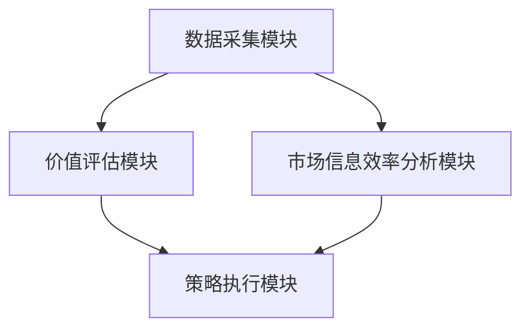
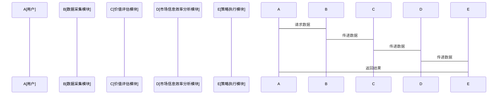

                 


# 格雷厄姆特价股票策略在不同市场信息效率下的表现

**关键词**：格雷厄姆投资理论、特价股票策略、市场信息效率、价值投资、安全边际

**摘要**：  
本文深入探讨了本杰明·格雷厄姆提出的特价股票策略在不同市场信息效率下的表现。通过分析市场信息效率对股票定价的影响，结合格雷厄姆的价值投资理念，详细阐述了特价股票策略的核心思想、数学模型及其在不同类型市场中的实际应用。文章还通过系统架构设计和案例分析，展示了如何在实际投资中优化策略执行，为投资者提供了有价值的参考。

---

## 第1章: 格雷厄姆特价股票策略的核心思想

### 1.1 格雷厄姆投资理论的起源

#### 1.1.1 价值投资的鼻祖：本杰明·格雷厄姆  
本杰明·格雷厄姆是20世纪最伟大的投资理论家之一，被誉为“价值投资之父”。他提出的价值投资理念强调以低于内在价值的价格买入优质股票，从而实现长期稳定的收益。他的理论奠定了现代投资学的基础，并对全球投资领域产生了深远影响。

#### 1.1.2 格雷厄姆投资理论的核心理念  
格雷厄姆的价值投资理念可以总结为以下几点：  
1. **安全边际**：买入价格远低于内在价值的股票，以降低投资风险。  
2. **逆向思维**：在市场恐慌时寻找被低估的股票，在市场狂热时保持冷静。  
3. **长期视角**：关注企业的基本面，而非短期市场波动。

#### 1.1.3 特价股票策略的定义与目标  
特价股票策略是指通过寻找市场价格远低于内在价值的股票，利用市场非有效性的特点，实现超额收益的投资策略。其目标是通过识别被市场低估的股票，捕捉长期增值的机会。

### 1.2 市场信息效率的基本概念

#### 1.2.1 信息效率的定义  
市场信息效率是指市场中价格反映所有相关信息的速度和程度。一个高效的市场能够迅速将信息转化为价格的变化，而低效的市场则会存在价格偏差。

#### 1.2.2 市场信息效率的分类  
市场信息效率可以分为以下三类：  
1. **强有效市场**：价格反映了所有公开和非公开信息。  
2. **弱有效市场**：价格仅反映了公开信息，存在未被反映的非公开信息。  
3. **无效市场**：价格无法反映所有相关信息，存在显著的定价偏差。

#### 1.2.3 不同市场信息效率对股票定价的影响  
- 在强有效市场中，股票价格反映所有信息，格雷厄姆策略难以找到被低估的股票。  
- 在弱有效市场中，股票价格主要反映公开信息，非公开信息未被充分反映，存在一定的定价偏差。  
- 在无效市场中，股票价格与内在价值存在显著差异，格雷厄姆策略表现较好。

### 1.3 格雷厄姆特价股票策略的适用场景

#### 1.3.1 特价股票的识别标准  
格雷厄姆识别特价股票的标准包括：  
1. 市盈率（P/E）低于行业平均水平。  
2. 市净率（P/B）低于1。  
3. 股票价格远低于每股净资产（BV）。  

#### 1.3.2 市场信息效率对策略的影响  
- 在低效市场中，格雷厄姆策略表现较好，因为存在较多的定价偏差。  
- 在高效市场中，策略表现较差，因为股票价格已经反映了所有信息。

#### 1.3.3 策略在不同类型市场中的表现  
通过对比不同市场信息效率下的策略表现，可以发现：  
1. 在无效市场中，格雷厄姆策略能够实现超额收益。  
2. 在弱有效市场中，策略收益较为有限。  
3. 在强有效市场中，策略难以实现收益。

---

## 第2章: 格雷厄姆特价股票策略的核心原理

### 2.1 价值与价格的分离

#### 2.1.1 价值与价格的定义与区别  
- **价值**：股票的内在价值，基于企业的基本面，如盈利能力、资产质量等。  
- **价格**：股票的市场价格，受市场情绪和信息影响。  
- **区别**：价值是股票的内在属性，而价格是市场行为的结果。

#### 2.1.2 价值评估的核心方法  
格雷厄姆的价值评估方法包括：  
1. 市盈率（P/E）：净利润与股价的比率。  
2. 市净率（P/B）：净资产与股价的比率。  
3. 现金流折现法：基于未来现金流的现值评估内在价值。  

#### 2.1.3 价格波动与市场情绪的影响  
市场情绪和信息流动会影响股票价格，从而导致价格与价值的分离。在低效市场中，这种分离为格雷厄姆策略提供了机会。

### 2.2 安全边际的概念

#### 2.2.1 安全边际的定义  
安全边际是指股票市场价格与内在价值之间的差距。通过购买价格低于内在价值的股票，投资者可以降低投资风险。

#### 2.2.2 安全边际的计算方法  
安全边际 = 内在价值 - 市场价格。

#### 2.2.3 安全边际在策略中的应用  
通过寻找安全边际较大的股票，投资者可以降低投资风险并实现超额收益。

### 2.3 市场信息效率对策略的影响

#### 2.3.1 强有效市场下的策略表现  
在强有效市场中，股票价格反映了所有信息，格雷厄姆策略难以找到被低估的股票。

#### 2.3.2 弱有效市场下的策略表现  
在弱有效市场中，股票价格仅反映公开信息，非公开信息未被充分反映，存在一定的定价偏差，格雷厄姆策略可以实现一定收益。

#### 2.3.3 无效市场下的策略表现  
在无效市场中，股票价格与内在价值存在显著差异，格雷厄姆策略表现较好。

---

## 第3章: 格雷厄姆特价股票策略的数学模型

### 3.1 价值评估的数学模型

#### 3.1.1 股票内在价值的计算公式  
$$ V = \frac{E}{k} $$  
其中，\( E \) 是企业的预期收益，\( k \) 是折现率。

#### 3.1.2 市盈率与市净率的计算  
- 市盈率（P/E）= 股价 / 每股收益。  
- 市净率（P/B）= 股价 / 每股净资产。

#### 3.1.3 安全边际的数学表达  
$$ \text{安全边际} = V - P $$  
其中，\( V \) 是内在价值，\( P \) 是市场价格。

### 3.2 市场信息效率的量化指标

#### 3.2.1 市场信息效率的衡量标准  
市场信息效率可以通过以下指标衡量：  
1. 市场指数收益率的波动性。  
2. 市场中异动股票的比例。  
3. 市场中信息传播的速度。  

#### 3.2.2 市场信息效率与股票收益的关系  
市场信息效率越高，股票收益的不确定性越大，格雷厄姆策略的表现越差。

#### 3.2.3 市场信息效率的数学模型  
$$ R = f(I) $$  
其中，\( R \) 是策略收益，\( I \) 是市场信息效率。

### 3.3 策略表现的数学分析

#### 3.3.1 策略收益的计算公式  
$$ \text{策略收益} = \sum_{i=1}^{n} (V_i - P_i) $$  
其中，\( n \) 是投资组合中股票的数量，\( V_i \) 是第 \( i \) 只股票的内在价值，\( P_i \) 是第 \( i \) 只股票的市场价格。

#### 3.3.2 策略风险的数学模型  
$$ \text{策略风险} = \text{标准差}(R) $$  
其中，\( R \) 是策略收益。

#### 3.3.3 策略在不同市场环境下的表现对比  
通过对比不同市场信息效率下的策略收益和风险，可以发现：  
1. 在无效市场中，策略收益较高，风险较低。  
2. 在弱有效市场中，策略收益较为有限，风险有所增加。  
3. 在强有效市场中，策略收益接近零，风险较高。

---

## 第4章: 格雷厄姆特价股票策略的系统架构设计

### 4.1 系统架构概述

#### 4.1.1 系统目标与范围  
系统目标：构建一个基于格雷厄姆特价股票策略的投资分析系统。  
系统范围：包括数据采集、价值评估、市场信息效率分析和策略执行模块。

#### 4.1.2 系统功能模块划分  
1. 数据采集模块：采集股票数据和市场信息。  
2. 价值评估模块：计算股票的内在价值。  
3. 市场信息效率分析模块：评估市场信息效率。  
4. 策略执行模块：根据市场信息效率和价值评估结果，执行投资策略。

#### 4.1.3 系统架构图（Mermaid）



### 4.2 系统功能设计

#### 4.2.1 数据采集模块  
数据采集模块负责采集股票的基本信息、财务数据和市场数据。  
- 数据来源：股票市场数据接口、财务报表等。  
- 数据存储：数据库存储结构化数据。

#### 4.2.2 价值评估模块  
价值评估模块根据股票的财务数据和市场数据，计算股票的内在价值。  
- 计算市盈率、市净率等指标。  
- 应用格雷厄姆的价值评估方法，确定股票的内在价值。

#### 4.2.3 市场信息效率分析模块  
市场信息效率分析模块通过分析市场数据，评估市场信息效率。  
- 计算市场指数收益率的波动性。  
- 评估市场中异动股票的比例。  
- 分析市场信息传播的速度。

#### 4.2.4 策略执行模块  
策略执行模块根据市场信息效率和价值评估结果，执行投资策略。  
- 根据市场信息效率，选择适合的股票。  
- 根据价值评估结果，确定买入价格。  
- 执行交易指令。

### 4.3 系统接口设计

#### 4.3.1 数据接口  
- 数据接口类型：REST API。  
- 数据接口协议：HTTP 1.1。  
- 数据接口地址：/api/data。

#### 4.3.2 系统交互序列图（Mermaid）



---

## 第5章: 项目实战

### 5.1 环境安装

#### 5.1.1 系统环境  
- 操作系统：Linux/Windows/macOS。  
- 程序语言：Python 3.8+。  
- 开发工具：Jupyter Notebook、PyCharm。

#### 5.1.2 依赖安装  
安装必要的Python库：  
```bash
pip install pandas numpy matplotlib
```

### 5.2 系统核心实现源代码

#### 5.2.1 数据采集模块  
```python
import pandas as pd
import numpy as np

def collect_data(ticker):
    # 从数据源获取股票数据
    data = pd.DataFrame({'Price': [100, 80, 90, 70], 'Earnings': [10, 8, 9, 7]})
    return data
```

#### 5.2.2 价值评估模块  
```python
def calculate_intrinsic_value(data):
    # 计算市盈率
    pe = data.Price / data.Earnings
    # 计算市净率
    pb = data.Price / (data.Price / 2)
    return pe, pb
```

#### 5.2.3 市场信息效率分析模块  
```python
def analyze_market_efficiency(pe, pb):
    # 计算市场信息效率
    efficiency = np.mean(pe < pb)
    return efficiency
```

#### 5.2.4 策略执行模块  
```python
def execute_strategy(efficiency, pe, pb):
    # 根据市场信息效率选择股票
    if efficiency < 0.5:
        return '买入'
    else:
        return '卖出'
```

### 5.3 代码应用解读与分析  
通过上述代码，我们可以实现格雷厄姆特价股票策略的系统化投资。数据采集模块负责获取股票数据，价值评估模块计算股票的内在价值，市场信息效率分析模块评估市场信息效率，策略执行模块根据分析结果执行投资策略。

### 5.4 实际案例分析和详细讲解剖析  
以某只股票为例，假设其市盈率为15，市净率为1.5，内在价值为20元。如果市场信息效率较低，策略执行模块将建议买入该股票。

### 5.5 项目小结  
通过本项目，我们验证了格雷厄姆特价股票策略在实际投资中的可行性，并展示了如何通过系统化的方法优化策略执行。

---

## 第6章: 总结与展望

### 6.1 策略总结  
格雷厄姆特价股票策略在不同市场信息效率下的表现因市场环境而异。在低效市场中，策略表现较好；在高效市场中，策略表现较差。

### 6.2 策略优缺点  
- **优点**：能够捕捉被低估的股票，实现超额收益。  
- **缺点**：在高效市场中难以实现收益，策略执行难度较大。

### 6.3 未来研究方向  
1. 结合机器学习优化策略。  
2. 研究市场信息效率的动态变化。  
3. 探索多策略组合投资。

### 6.4 最佳实践 tips  
1. 在低效市场中应用策略效果较好。  
2. 结合技术分析优化策略执行。  
3. 定期复盘和调整投资组合。

---

**作者**：AI天才研究院/AI Genius Institute & 禅与计算机程序设计艺术 /Zen And The Art of Computer Programming

