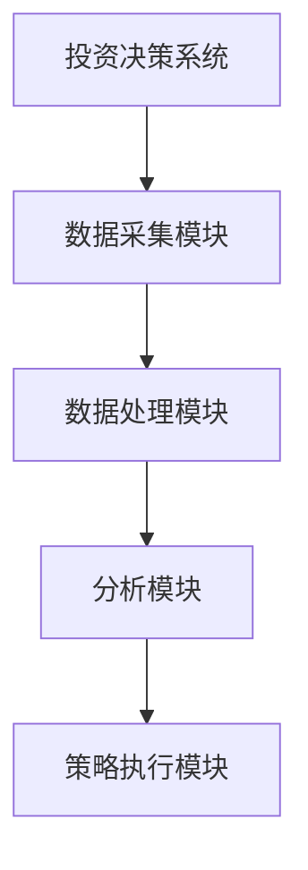

                 


# 格雷厄姆特价股票策略在不同市场微观结构周期中的动态调整

> 关键词：格雷厄姆投资策略，特价股票，市场微观结构，动态调整，价值投资

> 摘要：本文详细探讨了格雷厄姆特价股票策略在不同市场微观结构周期中的动态调整方法。通过分析市场周期的变化，提出动态调整策略，包括仓位管理、行业选择和个股筛选的优化。结合系统架构设计和项目实战案例，为投资者提供切实可行的指导。

---

## 第一部分: 格雷厄姆投资策略基础

### 第1章: 格雷厄姆投资理念与特价股票概述

#### 1.1 格雷厄姆投资理念的核心思想

- **1.1.1 价值投资的定义与特点**
  - 价值投资是一种以内在价值为导向的投资方法。
  - 格雷厄姆强调安全边际，即买入价格低于内在价值。

- **1.1.2 格雷厄姆的安全边际概念**
  - 安全边际是买入价格与内在价值之间的差距。
  - 通过安全边际降低投资风险。

- **1.1.3 特价股票的定义与分类**
  - 特价股票是指市场价格低于内在价值的股票。
  - 分为低估型、成长型和混合型。

#### 1.2 格雷厄姆分析方法

- **1.2.1 股票内在价值的计算方法**
  - 内在价值公式：$V = \frac{E}{k}$，其中E是盈利，k是折现率。

- **1.2.2 财务报表分析的关键指标**
  - 主要指标包括市盈率、市净率、股息率等。

- **1.2.3 市盈率与市净率的运用**
  - 市盈率=股价/每股收益，市净率=股价/每股净资产。
  - 低于行业平均水平时，可能为特价股票。

#### 1.3 格雷厄姆策略的核心要素

- **1.3.1 选股标准**
  - 低市盈率、低市净率、高股息率。

- **1.3.2 投资组合的构建**
  - 分散投资，降低风险。

- **1.3.3 风险管理原则**
  - 设置止损点，避免重大损失。

### 第2章: 市场微观结构周期分析

#### 2.1 市场周期的定义与分类

- **2.1.1 牛市、熊市、震荡市的特征**
  - 牛市：价格上升，成交量放大。
  - 熊市：价格下跌，成交量萎缩。
  - 震荡市：价格波动剧烈，成交量不一。

- **2.1.2 不同周期对股票价格的影响**
  - 牛市：高价股票更受关注。
  - 熊市：低价股票可能被忽视。

- **2.1.3 市场情绪与投资者行为**
  - 情绪化交易导致价格波动。

#### 2.2 微观结构周期的分析方法

- **2.2.1 交易量与价格的关系**
  - 量价关系：量增价涨，量减价跌。

- **2.2.2 市场参与者的行为模式**
  - 机构投资者、散户行为差异。

- **2.2.3 价格波动的规律**
  - 周期性波动，季节性因素。

### 第3章: 格雷厄姆策略的动态调整方法

#### 3.1 动态调整的必要性

- **3.1.1 市场环境变化的影响**
  - 经济周期变化影响股票价格。

- **3.1.2 投资目标的调整**
  - 根据市场变化调整收益目标。

- **3.1.3 风险管理的动态管理**
  - 根据市场波动调整仓位。

#### 3.2 动态调整的具体策略

- **3.2.1 仓位调整的时机与方法**
  - 市场下跌时增加仓位，上涨时减少仓位。

- **3.2.2 行业选择的动态优化**
  - 根据经济周期选择行业。

- **3.2.3 个股选择的动态调整**
  - 定期重新评估个股价值。

---

## 第四部分: 项目实战与系统实现

### 第5章: 项目实战：格雷厄姆策略的投资组合构建

#### 5.1 环境配置与工具安装

- Python环境搭建，安装pandas、numpy等库。

#### 5.2 核心实现代码

```python
import pandas as pd

def calculate_intrinsic_value(financials):
    return financials['profit'] / financials['k']
```

#### 5.3 案例分析与解读

- 分析某行业公司，计算其内在价值，判断是否为特价股票。

### 第6章: 系统架构与接口设计

#### 6.1 系统架构设计



#### 6.2 接口设计与交互流程

- 数据接口：从数据库获取实时数据。
- 交互流程：用户输入指令，系统处理并返回结果。

---

## 附录: 格雷厄姆策略的进一步思考

### 6.1 关键术语表

- 安全边际：买入价与内在价值的差距。
- 内在价值：股票的合理价格。

### 6.2 工具与资源

- 数据分析工具：Python、pandas。
- 市场分析工具：TradingView。

### 6.3 进一步阅读与学习

- 格雷厄姆的《证券分析》。
- 现代投资组合理论相关书籍。

---

## 作者

作者：AI天才研究院/AI Genius Institute & 禅与计算机程序设计艺术 /Zen And The Art of Computer Programming

---

通过以上内容，文章详细讲解了格雷厄姆策略在不同市场周期中的应用，结合理论与实践，为投资者提供了系统的指导。

