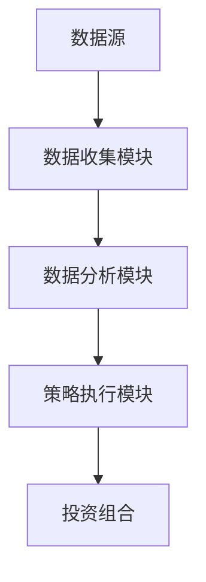
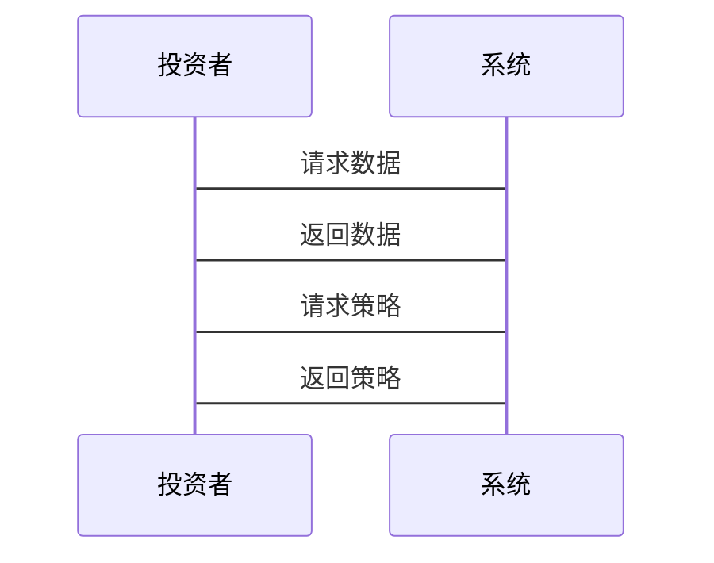

                 

# 格雷厄姆特价股票策略在不同市场成熟度中的动态调整

> 关键词：格雷厄姆投资理论，特价股票策略，市场成熟度，动态调整，价值投资，安全边际

> 摘要：本文系统地探讨了格雷厄姆价值投资理论在不同市场成熟度下的应用策略，特别是特价股票策略的动态调整方法。通过分析不同市场的特点，结合格雷厄姆的安全边际理论和内在价值计算方法，本文提出了在不同市场环境下如何优化投资策略的具体步骤和实践方法。文章还提供了丰富的案例分析和系统设计，帮助投资者更好地理解和应用格雷厄姆策略。

---

# 第1章 格雷厄姆特价股票策略概述

## 1.1 格雷厄姆投资理论基础

### 1.1.1 格雷厄姆的价值投资理念

本杰明·格雷厄姆（Benjamin Graham）是价值投资的鼻祖，他提出的价值投资理念深刻影响了全球投资界。格雷厄姆的价值投资理论强调以低于内在价值的价格买入优质股票，长期持有，等待市场重新认识到其真实价值。

格雷厄姆认为，股票不仅仅是金融工具，更是企业的一部分。投资者应该关注企业的基本面，而不是市场的短期波动。他提出的安全边际概念，即买入价格低于内在价值，是价值投资的核心原则。

$$
\text{安全边际} = \text{内在价值} - \text{市场价格}
$$

### 1.1.2 格雷厄姆特价股票的定义与特征

格雷厄姆的特价股票是指市场价格显著低于内在价值的股票。这种股票通常具有以下特征：

1. **低市盈率**：市场价格与公司盈利能力之间的比率较低。
2. **低市净率**：市场价格与资产净值之间的比率较低。
3. **高股息率**：相对于市场平均水平，股息收益率较高。
4. **稳定的财务状况**：公司具有较强的财务实力和较低的负债率。

### 1.1.3 格雷厄姆策略的核心原则

格雷厄姆策略的核心原则包括：

1. **安全边际**：买入价格远低于内在价值。
2. **分散投资**：通过投资多个股票降低风险。
3. **长期持有**：避免频繁交易，减少交易成本。

## 1.2 特价股票策略的基本框架

### 1.2.1 特价股票的筛选标准

格雷厄姆的特价股票筛选标准包括：

1. **市盈率低于行业平均水平**。
2. **市净率低于行业平均水平**。
3. **股息收益率高于市场平均水平**。
4. **公司具有稳定的财务状况**。

### 1.2.2 安全边际的概念与计算

安全边际是格雷厄姆策略的核心，它通过比较市场价格与内在价值之间的差距来衡量投资的安全性。计算公式如下：

$$
\text{安全边际} = \text{内在价值} - \text{市场价格}
$$

### 1.2.3 特价股票投资的逻辑与流程

1. 确定目标市场：选择具有投资潜力的市场。
2. 筛选特价股票：根据格雷厄姆的标准筛选股票。
3. 计算内在价值：使用格雷厄姆的方法估算股票的内在价值。
4. 评估安全边际：比较市场价格与内在价值，确定投资的安全性。
5. 构建投资组合：分散投资，降低风险。

## 1.3 市场成熟度对策略的影响

### 1.3.1 市场成熟度的定义与分类

市场成熟度是指市场的发育程度和市场的参与者对价格发现的能力。市场成熟度可以分为以下几类：

1. **初级市场**：市场参与者较少，价格波动较大。
2. **成熟市场**：市场参与者众多，价格发现能力强。
3. **过度成熟市场**：市场参与者过多，可能出现价格泡沫。

### 1.3.2 不同市场成熟度下的投资机会

在初级市场中，投资者可以发现更多的特价股票机会，但市场波动较大，风险较高。在成熟市场中，投资者可以通过安全边际策略找到低估股票，但竞争激烈，机会较少。在过度成熟市场中，价格可能被高估，投资机会有限。

### 1.3.3 市场成熟度与策略调整的关系

在不同市场成熟度下，投资者需要动态调整策略。例如，在初级市场中，投资者需要更加注重安全边际；在成熟市场中，投资者可以更加注重内在价值的估算；在过度成熟市场中，投资者需要更加谨慎，避免高估股票。

---

# 第2章 格雷厄姆特价股票策略的理论基础

## 2.1 格雷厄姆安全边际理论

### 2.1.1 安全边际的定义

安全边际是格雷厄姆策略的核心，它通过比较市场价格与内在价值之间的差距来衡量投资的安全性。安全边际越大，投资风险越小。

### 2.1.2 安全边际的计算方法

安全边际的计算公式如下：

$$
\text{安全边际} = \text{内在价值} - \text{市场价格}
$$

### 2.1.3 安全边际在策略中的应用

投资者在选择股票时，应选择安全边际较大的股票，以降低投资风险。

## 2.2 内在价值计算方法

### 2.2.1 内在价值的定义

内在价值是股票的真实价值，它反映了公司的基本面情况。

### 2.2.2 格雷厄姆内在价值计算公式

格雷厄姆的内在价值计算公式如下：

$$
\text{内在价值} = \frac{\text{每股收益} \times (5 + 市盈率)}{市盈率}
$$

### 2.2.3 内在价值与市场价的对比分析

投资者应比较市场价格与内在价值，选择市场价格低于内在价值的股票。

## 2.3 投资组合构建与风险控制

### 2.3.1 投资组合的构建原则

投资者应分散投资，降低风险。

### 2.3.2 风险控制的策略与方法

投资者应定期评估投资组合的风险，及时调整投资策略。

### 2.3.3 格雷厄姆策略中的分散投资

格雷厄姆强调分散投资，通过投资多个股票降低风险。

---

# 第3章 不同市场成熟度下的策略调整

## 3.1 市场成熟度的分类与特征

### 3.1.1 初级市场：新兴市场的特点

初级市场中，市场参与者较少，价格波动较大，但存在较多的特价股票机会。

### 3.1.2 成熟市场：发达市场的特点

成熟市场中，市场参与者众多，价格发现能力强，但竞争激烈，机会较少。

### 3.1.3 过度成熟市场：泡沫市场的特征

过度成熟市场中，价格可能被高估，存在泡沫，投资机会有限。

## 3.2 不同市场成熟度下的策略调整

### 3.2.1 新兴市场中的策略调整

在新兴市场中，投资者应更加注重安全边际，选择低市盈率、低市净率的股票。

### 3.2.2 成熟市场中的策略优化

在成熟市场中，投资者应更加注重内在价值的估算，选择市场价格低于内在价值的股票。

### 3.2.3 过度成熟市场中的风险规避

在过度成熟市场中，投资者应避免高估股票，选择具有稳定财务状况的股票。

## 3.3 市场周期与策略动态调整

### 3.3.1 市场周期的定义与阶段划分

市场周期可以分为上升周期和下降周期。

### 3.3.2 不同周期下的策略调整

在上升周期中，投资者应注重安全边际；在下降周期中，投资者应注重内在价值。

### 3.3.3 动态调整的触发条件与执行流程

动态调整的触发条件包括市场环境变化和公司基本面变化。执行流程包括重新评估股票价值和调整投资组合。

---

# 第4章 格雷厄姆策略的动态调整方法

## 4.1 动态调整的核心思想

### 4.1.1 动态调整的必要性

市场环境不断变化，投资者需要动态调整策略。

### 4.1.2 动态调整的原则与框架

动态调整应遵循安全边际原则和分散投资原则。

### 4.1.3 动态调整的实施步骤

1. 定期评估投资组合。
2. 重新评估股票的价值。
3. 调整投资组合。

## 4.2 动态调整的具体策略

### 4.2.1 市场环境变化下的策略调整

在市场环境变化时，投资者应重新评估股票的价值。

### 4.2.2 公司基本面变化下的策略调整

在公司基本面变化时，投资者应重新评估股票的价值。

### 4.2.3 动态调整的数学模型

$$
\text{调整后价格} = \text{内在价值} \times \text{市场环境因素} \times \text{公司基本面因素}
$$

## 4.3 动态调整的实施工具

### 4.3.1 数据分析工具

投资者可以使用数据分析工具（如Python）来分析市场数据。

### 4.3.2 投资组合管理工具

投资者可以使用投资组合管理工具来管理投资组合。

---

# 第5章 格雷厄姆策略的系统设计与实现

## 5.1 系统功能设计

### 5.1.1 数据收集模块

数据收集模块负责收集市场数据。

### 5.1.2 数据分析模块

数据分析模块负责分析市场数据。

### 5.1.3 策略执行模块

策略执行模块负责根据分析结果执行投资策略。

## 5.2 系统架构设计

### 5.2.1 系统架构图

### 5.2.2 系统接口设计

系统接口包括数据接口和策略接口。

### 5.2.3 系统交互序列图

---

# 第6章 实战案例分析

## 6.1 案例背景

### 6.1.1 案例市场环境

选择一个新兴市场作为案例。

### 6.1.2 案例公司选择

选择一家具有稳定财务状况的公司。

## 6.2 数据分析与策略实施

### 6.2.1 数据收集

收集公司的财务数据和市场数据。

### 6.2.2 内在价值计算

使用格雷厄姆的方法计算公司的内在价值。

### 6.2.3 策略实施

根据策略选择合适的股票进行投资。

## 6.3 投资效果评估

### 6.3.1 投资收益计算

计算投资的收益和风险。

### 6.3.2 策略优化

根据市场变化优化策略。

---

# 第7章 风险管理与最佳实践

## 7.1 风险管理策略

### 7.1.1 风险控制原则

分散投资，避免过度集中。

### 7.1.2 风险监控工具

使用数据分析工具监控市场风险。

## 7.2 最佳实践 tips

### 7.2.1 定期评估投资组合

定期评估投资组合，及时调整策略。

### 7.2.2 保持安全边际

始终选择安全边际较大的股票。

### 7.2.3 避免情绪化决策

避免因市场波动而做出情绪化决策。

---

# 第8章 结语与展望

## 8.1 本文总结

本文系统地探讨了格雷厄姆特价股票策略在不同市场成熟度中的应用，提出了动态调整的方法。

## 8.2 未来展望

未来可以进一步研究市场环境对策略的影响，优化策略的动态调整方法。

---

# 作者

作者：AI天才研究院/AI Genius Institute & 禅与计算机程序设计艺术/Zen And The Art of Computer Programming

