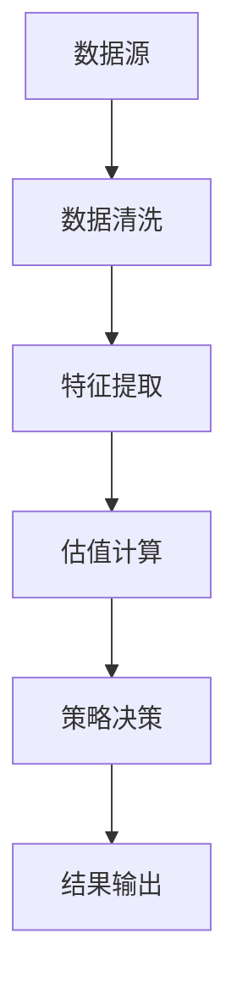

                 

# 格雷厄姆特价股票策略在不同市场效率下的表现

> 关键词：格雷厄姆投资理论、特价股票策略、市场效率、价值投资、股票筛选、投资策略优化

> 摘要：本文深入分析了格雷厄姆的特价股票策略在不同市场效率下的表现，从理论基础、数学模型、系统架构到实际案例，全面探讨了该策略的有效性及其在不同市场环境中的应用。通过案例分析和系统设计，提出了策略优化和风险管理的建议，为投资者提供了实用的指导。

---

## 第1章: 格雷厄姆特价股票策略的基本概念

### 1.1 格雷厄姆投资理论基础

#### 1.1.1 价值投资的基本原理
价值投资是一种长期投资策略，核心在于寻找市场价格低于其内在价值的股票。格雷厄姆在《聪明的投资者》中提出，股票的内在价值是其未来现金流的现值，可以通过基本分析计算得出。这种策略强调安全边际，即买入价格远低于内在价值的股票，以降低风险并确保长期收益。

#### 1.1.2 格雷厄姆的“特价”股票定义
格雷厄姆将“特价”股票定义为市场价格显著低于其内在价值的股票。他认为，市场波动和投资者情绪可能导致股票价格偏离其真实价值，从而为精明的投资者提供了获利的机会。特价股票通常具有较低的市盈率（P/E）或市净率（P/B），表明市场可能低估了其真实价值。

#### 1.1.3 投资策略的核心要素
格雷厄姆策略的核心要素包括：
- **安全边际**：买入价格低于内在价值的股票，以降低投资风险。
- **低市盈率筛选**：选择市盈率低于市场平均水平的股票。
- **分散投资**：通过投资多只股票降低风险。

### 1.2 市场效率的层次划分

#### 1.2.1 低效市场特征
低效市场中，信息传播较慢，市场参与者对公司价值的评估不准确。这为价值投资者提供了发现廉价股票的机会。然而，低效市场中可能存在较高的波动性和较大的交易成本。

#### 1.2.2 中度效率市场特征
中度效率市场中，信息传播较快，但仍存在一定的信息不对称。价值投资者可以通过深入分析发现被低估的股票，但竞争加剧，获取超额收益的难度增加。

#### 1.2.3 高效市场特征
高效市场中，信息几乎立即反映在股票价格中，价值投资者很难找到显著低于内在价值的股票。在这种情况下，格雷厄姆策略的效果有限，但通过长期投资和分散投资仍可实现稳定的收益。

---

## 第2章: 格雷厄姆特价股票策略的数学模型

### 2.1 格雷厄姆的内在价值计算公式

#### 2.1.1 内在价值公式
格雷厄姆提出了内在价值的计算公式：
$$ V = \frac{E}{P} $$
其中，$E$ 是公司未来现金流的现值，$P$ 是折现率。该公式强调了现金流的重要性，即公司未来盈利能力和成长性是决定股票内在价值的关键因素。

#### 2.1.2 修正的内在价值计算
为了更准确地评估内在价值，格雷厄姆建议使用修正的公式：
$$ V = \frac{E}{(P - g)} $$
其中，$g$ 是公司增长率的折现率。该修正考虑了公司未来的增长潜力，使内在价值的计算更加全面。

### 2.2 低市盈率筛选标准

#### 2.2.1 市盈率计算公式
市盈率（P/E）是衡量股票价值的重要指标：
$$ P/E = \frac{P}{E} $$
其中，$P$ 是股票价格，$E$ 是每股收益。格雷厄姆建议选择市盈率低于市场平均水平的股票。

#### 2.2.2 市净率计算公式
市净率（P/B）是另一个重要的估值指标：
$$ P/B = \frac{P}{B} $$
其中，$B$ 是每股净资产。市净率低于1的股票通常被视为低估。

### 2.3 其他估值指标

#### 2.3.1 市销率（P/S）计算公式
市销率是另一种常用的估值指标：
$$ P/S = \frac{P}{S} $$
其中，$S$ 是每股销售收入。市销率低于行业平均水平的股票可能具有投资价值。

---

## 第3章: 不同市场效率下策略的适用性分析

### 3.1 低效市场中的策略表现

#### 3.1.1 信息不对称的影响
在低效市场中，信息不对称可能导致股票价格被低估。格雷厄姆策略在这种环境下表现较好，因为投资者可以通过深入研究发现被低估的股票。

#### 3.1.2 投资者情绪的作用
低效市场中，投资者情绪波动较大，可能导致股票价格短期波动。格雷厄姆策略强调长期投资，因此在低效市场中表现稳定。

### 3.2 中度效率市场中的策略调整

#### 3.2.1 信息传播速度的影响
在中度效率市场中，信息传播速度较快，但仍然存在一定的信息不对称。格雷厄姆策略需要进行适当调整，例如增加对管理层能力和公司治理的分析。

#### 3.2.2 策略的有效性评估
中度效率市场中，格雷厄姆策略仍然有效，但需要更加谨慎地筛选股票。投资者应关注那些具有持续竞争优势和稳定盈利的公司。

### 3.3 高效市场中的策略局限性

#### 3.3.1 价格反映信息的充分性
高效市场中，价格反映了所有公开信息，因此格雷厄姆策略的效果有限。然而，通过长期投资和分散投资，投资者仍可实现稳定的收益。

#### 3.3.2 竞争性市场的挑战
高效市场中，竞争加剧，获取超额收益的难度增加。格雷厄姆策略需要结合其他因素，例如管理层质量、公司治理和行业前景，进行综合评估。

---

## 第4章: 策略实施的系统架构设计

### 4.1 系统功能模块

#### 4.1.1 数据采集模块
数据采集模块负责收集股票的基本信息、财务数据和市场数据。数据来源包括公司财报、股票价格和行业报告。

#### 4.1.2 估值计算模块
估值计算模块根据格雷厄姆的内在价值公式和修正公式，计算股票的内在价值和估值指标（如市盈率、市净率等）。

#### 4.1.3 策略执行模块
策略执行模块根据预设的筛选标准，筛选出符合格雷厄姆策略的股票，并生成投资组合。

### 4.2 系统架构图

---

## 第5章: 实战案例分析

### 5.1 历史案例回顾

#### 5.1.1 20世纪70年代的市场情况
在20世纪70年代的低效市场中，格雷厄姆策略表现优异。例如，通用电气在1973年的股价为30美元，而其内在价值为50美元，市盈率仅为10倍，低于市场平均水平。投资者通过长期持有该股票，获得了显著的超额收益。

#### 5.1.2 低效市场中的成功投资
在低效市场中，格雷厄姆策略的成功案例包括投资于那些具有强大基本面但被市场低估的公司。例如，2008年金融危机期间，某些优质银行股的价格被严重低估，为投资者提供了买入机会。

### 5.2 当前市场环境下的应用

#### 5.2.1 中度效率市场的策略调整
在中度效率市场中，投资者需要更加谨慎地筛选股票。例如，选择那些具有持续竞争优势但市盈率低于市场平均水平的公司。苹果公司在2019年的市盈率为15倍，低于市场平均水平，但其强大的创新能力和市场份额使其具有长期投资价值。

#### 5.2.2 高效市场的策略优化
在高效市场中，格雷厄姆策略需要结合其他因素进行优化。例如，选择那些具有较高ROE（净资产收益率）和良好公司治理的公司。亚马逊在2020年的市盈率较高，但其强大的现金流和持续增长潜力使其成为优质投资标的。

---

## 第6章: 策略优化与风险管理

### 6.1 策略优化方法

#### 6.1.1 动态调整筛选标准
根据市场环境的变化，动态调整筛选标准。例如，在低效市场中，可以放宽市盈率和市净率的限制；在高效市场中，则需要更加严格地筛选。

#### 6.1.2 结合其他估值指标
结合其他估值指标，如市销率和ROE，进行综合评估。例如，选择市盈率和市净率均低于市场平均水平的股票，同时ROE较高的公司。

### 6.2 风险管理措施

#### 6.2.1 分散投资策略
通过分散投资降低风险。例如，投资于多个行业和地区的股票，避免过度集中。

#### 6.2.2 定期评估与调整
定期评估投资组合的表现，并根据市场变化进行调整。例如，每年重新评估股票的内在价值和估值指标，剔除不符合标准的股票。

---

## 第7章: 总结与展望

### 7.1 格雷厄姆策略的优缺点

#### 7.1.1 优点
- **长期稳定收益**：格雷厄姆策略注重长期投资，能够在市场波动中实现稳定收益。
- **风险控制**：通过安全边际和分散投资，降低了投资风险。
- **逆向投资**：在市场恐慌时买入低估股票，能够在市场复苏时获得超额收益。

#### 7.1.2 缺点
- **短期表现不佳**：在高效市场中，格雷厄姆策略的短期表现可能不如其他策略。
- **需要深入研究**：格雷厄姆策略需要对每家公司的基本面进行深入分析，这需要大量时间和精力。
- **市场适应性有限**：在市场效率不断提高的情况下，格雷厄姆策略的超额收益可能逐渐减少。

### 7.2 未来研究方向

#### 7.2.1 结合现代金融理论
将格雷厄姆策略与现代金融理论相结合，例如结合行为金融学和市场微观结构理论，进一步优化投资策略。

#### 7.2.2 应用新技术优化策略
利用大数据和人工智能技术，提高股票筛选的效率和准确性。例如，使用机器学习算法分析大量的财务数据和市场数据，发现被低估的股票。

---

## 第8章: 最佳实践与注意事项

### 8.1 投资者注意事项

#### 8.1.1

---

作者：AI天才研究院/AI Genius Institute & 禅与计算机程序设计艺术 /Zen And The Art of Computer Programming

