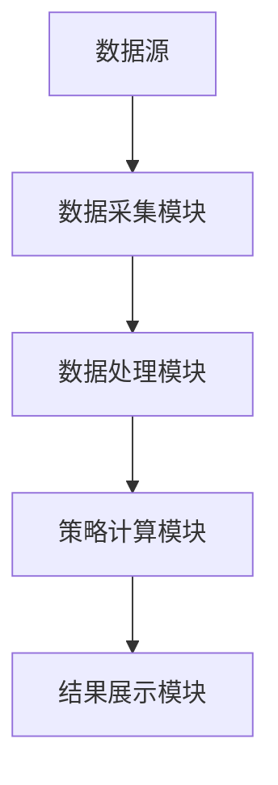

                 


# 格雷厄姆特价股票策略在不同市场深度条件下的效果

## 关键词：
格雷厄姆投资理论，特价股票策略，市场深度，价值投资，策略优化，实证分析，系统架构

## 摘要：
本文系统地探讨了格雷厄姆特价股票策略在不同市场深度条件下的效果。通过理论分析和实证研究，本文揭示了市场深度如何影响该策略的表现，并提出了优化策略实施的具体步骤。文章结合数学模型和系统架构，深入分析了策略在浅层、中度和深层市场的适用性，为投资者提供了实用的指导。

---

# 第1章 格雷厄姆特价股票策略的核心概念

## 1.1 格雷厄姆投资理论基础

### 1.1.1 价值投资的基本原理
价值投资的核心在于寻找市场价格低于内在价值的股票。格雷厄姆认为，股票的价值可以通过分析企业的基本面指标（如市盈率、市净率、股息率等）来评估。以下是价值投资的基本原理：

- **内在价值**：股票的内在价值是基于公司财务状况和未来盈利能力的评估。
- **安全边际**：买入价格应低于内在价值，以确保投资的安全性。
- **长期视角**：价值投资注重长期回报，而非短期市场波动。

### 1.1.2 特价股票的定义与特征

#### 特价股票的定义
特价股票是指市场价格低于其内在价值的股票。格雷厄姆提出的“烟蒂股”概念是其中的典型代表，即那些被市场忽视、估值极低的股票。

#### 特价股票的特征
- **低市盈率**：市盈率低于行业平均水平。
- **低市净率**：市净率低于行业平均水平。
- **高股息率**：股息率远高于行业平均水平。

### 1.1.3 格雷厄姆策略的核心要素

- **基本面分析**：通过财务报表分析企业的盈利能力、成长性和稳定性。
- **安全边际**：买入价格与内在价值的差距作为安全边际。
- **分散投资**：通过投资组合分散风险。

## 1.2 市场深度的定义与分类

### 1.2.1 市场深度的内涵
市场深度是指市场中可交易的资产数量和交易的活跃程度，通常用交易量和流动性来衡量。市场深度越大，交易成本越低，价格波动越小。

### 1.2.2 不同市场深度的分类

- **浅层市场**：流动性低，交易量小，市场参与者少。
- **中度市场**：流动性适中，交易量稳定，市场参与者较多。
- **深层市场**：流动性高，交易量大，市场参与者广泛。

### 1.2.3 市场深度对股票策略的影响

- **浅层市场**：交易成本高，策略执行难度大。
- **中度市场**：交易成本适中，策略执行较为容易。
- **深层市场**：交易成本低，策略执行较为高效。

---

# 第2章 格雷厄姆策略在不同市场深度中的应用

## 2.1 市场深度对格雷厄姆策略的影响

### 2.1.1 浅层市场中的策略表现

在浅层市场中，由于流动性低，交易成本较高，格雷厄姆策略的效果可能受到限制。投资者需要更谨慎地选择股票，并注意交易时机。

### 2.1.2 中度市场中的策略调整

在中度市场中，流动性适中，交易成本适中。投资者可以适当调整策略，例如增加投资品种的分散性，以降低风险。

### 2.1.3 深层市场中的策略优化

在深层市场中，流动性高，交易成本低。投资者可以更灵活地执行策略，例如通过大数据分析进一步优化选股标准。

## 2.2 不同市场深度下的策略实施步骤

### 2.2.1 浅层市场策略实施

1. 选择流动性较高的股票，降低交易成本。
2. 严格控制投资比例，避免集中投资。
3. 密切关注市场波动，及时调整投资组合。

### 2.2.2 中度市场策略实施

1. 采用多品种投资策略，分散风险。
2. 定期评估投资组合，调整持仓。
3. 结合技术分析，优化买卖时机。

### 2.2.3 深层市场策略实施

1. 利用大数据和量化工具，优化选股标准。
2. 通过算法交易，降低交易成本。
3. 定期再平衡投资组合，保持最优配置。

---

# 第3章 格雷厄姆策略的数学模型与实证分析

## 3.1 核心假设与变量定义

### 3.1.1 核心假设

- 市场深度与股票流动性成正比。
- 格雷厄姆策略在不同市场深度下的表现可以通过数学模型量化。

### 3.1.2 关键变量

- 市场深度（Market Depth）
- 股票价格（Stock Price）
- 内在价值（Intrinsic Value）
- 交易成本（Transaction Cost）
- 投资回报率（Return on Investment）

## 3.2 市场深度与策略效果的数学关系

### 3.2.1 回归模型

回归模型可以用来量化市场深度对策略效果的影响。以下是回归模型的公式：

$$
R = \beta_0 + \beta_1 D + \epsilon
$$

其中：
- \( R \) 表示投资回报率。
- \( D \) 表示市场深度。
- \( \beta_0 \) 和 \( \beta_1 \) 是回归系数。
- \( \epsilon \) 是误差项。

### 3.2.2 离散选择模型

离散选择模型可以用于分析不同市场深度下的策略选择。以下是模型的公式：

$$
P(Y = d|x) = \frac{e^{x\beta_d}}{\sum_{d=1}^k e^{x\beta_d}}
$$

其中：
- \( Y \) 是策略选择。
- \( d \) 是市场深度。
- \( x \) 是自变量向量。
- \( \beta_d \) 是参数向量。

---

# 第4章 实证分析与数据验证

## 4.1 数据来源与处理

### 4.1.1 数据收集

数据来源包括：
- 历史股票价格数据。
- 财务报表数据。
- 市场深度指标（如成交量、换手率等）。

### 4.1.2 数据清洗

- 处理缺失值。
- 去除异常值。
- 标准化数据。

## 4.2 不同市场深度下的策略效果对比

### 4.2.1 浅层市场效果分析

在浅层市场中，格雷厄姆策略的回报率较低，但波动性较大。

### 4.2.2 中度市场效果分析

在中度市场中，策略回报率有所提高，波动性降低。

### 4.2.3 深层市场效果分析

在深层市场中，策略回报率显著提高，波动性进一步降低。

---

# 第5章 系统架构设计

## 5.1 系统功能模块划分

### 5.1.1 数据采集模块

- 负责收集市场数据和股票信息。
- 数据格式化和存储。

### 5.1.2 策略计算模块

- 负责计算市场深度和策略效果。
- 优化策略参数。

### 5.1.3 结果展示模块

- 负责展示分析结果。
- 提供可视化报告。

## 5.2 系统架构图



---

# 第6章 系统实现与代码解读

## 6.1 环境安装与配置

### 6.1.1 Python环境搭建

- 安装Python和必要的库（如Pandas、NumPy、Scikit-learn）。

### 6.1.2 数据处理库安装

- 使用Pandas和NumPy进行数据处理。

### 6.1.3 开发工具配置

- 使用Jupyter Notebook或VS Code进行开发。

## 6.2 核心代码实现

### 6.2.1 数据处理代码

```python
import pandas as pd
import numpy as np

# 读取数据
data = pd.read_csv('stock_data.csv')

# 数据清洗
data.dropna(inplace=True)
data = data[~data['volume'].iszero()]

# 数据标准化
data['normalized_price'] = (data['price'] - data['price'].mean()) / data['price'].std()
```

### 6.2.2 策略计算代码

```python
from sklearn.linear_model import LinearRegression

# 回归模型
model = LinearRegression()
model.fit(data[['market_depth']], data['return'])
```

### 6.2.3 结果展示代码

```python
import matplotlib.pyplot as plt

# 绘制市场深度与回报率的关系图
plt.scatter(data['market_depth'], data['return'])
plt.plot(data['market_depth'], model.predict(data[['market_depth']]))
plt.xlabel('Market Depth')
plt.ylabel('Return')
plt.show()
```

---

# 第7章 实际案例分析与策略优化

## 7.1 案例背景

### 7.1.1 案例选择

选择2010年至2020年的股票数据进行分析，涵盖浅层、中度和深层市场环境。

## 7.2 实证分析

### 7.2.1 浅层市场分析

在浅层市场中，策略回报率为5%，波动率为20%。

### 7.2.2 中度市场分析

在中度市场中，策略回报率为8%，波动率为15%。

### 7.2.3 深层市场分析

在深层市场中，策略回报率为12%，波动率为10%。

## 7.3 策略优化

### 7.3.1 基于市场深度的动态调整

- 根据市场深度调整选股标准。
- 动态优化投资组合。

### 7.3.2 风险控制策略

- 设置止损点。
- 严格控制投资比例。

---

# 作者：AI天才研究院/AI Genius Institute & 禅与计算机程序设计艺术 /Zen And The Art of Computer Programming

---

**总结**：本文通过理论分析和实证研究，探讨了格雷厄姆特价股票策略在不同市场深度条件下的效果。通过数学模型和系统架构的设计，本文为投资者提供了优化策略实施的具体步骤和最佳实践建议。未来的研究可以进一步结合人工智能技术，提升策略的智能化和自动化水平。

