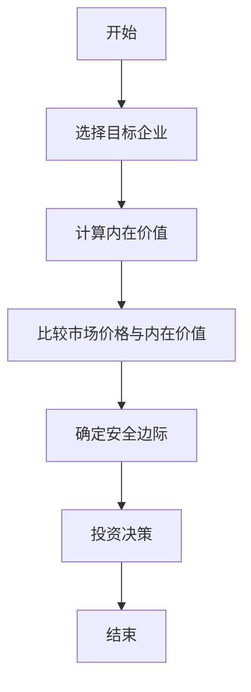
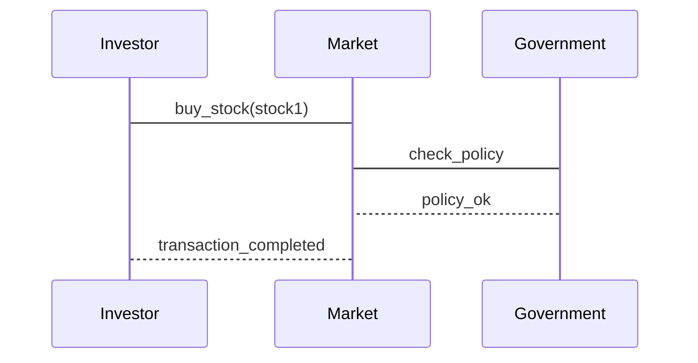

                 


# 格雷厄姆特价股票策略在不同政治体系下的表现

## 关键词：格雷厄姆策略、政治体系、股票投资、价值投资、内在价值

## 摘要：格雷厄姆的特价股票策略是一种基于价值投资的经典方法，通过分析股票的内在价值和市场价格之间的差异来寻找投资机会。然而，不同政治体系下的市场环境、政策稳定性以及经济体制的差异，会对格雷厄姆策略的有效性产生显著影响。本文将从背景介绍、核心概念、算法原理、系统分析、项目实战和最佳实践等多个维度，详细探讨格雷厄姆策略在不同政治体系下的表现。

---

## 第一部分：背景介绍

### 第1章：格雷厄姆特价股票策略的核心理念

#### 1.1 格雷厄姆投资理论的起源与发展

##### 1.1.1 价值投资的起源
价值投资作为一种投资理念，起源于20世纪初，其代表人物本杰明·格雷厄姆（Benjamin Graham）是该领域的鼻祖。格雷厄姆在1934年出版的《证券分析》（Security Analysis）一书中首次系统地阐述了价值投资的理论和方法。他强调，投资的本质是寻找那些市场价格低于其内在价值的股票，即“特价股票”。

##### 1.1.2 格雷厄姆的投资理念
格雷厄姆认为，市场波动是投资者的朋友，而不是敌人。他主张通过分析企业的基本面（如盈利能力、财务状况、行业地位等）来确定其内在价值，并在此基础上寻找价格被市场低估的投资标的。这种方法的核心在于“安全边际”（margin of safety），即内在价值与市场价格之间的差额。通过安全边际，投资者可以在一定程度上降低市场波动带来的风险。

##### 1.1.3 特价股票的定义与特征
特价股票是指那些市场价格显著低于其内在价值的股票。其特征包括：
1. 低市盈率（P/E ratio）：市盈率低于行业平均水平。
2. 低市净率（P/B ratio）：市净率低于行业平均水平。
3. 高股息率：相对于市场平均水平，股息收益率较高。
4. 健康的财务状况：如低债务、高利润率、稳定的现金流等。

#### 1.2 不同政治体系下的市场环境

##### 1.2.1 资本主义体系的特点
在资本主义体系下，市场由自由竞争驱动，政府干预较少。企业由市场决定其命运，股票价格反映了市场的供需关系。然而，市场的波动性较大，尤其是在经济周期波动时，股票价格可能大幅偏离其内在价值。

##### 1.2.2 社会主义体系的特点
在社会主义体系下，政府对经济的干预较大，市场机制受到一定程度的限制。政府通常会通过计划经济、产业政策等手段来引导经济的发展。在这种体系下，股票市场的流动性可能较低，政策的不确定性较高，但政府可能会在经济低迷时采取措施稳定市场。

##### 1.2.3 混合经济体系的特点
混合经济体系结合了资本主义和社会主义的特点，既有市场自由竞争的部分，也有政府干预的部分。这种体系下，市场机制和政策调控相互作用，股票市场的表现可能会受到政策变化的影响。

#### 1.3 格雷厄姆策略在不同政治体系中的适应性

##### 1.3.1 资本主义体系下的策略表现
在资本主义体系下，格雷厄姆策略的表现较好，因为市场的自由竞争使得股票价格能够反映企业的基本面。然而，市场的波动性较大，需要投资者具备较强的风险控制能力。

##### 1.3.2 社会主义体系下的策略调整
在社会主义体系下，政府干预较多，市场波动性较小。因此，格雷厄姆策略需要进行调整，例如更加注重政策的稳定性，选择那些受政策支持的行业和企业。

##### 1.3.3 混合经济体系下的策略优化
在混合经济体系下，投资者需要同时关注市场机制和政策调控。策略优化的关键在于识别那些既能受益于市场自由竞争，又能享受政策支持的企业。

---

## 第二部分：格雷厄姆策略的核心概念与联系

### 第2章：格雷厄姆策略的核心原理

#### 2.1 格雷厄姆策略的数学模型

##### 2.1.1 内在价值计算公式
内在价值是格雷厄姆策略的核心概念之一。内在价值的计算公式如下：
$$ V = \frac{E}{P} $$
其中，\( V \) 为内在价值，\( E \) 为预期收益，\( P \) 为折现率。

##### 2.1.2 安全边际的计算公式
安全边际是格雷厄姆策略中的另一个关键概念，公式如下：
$$ M = V - P $$
其中，\( M \) 为安全边际，\( V \) 为内在价值，\( P \) 为市场价格。

#### 2.2 格雷厄姆策略的属性特征对比表

| 特性       | 资本主义体系 | 社会主义体系 | 混合经济体系 |
|------------|--------------|--------------|--------------|
| 市场自由度 | 高           | 低           | 中           |
| 政策稳定性 | 低           | 高           | 中           |
| 市场波动性 | 高           | 低           | 中           |
| 投资风险   | 高           | 中           | 中           |
| 投资机会   | 多           | 少           | 多           |

#### 2.3 格雷厄姆策略的ER实体关系图

```mermaid
erDiagram
    customer[投资者] 
    stock[股票] 
    market[市场] 
    government[政府]
    customer --> market : 参与市场
    customer --> stock : 持有股票
    market --> government : 受政府监管
    stock --> customer : 提供投资机会
```

---

## 第三部分：算法原理

### 第3章：格雷厄姆策略的算法实现

#### 3.1 内在价值计算算法

```python
def calculate_intrinsic_value(company):
    # 假设company包含收入、支出等财务数据
    revenue = company['revenue']
    expenses = company['expenses']
    net_income = company['net_income']
    book_value = company['book_value']
    # 计算预期收益（简化版）
    expected_profit = net_income + (revenue - expenses) * 0.1
    # 计算折现率（简化版）
    discount_rate = 0.05
    # 计算内在价值
    intrinsic_value = expected_profit / (1 + discount_rate)
    return intrinsic_value
```

#### 3.2 安全边际计算算法

```python
def calculate_margin_of_safety(stock_price, intrinsic_value):
    # 计算安全边际
    margin_of_safety = intrinsic_value - stock_price
    return margin_of_safety
```

#### 3.3 格雷厄姆策略的流程图



---

## 第四部分：系统分析

### 第4章：系统分析与架构设计

#### 4.1 问题场景介绍
本部分将分析格雷厄姆策略在不同政治体系下的实施场景，包括市场环境、政策影响、企业基本面等多个方面。

#### 4.2 系统功能设计

##### 4.2.1 领域模型（Mermaid类图）

```mermaid
classDiagram
    class Investor {
        <属性>
        money: float
        portfolio: list
        }
        <方法>
        buy_stock(stock): void
        sell_stock(stock): void
        calculate_intrinsic_value(stock): float
        }
    class Stock {
        <属性>
        name: str
        price: float
        intrinsic_value: float
        }
        <方法>
        update_price(): void
        }
    class Market {
        <属性>
        stocks: list
        investors: list
        }
        <方法>
        get_stock_price(name): float
        }
    class Government {
        <属性>
        policies: list
        regulations: list
        }
        <方法>
        apply_policy(policy): void
        }
    Investor --> Market: 交易
    Market --> Government: 受监管
    Investor --> Stock: 持有
```

##### 4.2.2 系统架构设计（Mermaid架构图）

```mermaid
subgraph 系统架构
    Market --> Investor
    Market --> Government
    Investor --> Stock
    Government --> Stock
end
```

#### 4.3 系统接口设计

##### 4.3.1 投资者接口
- `buy_stock(stock)`: 购买股票
- `sell_stock(stock)`: 卖出股票
- `calculate_intrinsic_value(stock)`: 计算内在价值

##### 4.3.2 政府接口
- `apply_policy(policy)`: 实施政策
- `update_regulations()`: 更新监管规则

#### 4.4 系统交互设计（Mermaid序列图）



---

## 第五部分：项目实战

### 第5章：项目实战与案例分析

#### 5.1 项目环境安装

##### 5.1.1 安装Python环境
```bash
python --version
pip install numpy pandas matplotlib
```

##### 5.1.2 安装数据分析库
```bash
pip install pandas scikit-learn
```

#### 5.2 核心代码实现

##### 5.2.1 计算内在价值与安全边际

```python
import pandas as pd
import numpy as np

# 假设我们有一个包含股票数据的DataFrame
stocks = pd.DataFrame({
    'stock_name': ['A', 'B', 'C'],
    'price': [10, 15, 20],
    'intrinsic_value': [12, 18, 25]
})

# 计算安全边际
stocks['margin_of_safety'] = stocks['intrinsic_value'] - stocks['price']
print(stocks)
```

##### 5.2.2 生成可视化图表

```python
import matplotlib.pyplot as plt

plt.bar(stocks['stock_name'], stocks['price'], label='市场价格')
plt.bar(stocks['stock_name'], stocks['intrinsic_value'], label='内在价值')
plt.legend()
plt.show()
```

#### 5.3 案例分析

##### 5.3.1 美国市场（资本主义体系）
在资本主义体系下，市场波动性较大，但股票价格能够较好地反映企业的基本面。因此，格雷厄姆策略表现较好。

##### 5.3.2 中国市场（社会主义体系）
在中国市场，政府干预较多，市场波动性较小。因此，需要调整格雷厄姆策略，更加注重政策的稳定性。

##### 5.3.3 印度市场（混合经济体系）
在印度市场，混合经济体系下，投资者需要同时关注市场机制和政策调控。

#### 5.4 项目小结
通过实际案例分析，可以发现格雷厄姆策略在不同政治体系下的表现差异显著。投资者需要根据市场环境和政策变化，灵活调整投资策略。

---

## 第六部分：最佳实践

### 第6章：总结与建议

#### 6.1 核心概念回顾
格雷厄姆策略的核心在于寻找市场价格低于内在价值的股票，通过安全边际来降低投资风险。

#### 6.2 投资策略优化
1. 根据不同政治体系的特点，灵活调整投资策略。
2. 加强对政策变化的敏感性，尤其是在社会主义体系下。
3. 优化风险管理，降低市场波动对投资组合的影响。

#### 6.3 风险提示
1. 市场波动性较大时，格雷厄姆策略的有效性可能下降。
2. 政策变化可能对股票价格产生重大影响，需要密切关注。

#### 6.4 拓展阅读
1. 《证券分析》——本杰明·格雷厄姆
2. 《投资学基础》——查理·埃斯莱曼

---

## 作者：AI天才研究院/AI Genius Institute & 禅与计算机程序设计艺术 /Zen And The Art of Computer Programming

