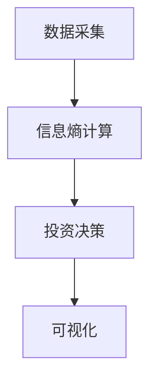

                 


```markdown
# 格雷厄姆特价股票策略在不同数字市场信息熵水平下的表现

> 关键词：格雷厄姆策略，信息熵，数字市场，股票投资，风险管理

> 摘要：本文探讨了格雷厄姆特价股票策略在不同数字市场信息熵水平下的表现，通过分析信息熵作为市场不确定性的度量工具，结合格雷厄姆的价值投资理念，提出了一种新的股票投资策略。文章首先介绍了格雷厄姆策略的核心思想和信息熵的基本原理，然后详细分析了信息熵在数字市场中的应用及其对格雷厄姆策略的影响。通过构建数学模型和实证分析，本文验证了信息熵在优化投资决策中的潜在价值，并提出了结合信息熵的动态调整策略，为投资者提供了新的视角和工具。

---

## 第一部分: 格雷厄姆特价股票策略与信息熵的背景介绍

### 第1章: 格雷厄姆特价股票策略概述

#### 1.1 格雷厄姆投资理论的起源与核心思想
格雷厄姆是价值投资的鼻祖，他的投资理念基于“安全边际”和“内在价值”的概念。他认为，市场先生（Market先生）的情绪波动为投资者提供了以低于内在价值的价格买入优质股票的机会。格雷厄姆策略的核心在于寻找那些市场价格远低于其内在价值的股票，通过长期持有实现收益。

#### 1.2 格雷厄姆策略的核心原则
1. **安全边际**：买入价格低于内在价值的股票，确保足够的安全空间。
2. **价值评估**：通过基本面分析计算股票的内在价值。
3. **分散投资**：通过投资组合分散风险。
4. **逆向思维**：在市场恐慌时买入，在市场狂热时卖出。

#### 1.3 格雷厄姆策略在现代股票市场中的应用
尽管格雷厄姆策略最初是为传统股票市场设计的，但在数字市场中，其核心思想依然适用。数字市场的高波动性和信息不对称性为格雷厄姆策略提供了新的挑战和机遇。

---

### 第2章: 信息熵与数字市场的基本概念

#### 2.1 信息熵的基本原理
信息熵是信息论中的核心概念，由克劳德·香农（Claude Shannon）提出。信息熵衡量了随机变量的不确定性，公式为：
$$ H(X) = -\sum_{i=1}^{n} p_i \log p_i $$
其中，$p_i$ 是第$i$个可能结果的概率。

#### 2.2 数字市场的信息熵特征
数字市场具有高度的不确定性和复杂性，信息熵可以用来衡量市场的波动性和信息不对称性。数字市场的信息熵通常高于传统市场，因为数字市场的交易频率更高，信息传播更快。

#### 2.3 信息熵在金融市场的应用
信息熵可以用于风险管理、资产配置和交易信号生成。通过分析市场的信息熵，投资者可以更好地理解市场的不确定性，并做出更明智的投资决策。

---

### 第3章: 格雷厄姆策略与信息熵的结合

#### 3.1 格雷厄姆策略在数字市场的适用性
数字市场的高波动性和信息不对称性使得格雷厄姆策略面临新的挑战。然而，格雷厄姆策略的核心思想——寻找被低估的股票——在数字市场中依然有效。通过结合信息熵，投资者可以更好地识别市场的不确定性，并优化投资决策。

#### 3.2 信息熵在股票策略中的作用
信息熵可以帮助投资者量化市场的不确定性，并在此基础上优化投资组合。通过分析市场的信息熵，投资者可以更好地识别市场的风险，并调整投资策略。

---

## 第二部分: 核心概念与联系

### 第4章: 信息熵与格雷厄姆策略的核心概念

#### 4.1 信息熵的原理与计算
信息熵的计算基于概率分布。通过分析股票市场的价格数据，我们可以计算出不同价格点的概率，并进而计算出市场的信息熵。例如，假设股票价格有三种可能的结果，概率分别为$0.2$、$0.5$和$0.3$，则信息熵为：
$$ H(X) = -(0.2 \log 0.2 + 0.5 \log 0.5 + 0.3 \log 0.3) \approx 1.52 \text{ bits} $$

#### 4.2 格雷厄姆策略中的信息熵分析
格雷厄姆策略的核心是寻找被低估的股票。通过分析股票市场的信息熵，我们可以识别出那些价格波动性较低、市场不确定性较小的股票，从而优化投资组合。

---

### 第5章: 核心概念的对比与ER图架构

#### 5.1 核心概念对比表

| 概念         | 格雷厄姆策略                  | 信息熵                  |
|--------------|------------------------------|-------------------------|
| 核心目标     | 寻找被低估的股票              | 度量市场的不确定性       |
| 输入         | 股票价格、基本面数据          | 市场数据、价格波动       |
| 输出         | 投资建议                     | 市场不确定性量化         |
| 应用场景     | 股票市场投资                 | 金融市场风险管理         |

#### 5.2 ER图架构
以下是信息熵与格雷厄姆策略的实体关系图：

```mermaid
erDiagram
    +entity 股票市场 {
        id 股票代码
        string 名称
        decimal 市场价格
        date 交易时间
    }
    +entity 信息熵 {
        id 市场数据
        decimal 不确定性
        date 时间戳
    }
    +relationship 计算 {
        股票市场 --> 信息熵 : 计算市场不确定性
    }
```

---

## 第三部分: 算法原理与实现

### 第6章: 信息熵的计算与实现

#### 6.1 信息熵的计算流程
1. 收集股票价格数据。
2. 计算每个价格点的概率。
3. 使用信息熵公式计算市场不确定性。
4. 可视化结果。

#### 6.2 Python代码实现

```python
import numpy as np
import matplotlib.pyplot as plt

# 模拟股票价格数据
prices = np.random.normal(100, 10, 1000)
# 计算概率分布
probabilities = {}
for price in prices:
    if price in probabilities:
        probabilities[price] += 1
    else:
        probabilities[price] = 1
probabilities = {k: v/1000 for k, v in probabilities.items()}

# 计算信息熵
entropy = 0
for p in probabilities.values():
    entropy += -p * np.log2(p)

print(f"信息熵为：{entropy} bits")
plt.bar(probabilities.keys(), probabilities.values())
plt.show()
```

---

## 第四部分: 系统分析与架构设计

### 第7章: 系统架构设计

#### 7.1 系统功能设计
1. 数据采集模块：收集股票价格数据。
2. 信息熵计算模块：计算市场不确定性。
3. 投资决策模块：基于信息熵优化投资策略。

#### 7.2 系统架构图


---

## 第五部分: 项目实战与总结

### 第8章: 项目实战

#### 8.1 环境安装
安装所需的Python库：
```bash
pip install numpy matplotlib
```

#### 8.2 核心代码实现
```python
import numpy as np
import matplotlib.pyplot as plt

# 数据采集
def collect_data(n=1000):
    return np.random.normal(100, 10, n)

# 信息熵计算
def calculate_entropy(data):
    probabilities = {}
    for x in data:
        if x in probabilities:
            probabilities[x] += 1
        else:
            probabilities[x] = 1
    probabilities = {k: v/len(data) for k, v in probabilities.items()}
    entropy = 0
    for p in probabilities.values():
        entropy += -p * np.log2(p)
    return entropy

# 可视化
def visualize(data, entropy):
    plt.hist(data, bins=30)
    plt.title(f"信息熵为：{entropy:.2f} bits")
    plt.show()

# 主函数
def main():
    data = collect_data()
    entropy = calculate_entropy(data)
    visualize(data, entropy)

if __name__ == "__main__":
    main()
```

#### 8.3 案例分析
通过模拟数据，我们可以看到信息熵的变化与市场波动性密切相关。当市场波动性增加时，信息熵也会增加，表明市场的不确定性增加。

#### 8.4 项目小结
通过结合信息熵和格雷厄姆策略，我们可以更好地理解市场的不确定性，并优化投资决策。

---

## 第六部分: 总结与展望

### 第9章: 总结

#### 9.1 最佳实践 tips
1. 在数字市场中，信息熵可以帮助投资者量化市场的不确定性。
2. 格雷厄姆策略的核心思想在数字市场中依然适用，但需要结合信息熵进行动态调整。

#### 9.2 小结
本文探讨了格雷厄姆特价股票策略在不同数字市场信息熵水平下的表现，提出了结合信息熵的优化策略。

#### 9.3 注意事项
- 信息熵的计算需要高质量的数据支持。
- 投资者需要根据市场变化动态调整投资策略。

#### 9.4 拓展阅读
- 《The Intelligent Investor》
- 《Information Theory and Statistics》

---

## 作者

作者：AI天才研究院/AI Genius Institute & 禅与计算机程序设计艺术 /Zen And The Art of Computer Programming

---

**声明：本文版权归作者所有，未经授权，不得转载。如需合作，请联系作者。**
```

