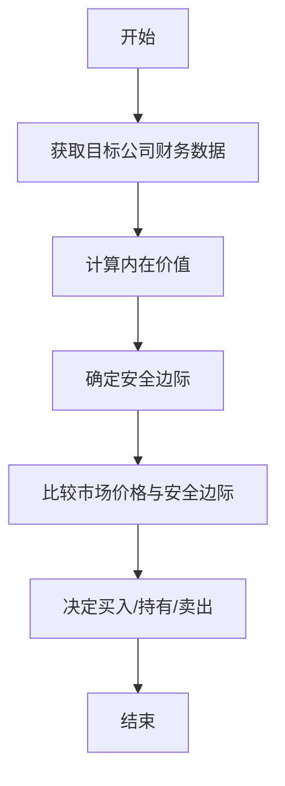
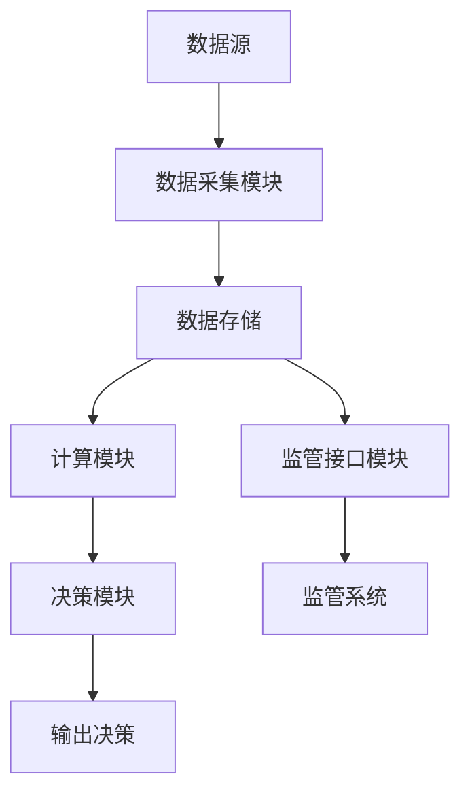
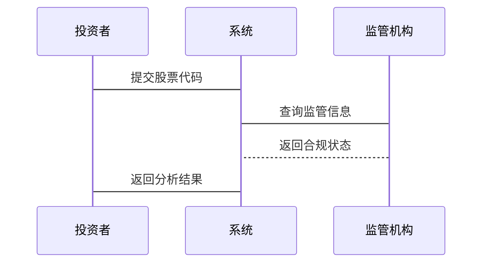

                 


# 格雷厄姆特价股票策略在不同数字监管科技环境中的表现

## 关键词：价值投资、格雷厄姆策略、数字监管科技、股票估值、风险管理

## 摘要：本文系统分析了格雷厄姆的价值投资策略在不同数字监管科技环境中的表现，探讨了监管科技对股票估值和投资决策的影响，结合算法原理和系统架构设计，通过实际案例分析，总结了策略在数字化监管环境中的适应性与优化方向，为投资者提供了新的视角。

---

## 第一章：引言

### 1.1 研究背景

- 价值投资理念由本杰明·格雷厄姆提出，强调以低于内在价值的价格买入优质股票。
- 数字监管科技（RegTech）的兴起，利用技术手段优化金融监管，提升透明度和效率。
- 结合两者，分析数字监管科技对格雷厄姆策略的影响，为投资者提供新视角。

### 1.2 研究目标

- 探讨格雷厄姆策略在数字化监管环境中的表现。
- 分析数字监管科技对股票估值和投资决策的影响。
- 提供优化策略的建议，指导投资者应对监管变化。

---

## 第二章：核心概念与理论框架

### 2.1 格雷厄姆投资理论的核心概念

#### 2.1.1 价值投资的定义

- **内在价值**：公司未来现金流的现值，计算公式：
  $$ V = \sum_{t=1}^{n} \frac{CF_t}{(1 + r)^t} $$

- **安全边际**：买入价格低于内在价值，确保投资的安全性。

#### 2.1.2 格雷厄姆策略的特点

- **低估股票**：寻找市场价格远低于内在价值的股票。
- **长期视角**：注重公司长期盈利能力。
- **风险管理**：分散投资，控制整体风险。

### 2.2 数字监管科技的定义与应用

#### 2.2.1 监管科技的概念

- 利用技术手段优化金融监管，提高效率和透明度。

#### 2.2.2 数字监管科技的应用领域

- **风险控制**：利用大数据分析和AI技术评估市场风险。
- **合规性检查**：自动化审查交易记录，确保合规性。
- **透明度提升**：通过区块链技术实现交易数据的不可篡改性。

### 2.3 格雷厄姆策略与数字监管科技的结合

#### 2.3.1 核心要素对比

| 核心要素         | 格雷厄姆策略                  | 数字监管科技                  |
|------------------|-----------------------------|-----------------------------|
| 评估方法         | 现金流折现法                 | 大数据分析和机器学习          |
| 数据来源         | 财务报表、市场数据            | 区块链、API接口               |
| 技术手段         | 人工分析                     | AI算法、自动化工具             |

#### 2.3.2 ER实体关系图

```mermaid
erDiagram
    investor[floor "投资者"] {
        id : int
        name : string
        portfolio : string
    }
    stock[database "股票"] {
        id : int
        name : string
        price : float
        value : float
    }
    regTech[software "监管科技系统"] {
        id : int
        name : string
        function : string
    }
    investor --> stock : 持有
    regTech --> stock : 监测
    investor --> regTech : 依赖
```

---

## 第三章：算法原理与数学模型

### 3.1 格雷厄姆策略的量化分析方法

#### 3.1.1 内在价值计算

- **现金流折现法**：
  $$ V = \frac{E}{(1 + r)^n} $$
  其中，E为未来现金流，r为折现率，n为时间周期。

#### 3.1.2 安全边际计算

- 买入价格 = 内在价值 × 安全边际系数（如0.8）

#### 3.1.3 算法流程



#### 3.1.4 Python代码实现

```python
def calculate_intrinsic_value(cash_flow, discount_rate, period):
    return sum(cash_flow / (1 + discount_rate) ** t for t in range(1, period + 1))

def greaham_strategy_analysis(stock_price, intrinsic_value, margin_of_safety):
    buy_price = intrinsic_value * margin_of_safety
    if stock_price < buy_price:
        return "买入"
    elif stock_price == buy_price:
        return "观察"
    else:
        return "卖出"

# 示例
cash_flow = [100, 120, 150, 180]
discount_rate = 0.05
period = 4
intrinsic_value = calculate_intrinsic_value(cash_flow, discount_rate, period)
margin_of_safety = 0.8
stock_price = 90

decision = greaham_strategy_analysis(stock_price, intrinsic_value, margin_of_safety)
print(f"决策：{decision}")
```

---

## 第四章：系统分析与架构设计

### 4.1 系统架构设计

#### 4.1.1 系统功能模块

- **数据采集模块**：获取股票数据和监管信息。
- **计算模块**：计算内在价值和安全边际。
- **决策模块**：根据价格与模型结果做出决策。
- **监管接口模块**：与监管系统对接，确保合规性。

#### 4.1.2 系统架构图



### 4.2 接口设计与交互图

#### 4.2.1 系统交互图



---

## 第五章：项目实战

### 5.1 环境安装

- **工具安装**：Python、Pandas、NumPy、Matplotlib、Mermaid。
- **数据源**：Yahoo Finance API获取股票数据，Regulatory API获取监管信息。

### 5.2 核心代码实现

```python
import pandas as pd
import requests

def get_stock_data(ticker):
    url = f"https://apiYahooFinance.com/stock/{ticker}"
    response = requests.get(url)
    return pd.DataFrame(response.json())

def calculate_intrinsic_value(...):
    # 如前所述

# 示例
data = get_stock_data("AAPL")
# 数据处理与分析
```

### 5.3 案例分析

- **案例1**：某科技公司，计算其内在价值，评估安全边际，给出投资建议。
- **案例2**：考虑监管变化，如会计准则调整，分析其对股价的影响。

---

## 第六章：总结与展望

### 6.1 研究总结

- 详细分析了格雷厄姆策略在数字监管环境中的表现。
- 结合监管科技优化了策略的执行和风险管理。

### 6.2 展望

- 深入研究AI技术对策略优化的潜力。
- 探讨更多监管环境下的投资机会。

---

## 作者：AI天才研究院 & 禅与计算机程序设计艺术

---

**致谢**：感谢读者的耐心阅读，期待更多交流与合作。

