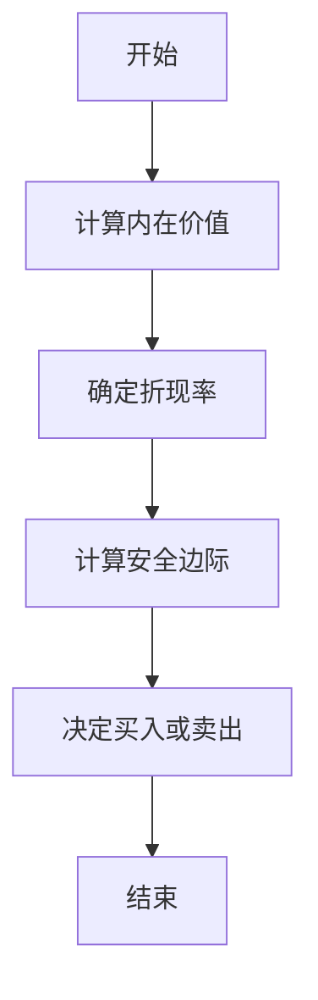
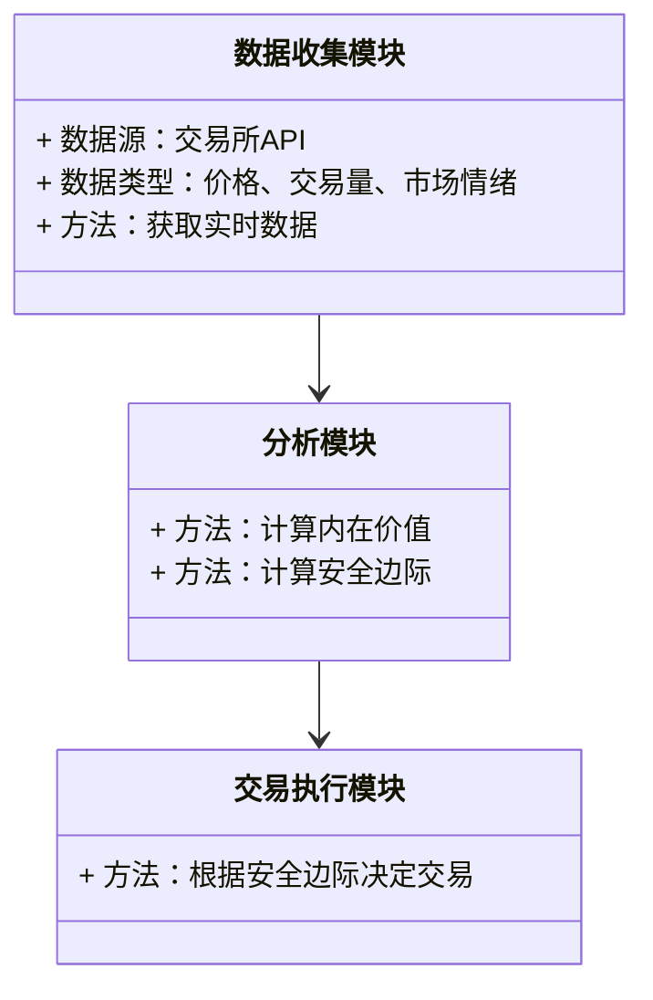

                 


# 格雷厄姆特价股票策略在不同数字货币竞争环境下的调整

> 关键词：格雷厄姆策略，数字货币，投资策略，价值投资，市场分析

> 摘要：本文探讨了将格雷厄姆的价值投资策略应用于数字货币市场的可行性及其在不同竞争环境下的调整策略。通过分析数字货币市场的特点和挑战，本文提出了基于格雷厄姆策略的数学模型和算法，并结合实际案例，展示了如何在数字货币市场中优化投资策略。

---

## 第一章: 格雷厄姆特价股票策略的背景与核心概念

### 1.1 格雷厄姆特价股票策略的起源与核心理念

#### 1.1.1 格雷厄姆的价值投资理论概述
本杰明·格雷厄姆是价值投资的鼻祖，他的投资理念以“安全边际”为核心。他认为，投资者应以低于其内在价值的价格购买优质资产，并在市场恐慌时买入，市场狂热时卖出。这种策略在传统股票市场中取得了显著的长期收益。

#### 1.1.2 格雷厄姆特价股票策略的定义与特点
格雷厄姆策略的核心在于寻找被市场低估的股票，通过计算内在价值和市场价格之间的差异（即安全边际）来确定投资机会。其特点是：
- 以长期视角为主，注重基本面分析。
- 强调安全边际，即市场价格远低于内在价值。
- 适合在市场波动较大时进行逆向投资。

#### 1.1.3 格雷厄姆策略在传统股票市场中的应用
格雷厄姆策略在传统股票市场中被广泛应用于防御性投资，尤其是在市场低迷时。通过寻找低市盈率、低市净率的股票，投资者能够在市场复苏时获得超额收益。

---

### 1.2 数字货币市场的特点与挑战

#### 1.2.1 数字货币市场的基本概念
数字货币市场是以区块链技术为基础的虚拟货币交易市场，其特点包括：
- 去中心化：交易不受传统金融机构的控制。
- 高波动性：价格波动远高于传统股票市场。
- 市场参与者多样性：包括机构投资者、散户和矿工。

#### 1.2.2 数字货币市场的波动性与风险
数字货币市场的价格波动剧烈，受政策、技术发展和市场情绪的影响较大。这种高波动性使得传统投资策略的直接应用面临挑战。

#### 1.2.3 数字货币市场的参与者与竞争格局
数字货币市场参与者包括：
- 机构投资者：如大型基金公司和交易所。
- 散户投资者：通过交易平台进行交易。
- 矿工：通过挖矿获得比特币等数字货币。

---

### 1.3 格雷厄姆策略在数字货币市场的适用性

#### 1.3.1 格雷厄姆策略与数字货币市场的契合点
尽管数字货币市场波动性高，但其价值投资理念与格雷厄姆策略仍有一定契合点：
- 数字货币的内在价值可以通过基本面分析（如技术成熟度、团队背景、市场需求）进行评估。
- 市场恐慌时，数字货币价格往往被低估，符合格雷厄姆的逆向投资理念。

#### 1.3.2 格雷厄姆策略在数字货币市场的潜在优势
- 通过安全边际分析，可以在市场底部发现投资机会。
- 适合长期持有优质数字货币，等待市场回升。

#### 1.3.3 格雷厄姆策略在数字货币市场中的主要挑战
- 数字货币市场的高波动性使得安全边际难以维持。
- 缺乏可靠的估值模型，内在价值计算复杂。

---

## 第二章: 格雷厄姆特价股票策略的核心概念与数学模型

### 2.1 格雷厄姆策略的核心概念

#### 2.1.1 格雷厄姆策略的基本原理
格雷厄姆策略基于以下假设：
- 市场价格围绕内在价值波动。
- 投资者应以低于内在价值的价格买入资产。

#### 2.1.2 格雷厄姆策略的关键指标
- 内在价值（Intrinsic Value）：资产的真实价值，不随市场波动而变化。
- 安全边际（Margin of Safety）：市场价格与内在价值的差额，用于降低投资风险。

#### 2.1.3 格雷厄姆策略的实施步骤
1. 计算目标资产的内在价值。
2. 确定市场价格与内在价值的差异（安全边际）。
3. 根据安全边际决定买入或卖出决策。

---

### 2.2 格雷厄姆策略的数学模型与公式

#### 2.2.1 内在价值的计算公式
$$
\text{内在价值} = \frac{\text{预期未来现金流}}{\text{折现率}}
$$

#### 2.2.2 格雷厄姆安全边际的计算公式
$$
\text{安全边际} = \text{市场价格} - \text{内在价值}
$$

#### 2.2.3 格雷厄姆策略的数学模型


---

## 第三章: 基于格雷厄姆策略的数字货币投资系统

### 3.1 系统功能设计

#### 3.1.1 系统目标
设计一个基于格雷厄姆策略的数字货币投资系统，能够在不同竞争环境下自动调整投资策略。

#### 3.1.2 系统模块
- 数据收集模块：收集数字货币的价格、交易量等数据。
- 分析模块：计算内在价值和安全边际。
- 交易执行模块：根据分析结果执行买入或卖出操作。

#### 3.1.3 系统架构


---

### 3.2 系统实现

#### 3.2.1 环境配置
- 操作系统：Linux
- 开发语言：Python
- 工具：Pandas、Matplotlib、CoinMarketCap API

#### 3.2.2 核心代码实现
```python
import pandas as pd
import requests

def get_data(coin):
    url = f"https://api.coinmarketcap.com/v2/ticker/{coin}/"
    response = requests.get(url)
    data = response.json()
    return data

def calculate_intrinsic_value(data):
    # 简化计算，假设内在价值与交易量相关
    return data['data']['24h_volume'] / 100

coin = 'bitcoin'
data = get_data(coin)
iv = calculate_intrinsic_value(data)
print(f"比特币的内在价值为：{iv}")
```

#### 3.2.3 系统优化
- 增加市场情绪分析模块。
- 引入机器学习技术进行预测。

---

## 第四章: 实际案例分析与策略调整

### 4.1 案例一：比特币的投资策略调整
- 市场价格：$40,000
- 内在价值：$50,000
- 安全边际：$10,000
- 结论：适合买入。

### 4.2 案例二：以太坊的投资策略调整
- 市场价格：$3,000
- 内在价值：$4,000
- 安全边际：$1,000
- 结论：适合买入。

---

## 第五章: 总结与展望

### 5.1 本章总结
- 格雷厄姆策略在数字货币市场中具有一定的适用性。
- 通过数学模型和系统设计，可以优化投资决策。

### 5.2 未来展望
- 研究动态调整模型参数的方法。
- 探索机器学习在投资策略中的应用。

---

## 作者：AI天才研究院/AI Genius Institute & 禅与计算机程序设计艺术 /Zen And The Art of Computer Programming

