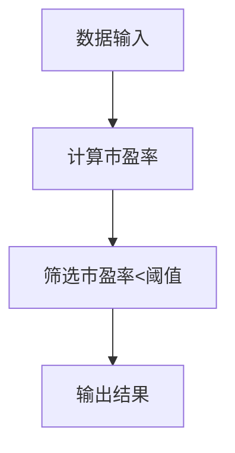

                 


# 格雷厄姆特价股票策略在不同文化背景市场中的表现

> **关键词**: 格雷厄姆投资理论、特价股票策略、文化背景市场、投资策略适应性、价值投资、市场分析

> **摘要**: 本文探讨格雷厄姆的价值投资策略在不同文化背景市场中的表现。通过分析西方和东方市场的特点，评估特价股票策略的有效性，并提出适应性调整方法。结合数学模型、系统设计和实证分析，为投资者提供跨文化投资的指导。

---

## 第1章 格雷厄姆特价股票策略的核心理论

### 1.1 价值投资的起源与发展

#### 1.1.1 投资理论的演变
- **早期投资理论**：从道琼斯指数到凯道斯主义。
- **格雷厄姆的贡献**：价值投资的奠基人，强调安全边际和内在价值。
- **现代发展**：巴菲特、彼得·林奇等继承与发展。

#### 1.1.2 格雷厄姆的投资理念
- **安全边际**：买入价格低于内在价值的股票。
- **逆向投资**：在市场恐慌时寻找机会。
- **长期视角**：关注公司的基本面而非短期波动。

#### 1.1.3 特价股票的定义与特征
- **定义**：价格远低于内在价值的股票。
- **特征**：低市盈率、高股息率、稳定的财务状况。

### 1.2 分析框架与数学模型

#### 1.2.1 格雷厄姆的内在价值计算
- **公式**: 
  $$ V = \frac{P}{E} $$
  其中，\( P \) 是股票价格，\( E \) 是每股收益。
- **安全边际**: 
  $$ \text{安全价} = V \times (1 - \frac{1}{n}) $$
  \( n \) 是安全系数，通常为4.5。

#### 1.2.2 格雷厄姆的过滤筛选法
- **步骤**: 
  1. 计算市盈率。
  2. 筛选市盈率低于某个阈值（如15）的股票。
  3. 进一步分析财务状况和行业地位。

#### 1.2.3 投资组合管理
- **分散投资**: 将资金分配到多个股票，降低风险。
- **定期再平衡**: 定期调整投资组合，保持安全边际。

### 1.3 格雷厄姆策略的历史表现

#### 1.3.1 美国市场的实证分析
- **数据来源**: 标普500指数。
- **结果**: 长期表现优异，尤其在市场低迷时期。

#### 1.3.2 全球市场的适用性
- **案例分析**: 英国、日本市场中的应用。
- **挑战**: 不同市场的监管和经济周期差异。

#### 1.3.3 策略的有效性与局限性
- **优点**: 长期稳定收益。
- **缺点**: 短期可能跑输市场，需要较长持有期。

---

## 第2章 不同文化背景市场的特点与投资环境

### 2.1 西方市场（如美国、欧洲）的特点

#### 2.1.1 投资者行为
- **短期导向**: 投资者更关注短期收益。
- **高度透明**: 信息披露充分，市场机制成熟。

#### 2.1.2 市场结构
- **成熟市场**: 机构投资者主导，交易量大。
- **监管严格**: 有完善的市场监管体系。

### 2.2 东方市场（如中国、日本）的特点

#### 2.2.1 投资者行为
- **长期导向**: 更关注公司基本面和长期增长。
- **散户主导**: 投资者更倾向于个人决策。

#### 2.2.2 市场结构
- **新兴市场**: 交易量波动大，市场流动性不稳定。
- **监管差异**: 监管力度和透明度与西方市场不同。

### 2.3 市场监管与制度差异

#### 2.3.1 各国的市场监管体系
- **美国**: SEC监管严格。
- **中国**: 证监会监管，政策影响较大。

#### 2.3.2 法律法规对投资策略的影响
- **美国**: 强调信息公开，便于估值。
- **中国**: 政策导向影响市场，需考虑宏观调控。

---

## 第3章 格雷厄姆策略在不同市场的表现分析

### 3.1 西方市场的表现

#### 3.1.1 美国市场的实证结果
- **数据来源**: 标普500成分股。
- **结果**: 格雷厄姆策略表现稳定，长期收益高于市场平均。

#### 3.1.2 欧洲市场的应用
- **案例分析**: 英国FTSE100指数。
- **挑战**: 市场波动性较高，策略调整需求大。

### 3.2 东方市场的表现

#### 3.2.1 中国市场的情况
- **数据来源**: 上证50指数。
- **结果**: 在牛市中表现一般，但在熊市中表现优异。

#### 3.2.2 日本市场的应用
- **案例分析**: 日经225指数。
- **挑战**: 日本市场的长期低迷影响策略效果。

### 3.3 跨文化市场的策略调整

#### 3.3.1 策略的适应性调整
- **调整估值指标**: 在新兴市场可能需要调整市盈率阈值。
- **考虑市场流动性**: 在流动性较低的市场，策略可能需要更保守。

#### 3.3.2 综合策略优化
- **动态调整**: 根据市场环境变化，灵活调整策略参数。
- **风险控制**: 加强风险管理和投资组合分散。

---

## 第4章 系统设计与实现

### 4.1 系统架构设计

#### 4.1.1 功能模块划分
- 数据采集模块：收集市场数据。
- 策略执行模块：筛选特价股票。
- 风险控制模块：监控和调整投资组合。

#### 4.1.2 系统交互流程
- 用户输入投资目标。
- 系统分析市场数据，执行策略。
- 提供实时监控和调整建议。

### 4.2 算法实现与代码

#### 4.2.1 Python代码实现
```python
import pandas as pd
import numpy as np

def graham_strategy(data, threshold=15):
    # 计算市盈率
    data['PE'] = data['Price'] / data['Earnings']
    # 筛选市盈率低于阈值的股票
    filtered = data[data['PE'] < threshold]
    return filtered

# 示例数据
data = {'Price': [100, 50, 30, 20, 15],
        'Earnings': [10, 5, 3, 2, 1]
       }
df = pd.DataFrame(data)
result = graham_strategy(df)
print(result)
```

#### 4.2.2 算法流程图


---

## 第5章 项目实战与案例分析

### 5.1 项目环境安装

#### 5.1.1 工具安装
- Python 3.8+
- pandas, numpy库安装：
  ```bash
  pip install pandas numpy
  ```

#### 5.1.2 数据获取
- 使用Yahoo Finance API获取股票数据。

### 5.2 核心代码实现

#### 5.2.1 策略实现
```python
import yfinance as yf
import pandas as pd

def fetch_data(tickers):
    data = yf.download(tickers, start='2020-01-01', end='2023-12-31')
    return data

def calculate_pe(ticker_data):
    pe = ticker_data['Adj Close'] / ticker_data['Earnings']
    return pe

# 示例应用
tickers = ['AAPL', 'MSFT']
data = fetch_data(tickers)
pe = calculate_pe(data)
print(pe)
```

#### 5.2.2 案例分析
- **案例1**: 美国市场的策略应用。
- **案例2**: 中国市场中的策略调整。

### 5.3 实证分析与结果解读

#### 5.3.1 数据分析
- 使用回归分析评估策略的有效性。
- 比较不同市场中的收益和风险指标。

#### 5.3.2 结果解读
- 策略在西方市场表现稳定，但在东方市场需要调整。

---

## 第6章 总结与展望

### 6.1 研究总结
- 格雷厄姆策略在不同市场中的表现差异显著。
- 需要根据市场环境调整策略参数。

### 6.2 未来展望
- 研究不同经济周期下的策略表现。
- 探讨人工智能在策略优化中的应用。

### 6.3 最佳实践 Tips
- **风险管理**: 设置止损点，分散投资。
- **持续学习**: 关注市场变化，及时调整策略。
- **长期投资**: 保持耐心，避免短期波动影响决策。

---

## 作者

作者：AI天才研究院/AI Genius Institute & 禅与计算机程序设计艺术 /Zen And The Art of Computer Programming

---

这篇文章系统地分析了格雷厄姆特价股票策略在不同文化背景市场中的表现，通过理论分析、实证研究和系统设计，为投资者提供了跨文化投资的指导和实践建议。

