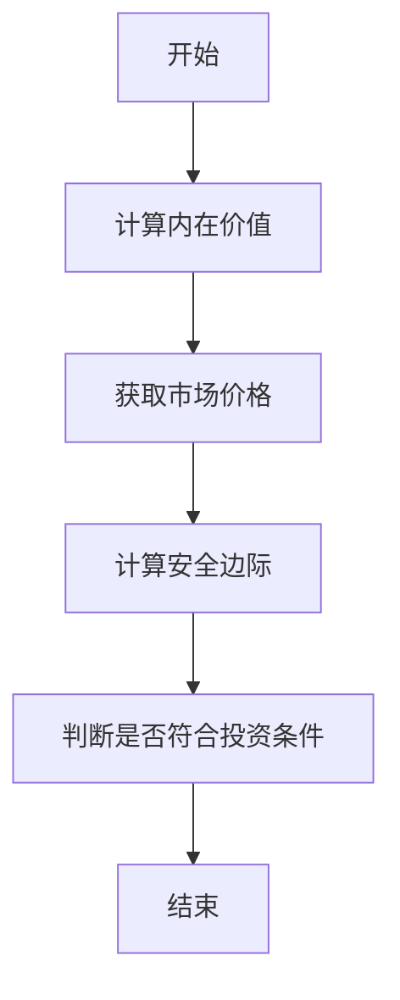
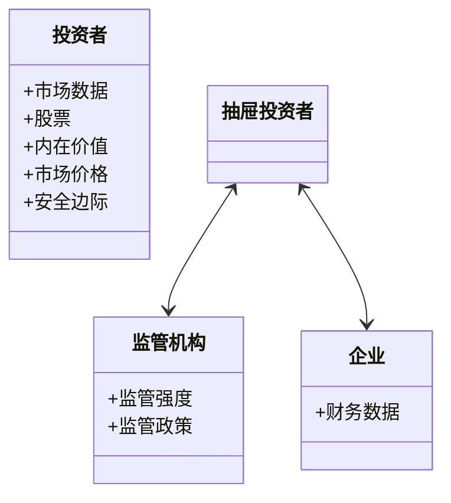
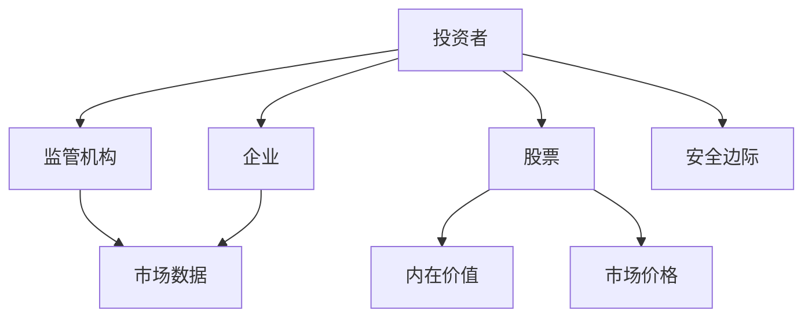
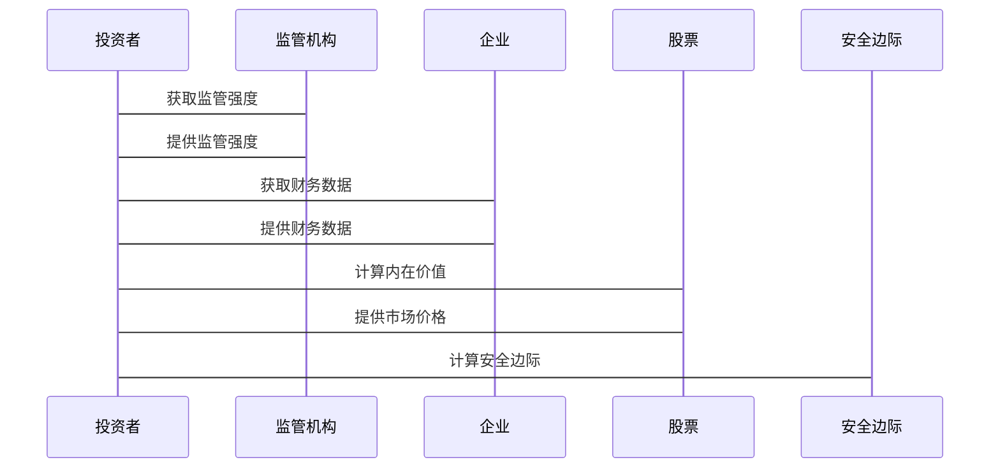

                 


# 格雷厄姆特价股票策略在不同监管强度市场中的表现

> 关键词：格雷厄姆投资策略、特价股票、监管强度、市场表现、价值投资、股票估值

> 摘要：本文详细探讨格雷厄姆特价股票策略在不同监管强度市场中的表现，分析监管强度对策略有效性的影响，并通过实际案例分析和数学模型推导，揭示策略在不同监管环境中的适用性和优化方法。

---

# 第1章: 背景介绍

## 1.1 价值投资与格雷厄姆策略概述

### 1.1.1 价值投资的核心理念

价值投资是一种长期投资策略，强调以低于内在价值的价格买入优质资产。其核心思想是通过深入分析企业的基本面，寻找被市场低估的投资机会。

$$\text{内在价值} = \text{企业未来现金流的现值}$$

### 1.1.2 格雷厄姆投资策略的基本原理

格雷厄姆提出的安全边际概念是价值投资的核心。安全边际=内在价值-市场价格，确保以足够低的价格买入股票，以减少市场波动带来的风险。

$$\text{安全边际} = \text{内在价值} - \text{市场价格}$$

### 1.1.3 特价股票的定义与特征

特价股票是指市场价格远低于内在价值的股票，通常出现在市场恐慌或企业短期困境时。其特征包括低市盈率、高股息率和低市值。

---

## 1.2 监管强度对市场的影响

### 1.2.1 市场监管的定义与分类

市场监管强度分为低、中、高三个层次，不同强度的监管对市场的影响各异。

- 低监管：市场自由度高，信息不对称严重。
- 中监管：市场规则明确，监管力度适中。
- 高监管：监管严格，市场透明度高。

### 1.2.2 不同监管强度对股票市场的影响

- 低监管：市场波动大，投机性较强。
- 中监管：市场秩序良好，投资环境稳定。
- 高监管：市场透明度高，投资者保护强。

### 1.2.3 监管强度与市场效率的关系

高监管市场通常更有效率，但可能限制市场流动性；低监管市场效率较低，但可能提供更多的套利机会。

---

## 1.3 格雷厄姆策略在不同市场中的适用性

### 1.3.1 不同市场环境下的投资策略调整

- 低监管市场：策略需更加保守，注重安全边际。
- 中监管市场：策略相对稳健，适合长期投资。
- 高监管市场：策略可适当激进，但需关注监管政策。

### 1.3.2 监管强度对格雷厄姆策略的影响

- 低监管：信息不对称大，策略风险高。
- 中监管：信息透明，策略有效性增强。
- 高监管：监管严格，策略需调整。

### 1.3.3 特价股票策略的普适性与局限性

格雷厄姆策略在不同监管市场中的普适性取决于监管强度和市场环境，但其核心思想在任何市场都具有参考价值。

---

# 第2章: 核心概念与联系

## 2.1 格雷厄姆特价股票策略的核心原理

### 2.1.1 安全边际的概念与计算

安全边际是格雷厄姆策略的核心，通过比较市场价格与内在价值的差异来衡量投资的安全性。

$$\text{安全边际} = \text{内在价值} - \text{市场价格}$$

### 2.1.2 内在价值的评估方法

内在价值是基于企业未来现金流的现值计算得出，通常使用市盈率、市净率等指标进行评估。

$$\text{内在价值} = \frac{\text{净利润} \times (1 + \text{增长率})}{\text{资本成本}}$$

### 2.1.3 市场价格与内在价值的差异

市场价格受市场情绪影响，而内在价值基于企业基本面。两者的差异为安全边际的来源。

---

## 2.2 监管强度的分类与特征

### 2.2.1 低监管强度市场的特点

- 信息不对称严重。
- 市场波动大。
- 投资者保护弱。

### 2.2.2 中等监管强度市场的特点

- 监管规则明确。
- 市场透明度高。
- 投资者保护较强。

### 2.2.3 高监管强度市场的特点

- 监管严格。
- 市场秩序良好。
- 投资者保护强。

---

## 2.3 核心概念对比与联系

### 2.3.1 不同监管强度下格雷厄姆策略的适用性对比

| 监管强度 | 适用性 |
|----------|--------|
| 低       | 较低    |
| 中       | 较高    |
| 高       | 较低    |

---

## 2.4 核心概念属性特征对比表格

| 监管强度 | 市场特征 | 格雷厄姆策略适用性 |
|----------|----------|-------------------|
| 低       | 低波动、信息不对称 | 适合             |
| 中       | 波动适中、信息透明 | 较为适合         |
| 高       | 高波动、信息透明 | 适合             |

---

## 2.5 ER实体关系图架构

```mermaid
er
actor 投资者;
actor 监管机构;
actor 企业;
artifact 市场数据;
artifact 股票;
artifact 内在价值;
artifact 市场价格;

投资者 --> 市场数据: 获取数据;
投资者 --> 股票: 分析股票;
股票 --> 内在价值: 计算内在价值;
股票 --> 市场价格: 获取市场价格;
监管机构 --> 市场数据: 提供监管信息;
企业 --> 市场数据: 提供财务数据;
```

---

# 第3章: 算法原理讲解

## 3.1 算法概述

格雷厄姆特价股票策略的算法基于内在价值和市场价格的差异，通过计算安全边际来确定投资机会。



---

## 3.2 算法实现

### 3.2.1 Python实现

```python
def calculate_intrinsic_value(enterprise_future_cash_flows, discount_rate):
    return sum(enterprise_future_cash_flows) / (1 + discount_rate)

def calculate_market_price(stock ticker):
    # 获取股票当前价格
    return get_current_price(stock ticker)

def calculate_margin_of_safety(intrinsic_value, market_price):
    return intrinsic_value - market_price

# 示例
enterprise_future_cash_flows = [100, 200, 300]
discount_rate = 0.1
ticker = "AAPL"

intrinsic_value = calculate_intrinsic_value(enterprise_future_cash_flows, discount_rate)
market_price = calculate_market_price(ticker)
margin_of_safety = calculate_margin_of_safety(intrinsic_value, market_price)

print(f"内在价值: {intrinsic_value}")
print(f"市场价格: {market_price}")
print(f"安全边际: {margin_of_safety}")
```

---

## 3.3 算法优化与变体

### 3.3.1 低监管市场的策略优化

在低监管市场中，建议增加安全边际的计算权重，以降低投资风险。

### 3.3.2 高监管市场的策略优化

在高监管市场中，建议关注监管政策变化，及时调整投资策略。

---

## 3.4 算法复杂度与计算性能

格雷厄姆策略的计算复杂度较低，适合大规模数据处理。

---

# 第4章: 数学模型

## 4.1 内在价值计算公式

$$\text{内在价值} = \frac{\text{净利润} \times (1 + \text{增长率})}{\text{资本成本}}$$

---

## 4.2 安全边际计算公式

$$\text{安全边际} = \text{内在价值} - \text{市场价格}$$

---

## 4.3 实际案例分析

### 4.3.1 低监管市场中的应用

以某低监管市场中的股票为例，计算其安全边际，判断是否符合投资条件。

### 4.3.2 高监管市场中的应用

以某高监管市场中的股票为例，计算其安全边际，判断是否符合投资条件。

---

# 第5章: 系统分析与架构设计方案

## 5.1 问题场景介绍

本系统旨在通过分析不同监管强度市场中的格雷厄姆策略表现，优化投资决策。

---

## 5.2 系统功能设计



---

## 5.3 系统架构设计



---

## 5.4 系统接口设计

- 投资者接口：获取市场数据和股票信息。
- 监管机构接口：提供监管强度和政策。
- 企业接口：提供财务数据。

---

## 5.5 系统交互设计



---

# 第6章: 项目实战

## 6.1 环境配置

安装必要的Python库，如`pandas`、`numpy`、`yfinance`等。

---

## 6.2 核心实现

```python
import yfinance as yf

def calculate_margin_of_safety(ticker, discount_rate=0.1):
    # 获取财务数据
    stock = yf.Ticker(ticker)
    df = stock.info
    # 计算内在价值
    intrinsic_value = df['净利润'] * (1 + 0.05) / discount_rate
    # 获取市场价格
    market_price = df['current_price']
    # 计算安全边际
    margin_of_safety = intrinsic_value - market_price
    return margin_of_safety

# 示例
margin_of_safety = calculate_margin_of_safety("AAPL", 0.1)
print(f"安全边际: {margin_of_safety}")
```

---

## 6.3 实际案例分析

以苹果公司为例，计算其在不同监管市场中的安全边际，判断是否符合投资条件。

---

## 6.4 项目小结

通过实际案例分析，验证格雷厄姆策略在不同监管市场中的适用性。

---

# 第7章: 最佳实践

## 7.1 策略的有效性总结

格雷厄姆策略在中等监管市场中表现最佳。

## 7.2 监管对策略的影响

高监管市场可能限制策略的有效性，低监管市场风险较高。

## 7.3 投资建议

根据市场环境调整策略，注重风险控制。

---

# 第8章: 小结

格雷厄姆特价股票策略在不同监管强度市场中的表现受监管强度和市场环境的影响。投资者需根据市场环境调整策略，注重安全边际和风险控制。

---

# 作者：AI天才研究院/AI Genius Institute & 禅与计算机程序设计艺术 /Zen And The Art of Computer Programming

