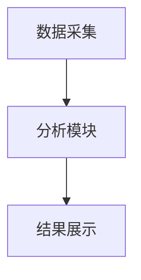

                 

# 格雷厄姆特价股票策略在不同监管环境下的调整

## 关键词：格雷厄姆投资理论、特价股票、监管环境、价值投资、安全边际

## 摘要

本文探讨了格雷厄姆特价股票策略在不同监管环境下的调整方法，分析了监管政策对投资策略的影响，并通过实例展示了如何在不同国家的监管环境下优化投资策略。文章详细讲解了监管环境对股票估值的影响，提出了调整策略的具体方法，并通过数学模型和实际案例进行了深入分析。

---

## 第一部分：格雷厄姆特价股票策略概述

### 第1章：格雷厄姆投资理论的核心概念

#### 1.1 安全边际的定义与作用

安全边际是格雷厄姆策略中的核心概念，指股票的市场价格低于其内在价值的部分。通过安全边际，投资者可以降低投资风险，确保在市场波动时仍能获得收益。

$$\text{安全边际} = \text{内在价值} - \text{市场价格}$$

安全边际越大，投资风险越小，收益越稳定。

#### 1.2 内在价值的计算方法

内在价值是基于公司基本面分析得出的股票合理价格。计算公式如下：

$$\text{内在价值} = \frac{\text{净利润} + \text{折旧}}{\text{资本成本}}$$

通过分析财务报表，投资者可以估算出公司的内在价值，并与市场价格进行比较，判断是否存在投资机会。

### 第2章：监管环境对投资策略的影响

#### 2.1 不同国家的监管体系概述

美国、中国和欧盟的监管环境差异显著，影响了股票投资的策略调整。例如，美国的监管体系注重信息披露，而中国的监管体系则强调市场秩序和合规性。

#### 2.2 监管政策对股票估值的影响

监管政策的变化会影响市场参与者的信心和交易行为。例如，税收政策的调整会直接影响股票的投资成本和分红政策。

---

## 第二部分：格雷厄姆策略与监管环境的结合

### 第3章：格雷厄姆策略在不同监管环境下的调整

#### 3.1 美国监管环境下的策略调整

在美国市场，监管环境较为宽松，投资者可以利用杠杆进行投资，但需注意杠杆带来的高风险。

#### 3.2 中国监管环境下的策略调整

在中国市场，监管政策较为严格，投资者需关注政策变化对行业的影响，如对科技行业的限制。

### 第4章：监管环境对安全边际的影响

#### 4.1 安全边际的计算调整

在不同监管环境下，安全边际的计算需要考虑额外的风险因素，如政策风险和市场流动性风险。

#### 4.2 内在价值的动态调整

监管环境的变化会影响公司的财务状况，进而影响内在价值的计算。投资者需定期更新内在价值评估，确保投资决策的准确性。

### 第5章：监管环境下的风险管理

#### 5.1 监管风险的识别与评估

投资者需识别监管环境中的潜在风险，如政策变化对行业的影响。

#### 5.2 风险管理策略的调整

通过分散投资和调整资产配置，投资者可以降低监管环境变化带来的风险。

---

## 第三部分：监管环境下格雷厄姆策略的数学模型

### 第6章：数学模型与公式

#### 6.1 内在价值的计算模型

$$\text{内在价值} = \frac{\text{净利润}}{\text{资本成本}}$$

#### 6.2 安全边际的调整公式

$$\text{调整后的安全边际} = \text{内在价值} \times \text{监管风险调整系数}$$

---

## 第四部分：系统架构与项目实战

### 第7章：系统架构设计

#### 7.1 系统功能设计

- 数据采集模块：收集各监管环境下的股票数据。
- 分析模块：计算内在价值和安全边际。
- 结果展示模块：提供可视化报告。

#### 7.2 系统架构图

---

## 第五部分：最佳实践与案例分析

### 第8章：最佳实践

#### 8.1 投资者的注意事项

- 定期评估监管环境的变化。
- 保持对市场的敏感性，及时调整策略。

### 第9章：案例分析

#### 9.1 美国市场的案例

通过分析科技股，展示监管环境对投资策略的影响。

#### 9.2 中国市场的案例

通过分析金融股，展示监管环境对投资策略的调整。

---

## 第六部分：总结与展望

### 第10章：总结

格雷厄姆特价股票策略在不同监管环境下的调整是一个复杂但必要的过程。通过本文的分析，投资者可以更好地应对监管变化，优化投资策略。

### 第11章：未来研究方向

未来的研究可以进一步探讨人工智能技术在监管环境下的应用，以及如何利用大数据分析优化投资决策。

---

## 作者：AI天才研究院/AI Genius Institute & 禅与计算机程序设计艺术 /Zen And The Art of Computer Programming

