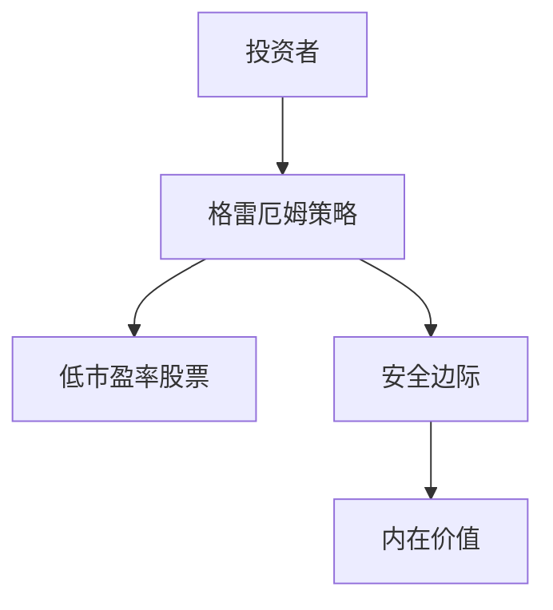
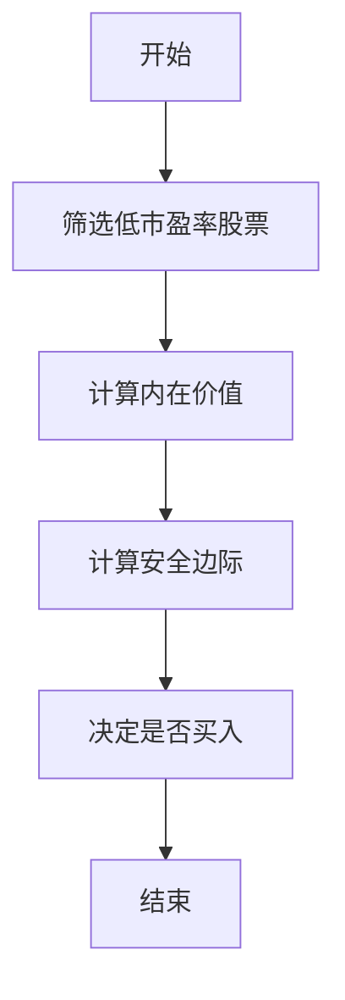
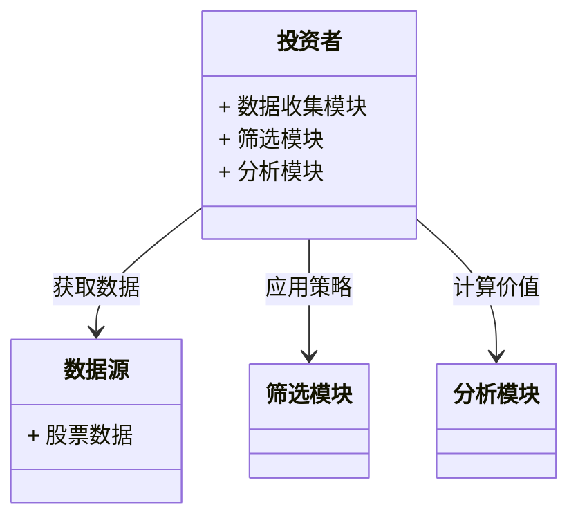

                 


# 格雷厄姆特价股票策略在不同规模经济体中的表现

> **关键词**：格雷厄姆特价股票策略，价值投资，内在价值，安全边际，规模经济体，投资策略

> **摘要**：本文探讨了格雷厄姆的价值投资策略在不同规模经济体中的表现。通过分析其核心概念、算法原理、数学模型、系统架构以及实际案例，揭示了该策略在不同经济环境下的优劣，为投资者提供深度见解和实际应用指导。

---

## 第一部分：背景介绍

### 第1章：格雷厄姆特价股票策略概述

#### 1.1 格雷厄姆投资理论的核心概念

格雷厄姆的价值投资理论是20世纪最经典的投资策略之一，其核心在于寻找市场价格低于内在价值的股票。以下是其核心概念：

- **内在价值**：股票的真正价值，即其未来现金流的现值。格雷厄姆认为，市场价格围绕内在价值波动，长期来看会回归其价值。
- **安全边际**：买入价格低于内在价值，确保在市场波动中仍有获利空间。例如，若股票内在价值为100元，以80元买入，安全边际为20%。

#### 1.2 不同规模经济体的经济特征

不同规模的经济体（如发达国家和发展中国家）具有不同的市场特征，影响格雷厄姆策略的表现：

- **发达国家市场**：市场成熟，波动较小，适合长期价值投资。但竞争激烈，低价股票稀缺。
- **发展中国家市场**：市场波动大，成长潜力高，低价股票较多，但风险也更大。

---

## 第二部分：核心概念与联系

### 第2章：格雷厄姆策略的核心原理

#### 2.1 格雷厄姆策略的数学模型

格雷厄姆的内在价值计算公式：

$$ V = \frac{E}{P} $$

其中，V为内在价值，E为每股收益，P为股息率。安全边际计算：

$$ \text{安全边际} = \frac{\text{内在价值} - \text{市场价格}}{\text{内在价值}} $$

#### 2.2 格雷厄姆策略与传统投资策略的对比

以下是对比表格：

| 指标 | 格雷厄姆策略 | 传统成长型投资 |
|------|--------------|----------------|
| 策略重点 | 低市盈率、低市净率 | 高成长率、高市盈率 |
| 风险偏好 | 低风险 | 高风险 |

#### 2.3 实体关系图



---

## 第三部分：算法原理讲解

### 第3章：格雷厄姆策略的筛选算法

#### 3.1 筛选标准

- **低市盈率（P/E < 15）**：市盈率低于行业平均水平，反映股票被低估。
- **低市净率（P/B < 2）**：市净率低于行业平均水平，表明资产价值被低估。

#### 3.2 筛选流程



---

## 第四部分：数学模型与公式

### 第4章：格雷厄姆策略的数学模型

#### 4.1 内在价值计算

格雷厄姆的内在价值公式：

$$ V = \frac{E}{P} $$

其中，V为内在价值，E为每股收益，P为股息率。

#### 4.2 安全边际计算

安全边际的计算公式：

$$ \text{安全边际} = \frac{\text{内在价值} - \text{市场价格}}{\text{内在价值}} $$

例如，若股票的内在价值为100元，市场价格为80元，则安全边际为20%。

---

## 第五部分：系统分析与架构设计

### 第5章：系统分析与架构设计

#### 5.1 项目介绍

本项目旨在分析格雷厄姆策略在不同经济体中的表现，构建一个自动化筛选系统。

#### 5.2 系统功能设计

- **数据收集模块**：收集股票数据，包括市盈率、市净率等。
- **筛选模块**：应用格雷厄姆策略筛选股票。
- **分析模块**：计算内在价值和安全边际。

#### 5.3 系统架构图



---

## 第六部分：项目实战

### 第6章：项目实战

#### 6.1 环境安装

- Python 3.8+
- Pandas、NumPy、Matplotlib

#### 6.2 核心实现代码

```python
import pandas as pd

def calculate_intrinsic_value(df):
    df['Intrinsic Value'] = df['Earnings'] / df['P']
    return df

def calculate_margin_of_safety(df):
    df['Safety Margin'] = (df['Intrinsic Value'] - df['Price']) / df['Intrinsic Value']
    return df

# 示例数据
data = {
    'Ticker': ['AAPL', 'GOOGL', 'MSFT'],
    'Price': [150, 100, 60],
    'Earnings': [10, 15, 8],
    'P': [0.05, 0.06, 0.1]
}
df = pd.DataFrame(data)
df = calculate_intrinsic_value(df)
df = calculate_margin_of_safety(df)
print(df)
```

---

## 第七部分：结论与展望

### 第7章：结论与展望

#### 7.1 研究结论

格雷厄姆策略在不同规模经济体中表现各异，发达国家市场更为稳定，而发展中国家市场波动大但潜力高。

#### 7.2 未来展望

进一步研究策略在混合经济环境中的表现，并结合机器学习优化筛选模型。

---

**作者：AI天才研究院/AI Genius Institute & 禅与计算机程序设计艺术 /Zen And The Art of Computer Programming**

