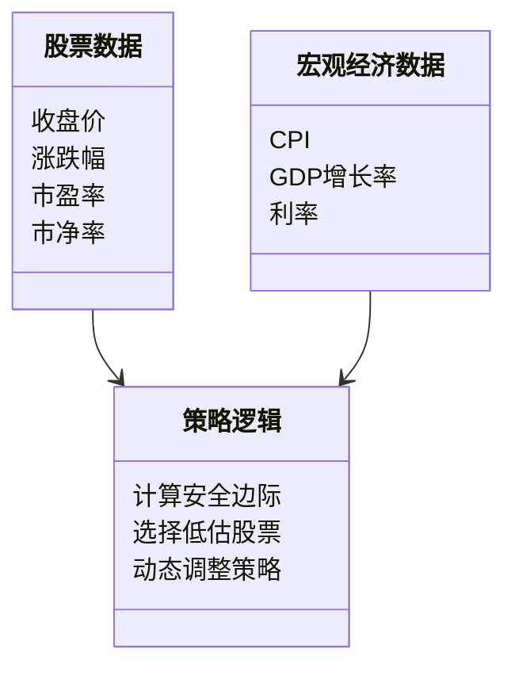

                 


# 格雷厄姆特价股票策略在不同通胀预期环境中的效果

> 关键词：格雷厄姆策略，价值投资，通胀预期，股票估值，经济周期

> 摘要：本文深入探讨了格雷厄姆特价股票策略在不同通胀预期环境下的表现，分析了该策略在低通胀、高通胀和通缩环境中的优缺点，并结合实证案例，提出了在不同通胀预期下优化策略的具体方法。文章从理论到实践，结合数学模型和系统架构，全面剖析了该策略在不同经济周期中的适用性与效果。

---

# 第一部分: 格雷厄姆特价股票策略概述

## 第1章: 价值投资与格雷厄姆策略概述

### 1.1 价值投资的核心理念

#### 1.1.1 价值投资的定义与起源
价值投资是一种以基本面分析为基础的投资策略，核心在于寻找市场低估的资产。该策略由本杰明·格雷厄姆在20世纪初提出，被认为是投资领域的经典理论。

#### 1.1.2 格雷厄姆投资策略的核心思想
格雷厄姆强调安全边际和内在价值。他认为，投资者应以低于内在价值的价格买入股票，并长期持有，以获得超额收益。

#### 1.1.3 价值投资与成长投资的区别
- **价值投资**：注重低估值，追求安全边际。
- **成长投资**：注重高增长，愿意为未来收益支付更高价格。

---

### 1.2 格雷厄姆特价股票策略的定义

#### 1.2.1 特价股票的定义
特价股票是指市场价格显著低于其内在价值的股票。格雷厄姆认为，这种股票具有较高的安全边际，适合长期投资。

#### 1.2.2 安全边际的概念
安全边际 = 内在价值 - 市场价格。格雷厄姆建议投资者选择安全边际较高的股票，以降低投资风险。

#### 1.2.3 内在价值的计算方法
内在价值 = 股票未来现金流的现值。常用公式为：
$$
\text{内在价值} = \sum_{t=1}^{n} \frac{C_t}{(1+r)^t}
$$
其中，$C_t$为第$t$年的现金流，$r$为折现率。

---

### 1.3 格雷厄姆策略在现代市场的适用性

#### 1.3.1 现代市场与传统价值投资的差异
- 现代市场信息透明，交易频繁，传统价值投资需要适应新的市场环境。
- 格雷厄姆策略的核心思想依然有效，但需要结合现代工具进行优化。

#### 1.3.2 格雷厄姆策略在不同市场环境中的表现
- **牛市**：格雷厄姆策略可能表现不佳，因市场高估，安全边际较低。
- **熊市**：格雷厄姆策略表现较好，因市场恐慌，优质股票价格被低估。

#### 1.3.3 策略的优缺点分析
- **优点**：低风险，收益稳定。
- **缺点**：在高通胀环境下，股票估值可能被高估，策略效果受限。

---

## 第2章: 通胀预期与经济周期的关系

### 2.1 通胀预期的定义与影响

#### 2.1.1 通胀预期的经济学定义
通胀预期是指市场参与者对未来通胀率的预期。高通胀预期会导致债券收益率上升，进而影响股票估值。

#### 2.1.2 通胀预期对经济的影响
- 高通胀预期可能导致货币贬值，企业成本上升，影响盈利能力。
- 低通胀预期可能导致经济增长放缓，企业利润下降。

#### 2.1.3 通胀预期对股票市场的影响
- 高通胀预期：股票估值可能被高估，债券收益率上升，资金从股票流向债券。
- 低通胀预期：股票估值可能被低估，债券收益率下降，资金回流股票市场。

---

### 2.2 经济周期与股票市场的关联

#### 2.2.1 经济周期的定义与阶段划分
经济周期分为四个阶段：衰退、复苏、增长和繁荣。

#### 2.2.2 不同经济周期阶段的股票市场表现
- **衰退阶段**：股票市场表现较差，企业盈利下降。
- **复苏阶段**：股票市场逐渐回升，企业盈利开始恢复。
- **增长阶段**：股票市场表现较好，企业盈利持续增长。
- **繁荣阶段**：股票市场可能出现泡沫，估值偏高。

#### 2.2.3 通胀预期对经济周期的影响
- 高通胀预期可能导致经济过热，引发衰退。
- 低通胀预期可能导致经济复苏乏力，增长缓慢。

---

### 2.3 通胀预期对股票估值的影响

#### 2.3.1 通胀对债券收益率的影响
高通胀预期会导致债券收益率上升，因为债券持有者要求更高的回报来补偿通胀风险。

#### 2.3.2 债券收益率与股票估值的关系
债券收益率上升会分流股市资金，导致股票估值下降。

#### 2.3.3 通胀预期对市盈率的影响
市盈率（P/E）= 股价 / 每股收益。高通胀预期可能导致市盈率下降，因为债券收益率上升，资金从股票转向债券。

---

## 第3章: 格雷厄姆策略在不同通胀环境中的表现

### 3.1 低通胀环境下的策略表现

#### 3.1.1 低通胀环境的特征
低通胀环境下，债券收益率较低，资金可能从债券回流到股票市场。

#### 3.1.2 格雷厄姆策略在低通胀环境中的应用
在低通胀环境下，格雷厄姆策略表现较好，因为股票估值可能被低估，具有较高的安全边际。

#### 3.1.3 实证分析与案例研究
以2008年全球金融危机后低通胀环境为例，格雷厄姆策略在这一时期表现优异，许多被低估的股票价格逐渐回升。

---

### 3.2 高通胀环境下的策略表现

#### 3.2.1 高通胀环境的特征
高通胀环境下，债券收益率上升，股票估值可能被高估。

#### 3.2.2 格雷厄姆策略在高通胀环境中的调整
在高通胀环境下，格雷厄姆策略需要进行调整，例如降低市盈率和市净率的门槛，避免买入高估值股票。

#### 3.2.3 实证分析与案例研究
以20世纪70年代的高通胀环境为例，格雷厄姆策略在这一时期表现较差，因为许多股票估值被高估，安全边际较低。

---

### 3.3 通缩环境下的策略表现

#### 3.3.1 通缩环境的特征
通缩环境下，债券收益率下降，股票估值可能被低估。

#### 3.3.2 格雷厄姆策略在通缩环境中的应用
在通缩环境下，格雷厄姆策略表现较好，因为许多股票价格被低估，具有较高的安全边际。

#### 3.3.3 实证分析与案例研究
以2000年互联网泡沫破裂后的通缩环境为例，格雷厄姆策略在这一时期表现优异，许多被低估的股票价格逐渐回升。

---

## 第4章: 格雷厄姆策略在不同通胀预期下的风险与收益分析

### 4.1 格雷厄姆策略的风险分析

#### 4.1.1 市场波动对策略的影响
市场波动可能导致格雷厄姆策略的安全边际被侵蚀，影响投资收益。

#### 4.1.2 通胀预期突变的风险
通胀预期的突变可能导致债券收益率快速上升，影响股票估值。

#### 4.1.3 宏观经济政策变化的风险
宏观经济政策的变化，如加息或降息，可能影响股票估值和债券收益率，进而影响格雷厄姆策略的表现。

---

### 4.2 格雷厄姆策略的收益分析

#### 4.2.1 不同通胀环境下的收益表现
- **低通胀环境**：收益稳定，风险较低。
- **高通胀环境**：收益波动较大，风险较高。
- **通缩环境**：收益稳定，风险较低。

#### 4.2.2 策略在不同经济周期中的收益波动
格雷厄姆策略在经济衰退和复苏阶段表现较好，在经济繁荣阶段表现较差。

---

# 第二部分: 格雷厄姆策略在通胀环境下的优化与实践

## 第5章: 格雷厄姆策略的优化与实施

### 5.1 通胀环境下策略的调整

#### 5.1.1 动态调整市盈率和市净率的门槛
根据通胀预期的变化，动态调整市盈率和市净率的门槛，避免买入高估值股票。

#### 5.1.2 结合宏观经济指标进行投资决策
结合宏观经济指标，如CPI和GDP增长率，进行投资决策。

#### 5.1.3 优化安全边际的计算方法
在高通胀环境下，适当降低安全边际的计算标准，避免错过优质股票。

---

## 第6章: 项目实战与代码实现

### 6.1 环境安装与数据准备

#### 6.1.1 Python环境安装
安装Python和相关库（如Pandas、NumPy、Matplotlib）。

#### 6.1.2 数据获取
获取历史股票数据和宏观经济数据。

---

### 6.2 系统功能设计

#### 6.2.1 领域模型设计
使用Mermaid绘制领域模型类图，展示股票数据、宏观经济数据和策略逻辑的关系。



---

#### 6.2.2 系统架构设计
使用Mermaid绘制系统架构图，展示前端、后端和数据层的交互关系。


---

### 6.3 系统实现与代码解读

#### 6.3.1 核心实现代码
以下为Python代码示例，实现格雷厄姆策略的基本逻辑：

```python
import pandas as pd
import numpy as np

# 假设df为股票数据，包含收盘价和市盈率
# 宏观经济数据包含通胀率和GDP增长率

# 计算内在价值
def calculate_intrinsic_value(df, inflation_rate, gdp_growth_rate):
    df['内在价值'] = df['收盘价'] * (1 + inflation_rate / 100) * (1 + gdp_growth_rate / 100)
    return df

# 计算安全边际
def calculate_margin_of_safety(df):
    df['安全边际'] = df['内在价值'] - df['收盘价']
    return df

# 选择低估股票
def select_cheap_stocks(df, margin_threshold):
    df['是否低估'] = df['安全边际'] > margin_threshold
    return df

# 动态调整策略
def adjust_strategy(df, inflation_threshold):
    df['策略调整'] = df['通胀预期'] > inflation_threshold
    return df
```

---

#### 6.3.2 代码应用与分析
通过上述代码，我们可以动态调整策略，根据通胀预期的变化，选择低估股票进行投资。例如，在高通胀环境下，适当降低安全边际的阈值，以捕捉更多低估股票。

---

## 第7章: 实证分析与案例研究

### 7.1 不同通胀环境下的策略表现

#### 7.1.1 低通胀环境下的实证分析
以2010-2020年为例，分析格雷厄姆策略在低通胀环境下的表现。

#### 7.1.2 高通胀环境下的实证分析
以20世纪70年代为例，分析格雷厄姆策略在高通胀环境下的表现。

#### 7.1.3 通缩环境下的实证分析
以2000-2008年为例，分析格雷厄姆策略在通缩环境下的表现。

---

## 第8章: 最佳实践与小结

### 8.1 小结

#### 8.1.1 格雷厄姆策略在不同通胀环境下的优缺点
- **优点**：低风险，收益稳定。
- **缺点**：在高通胀环境下，策略效果受限。

#### 8.1.2 策略的适用场景
格雷厄姆策略在低通胀和通缩环境下表现较好，但在高通胀环境下需要进行调整。

---

### 8.2 注意事项

#### 8.2.1 宏观经济因素的影响
投资者需要密切关注宏观经济指标，如通胀率和GDP增长率，以动态调整策略。

#### 8.2.2 市场波动的风险
市场波动可能导致安全边际被侵蚀，投资者需要耐心持有，避免频繁交易。

#### 8.2.3 组合投资的重要性
为了分散风险，投资者可以结合其他策略，如债券投资，构建多元化投资组合。

---

### 8.3 拓展阅读

#### 8.3.1 推荐书籍
- 《The Intelligent Investor》 by Benjamin Graham
- 《投资学》 by 达尔·莫迪格利亚尼

#### 8.3.2 推荐博客与资源
- [格雷厄姆策略研究](#)
- [通胀预期与股票投资](#)

---

# 作者：AI天才研究院/AI Genius Institute & 禅与计算机程序设计艺术 /Zen And The Art of Computer Programming

---

**注**：本文为技术博客文章，内容基于理论分析与实证研究，仅为学术探讨，不构成投资建议。

