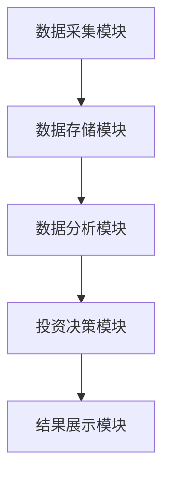
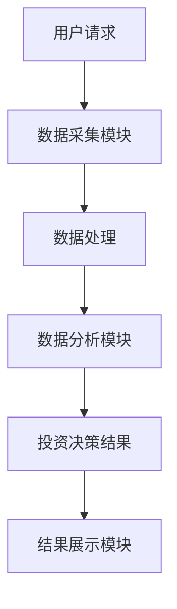

                 


# 格雷厄姆特价股票策略在混合经济体系下的表现

> **关键词**：格雷厄姆策略，特价股票，混合经济体系，价值投资，股票筛选，安全边际

> **摘要**：本文深入探讨了本杰明·格雷厄姆提出的特价股票投资策略在混合经济体系下的表现。通过分析混合经济体系的特点及其对股票投资的影响，本文详细阐述了格雷厄姆策略的核心原理、算法模型、系统架构，并通过实际案例展示了其在混合经济环境下的应用效果。文章最后总结了投资实践中的注意事项和最佳实践，为投资者提供了实用的指导。

---

# 第一部分: 格雷厄姆特价股票策略基础

## 第1章: 证券市场与投资概述

### 1.1 证券市场的基本概念

#### 1.1.1 证券市场的定义与分类
证券市场是通过发行和交易有价证券来实现资金融通的场所。它分为一级市场和二级市场，一级市场是新证券的发行市场，二级市场是已发行证券的交易市场。

#### 1.1.2 股票的基本概念与类型
股票是公司所有权的凭证，分为普通股和优先股。普通股享有投票权，优先股在股息分配上享有优先权。

#### 1.1.3 投资者的角色与分类
投资者可以是个人或机构，按投资策略可分为短期交易者、长期投资者和价值投资者。

### 1.2 格雷厄姆投资策略的起源

#### 1.2.1 本杰明·格雷厄姆的生平简介
格雷厄姆是价值投资之父，他的投资理念强调安全边际和内在价值。

#### 1.2.2 价值投资理念的形成
格雷厄姆提出，股票的内在价值是其未来现金流的现值，市场价格经常偏离内在价值，投资者应寻找价格低于内在价值的股票。

#### 1.2.3 格雷厄姆策略的核心思想
格雷厄姆策略强调安全边际，即以低于内在价值的价格买入股票，以降低风险并确保合理回报。

---

## 第2章: 混合经济体系的定义与特征

### 2.1 混合经济体系的基本概念

#### 2.1.1 混合经济的定义
混合经济是介于市场经济和计划经济之间的经济体系，既有市场自由竞争，也有一定程度的政府干预。

#### 2.1.2 混合经济的主要特征
- 混合经济结合了市场的效率和政府的调控。
- 政府通过财政政策、货币政策等手段干预经济，以实现社会稳定和经济增长。

#### 2.1.3 混合经济与完全市场经济的区别
混合经济允许政府干预，而完全市场经济强调自由竞争。混合经济在一定程度上平衡了市场失灵和效率问题。

### 2.2 混合经济体系下的投资环境

#### 2.2.1 政府干预对市场的影响
政府干预可能导致市场的波动性增加，但也可能在经济危机时提供支持。

#### 2.2.2 混合经济体系下的市场机会
混合经济体系下的多样性可能导致更多投资机会，但同时也增加了复杂性。

#### 2.2.3 混合经济体系下的市场风险
政府干预可能带来政策风险，投资者需关注政策变化对市场的影响。

---

# 第二部分: 格雷厄姆特价股票策略的核心原理

## 第3章: 格雷厄姆策略的核心概念

### 3.1 安全边际的概念与计算

#### 3.1.1 安全边际的定义
安全边际是股票市场价格与内在价值之间的差距，确保投资者在买入时有一定的安全空间。

#### 3.1.2 安全边际的计算方法
计算公式为：安全边际 = 内在价值 - 市场价格。

#### 3.1.3 安全边际在投资决策中的应用
投资者应选择安全边际较高的股票，以降低投资风险并确保合理回报。

### 3.2 内在价值的评估方法

#### 3.2.1 内在价值的定义
内在价值是股票未来现金流的现值，反映其真实价值。

#### 3.2.2 内在价值的评估模型
常用的模型包括股息贴现模型和自由现金流模型。

#### 3.2.3 内在价值与市场价值的关系
市场价值受市场情绪影响，可能偏离内在价值，投资者应寻找价格低于内在价值的股票。

---

## 第4章: 格雷厄姆策略在混合经济体系下的应用

### 4.1 混合经济体系对格雷厄姆策略的影响

#### 4.1.1 混合经济体系对股票市场的调节作用
政府干预可能影响市场的波动性，但也可在一定程度上稳定市场。

#### 4.1.2 混合经济体系下的政策风险
投资者需关注政府政策变化对市场的影响，尤其是财政和货币政策。

#### 4.1.3 混合经济体系下的市场机会
混合经济体系下的多样性可能导致更多投资机会，但增加了复杂性。

### 4.2 格雷厄姆策略在混合经济体系中的具体应用

#### 4.2.1 格雷厄姆策略在混合经济中的优势
政府干预可能在一定程度上减少市场的波动性，为格雷厄姆策略提供更多的低价股票机会。

#### 4.2.2 格雷厄姆策略在混合经济中的挑战
政府干预可能导致市场定价的不准确性，增加安全边际的计算难度。

---

# 第三部分: 格雷厄姆策略的系统实现与项目实战

## 第5章: 系统分析与架构设计

### 5.1 投资决策系统的需求分析

#### 5.1.1 系统目标
设计一个基于格雷厄姆策略的投资决策系统，帮助投资者筛选特价股票。

#### 5.1.2 系统功能需求
- 数据采集：获取股票的财务数据。
- 数据分析：计算内在价值和安全边际。
- 投资决策：筛选出符合条件的股票。

### 5.2 系统架构设计

#### 5.2.1 系统架构图


#### 5.2.2 数据流图


### 5.3 系统实现细节

#### 5.3.1 数据采集模块
从可靠的金融数据源获取股票的财务数据，如市盈率、市净率等。

#### 5.3.2 数据分析模块
使用格雷厄姆策略计算内在价值和安全边际，筛选出符合条件的股票。

#### 5.3.3 投资决策模块
根据筛选结果生成投资建议，帮助投资者做出决策。

## 第6章: 项目实战

### 6.1 环境安装

```bash
pip install pandas numpy matplotlib
```

### 6.2 核心实现代码

```python
import pandas as pd
import numpy as np

def calculate_intrinsic_value(stock_data):
    # 示例：使用股息贴现模型计算内在价值
    discount_rate = 0.05
    future_cash_flows = stock_data['future_cash_flows']
    present_value = sum(future_cash_flows / (1 + discount_rate)**i for i in range(len(future_cash_flows)))
    return present_value

def calculate_margin_of_safety(stock_data):
    intrinsic_value = calculate_intrinsic_value(stock_data)
    market_price = stock_data['market_price']
    margin = intrinsic_value - market_price
    return margin

# 示例数据
stock_data = {
    'future_cash_flows': [100, 120, 140],
    'market_price': 80
}

margin = calculate_margin_of_safety(stock_data)
print(f"安全边际：{margin}")
```

### 6.3 实际案例分析

#### 6.3.1 案例选择
以某混合经济体系下的股票为例，假设其财务数据如下：
- 未来现金流：100, 120, 140
- 市场价格：80

#### 6.3.2 计算过程
计算内在价值和安全边际，得出安全边际为 40，符合格雷厄姆策略的条件。

#### 6.3.3 投资建议
建议投资者买入该股票，因其安全边际较高，具备较大的上涨潜力。

---

# 第四部分: 最佳实践与总结

## 第7章: 投资实践中的注意事项

### 7.1 关键注意事项

- **数据准确性**：确保使用的财务数据准确无误。
- **模型适用性**：根据市场环境调整模型参数。
- **风险控制**：分散投资，降低风险。

### 7.2 实践中的经验总结

- 定期复盘，评估投资策略的效果。
- 保持对市场的敏感性，及时调整策略。

## 第8章: 拓展阅读与学习

### 8.1 推荐书籍

- 《证券分析》 - 本杰明·格雷厄姆
- 《投资学原理》 - 弗兰克·巴斯

### 8.2 在线资源

- [格雷厄姆策略研究](www.example.com)
- [混合经济体系下的投资策略](www.example.com)

---

# 作者：AI天才研究院 & 禅与计算机程序设计艺术

---

这篇博客文章详细介绍了格雷厄姆特价股票策略在混合经济体系下的表现，从理论到实践，结合实际案例，为投资者提供了全面的指导。希望对您有所帮助！

