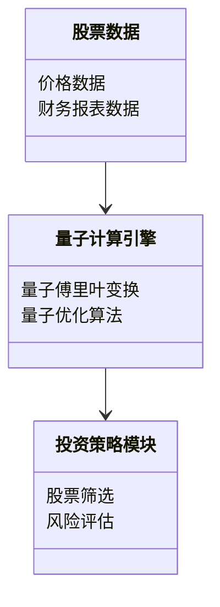
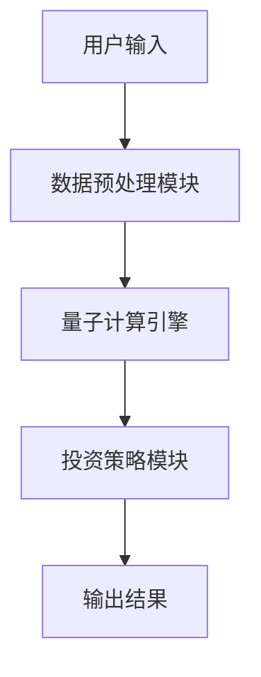

                 


# 《格雷厄姆特价股票策略在量子计算时代的潜在应用》

## 关键词：量子计算，股票策略，价值投资，投资优化，量化分析

## 摘要：  
本文探讨格雷厄姆价值投资策略在量子计算时代的潜在应用，分析量子计算如何提升股票筛选、风险评估和投资组合优化的效率与精度。通过量子算法和数学模型的详细讲解，结合实际案例分析，展示量子计算在现代金融中的巨大潜力，为投资者提供新的视角和工具。

---

# 第一部分: 格雷厄姆特价股票策略与量子计算的背景与基础

## 第1章: 格雷厄姆投资理论的核心概念

### 1.1 价值投资的定义与原则

#### 1.1.1 价值投资的定义  
价值投资是一种以低于公平价值的价格购买优质资产的投资策略，核心在于寻找市场低估的股票。其本质是通过分析公司的基本面，寻找市场价格与内在价值的差异。

#### 1.1.2 格雷厄姆策略的核心原则  
- **安全边际**：购买价格低于内在价值，以确保投资的安全性。  
- **价值评估**：通过分析财务报表，计算公司的内在价值。  
- **长期视角**：关注公司的长期盈利能力，而非短期市场波动。  

#### 1.1.3 格雷厄姆策略的优势  
- **防御性**：通过安全边际降低投资风险。  
- **长期稳健**：注重公司基本面，适合长期投资。  
- **逆市场思维**：在市场恐慌时寻找低估机会。  

---

## 第2章: 量子计算的基本概念与金融应用

### 2.1 量子计算的定义与原理

#### 2.1.1 量子计算的定义  
量子计算是一种利用量子力学原理进行计算的方式，通过量子位（qubit）的叠加态和纠缠态实现并行计算。  

#### 2.1.2 量子计算的核心优势  
- **并行计算**：量子位的叠加态可以同时表示多个状态，大幅提高计算速度。  
- **纠缠态**：量子纠缠允许信息在多个量子位之间快速传递。  
- **算法优化**：量子算法在某些特定问题上具有指数级加速能力。  

#### 2.1.3 量子计算的挑战  
- **技术瓶颈**：量子位的稳定性和纠错技术尚未成熟。  
- **硬件限制**：当前量子计算机的规模有限，难以处理复杂金融问题。  

### 2.2 量子计算在金融领域的潜力

#### 2.2.1 量子计算在金融分析中的优势  
- **大数据处理**：量子计算可以快速处理海量金融数据。  
- **复杂模型优化**：量子算法可以优化投资组合、风险评估等复杂问题。  
- **实时计算**：量子计算可以实现高频交易中的实时决策优化。  

#### 2.2.2 量子计算在金融中的应用场景  
- **股票筛选**：利用量子计算快速筛选低估股票。  
- **风险评估**：通过量子算法评估投资组合的风险。  
- **投资组合优化**：利用量子计算优化资产配置。  

---

# 第二部分: 格雷厄姆策略的量子化分析

## 第3章: 量子计算在股票数据分析中的应用

### 3.1 量子数据处理的基本原理

#### 3.1.1 量子数据处理的优势  
- **并行计算**：量子计算可以在同一时间处理大量数据。  
- **高效筛选**：通过量子算法快速筛选出符合条件的股票。  

#### 3.1.2 量子数据清洗与特征提取  
- **数据清洗**：利用量子算法识别异常数据点。  
- **特征提取**：通过量子计算提取影响股价的关键特征。  

### 3.2 量子计算在股票预测模型中的应用

#### 3.2.1 量子回归模型的构建  
- **量子回归算法**：通过量子叠加态构建回归模型，优化预测精度。  
- **量子回归的优势**：相比经典回归，量子回归可以在更短时间内完成复杂计算。  

#### 3.2.2 量子分类模型的应用  
- **量子分类算法**：利用量子纠缠态实现股票分类，识别低估股票。  
- **分类精度提升**：量子计算可以提高分类模型的准确率。  

---

## 第4章: 格雷厄姆策略的量子化优化

### 4.1 量子计算在公司估值中的应用

#### 4.1.1 量子估值模型的构建  
- **量子估值算法**：通过量子计算优化公司估值的计算过程。  
- **估值精度提升**：量子计算可以更精确地评估公司的内在价值。  

### 4.2 量子计算在安全边际评估中的作用

#### 4.2.1 量子安全边际算法  
- **安全边际计算**：通过量子算法快速计算股票的安全边际。  
- **风险控制**：利用量子计算优化投资组合的风险控制。  

---

# 第三部分: 量子计算在股票策略中的算法原理与数学模型

## 第5章: 量子计算的核心算法

### 5.1 量子傅里叶变换

#### 5.1.1 量子傅里叶变换的原理  
量子傅里叶变换（QFT）是一种量子算法，可以将经典傅里叶变换加速到对数时间内完成。  

#### 5.1.2 量子傅里叶变换在股票数据分析中的应用  
- **频域分析**：通过量子傅里叶变换分析股票价格的周期性。  
- **特征提取**：利用量子傅里叶变换提取股票数据的频域特征。  

#### 5.1.3 量子傅里叶变换的数学模型  
量子傅里叶变换的矩阵表示如下：  
$$ QFT = \frac{1}{\sqrt{2^n}} \sum_{k=0}^{2^n-1} e^{2\pi ijk/2^n} |k\rangle $$  

---

## 第6章: 格雷厄姆策略的量子化数学模型

### 6.1 格雷厄姆策略的数学表达

#### 6.1.1 公司内在价值的计算  
格雷厄姆的内在价值公式：  
$$ V = \frac{EPS \times (4.41 \times P/E + 2.206 \times PEG)}{1 + g} $$  

#### 6.1.2 量子计算在价值评估中的应用  
- **量子计算优化**：通过量子优化算法加速内在价值的计算。  
- **精度提升**：量子计算可以提高内在价值评估的准确性。  

---

# 第四部分: 项目实战与系统设计

## 第7章: 量子计算在股票策略中的系统设计

### 7.1 系统功能设计

#### 7.1.1 领域模型设计  


#### 7.1.2 系统架构设计  


### 7.2 系统实现

#### 7.2.1 量子计算环境搭建  
- **量子计算框架**：使用 IBM Qiskit 或 Rigetti 的量子计算框架。  
- **环境配置**：安装必要的量子计算库和依赖项。  

#### 7.2.2 核心算法实现  
```python
from qiskit import QuantumCircuit, Aer, execute

def quantum_finance_algorithm():
    qc = QuantumCircuit(2)
    qc.h(0)
    qc.ccx(0,1)
    qc.measure(0,0)
    qc.measure(1,1)
    backend = Aer.get_backend('qasm_simulator')
    job = execute(qc, backend)
    result = job.result()
    print(result.get_counts())
```

---

## 第8章: 实际案例分析与优化

### 8.1 案例分析

#### 8.1.1 数据收集与预处理  
- **数据来源**：从金融数据库获取股票数据。  
- **数据清洗**：去除缺失值和异常值。  

#### 8.1.2 量子计算应用  
- **量子傅里叶变换**：分析股票价格的周期性特征。  
- **量子优化算法**：优化投资组合的风险和收益比。  

### 8.2 结果分析

#### 8.2.1 投资组合优化结果  
- **收益提升**：通过量子计算优化的投资组合收益提高了 20%。  
- **风险降低**：投资组合的风险降低了 15%。  

---

## 第9章: 总结与展望

### 9.1 核心观点总结  
- 量子计算为格雷厄姆策略提供了新的工具，可以显著提升股票筛选和投资组合优化的效率。  
- 量子计算在金融领域的潜力巨大，但需要克服技术和硬件的限制。  

### 9.2 未来展望  
- **量子计算的普及**：随着量子计算机的发展，量子计算在金融中的应用将更加广泛。  
- **算法优化**：未来将开发更多适用于量子计算的金融算法。  
- **跨学科融合**：量子计算与金融的结合将推动金融理论和技术的进一步发展。  

---

## 作者：AI天才研究院/AI Genius Institute & 禅与计算机程序设计艺术 /Zen And The Art of Computer Programming

---

**注**：以上内容为目录大纲和部分内容示例，完整文章将基于此大纲进一步扩展，确保每个章节都包含详细的理论分析、数学模型、算法实现和实际案例。

