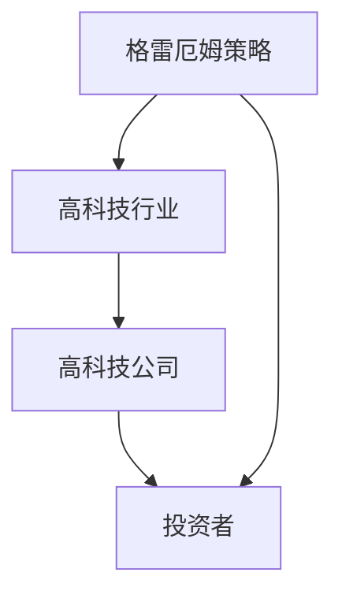
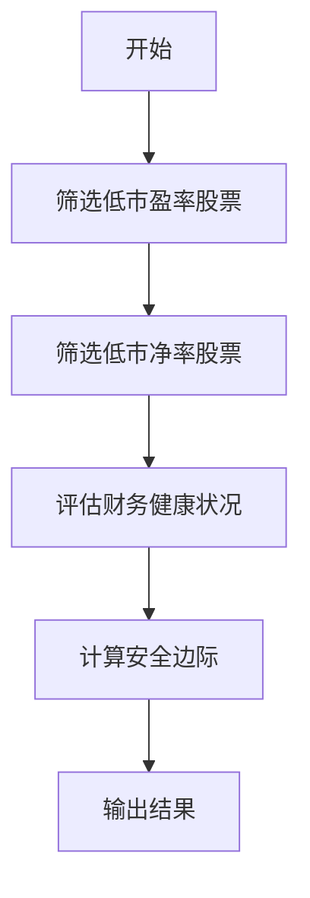

                 


# 《格雷厄姆特价股票策略在高科技行业的应用挑战》

> 关键词：格雷厄姆策略、特价股票、高科技行业、价值投资、算法分析

> 摘要：本文深入探讨了格雷厄姆价值投资策略在高科技行业的应用挑战，分析了其核心概念、算法原理、系统架构，并通过实际案例展示了策略的实现过程。通过对比分析，揭示了传统策略与高科技行业特性之间的矛盾，并提出了相应的解决方案和优化建议。

---

# 第一部分: 格雷厄姆特价股票策略概述

## 第1章: 格雷厄姆投资理论的起源与核心思想

### 1.1 价值投资的起源与发展

价值投资是投资学中的一个重要流派，其核心思想是寻找市场中被低估的资产。本杰明·格雷厄姆是该领域的鼻祖，他的理论在投资界产生了深远影响。格雷厄姆强调安全边际和低估值，主张以低于内在价值的价格买入股票。

### 1.2 格雷厄姆的“安全边际”概念

安全边际是格雷厄姆策略的核心，它是指股票的市场价格低于其内在价值的部分。通过计算安全边际，投资者可以降低投资风险，并在市场波动中获得稳定的收益。

### 1.3 特价股票的定义与特征

特价股票是指市场价格显著低于内在价值的股票。这类股票通常具有低市盈率、低市净率和高股息率的特点，被认为是长期投资的理想选择。

---

## 第2章: 高科技行业的特点与投资机遇

### 2.1 高科技行业的定义与范围

高科技行业涵盖信息技术、生物技术、人工智能等领域，其特点是技术驱动、高成长性和高波动性。这类行业的公司通常具有较高的研发投入和创新能力。

### 2.2 高科技行业的增长驱动力

高科技行业的增长主要依赖技术创新和市场需求。例如，人工智能和云计算等技术的快速发展推动了相关公司的业绩增长。

### 2.3 高科技行业的投资风险与挑战

尽管高科技行业具有高增长潜力，但其高波动性和技术不确定性也带来了较大的投资风险。此外，行业周期性变化和政策监管也可能影响投资回报。

---

## 第3章: 格雷厄姆策略在高科技行业的适用性

### 3.1 格雷厄姆策略在传统行业的成功案例

格雷厄姆策略在传统行业如制造业和公用事业中表现优异，但其在高科技行业的应用仍存在疑问。

### 3.2 高科技行业与传统行业的差异

高科技行业具有高成长性和高估值特征，而传统行业则更注重稳定性和低估值。这种差异可能导致格雷厄姆策略在高科技行业中的效果不佳。

### 3.3 格雷厄姆策略在高科技行业的潜在应用

尽管存在差异，但通过调整策略参数和引入动态估值模型，格雷厄姆策略仍有可能在高科技行业中发挥作用。

---

# 第二部分: 核心概念与联系

## 第4章: 格雷厄姆策略与高科技行业的核心概念

### 4.1 格雷厄姆策略的核心要素

格雷厄姆策略强调低市盈率、低市净率和高股息率，通过这些指标筛选具有安全边际的股票。

### 4.2 高科技行业的核心属性

高科技行业具有高成长性、高波动性和高技术壁垒的特点，这些属性与格雷厄姆策略的要求存在冲突。

### 4.3 核心概念对比分析

通过对比分析，我们可以发现格雷厄姆策略与高科技行业在多个维度上存在显著差异。例如，高科技行业的高市盈率和高市净率与格雷厄姆策略的低估值要求相悖。



---

# 第三部分: 格雷厄姆策略在高科技行业的算法原理

## 第5章: 格雷厄姆内在价值公式

### 5.1 内在价值计算公式

格雷厄姆的内在价值公式为：

$$ V = \frac{E}{(1 + r)^n} $$

其中，\( V \) 表示内在价值，\( E \) 表示年收益，\( r \) 表示折现率，\( n \) 表示投资期限。

### 5.2 高科技行业股票筛选算法



### 5.3 算法实现代码

```python
def greaham_strategy(stocks):
    selected_stocks = []
    for stock in stocks:
        if stock.pe < 15 and stock.pb < 2 and stock.div > 0.05:
            selected_stocks.append(stock)
    return selected_stocks
```

---

## 第6章: 系统分析与架构设计方案

### 6.1 问题场景介绍

本文将构建一个基于格雷厄姆策略的高科技股票筛选系统，旨在帮助投资者发现具有安全边际的股票。

### 6.2 系统功能设计

系统功能包括数据获取、股票筛选、结果展示和风险评估。

```mermaid
classDiagram
    class Stock {
        +name: str
        +pe: float
        +pb: float
        +div: float
    }
    class GreahamStrategy {
        +select(stocks: List[Stock]) -> List[Stock]
    }
    class System {
        +data: List[Stock]
        +strategy: GreahamStrategy
        +select() {
            return strategy.select(data)
        }
    }
```

---

## 第7章: 项目实战

### 7.1 环境安装

需要安装Python和相关库，如pandas和numpy。

### 7.2 核心代码实现

```python
import pandas as pd

def calculate_intrinsic_value(stock_data):
    # 假设stock_data为DataFrame，包含pe、pb和div列
    stock_data['intrinsic_value'] = stock_data['E'] / (1 + stock_data['r'])**stock_data['n']
    return stock_data
```

### 7.3 实际案例分析

以某高科技公司为例，计算其内在价值和安全边际，判断是否符合格雷厄姆策略的要求。

---

## 第8章: 最佳实践与总结

### 8.1 小结

本文探讨了格雷厄姆策略在高科技行业的应用挑战，提出了相应的解决方案和优化建议。

### 8.2 注意事项

投资者在实际操作中需注意行业特性和市场波动，避免盲目应用格雷厄姆策略。

### 8.3 未来趋势

随着人工智能和大数据技术的发展，动态估值模型在高科技行业的应用将更加广泛。

### 8.4 拓展阅读

推荐相关书籍和论文，供读者深入学习。

---

# 作者

作者：AI天才研究院/AI Genius Institute & 禅与计算机程序设计艺术 /Zen And The Art of Computer Programming

---

感谢您的阅读！希望本文对您理解格雷厄姆策略在高科技行业的应用有所帮助。

