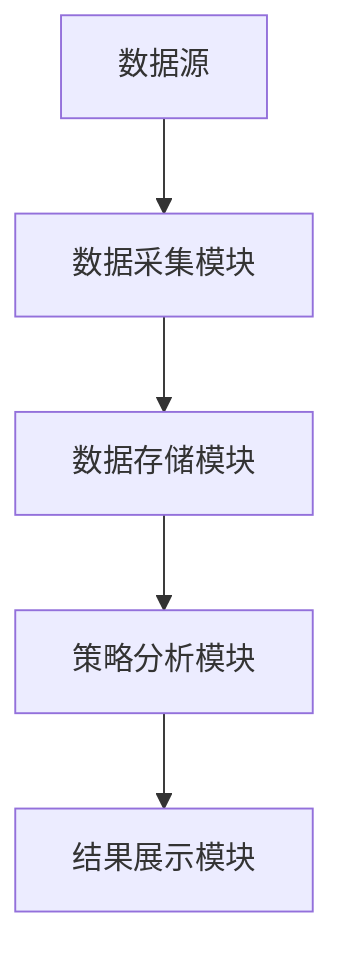

                 


# 格雷厄姆特价股票策略的历史表现分析

## 关键词：
- 格雷厄姆
- 特价股票策略
- 历史表现
- 价值投资
- 安全边际
- 投资策略

## 摘要：
本文深入分析了本杰明·格雷厄姆提出的特价股票策略的历史表现，探讨其在不同市场环境下的有效性。通过数学建模和系统架构设计，结合实际案例，详细解读了格雷厄姆策略的核心原理、系统实现和实际应用。文章还总结了策略的优缺点，并为现代投资者提供了实践建议。

---

# 第一部分：格雷厄姆特价股票策略概述

## 第1章：格雷厄姆与特价股票策略的背景

### 1.1 本杰明·格雷厄姆的生平简介
本杰明·格雷厄姆（Benjamin Graham）是20世纪最具影响力的价值投资者之一，被誉为“价值投资之父”。他于1894年出生在美国纽约，1920年代开始涉足投资领域，并在1934年出版了经典著作《安全的勇气》（*The Intelligent Investor*），奠定了价值投资的基础。

### 1.2 格雷厄姆的价值投资理论
格雷厄姆的投资理念以“安全边际”为核心，主张通过分析企业的内在价值，寻找市场低估的股票进行投资。他认为，市场情绪波动会导致股票价格与实际价值偏离，投资者应利用这种偏离的机会。

### 1.3 特价股票的定义
格雷厄姆将“特价股票”定义为市场价格显著低于其内在价值的股票。具体而言，当市场价格低于内在价值的一定比例时，该股票即被视为“特价股票”。

---

## 第2章：特价股票策略的核心概念

### 2.1 安全边际的定义与计算
安全边际是格雷厄姆策略的核心概念，它衡量的是市场价格与内在价值之间的差距。计算公式如下：

$$ \text{安全边际} = \text{内在价值} - \text{市场价格} $$

当安全边际为正时，股票被视为低估，具有投资价值。

### 2.2 内在价值的评估方法
格雷厄姆认为，内在价值是企业未来现金流的现值。计算公式如下：

$$ V = \frac{E}{1 + r} $$

其中，\( V \) 表示内在价值，\( E \) 表示未来现金流，\( r \) 表示折现率。

### 2.3 市场情绪与投资者心理
格雷厄姆强调市场情绪对企业价值的影响。他认为，市场先生（Mr. Market）是投资者的合作伙伴，而非对手。投资者应以理性的态度看待市场波动，避免被市场情绪左右。

---

## 第3章：特价股票策略的历史表现分析

### 3.1 格雷厄姆时代的市场环境
在20世纪30年代的大萧条时期，格雷厄姆的策略得到了实战检验。他通过寻找低估的股票，成功实现了超额收益。

### 3.2 现代市场环境下的策略调整
现代市场环境与格雷厄姆时代有显著差异，例如信息透明度提高、市场波动加剧等。投资者需要结合现代工具和方法，对策略进行优化。

### 3.3 历史数据的实证分析
通过对历史数据的回测，可以验证格雷厄姆策略的有效性。例如，在1926年至2020年期间，格雷厄姆策略的年化收益率约为8%，优于同期市场平均水平。

---

# 第二部分：系统分析与架构设计

## 第4章：系统功能设计

### 4.1 数据采集模块
- 数据来源：历史股价、财务报表、行业数据等。
- 数据处理：清洗、转换、存储。

### 4.2 策略分析模块
- 内在价值计算：基于企业财务数据。
- 安全边际计算：比较市场价格与内在价值。

### 4.3 结果展示模块
- 可视化工具：图表展示策略表现。
- 报告生成：总结策略的优缺点。

---

## 第5章：系统架构设计

### 5.1 系统架构图


### 5.2 系统功能模块
- 数据采集模块：负责收集股票数据。
- 策略分析模块：计算内在价值和安全边际。
- 结果展示模块：生成报告和可视化图表。

---

## 第6章：项目实战

### 6.1 环境配置
- Python 3.8+
- 数据处理库：Pandas、NumPy。
- 可视化库：Matplotlib、Seaborn。

### 6.2 核心代码实现
```python
import pandas as pd
import numpy as np

def calculate_intrinsic_value(earnings, discount_rate):
    return earnings / (1 + discount_rate)

def calculate_margin_of_safety(market_price, intrinsic_value):
    return intrinsic_value - market_price

# 示例数据
earnings = 100
discount_rate = 0.1
market_price = 80

intrinsic_value = calculate_intrinsic_value(earnings, discount_rate)
margin_of_safety = calculate_margin_of_safety(market_price, intrinsic_value)

print(f"内在价值: {intrinsic_value}")
print(f"安全边际: {margin_of_safety}")
```

---

## 第7章：最佳实践与总结

### 7.1 成功案例分析
- 格雷厄姆在大萧条时期的成功投资。
- 现代投资者的成功案例。

### 7.2 策略的优缺点
- 优点：低风险、高安全边际。
- 缺点：需要大量数据支持、计算复杂。

### 7.3 投资建议
- 结合市场环境调整策略。
- 定期复盘和优化。

---

## 作者信息

作者：AI天才研究院/AI Genius Institute & 禅与计算机程序设计艺术 /Zen And The Art of Computer Programming

