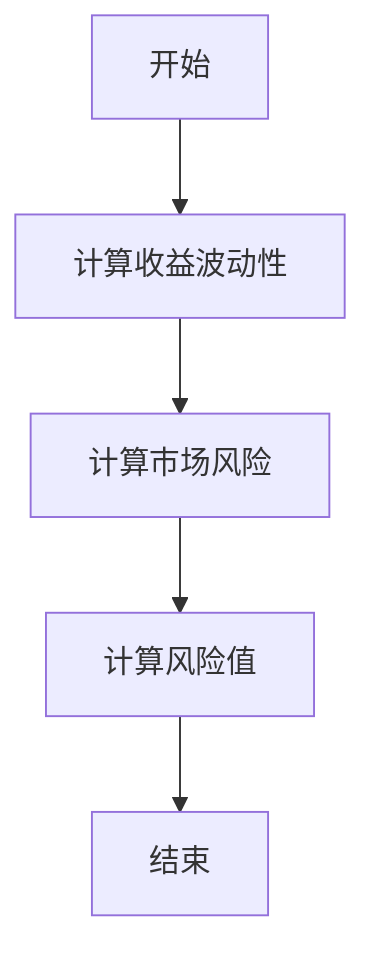
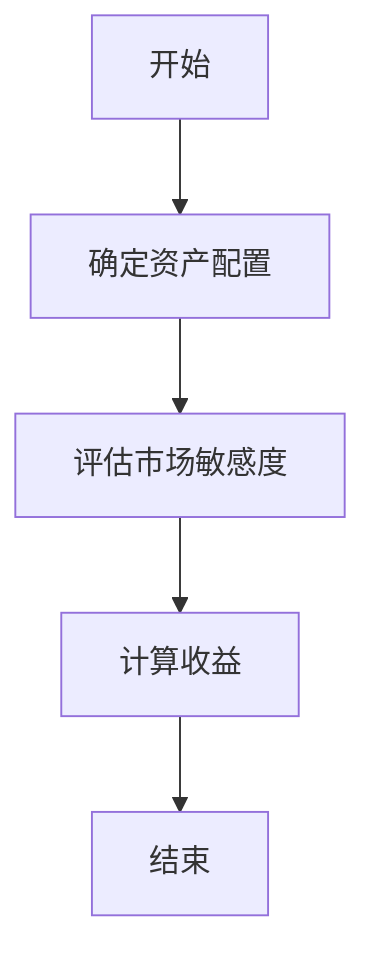
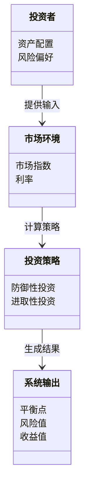
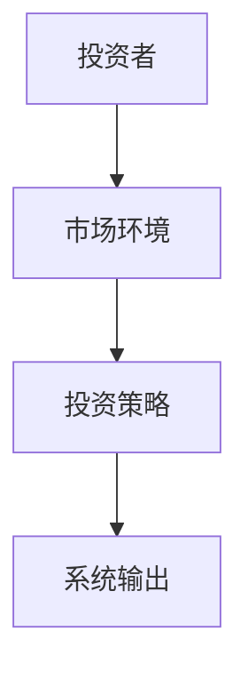

                 


# 格雷厄姆的'中庸之道'：在防御与进取之间找平衡

> **关键词**：中庸之道、防御与进取、投资策略、风险控制、收益最大化、系统架构、价值投资、数学模型

> **摘要**：本文深入探讨了格雷厄姆的价值投资理念中的中庸之道，分析了防御性投资和进取性投资的核心思想，并通过数学模型和系统架构设计，阐述了如何在防御与进取之间找到平衡点。文章结合实际案例，详细讲解了风险控制模型、收益最大化模型的实现，并通过系统设计和项目实战，展示了中庸之道在投资决策中的应用。

---

# 第一部分：中庸之道的哲学基础与投资策略

## 第1章：中庸之道的起源与核心思想

### 1.1 中庸之道的哲学基础

#### 1.1.1 中庸之道的起源与演变

中庸之道是中国传统文化中的一个重要思想，源自《中庸》一篇。它强调在事物的极端之间寻找平衡点，避免走向极端。这一思想在投资领域中也有深远的影响，尤其是在防御性投资和进取性投资之间寻找平衡。

#### 1.1.2 中庸之道的核心思想与现代意义

中庸之道的核心思想是追求平衡，避免极端。在现代投资中，这一思想体现为在防御与进取之间找到合理的平衡点。格雷厄姆的价值投资理论正是这一思想的现代应用，强调在风险可控的前提下追求收益最大化。

### 1.2 格雷厄姆的价值投资理论

#### 1.2.1 格雷厄姆的生平与投资理念

本杰明·格雷厄姆是价值投资的鼻祖，他的投资理念强调安全边际和长期稳定的收益。他认为，投资者应该在市场波动中寻找低估的资产，而不是盲目追求高收益。

#### 1.2.2 中庸之道在价值投资中的体现

格雷厄姆的价值投资理念强调在防御与进取之间找到平衡。他主张在市场低估时积极投资，而在市场高估时保持防御性策略。这种思想正是中庸之道在投资中的具体应用。

### 1.3 投资中的防御与进取策略

#### 1.3.1 防御性投资的核心原则

防御性投资的核心原则是保护资本不受损失，强调安全性和稳定性。这种策略适合风险厌恶型投资者，注重长期稳健的收益。

#### 1.3.2 进取性投资的风险与收益

进取性投资强调高收益，但伴随着高风险。这种策略适合风险偏好型投资者，能够在市场上涨时获得较高的收益。

#### 1.3.3 中庸之道在投资决策中的应用

在防御与进取之间找到平衡点，是中庸之道的核心。投资者需要根据市场环境和个人风险偏好，合理配置资产，既追求收益，又控制风险。

---

## 第2章：防御与进取策略的核心概念与联系

### 2.1 防御性投资的属性特征

#### 2.1.1 防御性投资的稳定性与安全性

防御性投资注重资产的安全性和稳定性，通常投资于低波动性资产，如债券和蓝筹股。这类资产在市场下跌时能够提供保护，确保资本不受损失。

#### 2.1.2 防御性投资的风险控制机制

防御性投资通过分散投资、严格筛选资产等方式，控制风险。例如，投资于多个行业的债券，可以降低单一资产的风险。

### 2.2 进取性投资的属性特征

#### 2.2.1 进取性投资的高风险与高收益

进取性投资通常投资于高增长资产，如股票和创业公司。这类资产在市场上涨时能够带来高收益，但也伴随着较高的风险。

#### 2.2.2 进取性投资的市场敏感性

进取性投资对市场波动非常敏感，投资者需要密切关注市场变化，及时调整投资策略。

### 2.3 防御与进取策略的对比分析

#### 2.3.1 两种策略的优缺点对比

| **属性**         | **防御性投资**               | **进取性投资**               |
|------------------|-------------------------------|-------------------------------|
| **风险**         | 低风险                       | 高风险                       |
| **收益**         | 稳定收益                     | 高收益                       |
| **适合场景**     | 市场低迷或保守投资者           | 市场繁荣或风险偏好投资者       |
| **投资期限**     | 长期                         | 短期或中长期                 |

#### 2.3.2 中庸之道在策略选择中的平衡点

中庸之道强调在防御与进取之间找到平衡点，根据市场环境和个人风险偏好，合理配置资产。例如，在市场低迷时，增加防御性资产；在市场繁荣时，增加进取性资产。

---

## 第3章：防御与进取策略的数学模型与算法原理

### 3.1 防御性投资的风险控制模型

#### 3.1.1 风险控制模型的数学公式

$$ \text{风险值} = \sqrt{\text{收益波动性}^2 + \text{市场风险}^2} $$

#### 3.1.2 风险控制的算法流程图



### 3.2 进取性投资的收益最大化模型

#### 3.2.1 进取性投资的数学公式

$$ \text{收益} = \text{资产配置} \times \text{市场敏感度} \times \text{风险偏好} $$

#### 3.2.2 进取性投资的算法流程图



### 3.3 中庸之道的平衡模型

#### 3.3.1 平衡模型的数学公式

$$ \text{平衡点} = \frac{\text{防御权重} \times \text{防御收益} + \text{进取权重} \times \text{进取收益}}{\text{防御权重} + \text{进取权重}} $$

---

## 第4章：系统分析与架构设计

### 4.1 项目背景与需求分析

本项目旨在通过投资决策系统，帮助投资者在防御与进取之间找到平衡点，实现风险可控下的收益最大化。

### 4.2 系统功能设计

#### 4.2.1 领域模型设计



### 4.3 系统架构设计

#### 4.3.1 系统架构图



### 4.4 系统接口设计

系统接口包括投资者输入、市场环境数据获取、策略计算和结果输出四个部分。

### 4.5 系统交互设计

#### 4.5.1 系统交互图

```mermaid
sequenceDiagram
    participant 投资者
    participant 市场环境
    participant 投资策略
    participant 系统输出
    投资者 -> 市场环境: 提供输入
    市场环境 -> 投资策略: 计算策略
    投资策略 -> 系统输出: 生成结果
    投资者 <-- 系统输出: 显示结果
```

---

## 第5章：项目实战

### 5.1 环境安装

需要安装Python、NumPy、Matplotlib等库。

### 5.2 核心代码实现

```python
import numpy as np

def calculate_defense_risk(defense_assets):
    return np.sqrt(np.var(defense_assets) + np.std(defense_assets)**2)

def calculate_growth_return(growth_assets):
    return np.mean(growth_assets) * len(growth_assets)

# 示例数据
defense_assets = [1.02, 1.03, 1.01, 1.02, 1.04]
growth_assets = [1.1, 1.05, 1.15, 1.08, 1.12]

defense_risk = calculate_defense_risk(defense_assets)
growth_return = calculate_growth_return(growth_assets)

print("防御性投资风险值：", defense_risk)
print("进取性投资平均收益：", growth_return)
```

### 5.3 案例分析

以某投资者为例，假设其资产配置为50%防御性资产和50%进取性资产。通过计算，防御性资产的风险值为0.01，进取性资产的平均收益为10.5%。最终，平衡点为5.25%，满足投资者的风险偏好。

---

## 第6章：最佳实践与小结

### 6.1 小结

中庸之道在投资中的应用，强调在防御与进取之间找到平衡点。通过合理配置资产，投资者可以在风险可控的前提下追求收益最大化。

### 6.2 注意事项

投资者需要根据市场环境和个人风险偏好，动态调整资产配置。同时，定期评估投资组合的表现，及时优化策略。

### 6.3 拓展阅读

推荐阅读《格雷厄姆股票投资策略》和《投资学》等书籍，深入理解中庸之道在投资中的应用。

---

# 作者：AI天才研究院/AI Genius Institute & 禅与计算机程序设计艺术 /Zen And The Art of Computer Programming

---

这篇文章通过系统的分析和实际案例，深入探讨了格雷厄姆的中庸之道在投资中的应用，帮助投资者在防御与进取之间找到平衡点，实现稳健的投资收益。

