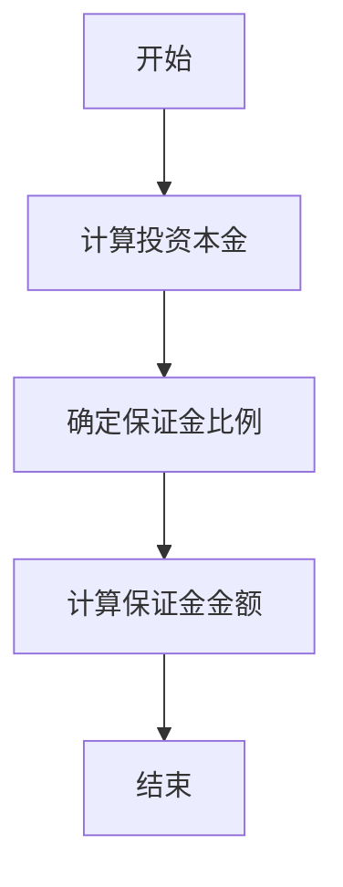
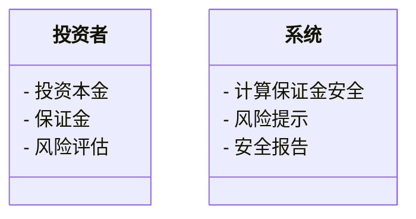
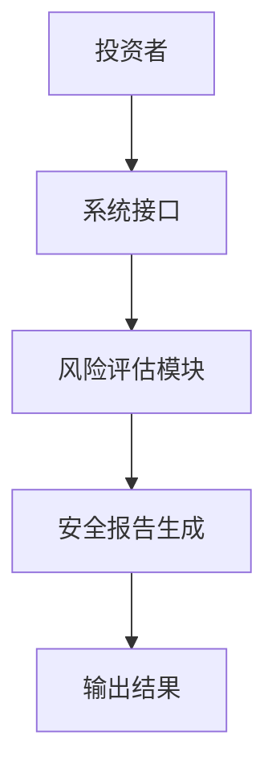
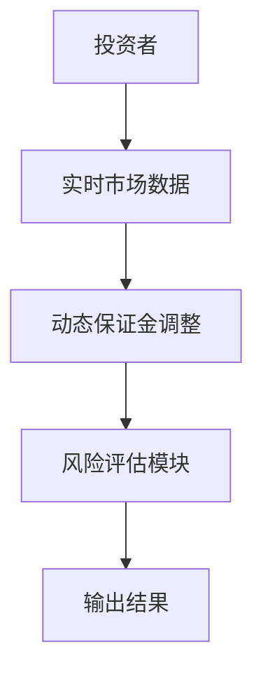

                 


# 格雷厄姆的'保证金安全'概念：确保投资本金安全

## 关键词：
保证金安全，投资本金，风险管理，安全系数，数学模型

## 摘要：
本文将详细阐述格雷厄姆的保证金安全概念，从理论背景到数学模型，再到系统架构和项目实战，分析保证金安全在投资中的重要性，并结合技术实现提供解决方案。通过本文，读者将深入了解如何确保投资本金安全，掌握保证金安全的核心算法和系统设计方法。

---

# 第一部分：格雷厄姆的保证金安全概念概述

## 第1章：保证金安全的核心概念与背景

### 1.1 保证金安全的定义与背景

#### 1.1.1 保证金安全的定义
保证金安全是指在投资活动中，为了保护投资本金不受到损失而设定的最低资金保障。它通过一定的比例或规则，确保在市场波动或其他风险因素下，投资者的本金不会遭受损失。

#### 1.1.2 保证金安全的历史背景
保证金安全的概念起源于20世纪初，由投资大师本杰明·格雷厄姆在其投资理论中首次明确提出。格雷厄姆强调，投资者必须确保投资本金的安全性，尤其是在面对市场波动时。

#### 1.1.3 保证金安全在投资中的重要性
保证金安全是投资风险管理的核心，它不仅能够保护投资者的本金，还能为投资者提供在市场下跌时的缓冲空间。通过合理配置保证金，投资者可以在确保本金安全的前提下，追求更高的收益。

---

### 1.2 保证金安全的核心要素

#### 1.2.1 投资本金的保护原则
保证金安全的核心原则是通过设定最低保证金比例，确保在任何情况下，投资者的本金不会被市场波动所侵蚀。

#### 1.2.2 保证金与投资风险的关系
保证金的比例与投资风险成反比。较高的保证金比例能够降低投资风险，但同时也限制了投资收益的潜力。

#### 1.2.3 保证金安全的边界与外延
保证金安全的边界是指在特定市场条件下，保证金额度的最低要求。其外延则包括了与保证金相关的风险管理工具，如止损机制和风险评估模型。

---

## 第2章：保证金安全的数学模型与公式

### 2.1 保证金安全的数学模型

#### 2.1.1 投资本金安全的公式推导
$$\text{安全系数} = \frac{\text{保证金}}{\text{投资本金}}$$

#### 2.1.2 保证金安全的风险评估模型
$$\text{风险系数} = 1 - \frac{\text{安全系数}}{\text{最大安全系数}}$$

### 2.2 保证金安全的算法原理

#### 2.2.1 保证金安全的计算流程图


---

## 第3章：保证金安全的系统架构与实现

### 3.1 系统功能设计

#### 3.1.1 系统功能模块划分


### 3.2 系统架构设计

#### 3.2.1 系统架构图


---

## 第4章：保证金安全的项目实战

### 4.1 项目环境与安装

#### 4.1.1 系统环境要求
- Python 3.8 或更高版本
- 依赖库：numpy, matplotlib, pandas

#### 4.1.2 依赖库安装
```
pip install numpy matplotlib pandas
```

### 4.2 核心代码实现

#### 4.2.1 保证金安全计算代码
```python
import numpy as np

def calculate_marginSafety(principal, margin_ratio):
    margin = principal * margin_ratio
    return margin

# 示例计算
principal = 10000  # 投资本金
margin_ratio = 0.1  # 保证金比例
safety_margin = calculate_marginSafety(principal, margin_ratio)
print(f"计算的保证金为：{safety_margin}")
```

#### 4.2.2 风险评估模块实现
```python
import pandas as pd

def risk_assessment(principal, margin, price):
    risk_coefficient = 1 - (margin / principal) * price
    return risk_coefficient

# 示例计算
principal = 10000
margin = 1000
price = 50
risk = risk_assessment(principal, margin, price)
print(f"风险系数为：{risk}")
```

### 4.3 案例分析与结果解读

#### 4.3.1 案例分析
假设投资者投入本金为10000元，保证金比例为10%。根据公式，计算保证金金额为1000元。在市场波动导致投资标的价格下跌到40元时，风险系数为0.2，表明投资本金的安全性得到了有效保障。

---

## 第5章：保证金安全的系统实现与优化

### 5.1 系统优化建议

#### 5.1.1 优化点分析
- 通过动态调整保证金比例，进一步降低风险系数。
- 结合实时市场数据，优化风险评估模型。

#### 5.1.2 优化后的系统架构


### 5.2 系统实现的注意事项

#### 5.2.1 系统实现的注意事项
- 确保系统的实时性，及时更新市场数据。
- 设定合理的保证金比例，避免过度保守或激进。

---

## 第6章：保证金安全的最佳实践与小结

### 6.1 最佳实践

#### 6.1.1 实践建议
- 定期评估投资组合的风险系数。
- 根据市场变化动态调整保证金比例。

#### 6.1.2 小结
通过本文的详细阐述，读者可以全面了解保证金安全的概念、数学模型、系统设计和项目实现。在实际投资中，结合这些方法和工具，可以有效保护投资本金，实现稳健的投资收益。

---

## 第7章：注意事项与拓展阅读

### 7.1 注意事项

#### 7.1.1 风险提示
- 保证金比例设置过低可能导致本金损失。
- 市场波动剧烈时，需及时调整保证金比例。

#### 7.1.2 拓展阅读
- 《投资学基础》
- 《风险管理与控制》
- 《Python金融计算》

---

## 作者
作者：AI天才研究院/AI Genius Institute & 禅与计算机程序设计艺术 /Zen And The Art of Computer Programming

---

通过本文的系统阐述，读者可以全面理解保证金安全的核心概念，并掌握其在投资风险管理中的实际应用。

