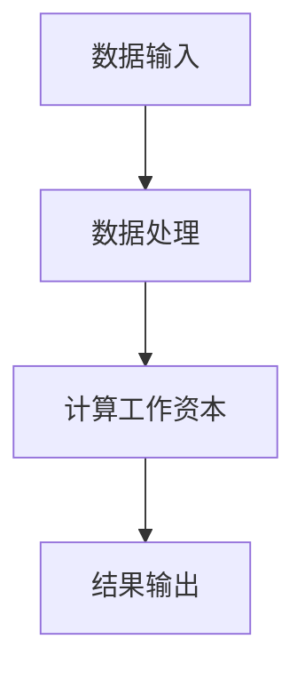
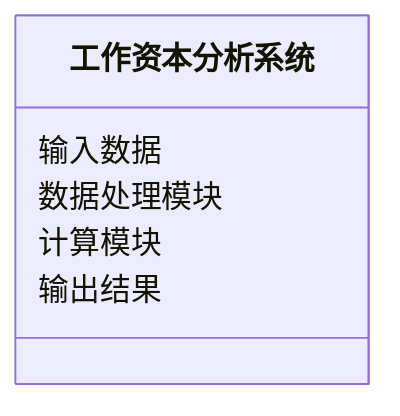
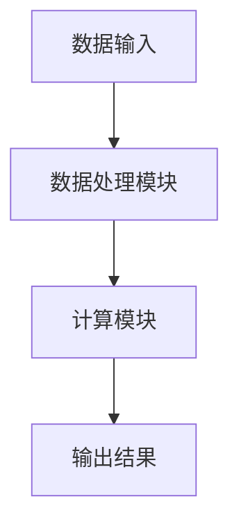

                 


```markdown
# 格雷厄姆的'工作资本'分析：评估公司短期偿债能力

> 关键词：工作资本，短期偿债能力，财务分析，流动资产，流动负债

> 摘要：工作资本是评估公司短期偿债能力的重要指标，本文通过详细分析格雷厄姆的工作资本理论，探讨其计算方法、实际应用及其在系统架构中的体现。文章结合理论与实践，通过Python代码实现和数学模型推导，深入讲解了工作资本分析的算法原理和系统架构设计，最后通过项目实战和总结，提供了实用的财务分析方法。

---

# 第1章：工作资本的基本概念

## 1.1 背景介绍

### 1.1.1 什么是工作资本
工作资本（Working Capital），也称为营运资本，是公司日常运营所需的流动资产减去流动负债。它是评估公司短期偿债能力的核心指标之一。

### 1.1.2 工作资本在财务分析中的地位
工作资本是财务健康状况的重要指标，它反映了公司在短期内偿还债务的能力。充足的流动资本意味着公司能够应对短期债务，避免财务危机。

### 1.1.3 工作资本与传统财务指标的区别
与速动资产等传统指标相比，工作资本综合考虑了流动资产和流动负债的关系，更能反映公司的实际偿债能力。

---

## 1.2 核心概念与联系

### 1.2.1 工作资本的定义
$$ \text{工作资本} = \text{流动资产} - \text{流动负债} $$

### 1.2.2 工作资本与流动资产的关系
工作资本是流动资产的一部分，主要关注于公司在短期内的财务状况。

### 1.2.3 工作资本与流动负债的关系
$$ \text{流动负债} = \text{流动资产} - \text{工作资本} $$

---

# 第2章：工作资本的核心概念与联系

## 2.1 核心概念原理

### 2.1.1 工作资本的计算公式
$$ WC = CA - CL $$
其中，$WC$ 表示工作资本，$CA$ 表示流动资产，$CL$ 表示流动负债。

### 2.1.2 工作资本的属性特征
- **流动性**：流动资产和流动负债的流动性直接影响工作资本的变动。
- **时间性**：工作资本的变动需要考虑时间因素，如应收账款的回收周期。

---

## 2.2 对比表格

| 概念       | 定义                                                                 |
|------------|----------------------------------------------------------------------|
| 工作资本    | 流动资产 - 流动负债                                                 |
| 流动资产    | 现金、应收账款、存货等短期资产                                   |
| 流动负债    | 短期借款、应付账款等短期债务                                    |
| 速动资产    | 流动资产减去存货                                                   |

---

## 2.3 ER实体关系图

```mermaid
erd
  title 工作资本分析的实体关系
  entity 流动资产
  entity 流动负债
  entity 工作资本
  flow from 流动资产 to 工作资本
  flow from 流动负债 to 工作资本
```

---

# 第3章：工作资本分析的算法原理

## 3.1 计算流程



## 3.2 Python实现

```python
def calculate_working_capital(current_assets, current_liabilities):
    return current_assets - current_liabilities

# 示例数据
current_assets = 500000
current_liabilities = 300000

wc = calculate_working_capital(current_assets, current_liabilities)
print(f"工作资本为：{wc}")
```

---

# 第4章：数学模型和公式

## 4.1 基本公式

$$ WC = CA - CL $$

## 4.2 调整公式

$$ WC_{\text{调整}} = WC + \text{调整项} $$

## 4.3 预测模型

$$ \text{预测工作资本} = \alpha \cdot WC + \beta $$

---

# 第5章：系统分析与架构设计

## 5.1 问题场景

## 5.2 功能设计



## 5.3 系统架构



---

# 第6章：项目实战

## 6.1 环境与工具
- Python 3.8+
- Pandas, NumPy, Matplotlib

## 6.2 代码实现

```python
import pandas as pd

# 示例数据
data = {
    '流动资产': [500000],
    '流动负债': [300000]
}
df = pd.DataFrame(data)

# 计算工作资本
df['工作资本'] = df['流动资产'] - df['流动负债']

print(df)
```

---

# 第7章：总结与展望

## 7.1 理论总结

## 7.2 实践中的问题

## 7.3 最佳实践 tips

## 7.4 拓展阅读

---

作者：AI天才研究院 & 禅与计算机程序设计艺术
```

