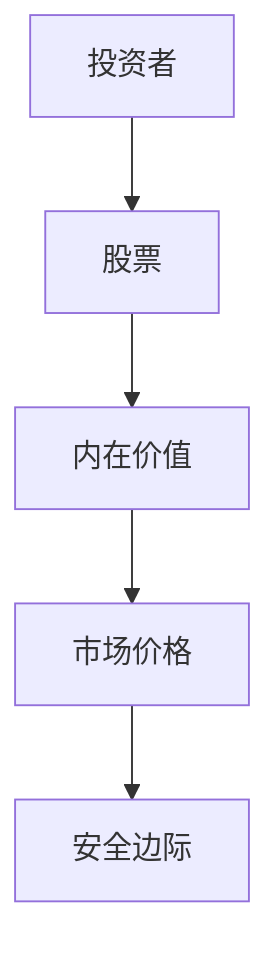
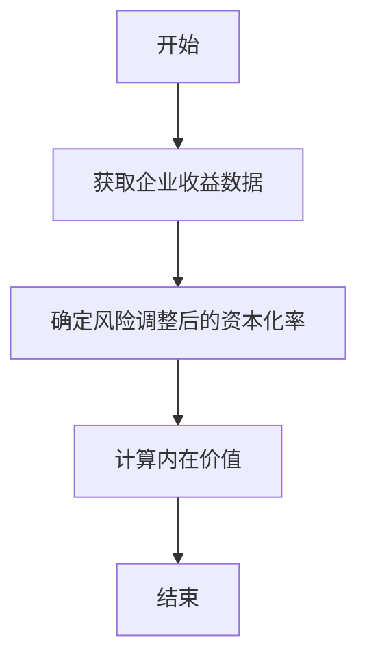
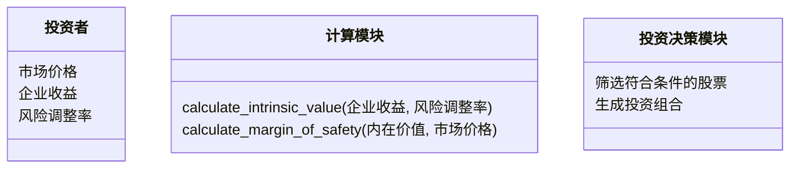
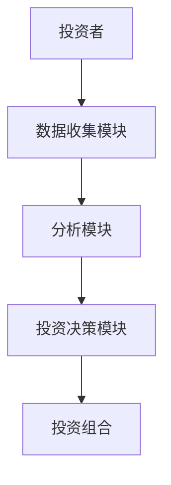

                 


# 格雷厄姆的Formula Investing：系统化投资方法

## 关键词：格雷厄姆、Formula Investing、价值投资、系统化投资方法、安全边际

## 摘要：本文深入探讨了格雷厄姆的Formula Investing方法，从其核心理念、数学模型到系统化投资策略，结合实际案例和代码实现，详细阐述了如何在现代投资环境中应用这一系统化方法。

---

# 第一部分: 格雷厄姆的Formula Investing概述

## 第1章: 价值投资与Formula Investing的背景

### 1.1 价值投资的起源与发展

#### 1.1.1 投资学的起源与演变
投资学作为一门学科，起源于对经济行为的深入研究。从古典经济学到现代金融学，投资理论经历了从简单到复杂的演变。格雷厄姆的出现，将投资理论从“艺术”推向了“科学”的领域。

#### 1.1.2 格雷厄姆与巴菲特的价值投资理念
格雷厄姆是价值投资的奠基人，他的核心理念是寻找市场低估的股票，通过安全边际来降低投资风险。巴菲特作为格雷厄姆的学生，将这一理念发扬光大，使其成为现代投资学的重要组成部分。

#### 1.1.3 Formula Investing的核心思想
Formula Investing强调通过系统化的公式和模型来评估股票的内在价值。这种方法摒弃了传统的主观判断，转而依靠客观的数学模型来指导投资决策。

### 1.2 Formula Investing的定义与特点

#### 1.2.1 Formula Investing的定义
Formula Investing是一种基于基本面分析的投资方法，通过数学公式计算股票的内在价值，并与市场价格进行对比，寻找被低估的投资标的。

#### 1.2.2 Formula Investing的核心特点
- **系统性**：依赖公式和模型，而非主观判断。
- **安全性**：强调安全边际，降低投资风险。
- **基本面驱动**：以企业的财务数据为基础，评估内在价值。

### 1.3 Formula Investing的理论基础

#### 1.3.1 格雷厄姆的"安全边际"概念
安全边际是指股票的市场价格低于其内在价值的部分。通过计算安全边际，投资者可以确保在市场波动中依然获得正收益。

#### 1.3.2 投资者心理与市场行为
格雷厄姆认为，市场的非理性波动为理性投资者提供了套利机会。投资者心理的偏差（如过度恐慌或乐观）是Formula Investing得以成功的基础。

#### 1.3.3 经济周期与投资策略
Formula Investing需要根据经济周期调整投资策略。在经济衰退期，市场低估现象更为普遍，适合进行投资。

### 1.4 Formula Investing的应用范围

#### 1.4.1 适用于哪些类型的投资者
- **长期投资者**：适合那些愿意长期持有优质资产的投资者。
- **机构投资者**：适合通过系统化的方法管理大量资金的机构。
- **个人投资者**：个人投资者可以通过学习掌握基本公式，进行理性投资。

#### 1.4.2 Formula Investing在不同市场环境中的表现
- **牛市**：市场高估，Formula Investing可能表现不佳。
- **熊市**：市场低估，Formula Investing能够捕捉到优质标的。

#### 1.4.3 Formula Investing的局限性与改进方向
- **局限性**：公式过于 rigid，可能无法适应快速变化的市场环境。
- **改进方向**：结合技术分析或其他投资策略，丰富投资组合。

### 1.5 本章小结
本章介绍了Formula Investing的背景、核心思想、理论基础以及应用范围。通过理解这些内容，读者可以为后续的系统化投资方法分析打下基础。

---

## 第2章: Formula Investing的核心概念与联系

### 2.1 核心概念原理

#### 2.1.1 内在价值的计算公式
$$\text{内在价值} = \frac{\text{预期收益}}{\text{风险调整后的资本化率}}$$

#### 2.1.2 安全边际的数学模型
$$\text{安全边际} = \text{内在价值} - \text{市场价格}$$

#### 2.1.3 股票估值的多因素分析
股票的内在价值不仅取决于收益，还需要考虑行业地位、竞争优势等因素。

### 2.2 核心概念属性特征对比表

| 概念       | 属性特征                         |
|------------|----------------------------------|
| 内在价值    | 客观、可计算、基于基本面数据     |
| 安全边际    | 主观、基于市场情绪、可调整        |
| 股票估值    | 综合考虑内在价值与市场价值       |

### 2.3 ER实体关系图（Mermaid流程图）



### 2.4 内在价值计算的流程图



### 2.5 本章小结
本章通过对比表格和流程图，详细解释了Formula Investing中的核心概念及其相互关系，帮助读者更好地理解内在价值和安全边际的计算逻辑。

---

## 第3章: Formula Investing的数学模型与算法

### 3.1 内在价值的计算公式

#### 3.1.1 格雷厄姆的经典公式
$$\text{内在价值} = \frac{E}{k}$$
其中，\( E \) 是企业的收益，\( k \) 是风险调整后的资本化率。

#### 3.1.2 改进的计算模型
$$\text{内在价值} = \frac{E}{k} \times (1 + g)$$
其中，\( g \) 是预期增长率。

### 3.2 安全边际的计算

#### 3.2.1 标准安全边际
$$\text{安全边际} = \text{内在价值} \times (1 - \frac{1}{k})$$

#### 3.2.2 优化后的安全边际
$$\text{安全边际} = \text{内在价值} \times \text{风险调整因子}$$

### 3.3 算法实现的Python代码示例

```python
def calculate_intrinsic_value(enterprise_value, risk_adjusted_rate):
    return enterprise_value / risk_adjusted_rate

def calculate_margin_of_safety(intrinsic_value, market_price):
    return intrinsic_value - market_price

# 示例计算
enterprise_value = 1000000
risk_adjusted_rate = 0.12
market_price = 800000

intrinsic_value = calculate_intrinsic_value(enterprise_value, risk_adjusted_rate)
margin_of_safety = calculate_margin_of_safety(intrinsic_value, market_price)

print(f"内在价值: {intrinsic_value}")
print(f"安全边际: {margin_of_safety}")
```

### 3.4 本章小结
本章通过数学公式和代码示例，详细讲解了内在价值和安全边际的计算方法，为后续的系统化投资策略奠定了基础。

---

## 第4章: Formula Investing的系统化投资策略

### 4.1 系统化投资策略的框架

#### 4.1.1 数据收集模块
- 数据来源：财务报表、市场数据等。
- 数据预处理：清洗、标准化。

#### 4.1.2 分析模块
- 内在价值计算。
- 安全边际计算。
- 筛选符合条件的股票。

#### 4.1.3 决策模块
- 根据模型结果，生成投资组合。
- 动态调整投资组合。

### 4.2 系统架构设计

#### 4.2.1 系统功能设计（领域模型Mermaid类图）



#### 4.2.2 系统架构设计（Mermaid架构图）



### 4.3 项目实战：构建投资组合

#### 4.3.1 数据收集与处理
```python
import pandas as pd

# 假设我们从CSV文件中读取数据
data = pd.read_csv('stock_data.csv')

# 数据预处理
data = data.dropna()
data['市盈率'] = data['市盈率'].astype(float)
```

#### 4.3.2 计算内在价值和安全边际
```python
def calculate_intrinsic_value(data):
    data['内在价值'] = data['企业收益'] / data['风险调整率']
    return data

def calculate_margin_of_safety(data):
    data['安全边际'] = data['内在价值'] - data['市场价格']
    return data

# 示例计算
data = calculate_intrinsic_value(data)
data = calculate_margin_of_safety(data)
```

#### 4.3.3 筛选股票
```python
# 筛选内在价值大于市场价格且安全边际大于零的股票
data.query('内在价值 > 市场价格 & 安全边际 > 0')
```

### 4.4 本章小结
本章通过系统化的方法，详细讲解了如何构建基于Formula Investing的投资策略，并通过实际案例展示了投资组合的构建过程。

---

## 第5章: Formula Investing的最佳实践与注意事项

### 5.1 最佳实践

#### 5.1.1 确保数据的准确性
- 使用可靠的财务数据源。
- 定期更新数据。

#### 5.1.2 定期评估模型
- 根据市场变化调整风险调整率。
- 重新计算内在价值和安全边际。

#### 5.1.3 结合其他投资策略
- 技术分析的辅助作用。
- 多元化投资以降低风险。

### 5.2 注意事项

#### 5.2.1 模型的局限性
- 公式过于 rigid，可能无法适应所有市场环境。
- 忽略了市场情绪的变化。

#### 5.2.2 数据偏差的影响
- 数据质量影响计算结果。
- 数据获取的延迟性。

#### 5.2.3 风险管理的重要性
- 设定止损点。
- 分散投资以降低风险。

### 5.3 拓展阅读
- 格雷厄姆的《 Intelligent Investor》
- 巴菲特的股东大会演讲

### 5.4 本章小结
本章总结了Formula Investing在实际应用中的最佳实践和注意事项，帮助投资者更好地理解和应用这一方法。

---

## 作者：AI天才研究院/AI Genius Institute & 禅与计算机程序设计艺术 /Zen And The Art of Computer Programming

---

通过以上内容，读者可以全面理解格雷厄姆的Formula Investing方法，从理论到实践，从数学模型到系统架构，逐步掌握这一系统化投资方法的核心思想和应用技巧。

