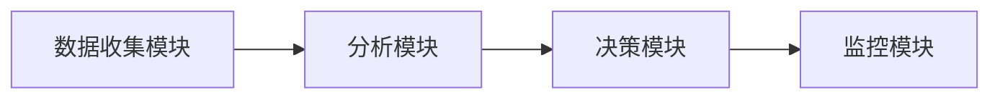
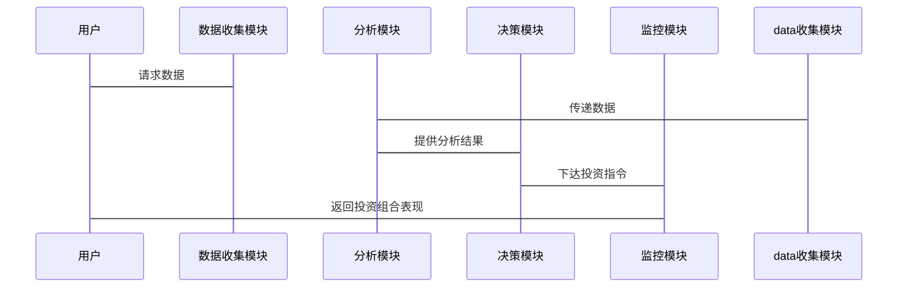

                 


# 格雷厄姆的Group Approach：分散投资的智慧

> 关键词：格雷厄姆，Group Approach，分散投资，价值投资，投资组合优化，安全边际

> 摘要：本文深入探讨了格雷厄姆的Group Approach投资策略，分析其核心思想、数学模型、系统架构及实际应用。通过详细讲解分散投资的智慧，帮助读者理解如何在现代投资环境中构建稳健的投资组合。

---

## 第一部分: 格雷厄姆投资理念与分散投资基础

### 第1章: 格雷厄姆投资理念概述

#### 1.1 格雷厄姆的生平与投资思想
##### 1.1.1 格雷厄姆的生平简介
 Benjamin Graham（本杰明·格雷厄姆）是20世纪著名的投资学家、经济学家，被誉为“价值投资之父”。他出生于1894年，早年在哥伦比亚大学学习法律，后来转向金融领域，并在华尔街从事投资工作。他的投资理念对现代金融理论产生了深远影响。

##### 1.1.2 格雷厄姆的投资哲学
 格雷厄姆的投资哲学可以总结为“安全第一，收益其次”。他认为，投资的本质是通过分析企业的内在价值，寻找被市场低估的投资标的。他强调长期投资和分散投资的重要性，以降低风险并实现稳健收益。

##### 1.1.3 格雷厄姆对现代投资理论的贡献
 格雷厄姆的《证券分析》和《聪明的投资者》两本书奠定了价值投资的基础。他的思想影响了包括巴菲特在内的众多投资者，并为现代投资组合理论（MPT）提供了重要的参考。

#### 1.2 投资的基本原则
##### 1.2.1 投资的定义与分类
 投资是指将资金投入到金融资产或实体资产中，以期获得未来收益的行为。根据资产类型，投资可以分为股票、债券、房地产等多种形式。格雷厄姆主张以股票为主要投资标的，因为股票代表了企业的所有权，具有较高的增值潜力。

##### 1.2.2 格雷厄姆的安全边际概念
 安全边际是指投资标的的市场价格与其内在价值之间的差距。格雷厄姆认为，市场价格往往偏离内在价值，这种偏离为投资者提供了安全边际。通过寻找市场价格低于内在价值的标的，投资者可以降低风险并获得超额收益。

##### 1.2.3 长期投资与价值投资的结合
 格雷厄姆强调长期投资的重要性，认为短期市场波动难以预测，而长期投资可以通过复利效应实现财富的稳步增长。他将价值投资与长期投资结合，形成了独特的企业分析方法。

#### 1.3 Group Approach的核心思想
##### 1.3.1 Group Approach的定义
 Group Approach是格雷厄姆提出的一种分散投资策略，通过将资金分散投资于多个具有相似特性的股票，降低非系统性风险。这种方法强调投资组合的构建，而非单个股票的选择。

##### 1.3.2 Group Approach与传统投资的区别
 传统投资通常关注单个股票的短期表现，而Group Approach注重投资组合的整体风险收益比。传统投资可能过于依赖市场趋势和短期信息，而Group Approach则强调长期价值和分散化。

##### 1.3.3 Group Approach的适用场景
 Group Approach适用于长期稳健的投资，尤其适合那些希望降低市场波动影响的投资者。它特别适合机构投资者或个人投资者在市场不确定性较高的情况下使用。

#### 1.4 本章小结
 本章介绍了格雷厄姆的投资理念，重点分析了Group Approach的核心思想。通过安全边际和分散投资的原则，格雷厄姆为投资者提供了一种稳健的投资方法。接下来的章节将深入探讨Group Approach的数学模型和系统架构。

---

## 第二部分: Group Approach的理论基础

### 第2章: 分散投资的数学模型

#### 2.1 投资组合的数学模型
##### 2.1.1 投资组合的收益与风险
 投资组合的收益可以通过各资产的权重和收益的加权平均计算。投资组合的风险则由各资产的风险以及它们之间的相关性决定。公式如下：
 
 收益：$$ E(r_p) = \sum w_i E(r_i) $$
 
 风险：$$ Var(r_p) = \sum w_i^2 Var(r_i) + 2 \sum w_i w_j Cov(r_i, r_j) $$

##### 2.1.2 现代投资组合理论（MPT）
 MPT由哈里·马科维茨提出，主张通过优化投资组合的风险和收益比来实现收益最大化。格雷厄姆的Group Approach与MPT有相似之处，但更注重实际操作和价值分析。

##### 2.1.3 格雷厄姆的分散投资模型
 格雷厄姆的分散投资模型基于企业的内在价值和市场价格的差异。他通过构建多个具有相似特性的股票组合，降低非系统性风险。这种方法在数学上可以通过以下公式表示：

 $$ r_p = \sum w_i r_i $$

 其中，$$ w_i $$ 是第i个股票的投资比例，$$ r_i $$ 是第i个股票的预期收益。

#### 2.2 风险与收益的平衡
##### 2.2.1 风险的定义与分类
 风险可以分为系统性风险和非系统性风险。系统性风险是整个市场普遍面临的风险，如经济衰退和通货膨胀。非系统性风险是特定资产或行业面临的风险，可以通过分散化来降低。

##### 2.2.2 收益与风险的权衡
 在投资过程中，收益与风险是密切相关的。高收益通常伴随着高风险，而低风险则可能意味着较低的收益。格雷厄姆通过Group Approach在两者之间找到了平衡点。

##### 2.2.3 格雷厄姆的分散投资策略
 格雷厄姆的分散投资策略通过将资金分配到多个具有相似特性的股票中，降低非系统性风险。他建议投资者选择具有稳定收益和良好财务状况的企业。

#### 2.3 数学公式与模型
##### 2.3.1 投资组合的期望收益公式
 $$ E(r_p) = \sum w_i E(r_i) $$

##### 2.3.2 投资组合的方差公式
 $$ Var(r_p) = \sum w_i^2 Var(r_i) + 2 \sum w_i w_j Cov(r_i, r_j) $$

##### 2.3.3 格雷厄姆分散投资的数学模型
 格雷厄姆的分散投资模型通过优化投资组合的权重，使得在给定风险水平下，收益最大化。或者在给定收益下，风险最小化。

#### 2.4 本章小结
 本章通过数学模型分析了Group Approach的理论基础。通过分散投资，投资者可以有效降低风险，同时实现收益的最大化。接下来的章节将探讨Group Approach的系统架构与实现。

---

## 第三部分: Group Approach的系统架构与实现

### 第3章: Group Approach的系统分析

#### 3.1 系统需求分析
##### 3.1.1 问题场景介绍
 在现代投资环境中，投资者面临复杂的市场波动和多样化的投资选择。格雷厄姆的Group Approach为投资者提供了一种稳健的投资策略，通过分散化降低风险。

##### 3.1.2 项目介绍
 本项目旨在实现格雷厄姆的Group Approach投资策略，构建一个基于价值投资的分散化投资组合。

##### 3.1.3 系统功能设计
 - 数据收集模块：收集企业财务数据和市场数据。
 - 分析模块：计算股票的内在价值和市场价格。
 - 决策模块：根据安全边际选择投资标的。
 - 监控模块：实时监控投资组合的表现。

#### 3.2 系统架构设计
##### 3.2.1 系统架构图
 以下是一个简单的系统架构图，展示了各模块之间的关系：



##### 3.2.2 数据流设计
 数据从外部数据源流入数据收集模块，经过分析模块的处理后，进入决策模块，最终由监控模块实时监控投资组合的表现。

#### 3.3 系统接口设计
##### 3.3.1 数据接口
 数据接口负责与外部数据源（如股票数据库）的交互，获取企业财务数据和市场数据。

##### 3.3.2 用户接口
 用户可以通过图形界面查看投资组合的表现和调整投资策略。

#### 3.4 系统交互设计
##### 3.4.1 系统交互流程
 1. 数据收集模块获取企业数据。
 2. 分析模块计算内在价值和市场价格。
 3. 决策模块根据安全边际选择投资标的。
 4. 监控模块实时监控投资组合的表现。

##### 3.4.2 交互序列图


#### 3.5 本章小结
 本章通过系统架构和交互设计，详细介绍了Group Approach的实现过程。接下来的章节将探讨项目实战，包括环境配置和代码实现。

---

## 第四部分: Group Approach的项目实战

### 第4章: Group Approach的实战应用

#### 4.1 环境配置
##### 4.1.1 系统环境
 需要安装Python、Pandas、NumPy等库。

##### 4.1.2 数据源配置
 使用Yahoo Finance获取股票数据。

#### 4.2 核心实现
##### 4.2.1 数据收集模块
```python
import pandas as pd
import yfinance as yf

def get_data(tickers):
    data = pd.DataFrame()
    for ticker in tickers:
        df = yf.download(ticker, start='2020-01-01', end='2023-12-31')
        df['Ticker'] = ticker
        data = pd.concat([data, df])
    return data
```

##### 4.2.2 分析模块
```python
def calculate_intrinsic_value(data):
    # 简化版的内在价值计算
    data['Intrinsic Value'] = data['Close'] * 1.2
    return data
```

##### 4.2.3 决策模块
```python
def select_stocks(data):
    data['Margin of Safety'] = data['Intrinsic Value'] / data['Close'] - 1
    selected_stocks = data[data['Margin of Safety'] > 0.2]
    return selected_stocks
```

#### 4.3 案例分析
##### 4.3.1 案例背景
 选取10只股票，构建一个分散化的投资组合。

##### 4.3.2 案例实施
 使用上述代码获取数据并计算内在价值和安全边际。

##### 4.3.3 案例结果
 根据安全边际筛选出具有投资价值的股票，构建投资组合。

#### 4.4 本章小结
 本章通过实战案例，详细讲解了Group Approach的实现过程。通过代码和案例分析，读者可以更好地理解如何将理论应用于实际投资中。

---

## 第五部分: 总结与展望

### 第5章: 总结与展望

#### 5.1 最佳实践
##### 5.1.1 核心要点回顾
 - 价值投资与长期投资的结合。
 - 分散投资与安全边际的重要性。

##### 5.1.2 投资策略优化
 根据市场变化和企业情况，动态调整投资组合。

#### 5.2 本章小结
 本章总结了Group Approach的核心思想和实现过程，并展望了未来的研究方向。

---

## 作者信息

作者：AI天才研究院/AI Genius Institute & 禅与计算机程序设计艺术 /Zen And The Art of Computer Programming

---

感谢您的阅读！希望本文对您理解格雷厄姆的Group Approach有所帮助。

