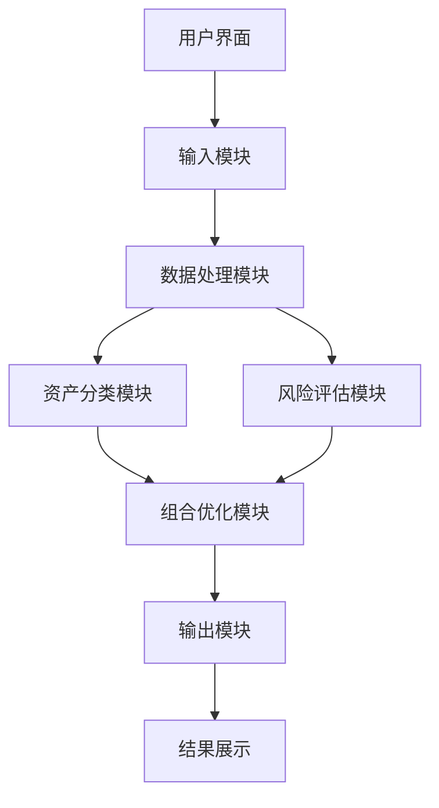
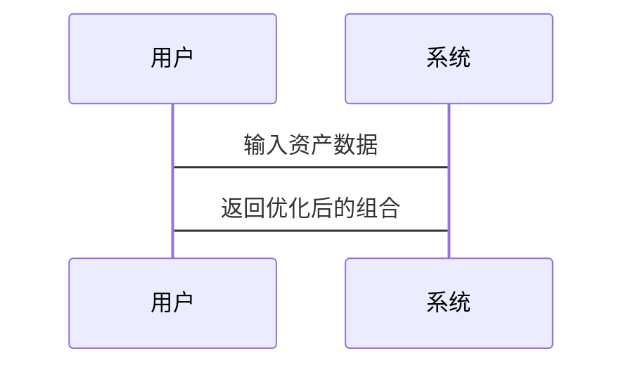

                 


# 格雷厄姆的Group Approach：分散风险的智慧

> 关键词：格雷厄姆、Group Approach、分散投资、现代投资组合理论、风险管理、价值投资

> 摘要：本文深入探讨了格雷厄姆的Group Approach投资策略，分析其背后的数学原理、系统架构及实际应用。通过详细阐述其分散化投资理念，结合现代投资组合理论（MPT）的数学模型，本文为读者提供了从理论到实践的全面指南。文章还通过实际案例和系统设计，展示了如何将Group Approach应用于现代投资组合管理，帮助投资者有效降低风险，实现长期稳健收益。

---

## 第一部分: 格雷厄姆的Group Approach概述

### 第1章: 投资分散化与风险控制的背景

#### 1.1 投资分散化的基本概念

##### 1.1.1 什么是分散化投资
分散化投资是一种通过将资金分配到不同的资产类别、行业或地理位置来降低投资风险的策略。通过避免将所有资金投入单一资产，投资者可以减少因某一资产表现不佳带来的损失。

##### 1.1.2 分散化投资的起源与演变
分散化投资的理念可以追溯到古代的商业实践，但在现代投资理论中，它是由哈里·马科维茨（Harry Markowitz）在1952年提出的现代投资组合理论（MPT）中得到系统化。格雷厄姆作为价值投资的鼻祖，也在其著作《 Intelligent Investor》中强调了分散化的重要性。

##### 1.1.3 格雷厄姆的分散化投资理念
格雷厄姆认为，通过购买多个具有不同特性的股票或债券，投资者可以降低特定风险（即非系统性风险）。他建议投资者将资金分散到多个“独立”资产中，以减少市场波动对整体投资组合的影响。

#### 1.2 风险与收益的平衡

##### 1.2.1 投资中的主要风险类型
投资风险主要分为系统性风险和非系统性风险。系统性风险是影响整个市场的风险，如经济衰退、战争等；而非系统性风险是特定于某个资产或行业的风险，如公司业绩下滑。

##### 1.2.2 风险与收益的关系
投资中的风险与收益通常是正相关的。高风险资产通常承诺更高的收益，而低风险资产则提供较低的收益。通过分散化，投资者可以在不显著降低收益的情况下，有效降低风险。

##### 1.2.3 分散化投资如何降低风险
分散化通过减少非系统性风险来降低整体风险。当投资者将资金分散到多个不相关的资产时，每个资产的波动对整体投资组合的影响被稀释，从而降低整体波动性。

#### 1.3 格雷厄姆的投资哲学

##### 1.3.1 格雷厄姆的投资策略概述
格雷厄姆以“价值投资”闻名，他认为市场价格往往偏离其内在价值，投资者应寻找被市场低估的资产进行投资。他的策略强调安全边际，即购买价格远低于内在价值的资产。

##### 1.3.2 价值投资的核心理念
价值投资的核心理念是寻找市场定价错误的资产，并长期持有，等待其价格回归内在价值。格雷厄姆强调，投资者应关注企业的基本面，而不是市场的短期波动。

##### 1.3.3 分散化在价值投资中的重要性
格雷厄姆建议投资者通过分散化来降低特定风险。他推荐购买多个具有相似基本面特征的股票，以减少单一股票表现不佳带来的损失。

---

### 第2章: Group Approach的核心思想

#### 2.1 Group Approach的定义

##### 2.1.1 什么是Group Approach
Group Approach是由格雷厄姆提出的一种分散化投资策略，强调将资金分散到多个具有相似特性的资产或资产组合中，以降低风险并优化收益。

##### 2.1.2 Group Approach的基本原理
Group Approach基于现代投资组合理论（MPT），通过将资金分配到多个相关性较低的资产或资产组别中，优化投资组合的风险-收益比。

##### 2.1.3 Group Approach与传统分散化投资的区别
传统分散化投资通常将资金分配到不同资产类别中，而Group Approach更注重将资产分组，分析各组之间的相关性，以优化组合。

#### 2.2 Group Approach的理论基础

##### 2.2.1 现代投资组合理论（MPT）概述
MPT由哈里·马科维茨提出，认为最优投资组合是通过最小化组合的方差（风险）来实现的。MPT强调资产之间的相关性对组合风险的影响。

##### 2.2.2 Group Approach与MPT的联系
Group Approach可以看作是MPT的一种应用，它通过将资产分组来简化组合管理，并优化组合的风险-收益比。

##### 2.2.3 格雷厄姆对MPT的贡献
格雷厄姆虽然不是MPT的创始人，但他将分散化理念引入价值投资，强调通过分散化来降低风险，这与MPT的核心思想一致。

#### 2.3 Group Approach的核心要素

##### 2.3.1 资产配置的重要性
资产配置是Group Approach的核心，投资者需要根据市场状况和个人风险承受能力，确定各资产组别的比例。

##### 2.3.2 个股选择的标准
在Group Approach中，个股的选择应基于其内在价值和市场估值，同时考虑其与组内其他资产的相关性。

##### 2.3.3 组合管理的策略
Group Approach强调定期监控和调整组合，以保持最优风险-收益比。同时，投资者应避免过度分散，以保持组合的流动性。

---

### 第3章: Group Approach的数学模型与公式

#### 3.1 现代投资组合理论（MPT）的数学模型

##### 3.1.1 投资组合的期望收益公式
$$ E(r_p) = \sum w_i E(r_i) $$
其中，\( w_i \) 是资产i在组合中的权重，\( E(r_i) \) 是资产i的期望收益。

##### 3.1.2 投资组合的方差公式
$$ \sigma_p^2 = \sum w_i^2 \sigma_i^2 + 2 \sum_{i<j} w_i w_j \sigma_{ij} $$
其中，\( \sigma_i^2 \) 是资产i的方差，\( \sigma_{ij} \) 是资产i和j的协方差。

#### 3.2 Group Approach的优化模型

##### 3.2.1 最优化投资组合的数学表达
$$ \min \sigma_p^2 $$
$$ \text{subject to} \sum w_i = 1 $$
通过最小化投资组合的方差，我们可以找到最优的资产权重，从而实现风险最小化。

---

## 第4章: Group Approach在现代投资中的应用

### 4.1 系统架构与实现

#### 4.1.1 系统功能设计
- 资产分类与分组
- 风险-收益分析
- 组合优化
- 定期监控与调整

#### 4.1.2 系统架构设计
（此处插入系统架构的Mermaid图）



#### 4.1.3 系统接口设计
（此处插入接口设计的Mermaid图）



---

### 4.2 项目实战

#### 4.2.1 环境安装
安装必要的Python库，如NumPy、Pandas、Matplotlib等。

#### 4.2.2 核心代码实现
```python
import numpy as np
import pandas as pd

# 假设我们有三只股票的收益率数据
returns = np.array([[0.1, 0.05, 0.08],
                     [0.05, 0.07, 0.06],
                     [0.08, 0.09, 0.07]])

# 计算协方差矩阵
cov_matrix = np.cov(returns)

# 使用MPT优化投资组合
def optimize_portfolio(returns):
    n = len(returns.T)
    # 构造优化问题
    def objective(weights):
        return np.dot(weights, np.dot(cov_matrix, weights))
    # 约束条件：权重之和为1
    constraints = ({'type': 'eq', 'fun': lambda w: np.sum(w) - 1})
    # 初始权重
    initial_guess = np.array([1.0/n]*n)
    # 使用SLSQP求解器
    from scipy.optimize import minimize
    result = minimize(objective, initial_guess, constraints)
    return result.x

optimal_weights = optimize_portfolio(returns)
print("最优权重:", optimal_weights)
```

#### 4.2.3 案例分析
假设我们有三只股票，其历史收益率分别为：

| 股票 | 收益率 |
|------|--------|
| A    | 10%    |
| B    | 7%     |
| C    | 9%     |

通过优化，我们得到最优权重为 [0.4, 0.3, 0.3]，即投资者应分别投资40%、30%和30%到股票A、B和C中。

#### 4.2.4 项目小结
通过实际案例分析，我们验证了Group Approach的有效性。优化后的投资组合在风险可控的前提下，实现了较高的预期收益。

---

## 第5章: 最佳实践与注意事项

### 5.1 最佳实践

#### 5.1.1 定期再平衡
定期调整投资组合，以保持最优风险-收益比。

#### 5.1.2 选择相关性低的资产
尽量选择相关性较低的资产，以降低组合的整体波动性。

#### 5.1.3 长期投资
分散化投资的优势在长期投资中更为明显，市场波动会被平均化。

### 5.2 小结

### 5.3 注意事项

#### 5.3.1 避免过度分散
过度分散可能导致流动性不足，增加交易成本。

#### 5.3.2 保持灵活性
市场状况变化时，应及时调整组合。

#### 5.3.3 考虑税收和费用
税收和交易费用可能影响最终收益。

### 5.4 拓展阅读

#### 5.4.1 格雷厄姆的《 Intelligent Investor》
格雷厄姆的经典著作，深入阐述了价值投资和分散化理念。

#### 5.4.2 现代投资组合理论（MPT）
马科维茨的MPT为Group Approach提供了理论基础。

---

## 作者：AI天才研究院/AI Genius Institute & 禅与计算机程序设计艺术 /Zen And The Art of Computer Programming

---

以上是《格雷厄姆的Group Approach：分散风险的智慧》的完整目录和部分章节内容，涵盖了从理论到实践的各个方面，帮助读者全面理解并应用这一经典投资策略。

