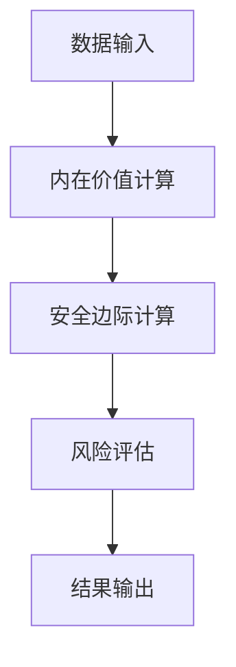
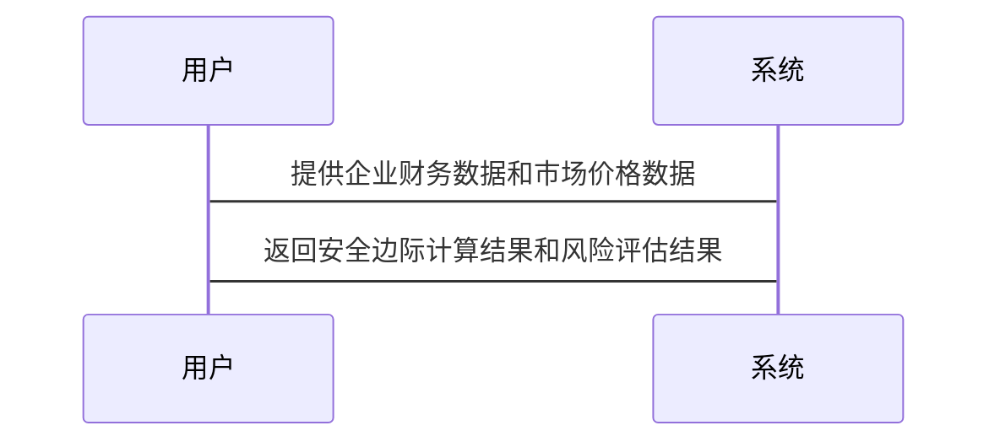

                 


# 格雷厄姆的Margin of Safety：投资的首要原则

> 关键词：投资，安全边际，价值投资，格雷厄姆，风险管理

> 摘要：本文深入探讨了格雷厄姆提出的安全边际（Margin of Safety）原则，分析其在投资决策中的重要性。通过详细解释安全边际的定义、计算方法及其在不同市场环境中的应用，本文为投资者提供了实用的指导和案例分析。结合数学模型和系统设计，本文展示了如何将安全边际原则融入投资策略中，以实现风险可控下的最大收益。

---

## 第三章：安全边际的数学模型与公式

### 3.1 安全边际的数学模型

安全边际是价值投资中最重要的概念之一，其核心在于通过计算企业的内在价值与市场价格之间的差异来评估投资的安全性。以下是安全边际的数学模型：

#### 3.1.1 内在价值计算公式
$$ V = \frac{E}{k} $$
其中：
- \( V \) 表示企业的内在价值
- \( E \) 表示企业的预期收益
- \( k \) 表示折现率

#### 3.1.2 安全边际计算公式
$$ \text{安全边际} = \frac{\text{内在价值} - \text{市场价格}}{\text{市场价格}} \times 100\% $$

安全边际的宽度越大，投资的风险越小，反之则风险越大。

### 3.2 安全边际与风险的关系

#### 3.2.1 风险的数学模型
$$ R = \frac{\text{市场价格} - \text{内在价值}}{\text{内在价值}} \times 100\% $$

当市场价格高于内在价值时，投资风险增加；当市场价格低于内在价值时，投资风险降低。

#### 3.2.2 安全边际与风险的反向关系

安全边际与投资风险呈反向关系。具体来说：
- 当安全边际为正时，投资风险较低
- 当安全边际为零时，投资风险达到中性水平
- 当安全边际为负时，投资风险较高

---

## 第四章：安全边际的系统分析与架构设计

### 4.1 系统分析

#### 4.1.1 问题场景介绍

在投资决策中，投资者需要综合考虑多个因素，包括企业的财务状况、行业竞争环境、宏观经济环境等。安全边际原则为投资者提供了一个量化工具，用于评估投资的潜在风险和收益。

#### 4.1.2 系统功能设计

以下是安全边际分析系统的功能模块：

- **模块1：数据输入**：获取企业的财务数据和市场价格数据。
- **模块2：内在价值计算**：基于预期收益和折现率计算企业的内在价值。
- **模块3：安全边际计算**：计算内在价值与市场价格之间的差异，并计算安全边际。
- **模块4：风险评估**：根据安全边际的宽度评估投资风险。
- **模块5：结果输出**：输出安全边际和风险评估结果。

### 4.2 系统架构设计

以下是安全边际分析系统的架构图：



### 4.3 系统接口设计

#### 4.3.1 数据接口

以下是系统的数据接口设计：

- **输入接口**：
  - 企业财务数据接口：用于获取企业的收入、利润等数据。
  - 市场价格接口：用于获取企业的市场价格数据。
- **输出接口**：
  - 安全边际结果接口：输出安全边际的计算结果。
  - 风险评估结果接口：输出投资风险的评估结果。

#### 4.3.2 交互设计

以下是系统的交互序列图：



---

## 第五章：项目实战

### 5.1 环境安装

为了实现安全边际分析系统，我们需要以下工具和环境：

- **编程语言**：Python
- **开发框架**：Django 或 Flask
- **数据处理工具**：Pandas
- **数据可视化工具**：Matplotlib 或 Seaborn

### 5.2 核心实现源代码

以下是安全边际分析系统的Python实现代码：

```python
import pandas as pd

def calculate_intrinsic_value(expected_revenue, discount_rate):
    return expected_revenue / discount_rate

def calculate_margin_of_safety(intrinsic_value, market_price):
    return (intrinsic_value - market_price) / market_price * 100

# 示例数据
expected_revenue = 1000000
discount_rate = 0.1
market_price = 50

# 计算内在价值
intrinsic_value = calculate_intrinsic_value(expected_revenue, discount_rate)

# 计算安全边际
margin_of_safety = calculate_margin_of_safety(intrinsic_value, market_price)

print(f"内在价值: {intrinsic_value}")
print(f"安全边际: {margin_of_safety}%")
```

### 5.3 代码应用解读与分析

1. **内在价值计算**：
   ```python
   intrinsic_value = expected_revenue / discount_rate
   ```
   这行代码计算了企业的内在价值，其中 `expected_revenue` 是企业的预期收益，`discount_rate` 是折现率。

2. **安全边际计算**：
   ```python
   margin_of_safety = (intrinsic_value - market_price) / market_price * 100
   ```
   这行代码计算了安全边际，`market_price` 是企业的市场价格。

### 5.4 实际案例分析

假设某企业的预期收益为100万元，折现率为10%，市场价格为50元。计算如下：

1. 计算内在价值：
   $$ V = \frac{1000000}{0.1} = 10000000 $$

2. 计算安全边际：
   $$ \text{安全边际} = \frac{10000000 - 50}{50} \times 100\% = 1900\% $$

这意味着该投资的安全边际为1900%，风险极低，是一个非常安全的投资。

---

## 第六章：总结与展望

### 6.1 总结

本文深入探讨了格雷厄姆提出的安全边际原则，分析了其在投资决策中的重要性。通过数学模型和系统设计，本文展示了如何将安全边际原则应用于实际投资中，以实现风险可控下的最大收益。

### 6.2 展望

未来，安全边际原则可以通过结合大数据和人工智能技术进一步优化。例如，利用机器学习模型预测企业的预期收益和市场价格，从而提高安全边际计算的准确性。

---

## 结语

安全边际是价值投资的核心原则之一，它帮助投资者在复杂多变的市场中做出更明智的投资决策。通过本文的分析和实践，读者可以更好地理解和应用安全边际原则，从而在投资中实现稳健的收益。

作者：AI天才研究院/AI Genius Institute & 禅与计算机程序设计艺术 /Zen And The Art of Computer Programming

