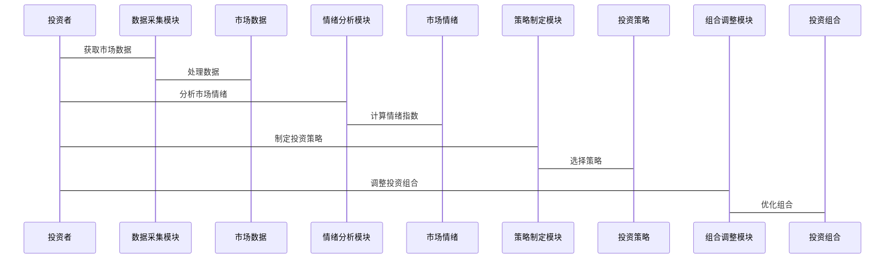

                 


# 格雷厄姆的Mr. Market理论

## 关键词：投资心理学, 市场情绪, 投资者心理, 市场波动, 价值投资

## 摘要：格雷厄姆的Mr. Market理论是一种投资心理学的重要理论，它通过分析市场情绪和投资者心理，帮助投资者做出理性的投资决策。本文将从理论背景、核心概念、算法实现、系统架构和项目实战等方面，全面探讨Mr. Market理论的深刻内涵及其在现代投资中的应用。

---

# 第一部分: 格雷厄姆的Mr. Market理论概述

## 第1章: 投资心理学与市场行为

### 1.1 投资心理学的背景与重要性

#### 1.1.1 投资心理学的基本概念
投资心理学是研究投资者在金融市场中的行为、决策和情绪的学科。它关注投资者如何处理信息、做出决策以及如何应对市场波动。

#### 1.1.2 市场参与者的行为模式
市场参与者包括个人投资者、机构投资者、市场参与者等。不同参与者的行为模式受到心理因素的影响，例如贪婪和恐惧。

#### 1.1.3 投资决策中的心理偏差
投资者在决策过程中常常受到心理偏差的影响，例如确认偏差、过度自信偏差等。

### 1.2 Mr. Market理论的核心思想

#### 1.2.1 Mr. Market的定义与特点
Mr. Market是格雷厄姆在《聪明的投资者》中提出的一个比喻，代表市场情绪。市场情绪是市场参与者心理的综合反映，具有波动性和不可预测性。

#### 1.2.2 市场情绪的波动性分析
市场情绪具有周期性，从乐观到悲观，再到乐观，不断循环。这种波动性影响资产价格的波动。

#### 1.2.3 投资者心理与市场行为的关系
投资者心理影响市场行为，而市场行为反过来也会影响投资者心理。这种互动关系是市场波动的重要原因。

### 1.3 Mr. Market理论的哲学基础

#### 1.3.1 投资与人性的关系
投资不仅仅是对市场的分析，更是对人性的洞察。投资者需要理解自己的心理和他人的心理。

#### 1.3.2 市场波动的周期性规律
市场波动遵循一定的周期性规律，投资者可以通过分析这些规律来做出更理性的决策。

#### 1.3.3 投资者的认知偏差与决策错误
投资者常常因为认知偏差而做出错误的决策，例如过度交易、追涨杀跌等。

### 1.4 本章小结
本章介绍了投资心理学的背景和重要性，详细阐述了Mr. Market理论的核心思想及其哲学基础，帮助读者理解市场情绪与投资者心理的关系。

---

## 第2章: Mr. Market理论的核心概念与联系

### 2.1 市场情绪的核心概念

#### 2.1.1 市场情绪的定义与分类
市场情绪是指市场参与者的整体心理状态，可以分为乐观、悲观、中立等类别。

#### 2.1.2 市场情绪的测量方法
市场情绪可以通过市场指标、投资者情绪调查、媒体情绪分析等多种方法进行测量。

#### 2.1.3 市场情绪与资产价格的关系
市场情绪是影响资产价格波动的重要因素，乐观情绪会导致资产价格上涨，悲观情绪会导致资产价格下跌。

### 2.2 投资者心理与市场行为的联系

#### 2.2.1 投资者心理的三重性
投资者心理具有贪婪、恐惧和不确定性，这三者相互作用，影响市场行为。

#### 2.2.2 市场情绪的传播机制
市场情绪通过投资者之间的互动传播，例如信息传播、舆论引导等。

#### 2.2.3 市场参与者的行为互动
投资者行为相互影响，形成市场趋势，例如羊群效应、从众心理等。

### 2.3 市场波动与投资策略的关系

#### 2.3.1 市场波动的周期性特征
市场波动具有周期性，投资者可以通过分析周期来制定投资策略。

#### 2.3.2 投资策略的选择与市场情绪的关系
在不同市场情绪下，投资者应选择不同的投资策略，例如在市场乐观时选择成长策略，在市场悲观时选择价值策略。

#### 2.3.3 市场波动对投资组合的影响
市场波动会影响投资组合的收益和风险，投资者需要根据市场波动调整投资组合。

### 2.4 本章小结
本章详细探讨了市场情绪的核心概念、投资者心理与市场行为的联系，以及市场波动与投资策略的关系，为后续的算法实现和系统设计奠定了理论基础。

---

## 第3章: 市场情绪的数学模型与算法原理

### 3.1 市场情绪的量化指标

#### 3.1.1 市场情绪指数的定义
市场情绪指数是将市场情绪量化为一个指标，用于衡量市场的乐观或悲观程度。

#### 3.1.2 市场情绪指数的计算公式
市场情绪指数可以通过多种方法计算，例如基于历史数据的均值回归模型。

$$\text{市场情绪指数} = \frac{\text{当前价格} - \text{历史平均价格}}{\text{历史标准差}}$$

#### 3.1.3 市场情绪指数的实证分析
通过对历史数据的实证分析，验证市场情绪指数的有效性。

### 3.2 市场情绪的算法实现

#### 3.2.1 市场情绪分类算法的选择
常用的市场情绪分类算法包括逻辑回归、支持向量机（SVM）、随机森林等。

#### 3.2.2 基于机器学习的情绪分析模型
使用自然语言处理技术，分析新闻、社交媒体等文本数据，提取市场情绪特征。

#### 3.2.3 市场情绪预测的数学模型
构建时间序列模型，如ARIMA、LSTM，用于预测市场情绪的变化。

### 3.3 市场情绪与资产价格的关系模型

#### 3.3.1 资产价格波动的数学模型
资产价格波动可以表示为随机过程，例如布朗运动模型。

$$\text{d}P_t = \mu \text{d}t + \sigma \text{d}W_t$$

#### 3.3.2 市场情绪对资产价格的影响路径
市场情绪通过影响投资者行为，进而影响资产价格的波动。

#### 3.3.3 市场情绪与资产价格的相关性分析
通过统计方法，分析市场情绪与资产价格之间的相关性。

### 3.4 本章小结
本章通过数学模型和算法，量化了市场情绪，分析了其对资产价格的影响，为后续的系统设计和投资策略提供了理论支持。

---

## 第4章: 投资决策系统的系统架构与设计

### 4.1 系统功能设计

#### 4.1.1 领域模型
使用Mermaid绘制领域模型图，展示系统的核心功能模块。


### 4.2 系统架构设计

#### 4.2.1 系统架构
使用Mermaid绘制系统架构图，展示系统的模块划分和交互关系。

```mermaid
container 投资决策系统
    container 数据采集模块
        class 数据源
        class 数据处理
    container 情绪分析模块
        class 情绪计算
    container 策略制定模块
        class 策略选择
    container 组合调整模块
        class 组合优化
```

### 4.3 系统接口设计

#### 4.3.1 系统接口
定义系统的主要接口，例如数据接口、情绪接口、策略接口和组合接口。

### 4.4 系统交互设计

#### 4.4.1 系统交互流程
使用Mermaid绘制序列图，展示系统的主要交互流程。



### 4.5 本章小结
本章详细设计了投资决策系统的功能、架构和接口，展示了如何将Mr. Market理论应用于实际的投资系统中。

---

## 第5章: 项目实战与案例分析

### 5.1 项目环境配置

#### 5.1.1 环境要求
需要安装Python、相关库（如pandas、numpy、scikit-learn）和数据接口。

### 5.2 核心代码实现

#### 5.2.1 数据采集模块
代码示例：

```python
import pandas as pd

def get_market_data(start_date, end_date):
    # 获取市场数据
    data = pd.read_csv('market_data.csv')
    return data[start_date:end_date]
```

#### 5.2.2 情绪分析模块
代码示例：

```python
from sklearn.linear_model import LinearRegression

def calculate_market_mood(data):
    # 计算市场情绪指数
    model = LinearRegression()
    model.fit(data[['price', 'volume']], data['returns'])
    mood_index = model.predict(data[['price', 'volume']])
    return mood_index
```

#### 5.2.3 投资策略模块
代码示例：

```python
def create_strategy(mood_index):
    # 根据市场情绪制定策略
    if mood_index > 0.5:
        return 'long'  # 买入
    else:
        return 'short'  # 卖出
```

#### 5.2.4 组合调整模块
代码示例：

```python
def adjust_portfolio(portfolio, strategy):
    # 根据策略调整投资组合
    if strategy == 'long':
        portfolio.weight = 0.8
    else:
        portfolio.weight = 0.2
    return portfolio
```

### 5.3 案例分析与解读

#### 5.3.1 案例分析
假设在2020年3月，市场情绪指数为-0.3，投资者选择卖出策略，调整投资组合权重为20%。

#### 5.3.2 代码解读
详细解读上述代码，说明每个模块的功能和实现逻辑。

### 5.4 本章小结
本章通过项目实战，展示了如何将Mr. Market理论应用于实际投资决策系统中，帮助投资者做出更理性的决策。

---

## 第6章: 最佳实践与小结

### 6.1 小结
总结全文，回顾Mr. Market理论的核心内容和应用。

### 6.2 注意事项
在实际投资中，需注意市场情绪的复杂性，避免过度依赖单一指标。

### 6.3 拓展阅读
推荐相关书籍和资源，供读者进一步学习。

---

## 作者信息

作者：AI天才研究院/AI Genius Institute & 禅与计算机程序设计艺术/Zen And The Art of Computer Programming

---

以上是《格雷厄姆的Mr. Market理论》的技术博客文章的完整大纲和内容框架。希望这篇文章能帮助读者更好地理解Mr. Market理论，并在实际投资中应用这一理论。

