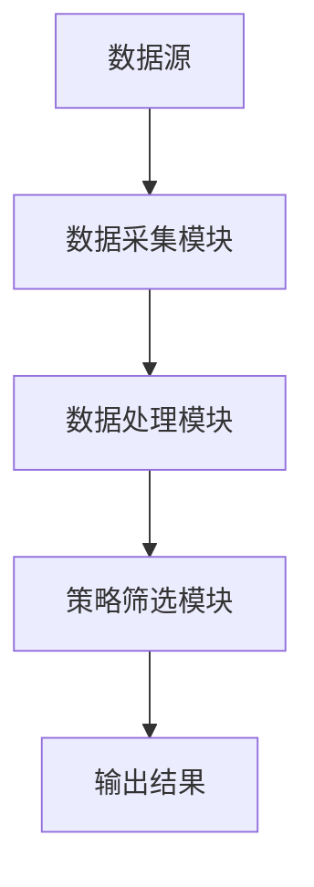

                 


# 格雷厄姆的NCAV策略：寻找极度低估的股票

## 关键词：  
格雷厄姆, NCAV策略, 价值投资, 股票筛选, 投资策略

## 摘要：  
本文详细探讨了格雷厄姆的NCAV策略，这是一种用于寻找市场中极度低估股票的投资方法。通过分析NCAV策略的核心概念、算法原理和系统架构，本文为读者提供了一套基于净当前资产与股价比率的投资框架。文章从背景介绍、数学模型、系统设计到项目实战，全面解析了NCAV策略的实现过程，并通过实际案例展示了其在投资中的应用。最后，本文总结了NCAV策略的优势，并提出了最佳实践建议。

---

# 第1章: NCAV策略的背景与起源

## 1.1 本杰明·格雷厄姆的生平简介  
本杰明·格雷厄姆（Benjamin Graham）是20世纪最伟大的投资思想家之一，被誉为“价值投资之父”。他于1894年出生于伦敦，后随家人移居美国。格雷厄姆的职业生涯始于1914年，当时他仅20岁，凭借其卓越的投资能力和对市场的深刻理解，迅速积累了巨大的财富。然而，1929年的股市崩盘让他损失惨重，但这并没有击垮他，反而促使他更加深入地研究投资理论，最终形成了独特的价值投资理念。

## 1.2 价值投资理念的核心思想  
格雷厄姆的价值投资理念基于一个简单而深刻的观察：市场先生（Mr. Market）是不可预测的，但投资者可以通过分析企业的内在价值来识别被市场低估的机会。他认为，股票的价格经常偏离其真实价值，而这种偏离为精明的投资者提供了套利的机会。格雷厄姆的策略是寻找那些市场价格远低于其内在价值的企业，长期持有，直到市场认识到其真实价值为止。

## 1.3 NCAV策略的提出与演变  
NCAV（Net Current Asset Value）策略是格雷厄姆提出的一种具体的投资方法，旨在识别那些市场价格远低于其净当前资产价值的公司。该策略的核心思想是，如果一家公司的净当前资产价值远高于其市值，那么这家公司很可能被市场低估，具有投资价值。

---

# 第2章: NCAV策略的核心概念与原理

## 2.1 核心概念解析  
### 2.1.1 净当前资产（Net Current Assets）的定义  
净当前资产是指一家公司在扣除所有流动负债后的剩余流动资产。具体来说，净当前资产 = 流动资产 - 流动负债。流动资产包括现金、应收账款、存货等，而流动负债则包括应付账款、短期债务等。

### 2.1.2 市价与NCAV的关系  
NCAV策略的核心在于比较一家公司的净当前资产与其市场价格。当一家公司的净当前资产远高于其市值时，该公司被认为是被市场低估的，具有投资价值。

### 2.1.3 NCAV策略的核心逻辑  
NCAV策略的逻辑是：如果一家公司的净当前资产价值远高于其市值，那么即使该公司在短期内表现不佳，其资产也足以支撑其股价回升。因此，这种策略旨在通过识别这些公司来捕捉市场低估的机会。

## 2.2 NCAV策略的关键指标  
### 2.2.1 净当前资产与股价的对比分析  
为了确定一家公司是否被低估，NCAV策略要求计算其净当前资产与股价的比率。如果这个比率大于1，说明公司的净当前资产高于其市值，具有投资价值。

### 2.2.2 NCAV比率的计算公式  
NCAV比率的计算公式如下：
$$
\text{NCAV比率} = \frac{\text{净当前资产}}{\text{股价}}
$$

### 2.2.3 NCAV策略的筛选标准  
NCAV策略通常要求NCAV比率大于1，即：
$$
\text{NCAV比率} > 1
$$
这意味着公司净当前资产的价值高于其市场价格，具有投资价值。

---

# 第3章: NCAV策略的算法原理

## 3.1 NCAV策略的数学模型  
NCAV策略的数学模型可以表示为：
$$
\text{NCAV比率} = \frac{\text{流动资产} - \text{流动负债}}{\text{股价}}
$$

其中，流动资产包括现金、应收账款、存货等，流动负债包括应付账款、短期债务等。

## 3.2 NCAV策略的算法流程  
以下是NCAV策略的算法流程：

1. **数据收集**：收集目标公司的财务数据，包括流动资产、流动负债和股价。
2. **计算净当前资产**：计算净当前资产 = 流动资产 - 流动负债。
3. **计算NCAV比率**：计算NCAV比率 = 净当前资产 / 股价。
4. **筛选股票**：如果NCAV比率 > 1，则该股票被认为是被低估的，具有投资价值。

---

# 第4章: NCAV策略的系统架构设计

## 4.1 系统功能设计  
### 4.1.1 数据采集模块  
数据采集模块负责收集目标公司的财务数据和股价数据。

### 4.1.2 数据处理模块  
数据处理模块负责对收集到的数据进行清洗和计算，包括计算流动资产、流动负债和净当前资产。

### 4.1.3 策略筛选模块  
策略筛选模块负责根据NCAV比率筛选出符合条件的股票。

## 4.2 系统架构图  
以下是系统架构的mermaid图：



---

# 第5章: 项目实战

## 5.1 项目环境安装  
为了实现NCAV策略，我们需要以下环境：

1. Python 3.8+
2. pandas库
3. numpy库

安装命令：
```bash
pip install pandas numpy
```

## 5.2 核心实现代码  
以下是NCAV策略的核心实现代码：

```python
import pandas as pd
import numpy as np

# 数据加载
df = pd.read_csv('stock_data.csv')

# 计算流动资产和流动负债
current_assets = df['流动资产'].values
current_liabilities = df['流动负债'].values
nca = current_assets - current_liabilities

# 计算股价
prices = df['股价'].values

# 计算NCAV比率
nca_ratios = nca / prices

# 筛选符合条件的股票
selected_stocks = df[nca_ratios > 1]
```

## 5.3 实际案例分析  
假设我们有以下股票数据：

| 公司名称 | 流动资产 | 流动负债 | 股价 |
|----------|----------|----------|------|
| 公司A    | 100      | 50       | 40   |
| 公司B    | 150      | 70       | 60   |
| 公司C    | 200      | 100      | 80   |

计算NCAV比率：
- 公司A：NCAV比率 = (100 - 50) / 40 = 1.25 > 1 → 符合条件
- 公司B：NCAV比率 = (150 - 70) / 60 = 1.33 > 1 → 符合条件
- 公司C：NCAV比率 = (200 - 100) / 80 = 1.25 > 1 → 符合条件

因此，这三家公司都被认为是被低估的股票，具有投资价值。

---

# 第6章: 总结与最佳实践

## 6.1 小结  
NCAV策略是一种简单而有效的投资方法，通过比较公司的净当前资产与股价，识别被市场低估的股票。这种方法的核心在于利用市场的非理性波动，捕捉低估机会。

## 6.2 注意事项  
1. **数据准确性**：确保财务数据的准确性和及时性。
2. **市场波动**：NCAV策略适用于市场低估阶段，但在市场高估阶段可能表现不佳。
3. **行业分析**：不同行业的资产结构不同，需要结合行业特点进行分析。

## 6.3 拓展阅读  
1. 《证券分析》（The Analysis of Investment Value）——本杰明·格雷厄姆
2. 《投资学原理》（Principles of Investment）——彼得·林奇

---

# 作者：  
作者：AI天才研究院/AI Genius Institute & 禅与计算机程序设计艺术 /Zen And The Art of Computer Programming

