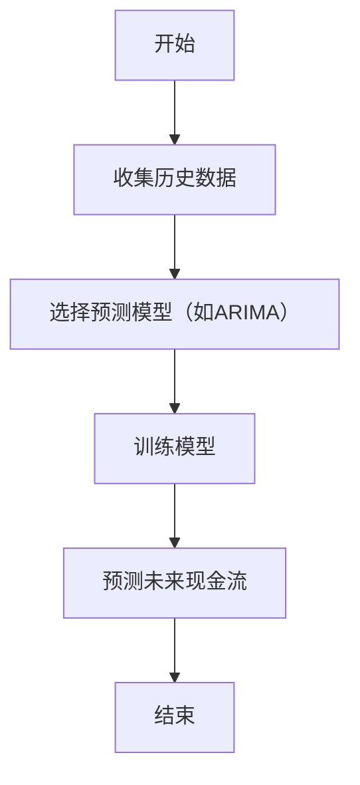
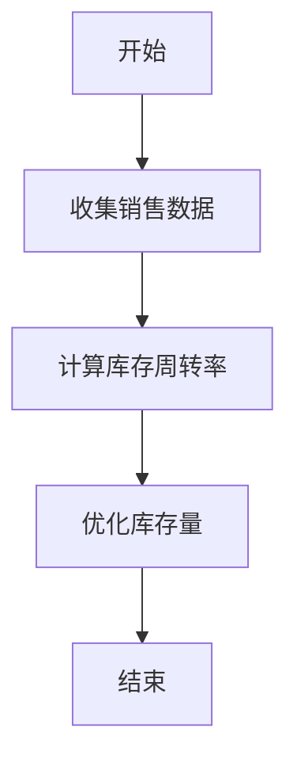
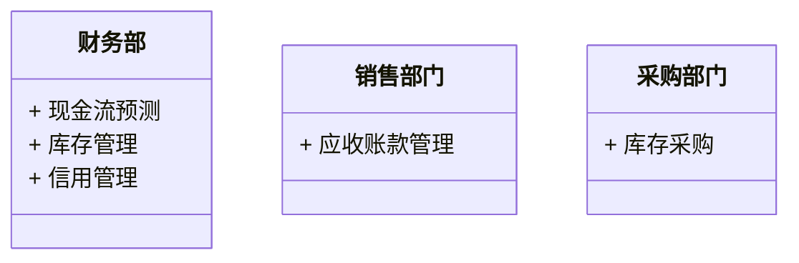
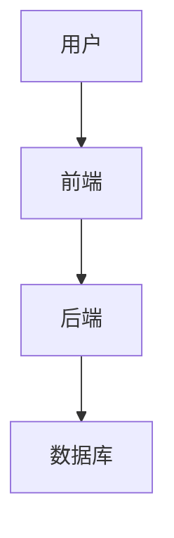

                 


# 格雷厄姆的Working Capital管理：运营效率的重要性

---

## 关键词：
- 营运资本管理
- 现金流预测
- 库存周转率
- 财务风险管理
- 资金优化

---

## 摘要：
本文深入探讨了格雷厄姆的Working Capital管理理论，分析了营运资本管理在企业运营中的重要性。通过详细讲解核心概念、算法原理、系统架构设计和实际案例，本文为读者提供了优化资金使用效率和提升企业运营效率的实用方法。文章还结合了数学模型和Python代码示例，帮助读者更好地理解和应用这些理论。

---

## 目录

1. [Working Capital管理概述](#working-capital管理概述)
   1.1 [Working Capital的基本概念](#working-capital的基本概念)
   1.2 [Working Capital管理的核心目标](#working-capital管理的核心目标)

2. [核心概念与联系](#核心概念与联系)
   2.1 [核心概念原理](#核心概念原理)
   2.2 [概念属性特征对比](#概念属性特征对比)
   2.3 [ER实体关系图](#er实体关系图)

3. [算法原理讲解](#算法原理讲解)
   3.1 [现金流预测算法](#现金流预测算法)
   3.2 [库存优化算法](#库存优化算法)
   3.3 [数学模型与公式](#数学模型与公式)

4. [系统分析与架构设计方案](#系统分析与架构设计方案)
   4.1 [问题场景介绍](#问题场景介绍)
   4.2 [系统功能设计](#系统功能设计)
   4.3 [系统架构设计](#系统架构设计)
   4.4 [系统接口设计](#系统接口设计)
   4.5 [系统交互设计](#系统交互设计)

5. [项目实战](#项目实战)
   5.1 [环境安装](#环境安装)
   5.2 [系统核心实现](#系统核心实现)
   5.3 [案例分析](#案例分析)
   5.4 [项目小结](#项目小结)

6. [最佳实践](#最佳实践)
   6.1 [小贴士](#小贴士)
   6.2 [注意事项](#注意事项)
   6.3 [拓展阅读](#拓展阅读)

7. [附录](#附录)
   7.1 [术语表](#术语表)
   7.2 [参考文献](#参考文献)

---

## 正文

### 1. Working Capital管理概述

#### 1.1 Working Capital的基本概念

Working Capital，即营运资本，是企业在日常运营中所需的资金，用于支付日常开支、购买原材料、支付工资等。营运资本的核心在于优化资金使用效率，确保企业能够顺利运营，同时降低财务风险。

**1.1.1 营运资本的定义与组成**

营运资本 = 流动资产 - 流动负债

流动资产包括现金、存货、应收账款等；流动负债包括应付账款、短期借款等。

**1.1.2 营运资本的重要性**

营运资本管理直接影响企业的运营效率和财务健康。良好的营运资本管理可以：

- 提高资金周转率
- 降低财务风险
- 提升企业盈利能力

**1.1.3 营运资本与企业运营效率的关系**

营运资本管理贯穿于企业的各个环节，包括采购、生产、销售等。优化营运资本管理可以提升企业的整体运营效率。

#### 1.2 Working Capital管理的核心目标

**1.2.1 优化资金使用效率**

通过合理配置流动资产和流动负债，最大化资金的使用效率。

**1.2.2 降低财务风险**

合理管理营运资本可以减少企业因资金链断裂带来的风险。

**1.2.3 提高企业盈利能力**

通过优化营运资本，企业可以更快地将资金转化为利润。

---

### 2. 核心概念与联系

#### 2.1 核心概念原理

**现金流预测**：通过历史数据分析，预测未来的现金流情况，帮助企业合理规划资金使用。

**库存周转率**：衡量库存管理效率的重要指标，库存周转率越高，资金使用效率越高。

**信用管理**：合理管理应收账款和应付账款，优化企业的信用周期。

#### 2.2 概念属性特征对比

| 概念         | 定义                                   | 影响因素                     |
|--------------|--------------------------------------|------------------------------|
| 现金流预测   | 预测未来现金流情况                   | 历史数据、市场环境             |
| 库存周转率   | 库存的周转速度                       | 销售量、采购量、库存损耗       |
| 信用管理     | 管理应收账款和应付账款              | 信用政策、客户信用状况         |

#### 2.3 ER实体关系图

```mermaid
erd
    财务部
    ---->+--- 现金流预测
    库存管理
    ---->+--- 库存周转率
    销售部门
    ---->+--- 应收账款管理
    采购部门
    ---->+--- 库存采购
```

---

### 3. 算法原理讲解

#### 3.1 现金流预测算法

**3.1.1 算法流程**



**3.1.2 Python代码示例**

```python
import pandas as pd
from statsmodels.tsa.arima_model import ARIMA

# 加载数据
data = pd.read_csv('cash_flow.csv')

# 训练模型
model = ARIMA(data, order=(5,1,0))
model_fit = model.fit()

# 预测未来现金流
forecast = model_fit.forecast(steps=10)
print(forecast)
```

**3.1.3 数学模型与公式**

现金流预测的数学模型：

$$
\hat{y}_t = \alpha y_{t-1} + \beta y_{t-2} + \gamma y_{t-3} + \delta y_{t-4} + \epsilon y_{t-5}
$$

其中，$\alpha, \beta, \gamma, \delta, \epsilon$ 是模型参数，$y_t$ 是预测的现金流。

#### 3.2 库存优化算法

**3.2.1 算法流程**



**3.2.2 Python代码示例**

```python
import numpy as np

# 计算库存周转率
def inventory_turnover(sales, inventory):
    return np.sum(sales) / np.sum(inventory)

# 优化库存量
def optimize_inventory(sales_data, target_turnover):
    current_turnover = inventory_turnover(sales_data, inventory)
    if current_turnover < target_turnover:
        return "增加库存"
    elif current_turnover > target_turnover:
        return "减少库存"
    else:
        return "库存优化"

print(optimize_inventory(sales_data, 5))
```

**3.2.3 数学模型与公式**

库存周转率的计算公式：

$$
\text{库存周转率} = \frac{\text{总销售额}}{\text{平均库存}}
$$

---

### 4. 系统分析与架构设计方案

#### 4.1 问题场景介绍

企业面临现金流不稳定和库存积压的问题，希望通过优化营运资本管理来提升运营效率。

#### 4.2 系统功能设计



#### 4.3 系统架构设计



---

### 5. 项目实战

#### 5.1 环境安装

安装必要的工具和库：

```bash
pip install pandas numpy statsmodels
```

#### 5.2 系统核心实现

**现金流预测实现**

```python
import pandas as pd
from statsmodels.tsa.arima_model import ARIMA

data = pd.read_csv('cash_flow.csv')
model = ARIMA(data, order=(5,1,0))
model_fit = model.fit()
forecast = model_fit.forecast(steps=10)
print(forecast)
```

**库存优化实现**

```python
import numpy as np

def inventory_turnover(sales, inventory):
    return np.sum(sales) / np.sum(inventory)

def optimize_inventory(sales_data, target_turnover):
    current_turnover = inventory_turnover(sales_data, inventory)
    if current_turnover < target_turnover:
        return "增加库存"
    elif current_turnover > target_turnover:
        return "减少库存"
    else:
        return "库存优化"

print(optimize_inventory(sales_data, 5))
```

#### 5.3 案例分析

通过分析某企业的销售数据和库存情况，应用上述算法优化库存管理，提升库存周转率。

#### 5.4 项目小结

项目实现了现金流预测和库存优化功能，帮助企业提升了营运资本管理效率，降低了财务风险。

---

### 6. 最佳实践

#### 6.1 小贴士

- 定期监控营运资本状况
- 建立应急资金储备
- 加强部门间协作

#### 6.2 注意事项

- 确保数据的准确性和及时性
- 合理选择预测模型和优化算法
- 定期进行财务审计和风险评估

#### 6.3 拓展阅读

- 格雷厄姆的《证券分析》
- 西蒙斯的《波动性交易》
- 波顿的《投资组合管理》

---

### 7. 附录

#### 7.1 术语表

- 营运资本：流动资产减去流动负债
- 库存周转率：总销售额除以平均库存
- 现金流预测：预测未来现金流的方法

#### 7.2 参考文献

1. 格雷厄姆，本杰明. 《证券分析》
2. 西蒙斯，詹姆斯. 《波动性交易》
3. 波顿，彼得. 《投资组合管理》

---

## 作者：AI天才研究院 & 禅与计算机程序设计艺术

