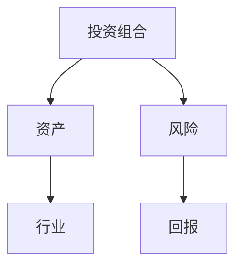
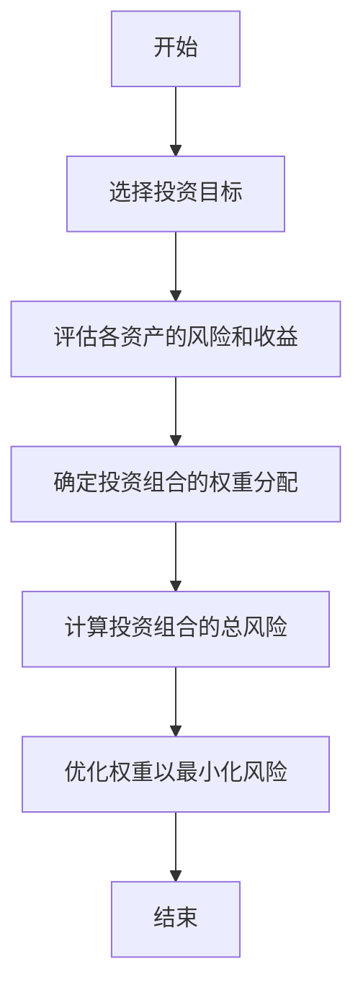
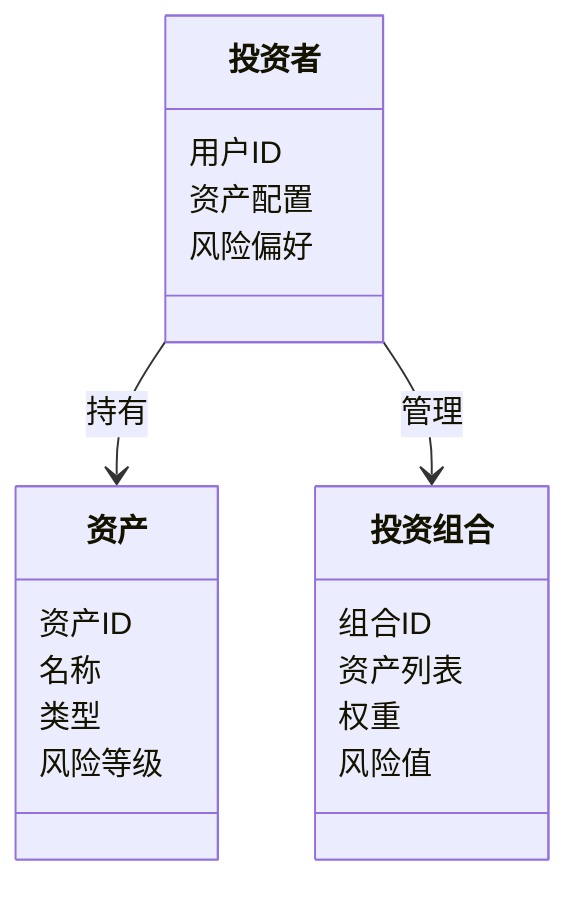
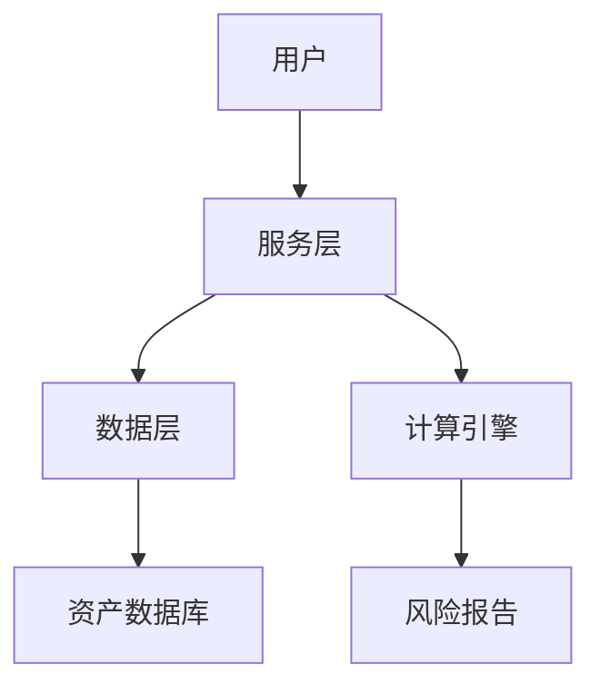

                 


# 格雷厄姆的diversification原则：降低投资风险

> 关键词：投资风险、投资组合、资产配置、价值投资、风险管理、风险分散、价值投资策略  
> 摘要：本文详细探讨了格雷厄姆的diversification原则，分析了其在降低投资风险中的应用。通过数学模型、系统架构和项目实战的深入解析，结合价值投资策略，为投资者提供降低风险的有效方法。

---

## 第一章：引言

### 1.1 投资的基本概念
投资是指将资金投入某种资产或项目，以期在未来获得收益或资本增值的行为。投资的核心目标是通过合理的资源配置，最大化收益并最小化风险。然而，投资过程中不可避免地伴随着风险，这使得风险管理成为投资者关注的焦点。

### 1.2 风险在投资中的重要性
投资风险是指投资收益的不确定性，通常表现为资产价格的波动或损失。风险的存在使得投资者需要在追求高回报的同时，注重风险的控制。有效的风险管理能够帮助投资者在市场波动中保持稳定的投资收益。

### 1.3 格雷厄姆的背景与投资理念
本杰明·格雷厄姆（Benjamin Graham）是价值投资的鼻祖，被誉为“投资之父”。他提出的价值投资理念强调以低于内在价值的价格购买优质资产，并长期持有。格雷厄姆的投资理念强调安全边际和风险管理，其核心思想之一是通过分散投资来降低风险。

### 1.4 本章小结
本章主要介绍了投资的基本概念、风险的重要性以及格雷厄姆的投资理念，为后续内容奠定了基础。

---

## 第二章：格雷厄姆diversification原则的核心概念

### 2.1 diversification原则的定义与分类
diversification原则是指通过将资金分散投资于不同的资产或行业，以降低整体投资组合的风险。分散投资的核心思想是“不要把所有的鸡蛋放在一个篮子里”，通过多样化来减少特定资产或行业的波动对整体投资组合的影响。

#### 2.1.1 投资组合的分类
- **单一投资**：仅投资于一种资产或行业，风险较高。
- **多元化投资**：投资于多种资产或行业，风险较低。

### 2.2 核心概念对比分析

#### 2.2.1 核心概念属性对比表格

| 核心概念 | 定义 | 优势 | 局限性 |
|----------|------|------|--------|
| 单一投资 | 投资于单一资产或行业 | 高回报潜力 | 高风险 |
| 多元化投资 | 投资于多个资产或行业 | 降低风险 | 平均回报 |

#### 2.2.2 ER实体关系图架构



### 2.3 本章小结
本章详细解释了diversification原则的定义与分类，并通过对比分析和实体关系图帮助读者理解其核心概念。

---

## 第三章：格雷厄姆diversification原则的数学模型与算法

### 3.1 数学模型与公式
#### 3.1.1 风险分散的数学表达
投资组合的总风险可以通过方差来衡量。对于多个资产的投资组合，其总体方差可以分解为各资产方差的加权平均以及资产之间的协方差。

$$ \text{总方差} = \sum_{i=1}^{n} \sum_{j=1}^{n} w_i w_j \sigma_i \sigma_j \rho_{ij} $$

其中，\( w_i \) 和 \( w_j \) 分别是资产 \( i \) 和 \( j \) 的权重，\( \sigma_i \) 和 \( \sigma_j \) 是资产 \( i \) 和 \( j \) 的标准差，\( \rho_{ij} \) 是资产 \( i \) 和 \( j \) 的相关系数。

#### 3.1.2 投资组合的方差计算
假设我们有两只资产，其权重分别为 \( w_1 \) 和 \( w_2 \)，方差分别为 \( \sigma_1^2 \) 和 \( \sigma_2^2 \)，相关系数为 \( \rho_{12} \)。则投资组合的方差为：

$$ \text{组合方差} = w_1^2 \sigma_1^2 + w_2^2 \sigma_2^2 + 2 w_1 w_2 \sigma_1 \sigma_2 \rho_{12} $$

#### 3.1.3 夏普比率的公式
夏普比率衡量的是投资组合单位风险所获得的超额回报。公式为：

$$ \text{夏普比率} = \frac{E[r_p] - r_f}{\sigma_p} $$

其中，\( E[r_p] \) 是投资组合的预期收益率，\( r_f \) 是无风险利率，\( \sigma_p \) 是投资组合的收益率标准差。

### 3.2 算法原理与流程图
通过分散化投资降低风险的算法流程如下：



### 3.3 本章小结
本章通过数学模型和算法流程图，详细阐述了diversification原则的实现方法，为后续的系统设计和项目实战奠定了基础。

---

## 第四章：系统分析与架构设计方案

### 4.1 问题场景介绍
在实际投资中，投资者需要根据市场变化动态调整投资组合。为了实现这一目标，我们需要设计一个智能化的投资组合管理系统。

### 4.2 系统功能设计
#### 4.2.1 领域模型设计



### 4.3 系统架构设计
#### 4.3.1 系统架构图



### 4.4 系统交互设计
#### 4.4.1 系统交互流程图

```mermaid
graph TD
    U[用户] --> S[服务层]: 请求投资组合
    S --> D[数据层]: 获取资产数据
    D --> C[计算引擎]: 计算风险
    C --> S[服务层]: 返回风险报告
    S --> U[用户]: 显示结果
```

### 4.5 本章小结
本章通过系统架构和交互设计，展示了如何将diversification原则应用于实际投资管理中。

---

## 第五章：项目实战

### 5.1 环境安装
项目需要以下环境：
- Python 3.8+
- NumPy
- Pandas
- Matplotlib

### 5.2 核心代码实现
#### 5.2.1 计算投资组合方差

```python
import numpy as np

def calculate_portfolio_variance(weights, cov_matrix):
    return np.dot(weights.T, np.dot(cov_matrix, weights))
```

#### 5.2.2 优化权重以最小化风险

```python
from scipy.optimize import minimize

def minimize_variance(weights, cov_matrix):
    return minimize(lambda w: w.dot(cov_matrix.dot(w)), weights, method='Nelder-Mead')
```

### 5.3 案例分析
假设我们有三只股票，其权重分别为 [0.3, 0.4, 0.3]，协方差矩阵为：

$$ \begin{bmatrix}
0.02 & 0.01 & 0.01 \\
0.01 & 0.03 & 0.02 \\
0.01 & 0.02 & 0.03 \\
\end{bmatrix} $$

计算投资组合的方差：

$$ \text{组合方差} = 0.3^2 \times 0.02 + 0.4^2 \times 0.03 + 0.3^2 \times 0.03 + 2 \times 0.3 \times 0.4 \times 0.01 + 2 \times 0.3 \times 0.3 \times 0.01 + 2 \times 0.4 \times 0.3 \times 0.02 $$

### 5.4 本章小结
本章通过项目实战，展示了如何使用Python代码实现投资组合的风险优化。

---

## 第六章：最佳实践与小结

### 6.1 最佳实践
- **分散投资**：通过投资多种资产降低风险。
- **定期调整**：根据市场变化动态优化投资组合。
- **长期持有**：避免频繁交易带来的额外风险。

### 6.2 小结
本文详细探讨了格雷厄姆的diversification原则，并通过数学模型、系统设计和项目实战展示了其在降低投资风险中的应用。投资者可以通过合理配置资产和动态调整投资组合，实现稳健的投资收益。

---

## 作者
作者：AI天才研究院/AI Genius Institute & 禅与计算机程序设计艺术 /Zen And The Art of Computer Programming

