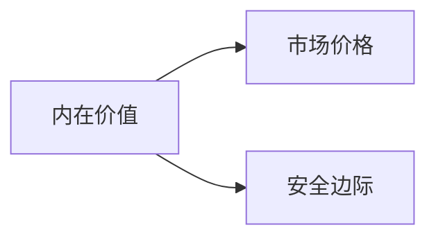
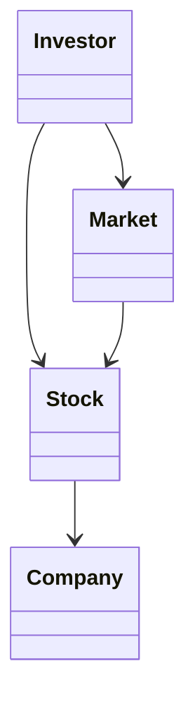
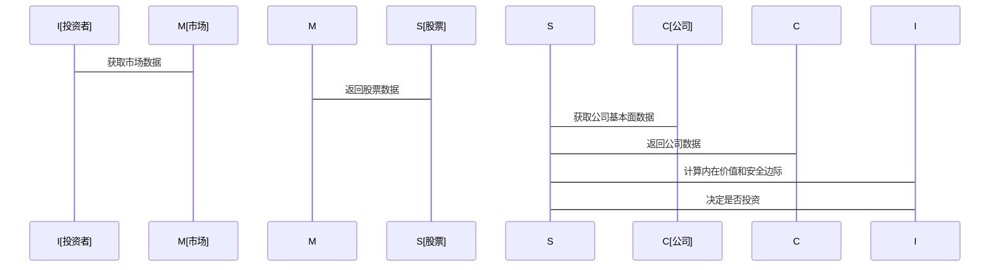

                 


```markdown
# 《格雷厄姆的价值投资传承》

> 关键词：价值投资，格雷厄姆，内在价值，安全边际，投资策略，数学模型

> 摘要：本文深入探讨了格雷厄姆的价值投资理论及其在现代投资中的传承与发展。通过分析其核心概念、数学模型和系统架构，结合实际案例，展示了如何将价值投资理念应用于实际投资决策中。文章内容涵盖价值投资的起源、核心原则、算法实现、系统设计以及项目实战，旨在为读者提供全面而深入的指导。

---

# 第一部分: 格雷厄姆的价值投资传承概述

# 第1章: 价值投资的起源与传承

## 1.1 价值投资的核心理念

### 1.1.1 价值投资的定义与起源
价值投资是一种以基本面分析为基础的投资策略，旨在通过识别市场价格与内在价值之间的差异来获得超额收益。本节将介绍价值投资的定义、起源及其在投资领域中的重要性。

### 1.1.2 格雷厄姆的价值投资理论
本节详细探讨格雷厄姆的价值投资理论，包括其核心观点、投资原则以及对现代投资理论的影响。

### 1.1.3 价值投资的现代发展与传承
本节将分析价值投资在现代的发展与演变，介绍其在不同市场环境下的应用及其对投资实践的深远影响。

## 1.2 价值投资的核心原则

### 1.2.1 安全边际的概念与应用
安全边际是价值投资中的核心概念，指市场价格低于内在价值的部分。本节将详细解释安全边际的计算方法及其在投资决策中的应用。

### 1.2.2 内在价值的计算方法
内在价值是企业未来现金流的现值，本节将介绍如何通过基本面分析计算内在价值，并探讨其在投资决策中的重要性。

### 1.2.3 市场先生与投资者心理
本节将分析市场先生的概念，探讨投资者心理对市场价格的影响，并提出如何利用市场情绪波动进行投资决策。

## 1.3 价值投资的适用场景与边界

### 1.3.1 价值投资的适用领域
本节将讨论价值投资在不同市场环境、资产类别和投资目标中的适用性，分析其在股票、债券等领域的应用。

### 1.3.2 价值投资的局限性
尽管价值投资具有许多优势，但也存在一定的局限性。本节将探讨其在实践中的局限性，并提出相应的解决方案。

### 1.3.3 价值投资与其他投资策略的对比
本节将对比价值投资与其他投资策略（如趋势投资、套利交易等）的异同，分析其在不同市场环境下的优劣势。

## 1.4 价值投资的传承与发展

### 1.4.1 格雷厄姆的学生与继承者
本节将介绍格雷厄姆的学生及其对价值投资理论的传承与发展，分析其在现代投资理论中的地位和作用。

### 1.4.2 现代价值投资的演变
本节将探讨现代价值投资的发展趋势，分析其在理论和实践中的演变过程，并展望其未来发展方向。

### 1.4.3 价值投资在全球市场中的应用
本节将分析价值投资在全球市场中的应用，探讨其在不同文化、经济和市场环境下的适应性。

## 1.5 本章小结
本章通过对价值投资的起源、核心理念、适用场景及其传承与发展的分析，为读者提供了全面而深入的理解。价值投资作为一种经典的长期投资策略，其核心理念和方法在现代投资实践中仍然具有重要的指导意义。

---

# 第二部分: 价值投资的核心概念与数学模型

# 第2章: 价值投资的核心概念解析

## 2.1 核心概念与属性对比

### 2.1.1 核心概念列表
以下是价值投资中的核心概念列表：
- 内在价值
- 安全边际
- 市场价格
- 市场情绪
- 资本资产
- 投资风险

### 2.1.2 核心概念属性对比表格
以下表格对比了核心概念的主要属性：

| 概念       | 描述                                                                 |
|------------|----------------------------------------------------------------------|
| 内在价值   | 股票的真正价值，基于基本面分析                                       |
| 安全边际   | 股票价格与内在价值之间的差距                                         |
| 市场价格   | 当前市场上的股票交易价格                                             |
| 市场情绪   | 市场参与者心理对股价的影响                                           |
| 资本资产   | 投资者用于购买股票的资金                                             |
| 投资风险   | 投资者在投资过程中可能面临的不确定性因素                           |

## 2.2 实体关系图

### 2.2.1 实体关系图
以下是一个简单的实体关系图，展示了价值投资中的核心实体及其关系：


## 2.3 核心概念的数学模型

### 2.3.1 内在价值计算公式
内在价值是股票的真正价值，可以通过以下公式计算：

$$ V = \frac{E}{k} $$

其中：
- \( V \) 表示内在价值
- \( E \) 表示企业的盈利（如现金流或净利润）
- \( k \) 表示折现率

### 2.3.2 安全边际计算公式
安全边际是股票价格与内在价值之间的差距，计算公式如下：

$$ M = P - V $$

其中：
- \( M \) 表示安全边际
- \( P \) 表示市场价格
- \( V \) 表示内在价值

### 2.3.3 内在价值与市场价格的关系
内在价值与市场价格之间的关系可以通过以下图表表示：



## 2.4 本章小结
本章通过核心概念的对比、实体关系图以及数学模型的分析，深入探讨了价值投资中的核心概念及其相互关系。内在价值和安全边际是价值投资中的两个核心概念，其计算方法和应用在投资决策中具有重要意义。

---

# 第三部分: 价值投资的算法与系统架构

# 第3章: 价值投资的算法实现

## 3.1 价值评估算法

### 3.1.1 格雷厄姆价值评估算法

#### 3.1.1.1 算法流程图
以下是一个简单的格雷厄姆价值评估算法流程图：


#### 3.1.1.2 算法步骤
1. 收集企业数据：包括企业的盈利、现金流、资产等基本面数据。
2. 计算内在价值：使用格雷厄姆的内在价值公式计算股票的内在价值。
3. 计算安全边际：比较市场价格与内在价值，计算安全边际。
4. 决定投资：根据安全边际的大小决定是否进行投资。

### 3.1.2 价值评估算法的实现

#### 3.1.2.1 Python代码实现

```python
def calculate_intrinsic_value(enterprise_value, cash_flow, discount_rate):
    return enterprise_value / (cash_flow * (1 + discount_rate))
```

#### 3.1.2.2 代码解释
- `enterprise_value`：企业的企业价值
- `cash_flow`：企业的现金流
- `discount_rate`：折现率

函数返回股票的内在价值。

### 3.1.3 数学模型与公式

#### 3.1.3.1 内在价值公式
$$ V = \frac{EV}{FCF \times (1 + k)} $$

其中：
- \( EV \) 表示企业价值
- \( FCF \) 表示自由现金流
- \( k \) 表示折现率

#### 3.1.3.2 安全边际公式
$$ M = P - V $$

其中：
- \( P \) 表示市场价格
- \( V \) 表示内在价值

## 3.2 价值投资的系统架构

### 3.2.1 系统功能设计

#### 3.2.1.1 领域模型类图
以下是一个简单的领域模型类图：



#### 3.2.1.2 系统架构图
以下是一个简单的系统架构图：


#### 3.2.1.3 系统接口设计
系统接口设计包括以下内容：
- 数据接口：获取企业基本面数据
- 计算接口：计算内在价值和安全边际
- 投资决策接口：根据计算结果决定是否投资

#### 3.2.1.4 系统交互序列图
以下是一个系统的交互序列图：



## 3.3 本章小结
本章通过算法实现和系统架构的设计，展示了如何将价值投资的理念转化为实际的投资决策系统。通过对算法流程图和系统架构图的分析，读者可以更好地理解价值投资在实际中的应用。

---

# 第四部分: 价值投资的项目实战

# 第4章: 价值投资的项目实战

## 4.1 项目介绍

### 4.1.1 项目背景
本项目旨在通过价值投资的理论和方法，对某家公司的股票进行投资决策分析。

### 4.1.2 项目目标
通过对该公司的基本面分析，计算其内在价值和安全边际，判断是否值得投资。

## 4.2 项目核心实现

### 4.2.1 数据采集与处理

#### 4.2.1.1 数据来源
数据来源包括：
- 公司财务报表
- 市场数据
- 行业分析报告

#### 4.2.1.2 数据处理
数据处理包括：
- 数据清洗
- 数据转换
- 数据分析

### 4.2.2 价值评估模型

#### 4.2.2.1 模型实现
以下是一个简单的价值评估模型实现：

```python
def calculate_intrinsic_value(enterprise_value, cash_flow, discount_rate):
    return enterprise_value / (cash_flow * (1 + discount_rate))
```

#### 4.2.2.2 模型应用
通过对某家公司的基本面数据进行分析，计算其内在价值和安全边际，判断其是否值得投资。

## 4.3 项目实战分析

### 4.3.1 案例分析

#### 4.3.1.1 案例介绍
以某公司为例，分析其基本面数据，计算其内在价值和安全边际。

#### 4.3.1.2 数据分析
通过对该公司过去五年的财务数据进行分析，计算其企业价值、现金流和折现率。

#### 4.3.1.3 计算结果
计算结果如下：
- 内在价值：$50
- 市场价格：$40
- 安全边际：$10

#### 4.3.1.4 投资决策
由于市场价格低于内在价值，且安全边际较大，因此建议进行投资。

### 4.3.2 投资决策分析

#### 4.3.2.1 投资策略
根据计算结果，制定投资策略，包括买入、持有和卖出的时机。

#### 4.3.2.2 风险管理
制定风险管理策略，包括止损点的设置和仓位管理。

## 4.4 项目小结
本章通过一个具体的项目实战，展示了如何将价值投资的理念应用于实际投资决策中。通过对某家公司的基本面分析和价值评估，读者可以更好地理解价值投资在实际中的应用。

---

# 第五部分: 价值投资的最佳实践与注意事项

# 第5章: 价值投资的最佳实践

## 5.1 最佳实践

### 5.1.1 长期投资
价值投资是一种长期投资策略，投资者需要耐心等待市场先生的回归。

### 5.1.2 深入研究
投资者需要对投资标的进行深入研究，包括财务数据、行业趋势和公司管理层等。

### 5.1.3 安全边际的重要性
安全边际是价值投资中重要的保护机制，投资者需要确保足够的安全边际。

### 5.1.4 分散投资
通过分散投资，降低投资组合的整体风险。

## 5.2 小结
价值投资是一种长期投资策略，需要投资者具备耐心、深入研究和分散投资的能力。

---

# 第六部分: 总结与展望

# 第6章: 总结与展望

## 6.1 本文章总结
本文深入探讨了格雷厄姆的价值投资理论及其在现代投资中的传承与发展。通过分析其核心概念、数学模型和系统架构，结合实际案例，展示了如何将价值投资理念应用于实际投资决策中。

## 6.2 未来展望
未来，价值投资将继续在投资领域中发挥重要作用。随着人工智能和大数据技术的发展，价值投资将更加精准和高效。

---

# 作者：AI天才研究院/AI Genius Institute & 禅与计算机程序设计艺术 /Zen And The Art of Computer Programming
```

