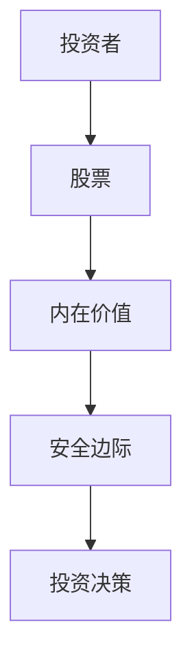
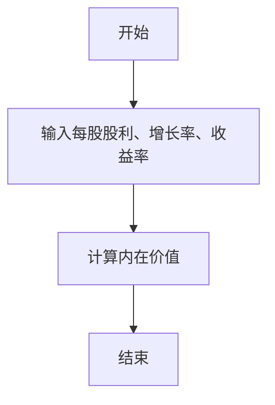
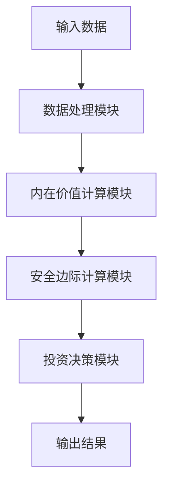
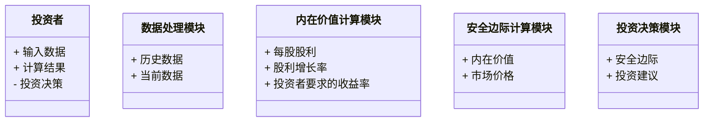

                 


# 格雷厄姆的价值投资公式解析

> 关键词：价值投资，格雷厄姆，内在价值，安全边际，投资公式，股票分析

> 摘要：本文详细解析了格雷厄姆的价值投资公式，从其背景、核心概念、数学模型、算法原理到系统架构和项目实战，全面阐述了如何利用该公式进行股票分析和投资决策。文章还提供了详细的Python代码示例和系统架构设计，帮助读者深入理解并实践价值投资。

---

# 第一部分: 格雷厄姆价值投资公式背景与核心概念

## 第1章: 价值投资的起源与格雷厄姆的贡献

### 1.1 价值投资的起源

#### 1.1.1 投资学的早期发展
投资学作为一门学科，起源于20世纪初。在20世纪20年代至30年代，投资理论开始从简单的“市场先生”概念逐渐发展为更系统的方法。1934年，本杰明·格雷厄姆（Benjamin Graham）与戴维·多德（David Dodd）合著的《证券分析》（Security Analysis）一书，奠定了价值投资的理论基础。

#### 1.1.2 格雷厄姆与巴菲特的师徒关系
格雷厄姆是价值投资的鼻祖，他的学生中包括沃伦·巴菲特（Warren Buffett）。巴菲特将格雷厄姆的价值投资理念发扬光大，使其成为现代投资学的重要流派之一。

#### 1.1.3 价值投资在现代投资学中的地位
价值投资强调以低于内在价值的价格购买股票，注重长期稳健的回报，而非短期市场波动。这一理念在学术界和实务界都具有重要影响，尤其是在2008年金融危机后，价值投资因其稳健性而备受关注。

---

### 1.2 格雷厄姆的投资理念

#### 1.2.1 格雷厄姆的投资哲学
格雷厄姆的投资哲学可以概括为“购买便宜的东西”，即以低于其内在价值的价格买入股票。他认为市场先生（Mr. Market）的情绪波动会导致股票价格偏离其实际价值，投资者应利用这种偏差进行投资。

#### 1.2.2 安全边际的概念
**安全边际（Margin of Safety）**是格雷厄姆提出的一个核心概念，指股票的市场价格低于其内在价值的部分。通过安全边际，投资者可以在一定程度上降低投资风险，因为即使估值出现偏差，也能保证一定的收益空间。

#### 1.2.3 资产评估的核心思想
格雷厄姆的价值投资公式的核心思想是通过分析企业的基本面，计算其内在价值，并与市场价格进行比较，从而决定是否投资。这种方法强调长期视角和稳健的投资策略。

---

## 第2章: 格雷厄姆价值投资公式的数学模型

### 2.1 格雷厄姆价值投资公式的数学表达

#### 内在价值的计算公式
格雷厄姆的内在价值公式基于股利增长模型，假设股利以固定速率增长：
$$\text{内在价值} = \frac{\text{每股股利} \times (1 + g)}{r - g}$$
其中：
- $\text{每股股利}$ 是公司每股的股利；
- $g$ 是股利的年增长率；
- $r$ 是投资者要求的收益率。

#### 安全边际的计算公式
$$\text{安全边际} = \text{内在价值} - \text{市场价格}$$
如果安全边际为正，说明股票价格低于其内在价值，适合买入。

---

### 2.2 格雷厄姆价值投资公式的属性对比

| 属性               | 描述                                                                 |
|--------------------|----------------------------------------------------------------------|
| 输入               | 每股股利、股利增长率、投资者要求的收益率                                 |
| 输出               | 内在价值、安全边际                                                   |
| 适用范围           | 适用于稳定增长的公司，尤其是公用事业等具有稳定收益的行业             |

---

### 2.3 格雷厄姆价值投资公式的ER实体关系图



---

## 第3章: 格雷厄姆价值投资公式的算法原理

### 3.1 内在价值计算算法

#### 算法流程


#### 算法实现
```python
def calculate_intrinsic_value(dividend_per_share, growth_rate, required_return):
    intrinsic_value = (dividend_per_share * (1 + growth_rate)) / (required_return - growth_rate)
    return intrinsic_value
```

---

## 第4章: 价值投资公式在系统中的应用

### 4.1 系统功能设计

#### 数据流图


#### 系统架构图


---

## 第5章: 项目实战

### 5.1 环境安装

#### 安装Python和必要的库
```bash
pip install numpy pandas matplotlib
```

### 5.2 核心实现源代码

```python
import pandas as pd
import numpy as np

def calculate_intrinsic_value(dividend_per_share, growth_rate, required_return):
    return (dividend_per_share * (1 + growth_rate)) / (required_return - growth_rate)

def calculate_margin_ofSafety(intrinsic_value, market_price):
    return intrinsic_value - market_price

# 示例数据
data = {
    '公司': ['公司A', '公司B', '公司C'],
    '每股股利': [1.5, 2.0, 1.8],
    '股利增长率': [0.05, 0.03, 0.04],
    '投资者要求的收益率': [0.10, 0.12, 0.08],
    '市场价格': [20, 30, 25]
}

df = pd.DataFrame(data)

# 计算内在价值和安全边际
df['内在价值'] = df.apply(lambda x: calculate_intrinsic_value(x['每股股利'], x['股利增长率'], x['投资者要求的收益率']), axis=1)
df['安全边际'] = df.apply(lambda x: calculate_margin_ofSafety(x['内在价值'], x['市场价格']), axis=1)

print(df)
```

### 5.3 案例分析与解读

以公司A为例：
- 每股股利：1.5
- 股利增长率：5%
- 投资者要求的收益率：10%
- 市场价格：20

计算其内在价值：
$$\text{内在价值} = \frac{1.5 \times (1 + 0.05)}{0.10 - 0.05} = \frac{1.575}{0.05} = 31.5$$

计算安全边际：
$$\text{安全边际} = 31.5 - 20 = 11.5$$

由于安全边际为正，说明公司A的市场价格低于其内在价值，适合买入。

---

## 第6章: 最佳实践与小结

### 6.1 小结
格雷厄姆的价值投资公式为投资者提供了一种基于基本面分析的股票估值方法。通过计算内在价值和安全边际，投资者可以识别出具有投资价值的股票，从而做出更明智的投资决策。

### 6.2 注意事项
1. 价值投资公式假设股利以固定速率增长，这在现实中可能并不完全准确。
2. 市场价格受多种因素影响，包括市场情绪和宏观经济环境，因此安全边际只是降低风险的工具，而非绝对保证。
3. 投资者需结合其他分析方法，如行业分析和竞争分析，以全面评估公司的投资价值。

### 6.3 拓展阅读
- 《证券分析》（Benjamin Graham & David Dodd）
- 《聪明的投资者》（Warren Buffett）
- 现代投资组合理论（Harry Markowitz）

---

# 作者：AI天才研究院/AI Genius Institute & 禅与计算机程序设计艺术 /Zen And The Art of Computer Programming

