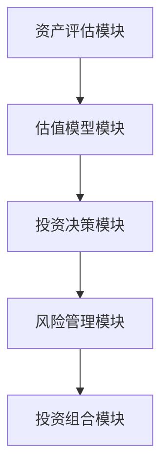
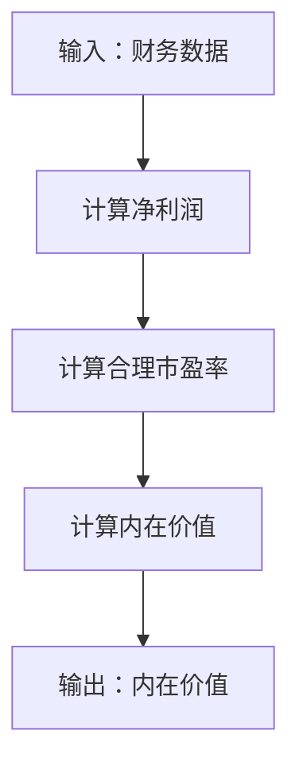

                 


# 格雷厄姆的价值投资原则在不同资产类别中的应用

## 关键词：格雷厄姆，价值投资，资产配置，安全边际，内在价值，投资策略

## 摘要：  
本文系统地探讨了格雷厄姆的价值投资原则在不同资产类别中的应用。通过对股票、债券、房地产等主要资产类别的分析，文章详细阐述了如何在每种资产类别中应用格雷厄姆的安全边际、内在价值等核心理念。同时，本文结合现代投资理论，分析了价值投资在多资产配置中的策略优化，并通过实例和算法模型，展示了如何在实际投资中实现格雷厄姆理论的量化应用。

---

## 第一部分：价值投资的基本概念

### 第1章：价值投资的定义与核心理念  
#### 1.1 价值投资的起源与发展  
- 价值投资的起源：格雷厄姆与多德的价值投资理论  
- 格雷厄姆的价值投资理念：寻找“烟屁股”和“廉价烟蒂”  
- 价值投资的现代发展：从基本面分析到量化投资  

#### 1.2 格雷厄姆的价值投资理论基础  
- 格雷厄姆的“安全边际”概念：内在价值与市场价格的差距  
- 内在价值的计算：企业价值的多维度评估  
- 价值投资的核心原则：买入低于内在价值的资产  

#### 1.3 价值投资与现代投资理论的对比  
- 现代投资组合理论（MPT）的核心思想：分散化与风险收益平衡  
- 价值投资与MPT的异同：长期 vs 短期视角  

---

## 第二部分：价值投资原则在资产类别中的应用

### 第2章：股票投资中的应用  
#### 2.1 股票估值模型的建立  
- 市盈率（P/E）与市净率（P/B）的分析：格雷厄姆的安全边际策略  
- 内在价值的计算公式：  
  $$\text{内在价值} = \text{净利润} \times \text{合理市盈率}$$  
- 格雷厄姆的“三步法”：分析公司财务状况、评估管理层、计算安全边际  

#### 2.2 市场波动与股票投资策略  
- 股票市场的周期性分析：如何在市场低谷期寻找机会  
- 格雷厄姆的防御性投资策略：买入并持有低估资产  

#### 2.3 股票投资组合的构建  
- 投资组合的分散化原则：避免过度集中于单一行业或资产  
- 格雷厄姆的多资产配置策略：股票、债券、现金的合理比例  

### 第3章：债券投资中的应用  
#### 3.1 债券估值的基本原理  
- 债券的内在价值计算：现值法与收益率法  
  $$\text{债券价值} = \sum_{t=1}^{n} \frac{C}{(1+r)^t} + \frac{F}{(1+r)^n}$$  
- 利率风险与信用风险的评估  

#### 3.2 格雷厄姆债券投资策略  
- 高质量债券的选择标准：高信用评级与较长期限  
- 债券投资的安全边际：买入低于面值的债券  

#### 3.3 债券投资组合的优化  
- 债券组合的风险管理：如何在不同经济周期中调整债券持仓  

### 第4章：房地产投资中的应用  
#### 4.1 房地产估值的基本方法  
- 房地产的内在价值评估：租金法与现金流法  
  $$\text{房地产价值} = \frac{\text{年净租金收入}}{\text{资本化率}}$$  
- 地理位置与资产寿命对估值的影响  

#### 4.2 房地产市场的周期性分析  
- 房地产市场的牛熊周期：如何在周期底部寻找投资机会  
- 格雷厄姆的安全边际策略：买入低于重置成本的房地产资产  

#### 4.3 房地产投资组合的构建  
- 房地产投资的风险分散：多区域、多资产类别的配置  

### 第5章：其他资产类别中的应用  
#### 5.1 信托与基金的投资策略  
- 信托产品的估值：现金流分析与风险评估  
- 公募基金与私募基金的比较：主动管理 vs 被动管理  

#### 5.2 黄金与贵金属的投资价值  
- 黄金的内在价值：避险资产与货币金属的双重属性  
- 黄金投资的安全边际：长期持有 vs 短期交易  

#### 5.3 私募股权与另类投资  
- 私募股权的估值挑战：如何评估未上市公司的内在价值  
- 格雷厄姆的长期视角：耐心资本与价值发现  

---

## 第三部分：价值投资的系统分析与架构设计

### 第6章：系统功能设计  
#### 6.1 领域模型的类图  


#### 6.2 系统架构设计  


### 第7章：算法原理与实现  
#### 7.1 内在价值计算算法  


#### 7.2 核心代码实现  
```python
def calculate_intrinsic_value(net_income,合理市盈率):
    return net_income * 合理市盈率

# 示例
net_income = 100
合理市盈率 = 15
intrinsic_value = calculate_intrinsic_value(net_income, 合理市盈率)
print(f"内在价值为：{intrinsic_value}")
```

---

## 第四部分：项目实战与案例分析

### 第8章：股票投资实战  
#### 8.1 环境安装  
- 安装Python与数据分析库（Pandas、NumPy）  

#### 8.2 核心代码实现  
```python
import pandas as pd

def 市盈率计算(eps, 市盈率):
    return eps * 市盈率

# 示例
eps = 5
市盈率 = 10
市盈率值 = 市盈率计算(eps, 市盈率)
print(f"市盈率为：{市盈率值}")
```

#### 8.3 案例分析  
- 某公司的财务数据与市盈率分析  

---

## 第五部分：总结与展望

### 第9章：最佳实践与注意事项  
#### 9.1 投资中的常见误区  
- 过度关注短期波动  
- 忽视基本面分析  

#### 9.2 未来展望  
- 价值投资与人工智能的结合：量化分析与大数据应用  

---

## 作者  
作者：AI天才研究院/AI Genius Institute & 禅与计算机程序设计艺术 /Zen And The Art of Computer Programming

