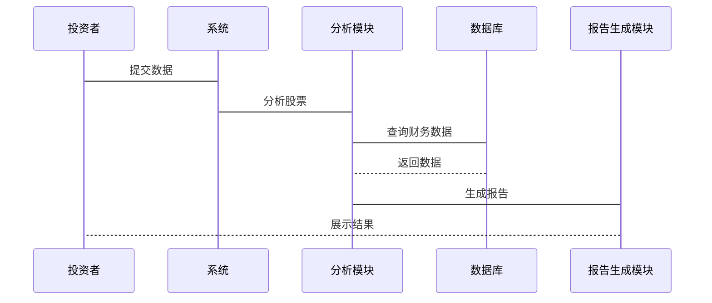

                 


# 格雷厄姆的价值投资原则现代解读

---

## 关键词：
价值投资，格雷厄姆，安全边际，内在价值，现代投资，大数据，人工智能，机器学习

---

## 摘要：
本文旨在通过现代视角重新解读格雷厄姆的价值投资原则，结合大数据和人工智能技术，探讨其在当前投资环境中的应用。文章从价值投资的核心理念出发，分析其在现代金融市场的适应性，并通过数学模型和系统设计，展示如何将传统投资理论与现代技术相结合，以实现更高效、更精准的投资决策。最后，本文通过实际案例分析和代码实现，为读者提供实践指导。

---

## 第一部分：引言

---

### 第1章：价值投资的核心理念

#### 1.1 价值投资的定义与背景

##### 1.1.1 价值投资的起源与核心理念
价值投资是一种以基本面分析为基础的投资策略，起源于20世纪20年代，由本杰明·格雷厄姆（Benjamin Graham）和戴维·多德（David Dodd）提出。其核心理念是通过深入分析企业的财务状况、行业地位和市场前景，寻找那些市场价格低于其内在价值的股票进行投资。

**关键概念：**
- **内在价值**：指企业在正常市场条件下所能产生的现金流的现值。
- **安全边际**：指市场价格与内在价值之间的差异，旨在降低投资风险。

##### 1.1.2 格雷厄姆的价值投资理论概述
格雷厄姆在其著作《证券分析》中提出，投资者应关注企业的基本面，而非市场的短期波动。他认为，市场的价格波动是投资者的敌人，而企业的真实价值才是投资的依据。

##### 1.1.3 现代投资环境的变化与价值投资的适应性
随着金融市场的复杂化和科技的进步，价值投资需要与时俱进。大数据和人工智能技术的应用，为传统价值投资提供了新的工具和方法。

#### 1.2 价值投资的基本原则

##### 1.2.1 安全边际的概念与计算
安全边际是价值投资的核心原则之一。通过计算市场价格与内在价值的差异，投资者可以避免因市场波动带来的损失。

**公式：**
$$ \text{安全边际} = \text{内在价值} - \text{市场价格} $$

##### 1.2.2 内在价值的评估方法
内在价值的计算通常基于现金流折现模型（DCF）。

**公式：**
$$ \text{内在价值} = \sum_{t=1}^{n} \frac{\text{现金流}_t}{(1 + r)^t} $$

其中，$r$为折现率，$n$为预测期数。

##### 1.2.3 股票分析的三重过滤法
格雷厄姆提出，投资者应通过以下三个标准筛选股票：
1. 低市盈率（P/E比率）。
2. 低市净率（P/B比率）。
3. 高股息率。

#### 1.3 价值投资的适用场景与局限性

##### 1.3.1 价值投资在不同市场环境下的表现
在牛市中，价值投资可能表现不佳；在熊市中，其优势更为明显。

##### 1.3.2 价值投资与成长投资的对比
价值投资关注低估值股票，成长投资关注高增长企业。两者在风险和收益上存在差异。

##### 1.3.3 现代市场中价值投资的挑战
信息不对称、高频交易、算法交易等现代金融现象，对传统价值投资提出了挑战。

---

### 第2章：价值投资的现代解读

#### 2.1 大数据与人工智能在价值投资中的应用

##### 2.1.1 数据驱动的股票筛选方法
通过大数据分析，投资者可以更高效地筛选出具有潜在价值的股票。

**流程：**
1. 收集企业财务数据、行业数据和市场数据。
2. 使用机器学习模型进行特征提取和分类。
3. 筛选出符合价值投资标准的股票。

##### 2.1.2 机器学习在投资决策中的作用
机器学习可以用于预测股票价格、识别市场趋势和评估风险。

**算法：**
- 线性回归：预测股票价格。
- 支持向量机（SVM）：分类市场状态。
- 随机森林：评估股票风险。

##### 2.1.3 自然语言处理在财务报表分析中的应用
NLP技术可以用于分析企业财报，提取关键信息。

**步骤：**
1. 对财务报表进行文本清洗。
2. 使用NLP模型（如BERT）提取关键词和情感分析。
3. 生成财务分析报告。

#### 2.2 现代金融工具与价值投资的结合

##### 2.2.1 量化投资与价值投资的融合
量化投资基于算法和模型，与价值投资的内在价值评估相结合。

##### 2.2.2 ETF与指数投资的策略
通过投资指数基金（如标普500），投资者可以间接实践价值投资。

##### 2.2.3 股票质押与融资工具的运用
利用融资工具，投资者可以在低估时期增加仓位，提高收益。

#### 2.3 价值投资的全球化视角

##### 2.3.1 全球市场中的价值投资机会
新兴市场中可能存在更多的价值投资机会。

##### 2.3.2 跨国公司与国际市场的分析
分析跨国公司的全球业务，评估其在不同市场的表现。

##### 2.3.3 货币政策与全球经济对价值投资的影响
货币政策变化会影响市场利率和企业盈利，进而影响股票价格。

---

## 第三部分：价值投资的核心理论

---

### 第3章：安全边际的数学模型与实证分析

#### 3.1 安全边际的计算方法

##### 3.1.1 内在价值的公式推导
$$ \text{内在价值} = \frac{\text{股息} + \text{资本支出} + \text{新债务}}{1 + r} $$

##### 3.1.2 安全边际的量化指标
$$ \text{安全边际率} = \frac{\text{安全边际}}{\text{内在价值}} \times 100\% $$

##### 3.1.3 安全边际与股票价格波动的关系
当市场价格偏离内在价值时，安全边际减小，投资风险增加。

#### 3.2 安全边际的实证分析

##### 3.2.1 历史数据中的安全边际表现
通过对历史数据的分析，验证安全边际与投资收益的相关性。

##### 3.2.2 不同行业中的安全边际差异
金融、能源和消费等行业可能存在不同的安全边际表现。

##### 3.2.3 安全边际与投资回报率的统计分析
通过回归分析，研究安全边际与投资回报率的关系。

---

### 第4章：内在价值的评估与修正

#### 4.1 内在价值的评估方法

##### 4.1.1 现金流折现模型（DCF）的详细解释
$$ \text{DCF} = \frac{\text{自由现金流}}{(1 + r)^n} $$

##### 4.1.2 市盈率与市净率的比较分析
- 市盈率（P/E）：$$ \frac{\text{股价}}{\text{每股收益}} $$
- 市净率（P/B）：$$ \frac{\text{股价}}{\text{每股净资产}} $$

##### 4.1.3 股息率与股息增长模型的应用
$$ \text{股息率} = \frac{\text{股息支付率}}{\text{股价}} $$

#### 4.2 内在价值的修正与更新

##### 4.2.1 经济周期对内在价值的影响
经济衰退可能导致企业盈利下降，内在价值减少。

##### 4.2.2 财务报表调整对内在价值的修正
通过调整财务报表数据，重新计算内在价值。

##### 4.2.3 行业变化对内在价值的影响
行业政策变化、技术进步等因素会影响企业的内在价值。

---

## 第四部分：系统分析与架构设计

---

### 第5章：价值投资分析系统的构建

#### 5.1 问题场景介绍
投资者需要一个系统化的工具，帮助其进行价值投资决策。

#### 5.2 系统功能设计

##### 5.2.1 领域模型（Mermaid类图）


#### 5.3 系统架构设计（Mermaid架构图）


#### 5.4 系统接口设计

##### 5.4.1 数据接口
- 输入接口：接收股票数据、市场数据。
- 输出接口：返回分析结果、投资建议。

##### 5.4.2 用户界面
- 登录界面
- 数据输入界面
- 分析结果展示界面

#### 5.5 系统交互（Mermaid序列图）


---

## 第五部分：项目实战

---

### 第6章：价值投资系统的实现

#### 6.1 环境安装

##### 6.1.1 Python安装与配置
安装Python 3.8及以上版本，安装必要的库（Pandas、NumPy、Scikit-learn）。

#### 6.2 系统核心实现源代码

##### 6.2.1 数据处理模块
```python
import pandas as pd
import numpy as np

def load_data(file_path):
    df = pd.read_csv(file_path)
    return df

def calculate_intrinsic_value(df):
    df['Intrinsic Value'] = df['现金流'] / (1 + df['折现率'])
    return df

def calculate_margin_of_safety(df):
    df['安全边际'] = df['内在价值'] - df['市场价格']
    return df

if __name__ == "__main__":
    data = load_data("股票数据.csv")
    iv_data = calculate_intrinsic_value(data)
    mos_data = calculate_margin_of_safety(iv_data)
    print(mos_data)
```

##### 6.2.2 投资决策模块
```python
from sklearn import linear_model

def train_model(X, y):
    model = linear_model.LinearRegression()
    model.fit(X, y)
    return model

def predict_prices(model, new_X):
    return model.predict(new_X)

if __name__ == "__main__":
    X = df[['市盈率', '市净率']]
    y = df['股价']
    model = train_model(X, y)
    new_X = [[20, 3]]
    prediction = predict_prices(model, new_X)
    print(f"预测股价：{prediction}")
```

#### 6.3 实际案例分析

##### 6.3.1 案例选择
选择一家公司，如苹果（AAPL），分析其内在价值和安全边际。

##### 6.3.2 数据分析与结果解读
通过代码计算苹果的内在价值和安全边际，结合市场环境给出投资建议。

##### 6.3.3 模型优化与验证
通过回测验证模型的准确性和稳定性。

#### 6.4 项目小结

##### 6.4.1 实践收获
通过项目实战，掌握了价值投资的系统化方法。

##### 6.4.2 经验总结
数据质量和模型选择对投资结果影响重大。

##### 6.4.3 未来改进方向
引入更多数据源，优化模型算法。

---

## 第六部分：结论与附录

---

### 第7章：结论与展望

#### 7.1 全文总结
本文通过现代视角重新解读了格雷厄姆的价值投资原则，结合大数据和人工智能技术，探讨了其在当前投资环境中的应用。通过系统设计和项目实战，展示了如何将传统投资理论与现代技术相结合。

#### 7.2 对未来趋势的展望
未来，价值投资将更加依赖于技术驱动，大数据和人工智能将在投资决策中发挥越来越重要的作用。

#### 7.3 最佳实践 tips
- 保持对市场的敏感性。
- 熟练掌握数据分析工具。
- 定期更新投资组合。

---

## 附录

### 附录A：常用投资工具与平台
- **数据获取**：Yahoo Finance、Google Finance、Alpha V
- **数据分析**：Pandas、NumPy、Matplotlib
- **机器学习**：Scikit-learn、XGBoost、TensorFlow

### 附录B：进一步阅读的资源
- 《证券分析》——本杰明·格雷厄姆
- 《投资学》——查理斯·埃利森
- 《Python金融计算》——罗伯特·吉恩

---

## 作者

作者：AI天才研究院/AI Genius Institute & 禅与计算机程序设计艺术 /Zen And The Art of Computer Programming

