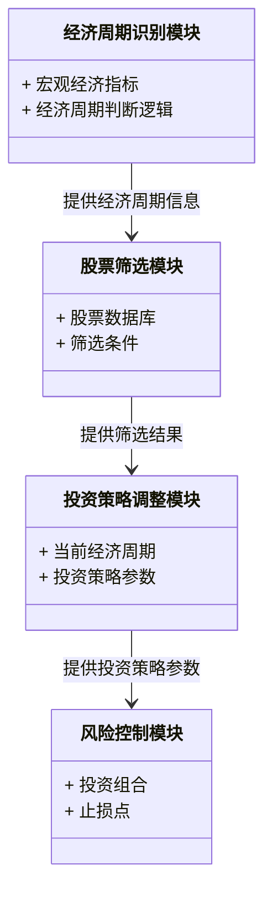

                 


# 格雷厄姆的价值投资在不同经济周期中的应用

## 关键词：价值投资，经济周期，安全边际，内在价值，投资策略

## 摘要：  
格雷厄姆的价值投资方法是一种基于基本面分析的投资策略，强调安全边际和内在价值。本文通过分析不同经济周期的特点，探讨格雷厄姆投资策略在不同经济环境下的应用，包括扩张期、衰退期、萧条期和复苏期的投资机会与风险控制。文章还结合数学模型和实际案例，详细讲解了格雷厄姆投资策略的核心概念，如安全边际、内在价值和安全边际率，并通过系统架构设计和项目实战，展示了如何在实际投资中应用这些策略。

---

## 第一章：价值投资的基本概念与核心理念

### 1.1 价值投资的定义与背景

价值投资是一种以公司基本面分析为基础的投资策略，旨在通过识别市场低估的股票，长期持有，以获得超额收益。其核心理念是购买价格低于公司内在价值的股票，并在市场恢复理性后卖出，获得资本增值。

#### 1.1.1 投资的基本概念与分类  
投资是将资金分配到不同资产（如股票、债券、房地产等）以实现财富增值的行为。根据投资风格，可以分为以下几类：  
1. **价值投资**：寻找市场价格低于内在价值的股票。  
2. **成长投资**：投资于具有高成长潜力的公司。  
3. **指数投资**：通过投资指数基金实现市场平均收益。  
4. **短线交易**：通过频繁买卖赚取短期价差。  

#### 1.1.2 价值投资的起源与发展  
价值投资的鼻祖是本杰明·格雷厄姆（Benjamin Graham），他在20世纪30年代提出了“安全边际”和“内在价值”等核心概念。格雷厄姆的学生戴维·多德（David Dodd）进一步完善了这一理论，为现代价值投资奠定了基础。

#### 1.1.3 格雷厄姆与价值投资的核心理念  
格雷厄姆的价值投资理念可以总结为以下几点：  
- **安全边际**：买入价格低于内在价值的股票，确保投资的安全性。  
- **内在价值**：通过基本面分析计算股票的真实价值。  
- **逆向思维**：在市场恐慌时买入，在市场狂热时卖出。  
- **分散投资**：通过投资组合分散风险，避免过度集中。  

---

## 第二章：不同经济周期的特点与投资策略

### 2.1 经济周期的定义与阶段划分

经济周期通常分为四个阶段：扩张期、衰退期、萧条期和复苏期。每个阶段的特点和投资策略有所不同。

#### 2.1.1 经济周期的四个阶段  
1. **扩张期**：经济增长迅速，企业盈利上升，市场情绪乐观。  
2. **衰退期**：经济增长放缓，企业盈利下降，市场情绪低迷。  
3. **萧条期**：经济陷入停滞，企业盈利大幅下降，市场情绪极度悲观。  
4. **复苏期**：经济开始复苏，企业盈利逐步恢复，市场情绪逐渐乐观。  

#### 2.1.2 不同经济周期的特点  
- **扩张期**：市场情绪高涨，股票估值可能偏高，但优质股票仍可能有投资机会。  
- **衰退期**：市场情绪恐慌，股票估值可能被低估，价值投资机会出现。  
- **萧条期**：市场情绪极度悲观，股票估值极低，是价值投资者的黄金时期。  
- **复苏期**：市场情绪逐渐恢复，股票估值逐步回升，价值投资者逐步退出。  

### 2.2 格雷厄姆投资策略在不同经济周期中的应用

#### 2.2.1 扩张期的投资机会与风险控制  
- **投资机会**：选择低市盈率（P/E）和低市净率（P/B）的股票，避免追高。  
- **风险控制**：分散投资，避免过度集中于高估值股票，设置止损点。  

#### 2.2.2 衰退期与萧条期的价值投资机会  
- **衰退期**：市场恐慌，股票价格可能大幅低于内在价值，适合买入优质股票。  
- **萧条期**：市场情绪极度悲观，股票价格可能被严重低估，是价值投资者的黄金机会。  

#### 2.2.3 复苏期的投资策略调整  
- **策略调整**：逐步退出低估值股票，转向高成长股票或指数基金。  
- **风险控制**：避免过度乐观，逐步降低仓位，锁定利润。  

---

## 第三章：格雷厄姆价值投资的核心概念与联系

### 3.1 核心概念原理

#### 3.1.1 安全边际的计算公式  
安全边际是价值投资的核心概念之一，用于衡量股票的市场价格与内在价值之间的差距。公式如下：  
$$ \text{安全边际} = \text{内在价值} - \text{市场价格} $$  

#### 3.1.2 内在价值的评估方法  
内在价值是股票的真实价值，可以通过以下公式计算：  
$$ V = \frac{E}{k} $$  
其中，V为内在价值，E为每股收益，k为折现率。  

#### 3.1.3 股票价格与市场情绪的关系  
股票价格不仅取决于内在价值，还受到市场情绪的影响。市场情绪可以通过投资者的心理和行为分析来判断，例如通过观察市场成交量和投资者情绪指标。  

---

## 第四章：系统分析与架构设计方案

### 4.1 问题场景介绍

假设我们希望开发一个基于格雷厄姆价值投资策略的股票筛选系统，该系统能够根据经济周期的变化，自动调整投资策略并筛选出符合条件的股票。

### 4.2 系统功能设计

#### 4.2.1 系统功能模块  
1. **经济周期识别模块**：通过宏观经济指标（如GDP增长率、失业率、通胀率等）判断当前经济周期所处的阶段。  
2. **股票筛选模块**：根据当前经济周期，筛选出符合条件的股票（如低市盈率、低市净率、高股息率等）。  
3. **投资策略调整模块**：根据经济周期和市场环境，调整投资策略（如增加防御性股票的权重，减少周期性股票的权重）。  
4. **风险控制模块**：通过分散投资和设置止损点，控制投资组合的风险。  

#### 4.2.2 领域模型（Mermaid类图）  


### 4.3 系统架构设计（Mermaid架构图）


### 4.4 系统接口设计

- **接口1：获取宏观经济指标**  
  - 输入：无  
  - 输出：当前宏观经济指标（如GDP增长率、失业率等）  

- **接口2：筛选股票**  
  - 输入：筛选条件（如低市盈率、低市净率）  
  - 输出：符合条件的股票列表  

---

## 第五章：项目实战

### 5.1 环境安装

- **安装Python环境**：使用Anaconda或Pyenv安装Python 3.8及以上版本。  
- **安装必要的库**：使用pip安装numpy、pandas、scipy等库。  
  ```bash
  pip install numpy pandas scipy
  ```

### 5.2 核心代码实现

#### 5.2.1 经济周期识别模块

```python
import numpy as np
import pandas as pd

def get_macro_indicators():
    # 获取宏观经济指标（假设）
    gdp_growth = 2.5
    unemployment_rate = 5.2
    inflation_rate = 1.8
    return gdp_growth, unemployment_rate, inflation_rate

# 示例数据
gdp_growth, unemployment_rate, inflation_rate = get_macro_indicators()
print(f"GDP增长率：{gdp_growth}%")
print(f"失业率：{unemployment_rate}%")
print(f"通胀率：{inflation_rate}%")
```

#### 5.2.2 股票筛选模块

```python
import pandas as pd

def screen_stocks():
    # 假设我们有一个股票数据库
    stock_data = pd.DataFrame({
        '股票代码': ['AAPL', 'MSFT', 'GOOGL', 'AMZN', 'FB'],
        '市盈率': [15, 18, 22, 28, 20],
        '市净率': [3.5, 4.2, 5.1, 6.8, 4.8]
    })
    # 筛选条件：市盈率 < 20 且市净率 < 5
    filtered_stocks = stock_data[(stock_data['市盈率'] < 20) & (stock_data['市净率'] < 5)]
    return filtered_stocks

# 示例筛选
filtered_stocks = screen_stocks()
print("符合条件的股票：")
print(filtered_stocks)
```

#### 5.2.3 投资策略调整模块

```python
def adjust_strategy(economic_stage):
    if economic_stage == '扩张期':
        return {'防御性股票': 30%, '周期性股票': 40%, '成长股': 30%}
    elif economic_stage == '衰退期':
        return {'防御性股票': 50%, '周期性股票': 20%, '成长股': 30%}
    elif economic_stage == '萧条期':
        return {'防御性股票': 60%, '周期性股票': 10%, '成长股': 30%}
    elif economic_stage == '复苏期':
        return {'防御性股票': 40%, '周期性股票': 30%, '成长股': 30%}

# 示例调整
economic_stage = '衰退期'
strategy = adjust_strategy(economic_stage)
print(f"当前经济阶段：{economic_stage}")
print(f"投资策略：{strategy}")
```

#### 5.2.4 风险控制模块

```python
def risk_management(portfolio_value, stop_loss):
    if portfolio_value < stop_loss:
        print("触发止损，卖出所有股票")
    else:
        print("未触发止损，继续持有")

# 示例风险控制
portfolio_value = 1000000
stop_loss = 0.9 * portfolio_value
risk_management(portfolio_value, stop_loss)
```

---

## 第六章：总结与展望

### 6.1 最佳实践 tips

- **长期投资**：价值投资需要耐心，避免短期波动的干扰。  
- **分散投资**：通过分散投资降低风险，避免过度集中。  
- **定期调整**：根据经济周期的变化，定期调整投资策略。  
- **关注基本面**：始终关注公司的基本面，选择具有持续盈利能力和良好管理的公司。  

### 6.2 小结

格雷厄姆的价值投资策略是一种基于基本面分析的投资方法，强调安全边际和内在价值。在不同经济周期中，投资者需要根据市场环境调整投资策略，选择合适的投资标的，并通过分散投资和风险控制降低投资风险。

### 6.3 注意事项

- **市场情绪**：市场情绪可能影响股票价格，但长期来看，基本面才是决定股票价值的核心因素。  
- **数据准确性**：在实际投资中，需要确保数据的准确性和及时性，避免因数据误差导致的投资失误。  
- **经济周期判断**：经济周期的判断可能受到主观因素的影响，投资者需要结合多种指标进行综合判断。  

### 6.4 拓展阅读

- 《证券分析》——本杰明·格雷厄姆  
- 《投资学原理》——威廉·夏普  
- 《价值投资实战手册》——张磊  

---

## 作者：AI天才研究院/AI Genius Institute & 禅与计算机程序设计艺术 /Zen And The Art of Computer Programming

---

本文通过详细分析格雷厄姆的价值投资策略在不同经济周期中的应用，结合数学模型、系统架构和实际案例，为投资者提供了理论和实践上的双重指导。希望读者能够通过本文更好地理解价值投资的核心理念，并在实际投资中灵活运用这些策略。

