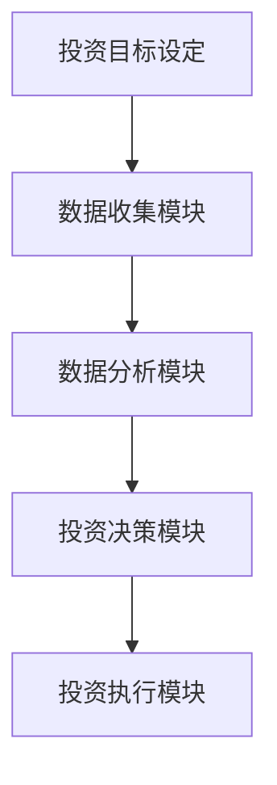
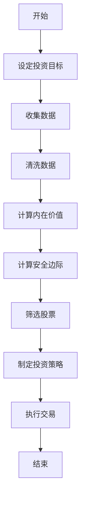

                 


# 格雷厄姆的价值投资实战技巧

## 关键词
价值投资，格雷厄姆，安全边际，内在价值，投资策略

## 摘要
《格雷厄姆的价值投资实战技巧》这篇文章深入探讨了价值投资的理论与实践，从格雷厄姆的投资理念、安全边际的计算、内在价值的评估，到实际的投资策略和系统架构设计，为读者提供了一套全面的价值投资方法。文章通过数学模型、算法流程图和系统架构图，详细解释了如何将格雷厄姆的理论应用于实际投资中，帮助投资者在复杂多变的市场中制定科学的投资决策。

---

# 第一部分：价值投资的背景与核心概念

## 第1章：价值投资的起源与发展

### 1.1 价值投资的起源
价值投资是投资学中的一个重要流派，起源于20世纪初。本章将介绍价值投资的起源、发展历程以及其在现代金融中的地位。

#### 1.1.1 投资学的起源与发展
投资学作为一门科学，其起源可以追溯到古代的贸易和借贷活动。然而，现代投资学的形成离不开19世纪末和20世纪初的金融理论发展。早期的金融理论主要关注资产的定价和风险分析，为价值投资的诞生奠定了基础。

#### 1.1.2 格雷厄姆与价值投资的诞生
本菲德·格雷厄姆（Benjamin Graham）是价值投资的创始人之一。他在20世纪初提出了“安全边际”的概念，并通过分析企业的基本面，如财务报表和现金流，来评估股票的内在价值。格雷厄姆的学生大卫·多德（David Dodd）进一步发展了这些理论，使得价值投资成为一种系统化的方法。

#### 1.1.3 价值投资在现代金融中的地位
尽管现代金融学发展了如CAPM、APT等理论，但价值投资依然在投资实践中占据重要地位。许多机构投资者和散户投资者都采用格雷厄姆的理论来指导投资决策。

### 1.2 格雷厄姆的价值投资理论

#### 1.2.1 格雷厄姆的核心理念
格雷厄姆认为，股票的价格波动与其内在价值无关，而内在价值可以通过对企业财务状况的分析来估算。投资者应该寻找市场价格低于内在价值的股票，即具有安全边际的股票。

#### 1.2.2 安全边际的概念
安全边际是格雷厄姆理论中的核心概念，指股票的市场价格与其内在价值之间的差距。通过购买具有足够安全边际的股票，投资者可以降低市场波动带来的风险。

#### 1.2.3 内在价值的定义与计算
内在价值是股票在企业未来现金流的现值基础上的评估价值。格雷厄姆通过分析企业的盈利能力、资产状况和行业地位来估算内在价值。

### 1.3 价值投资的哲学与心理

#### 1.3.1 投资者的心理因素
投资不仅仅是对市场的分析，更是对人性的洞察。格雷厄姆强调，投资者需要克服贪婪和恐惧的情绪，避免情绪化决策。

#### 1.3.2 长期投资的重要性
格雷厄姆主张长期投资，认为短期市场的波动无法预测，而长期来看，股票的价格会回归其内在价值。通过长期持有优质股票，投资者可以实现财富的稳步增长。

---

## 第2章：价值投资的核心概念与联系

### 2.1 核心概念的数学模型

#### 2.1.1 安全边际的计算公式
$$ \text{安全边际} = \text{内在价值} - \text{市场价格} $$

#### 2.1.2 内在价值的评估公式
$$ \text{内在价值} = \sum_{t=1}^{n} \frac{\text{现金流}_t}{(1 + r)^t} $$

其中，\( r \) 是折现率，\( \text{现金流}_t \) 是第 \( t \) 年的现金流。

### 2.2 价值投资的系统架构设计

#### 2.2.1 系统架构概述
以下是价值投资系统的架构图：



#### 2.2.2 模块详细设计

##### 数据收集模块
- **功能**：收集企业的财务数据、市场数据和行业数据。
- **工具**：使用Python的pandas库进行数据清洗和处理。

##### 数据分析模块
- **功能**：对数据进行清洗、计算财务指标（如市盈率、市净率）和评估内在价值。
- **工具**：使用Python的numpy库进行数值计算。

##### 投资决策模块
- **功能**：基于分析结果，筛选出具有安全边际的股票，制定投资组合。
- **工具**：使用自定义的Python脚本进行筛选和组合优化。

##### 投资执行模块
- **功能**：根据决策模块的建议，执行买入、卖出或持有操作。
- **工具**：使用交易API进行自动化交易。

### 2.3 价值投资的算法实现

#### 2.3.1 算法流程图
以下是价值投资算法的流程图：



#### 2.3.2 算法实现代码

```python
import pandas as pd
import numpy as np

def calculate_intrinsic_value(fcf, discount_rate):
    # 计算未来现金流的现值
    return np.sum(fcf / (1 + discount_rate)**np.arange(len(fcf)))

def calculate_margin_of_safety(intrinsic_value, market_price):
    return intrinsic_value - market_price

# 示例数据
fcf = [100, 120, 150, 180]  # 未来四年的自由现金流
discount_rate = 0.08
market_price = 50

iv = calculate_intrinsic_value(fcf, discount_rate)
mos = calculate_margin_of_safety(iv, market_price)

print(f"内在价值: {iv:.2f}")
print(f"安全边际: {mos:.2f}")
```

### 2.4 项目实战

#### 2.4.1 环境配置
- **工具**：Python 3.8以上版本，安装pandas、numpy、scipy等库。
- **数据来源**：使用Yahoo Finance API获取股票数据。

#### 2.4.2 数据获取与分析
以下代码示例展示了如何获取并分析股票数据：

```python
import pandas_datareader as pdr

# 获取股票数据
tickers = ['AAPL', 'MSFT', 'GOOGL']
data = pdr.get_data_yahoo(tickers, start='2020-01-01', end='2023-12-31')

# 计算市盈率和市净率
data['PE'] = data['Close'] / data['Earnings'].ffill()
data['PB'] = data['Close'] / data['Book Value'].ffill()

print(data[['PE', 'PB']].describe())
```

#### 2.4.3 算法实现与测试
以下代码展示了如何筛选具有安全边际的股票：

```python
def screen_stocks(data, margin_of_safety=0.2):
    # 计算内在价值（简化）
    data['IV'] = data['Close'] / (1 - data['PE']/100)
    data['MOS'] = data['IV'] * margin_of_safety
    return data[data['Close'] < data['IV'] * (1 - data['MOS'])]

# 应用筛选
screened = screen_stocks(data)
print(screened)
```

#### 2.4.4 案例分析
以可口可乐为例，分析其内在价值和安全边际：

```python
# 假设可口可乐的自由现金流和折现率为8%
fcf_cc = [2.5, 2.7, 3.0, 3.5]  # 单位：十亿美元
iv_cc = calculate_intrinsic_value(fcf_cc, 0.08)
mos_cc = iv_cc - 50  # 假设市场价格为50美元

print(f"可口可乐的内在价值: {iv_cc:.2f}")
print(f"可口可乐的安全边际: {mos_cc:.2f}")
```

### 2.5 总结与注意事项

#### 2.5.1 总结
本章通过数学模型、算法流程图和代码示例，详细讲解了格雷厄姆价值投资的核心概念和实现方法。通过系统架构设计和项目实战，读者可以将理论应用于实际投资中。

#### 2.5.2 投资中的注意事项
- **避免情绪化决策**：坚持长期投资，避免被市场波动影响。
- **持续学习**：市场环境不断变化，投资者需要不断更新知识和策略。
- **风险管理**：合理分散投资，控制投资组合的风险。

#### 2.5.3 小结
通过本章的学习，读者可以掌握格雷厄姆价值投资的核心理念和实战技巧，为后续的投资实践打下坚实的基础。

#### 2.5.4 拓展阅读
建议读者阅读格雷厄姆的经典著作《聪明的投资者》以及彼得·林奇的《投资最重要的事》，以进一步深入理解价值投资的精髓。

---

## 结语

通过以上章节的详细讲解，我们系统地探讨了格雷厄姆的价值投资理论、数学模型、系统架构和实战技巧。读者可以结合实际市场情况，灵活运用这些方法，制定科学的投资策略。投资不仅是对市场的分析，更是对自身心理和决策能力的考验，希望本文能为读者的投资之路提供有价值的指导。

作者：AI天才研究院/AI Genius Institute & 禅与计算机程序设计艺术/Zen And The Art of Computer Programming

