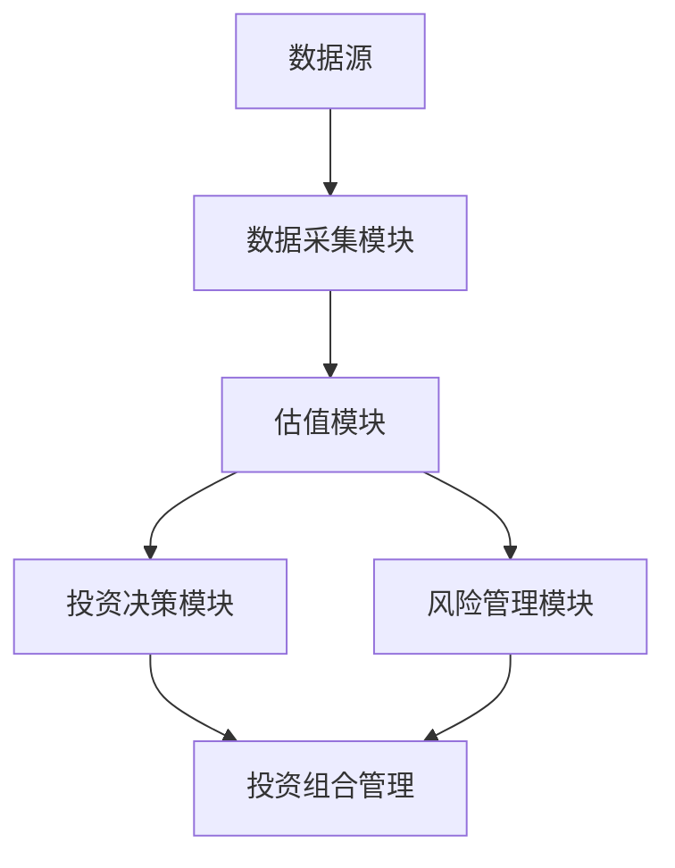

                 


# 格雷厄姆的价值投资实践指南

## 关键词：价值投资，格雷厄姆，内在价值，安全边际，投资策略，数学模型

## 摘要：  
《格雷厄姆的价值投资实践指南》系统介绍了格雷厄姆的价值投资理论，从核心概念到数学模型，从系统架构到实际案例，全面解析了价值投资的实践方法。文章首先介绍了价值投资的背景与发展，接着深入探讨了价值投资的核心理念和关键原则，包括内在价值、安全边际以及市场先生等核心概念。随后，文章详细阐述了价值投资的算法原理和数学模型，包括内在价值计算公式和投资组合优化方法。最后，文章通过系统架构设计和实际项目案例，展示了如何在实际投资中应用这些理论，提供了丰富的实战经验和最佳实践建议。

---

# 第一部分: 价值投资的背景与发展

## 第1章: 价值投资的起源与发展

### 1.1 价值投资的起源
- 1.1.1 投资学的起源与发展
- 1.1.2 格雷厄姆与价值投资的诞生
- 1.1.3 价值投资在现代金融中的地位

### 1.2 格雷厄姆的价值投资理论
- 1.2.1 安全边际的概念与计算
- 1.2.2 内在价值的定义与评估
- 1.2.3 市场先生的理性与非理性

### 1.3 价值投资与传统投资的区别
- 1.3.1 传统投资方法概述
- 1.3.2 价值投资的独特性
- 1.3.3 价值投资的适用场景

---

# 第二部分: 价值投资的核心概念与联系

## 第2章: 核心概念的原理与联系

### 2.1 核心概念的原理
- 2.1.1 安全边际的数学模型
- 2.1.2 内在价值的评估方法
- 2.1.3 市场波动的周期性规律

### 2.2 核心概念的对比分析
- 2.2.1 安全边际与风险控制的对比
- 2.2.2 内在价值与市场价值的对比
- 2.2.3 长期持有与短期交易的对比

## 第3章: 核心概念的数学模型与公式

### 3.1 内在价值的计算公式
- 3.1.1 格雷厄姆的内在价值公式
$$ V = \frac{E}{(1 + r)^n} $$
其中，\( V \) 是内在价值，\( E \) 是未来现金流的现值，\( r \) 是折现率，\( n \) 是时间跨度。

### 3.2 安全边际的计算公式
- 3.2.1 安全边际的计算方法
$$ \text{安全边际} = \text{内在价值} - \text{市场价格} $$

### 3.3 投资组合的优化公式
- 3.3.1 马科维茨投资组合理论
$$ \min_w \left( w^T \Sigma w \right) $$
其中，\( w \) 是投资组合的权重向量，\( \Sigma \) 是资产之间的协方差矩阵。

---

# 第三部分: 价值投资的算法原理与系统架构

## 第4章: 价值投资的算法原理

### 4.1 内在价值评估的算法流程
1. 数据收集与清洗
2. 财务指标计算（如市盈率、市净率、股息率）
3. 估值模型的选择与应用（如DCF模型）
4. 安全边际计算与投资决策

### 4.2 算法的数学模型
- DCF模型：$$ V = \sum_{t=1}^{n} \frac{CF_t}{(1 + r)^t} + \frac{TV}{(1 + r)^n} $$
其中，\( CF_t \) 是第t年的自由现金流，\( TV \) 是终值。

## 第5章: 价值投资的系统架构设计

### 5.1 系统功能设计
- 数据采集模块：收集公司财务数据和市场数据。
- 估值模块：计算内在价值和安全边际。
- 投资决策模块：基于安全边际生成投资策略。
- 风险管理模块：监控投资组合的风险。

### 5.2 系统架构图


---

# 第四部分: 项目实战与最佳实践

## 第6章: 项目实战

### 6.1 环境安装与数据准备
- 安装Python和必要的库（如Pandas、NumPy、Matplotlib）
- 数据来源：Yahoo Finance或 Bloomberg

### 6.2 核心实现
```python
import pandas as pd
import numpy as np

def calculate_intrinsic_value(enterprise_value, free_cash_flow, discount_rate, growth_rate, years):
    # 计算未来现金流现值
    pv = 0
    for i in range(years):
        cash_flow = enterprise_value * (1 + growth_rate) ** i
        pv += cash_flow / (1 + discount_rate) ** i
    return pv

# 示例计算
enterprise_value = 1000000
free_cash_flow = 100000
discount_rate = 0.08
growth_rate = 0.05
years = 5

intrinsic_value = calculate_intrinsic_value(enterprise_value, free_cash_flow, discount_rate, growth_rate, years)
print("内在价值：", intrinsic_value)
```

### 6.3 实际案例分析
- 案例：某公司财务数据分析与估值
- 步骤：数据清洗、模型应用、结果解读

## 第7章: 最佳实践与小结

### 7.1 小结
- 价值投资的核心在于基本面分析和长期持有
- 安全边际是保护投资者的重要工具
- 数学模型为投资决策提供科学依据

### 7.2 注意事项
- 数据质量的重要性
- 模型假设的合理性
- 市场环境的变化影响

### 7.3 拓展阅读
- 格雷厄姆的《聪明的投资者》
- 彼得·林奇的《投资心理》

---

# 结语

价值投资不仅是一种投资方法，更是一种投资哲学。通过系统学习和实践，投资者可以更好地理解市场波动，做出更明智的投资决策。希望本书能够为读者提供有价值的指导，帮助他们在投资领域取得成功。

---

**作者：AI天才研究院/AI Genius Institute & 禅与计算机程序设计艺术/Zen And The Art of Computer Programming**

