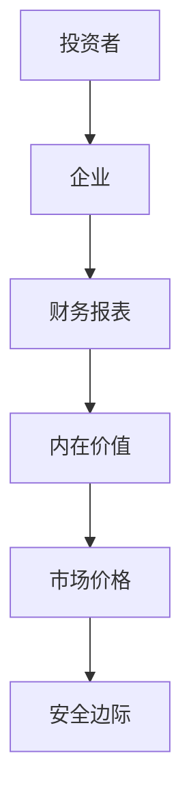
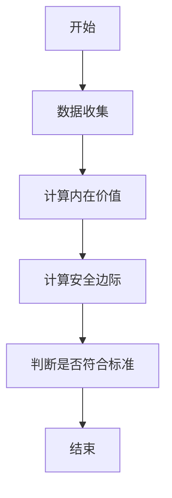
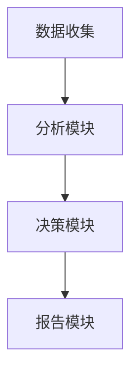

                 


# 格雷厄姆的价值投资者修炼之道

## 关键词：
- 价值投资、格雷厄姆、内在价值、安全边际、投资策略、股票分析

## 摘要：
本文深入探讨了格雷厄姆的价值投资理念，从核心概念到实战分析，帮助读者系统地理解和掌握价值投资的方法。通过详细解析内在价值、安全边际等关键概念，并结合实际案例和系统架构设计，本文为投资者提供了从理论到实践的完整指导。

---

# 第一部分: 格雷厄姆的价值投资基础

## 第1章: 价值投资的起源与核心理念

### 1.1 价值投资的起源
#### 1.1.1 投资学的起源与发展
现代投资学起源于20世纪初，经历了从传统金融学到行为金融学的演变。格雷厄姆的价值投资理念诞生于1929年大萧条时期，当时市场恐慌导致股票价格暴跌，投资者对理性分析的需求迫切。

#### 1.1.2 格雷厄姆与价值投资的诞生
本杰明·格雷厄姆（Benjamin Graham）是价值投资的奠基人，他在1934年出版的《证券分析》一书中系统阐述了价值投资的方法。他的理念强调安全边际和内在价值，为后来的投资者提供了重要的理论基础。

#### 1.1.3 价值投资的核心理念与原则
价值投资的核心理念是寻找市场价格低于内在价值的股票。格雷厄姆提出，投资者应以企业的基本面分析为基础，寻找具有安全边际的投资标的。

### 1.2 价值投资与其他投资方法的对比
#### 1.2.1 股票投资的主要方法概述
股票投资的主要方法包括基本面分析、技术分析和行为分析。价值投资侧重于基本面分析，而技术分析则关注价格走势。

#### 1.2.2 价值投资与成长投资的异同
价值投资关注低估的股票，而成长投资关注高增长的公司。两者都基于基本面分析，但侧重点不同。

#### 1.2.3 价值投资与技术分析的对比
价值投资注重内在价值，技术分析则关注价格和成交量的变化。两者方法不同，但可以互补。

### 1.3 价值投资的哲学与心理
#### 1.3.1 投资中的心理陷阱
投资者常陷入贪婪和恐惧的情绪陷阱，价值投资强调理性分析，避免情绪化决策。

#### 1.3.2 格雷厄姆的"安全边际"概念
安全边际是市场价格与内在价值的差距，确保投资的安全性。格雷厄姆认为，安全边际提供了抵御市场波动的缓冲。

#### 1.3.3 投资中的耐心与纪律
价值投资需要长期持有，耐心等待市场回归理性。纪律性是保持投资策略一致的关键。

## 第2章: 价值投资的核心概念与联系

### 2.1 核心概念原理
#### 2.1.1 内在价值的定义与计算
内在价值是企业未来现金流的现值，常用DCF模型计算。公式为：
$$
V = \frac{CF}{(1+r)^t}
$$
其中，CF为现金流，r为折现率，t为时间。

#### 2.1.2 市场价值与内在价值的关系
市场价值受情绪影响，可能偏离内在价值。价值投资寻找市场价值低于内在价值的机会。

#### 2.1.3 安全边际的数学模型
安全边际=内在价值-市场价格。公式为：
$$
Margin = V - P
$$
其中，V为内在价值，P为市场价格。

### 2.2 核心概念对比表格
| 概念       | 属性               | 描述                                   |
|------------|--------------------|----------------------------------------|
| 内在价值   | 计算方式           | 现金流折现法                           |
| 市场价值   | 受市场情绪影响     | 受投资者情绪和市场波动影响             |
| 安全边际   | 计算方式           | 内在价值与市场价值的差额               |

### 2.3 ER实体关系图


---

# 第二部分: 价值投资的算法与系统设计

## 第3章: 价值投资的算法原理

### 3.1 算法原理讲解
#### 3.1.1 基于价值投资的股票筛选算法
价值投资筛选算法分为三步：数据收集、内在价值计算、安全边际判断。

#### 3.1.2 算法流程图


#### 3.1.3 算法实现代码
```python
def calculate_intrinsic_value(revenue, growth_rate, discount_rate):
    return revenue / (1 + growth_rate) ** discount_rate
```

### 3.2 算法数学模型
价值投资算法基于DCF模型，公式为：
$$
V = \frac{CF}{(1+r)^t}
$$

### 3.3 算法优化与改进
通过引入宏观经济指标和行业分析，优化DCF模型。改进后的公式为：
$$
V' = \frac{CF}{(1+r)^t} \times (1 + macro\_adjustment)
$$

## 第4章: 价值投资的系统架构设计

### 4.1 系统分析与设计
#### 4.1.1 价值投资系统的功能需求
系统需实现数据收集、分析、决策和报告功能。

#### 4.1.2 系统功能设计
系统功能包括数据收集模块、分析模块、决策模块和报告模块。

#### 4.1.3 系统架构图


### 4.2 系统架构设计
系统架构采用分层设计，包括数据层、业务逻辑层和用户界面层。

### 4.3 系统交互设计
系统交互包括数据输入、分析执行、结果展示和报告生成。

---

# 第三部分: 价值投资的实战与案例

## 第5章: 价值投资的项目实战

### 5.1 环境安装
安装必要的Python库，如pandas和numpy。

### 5.2 核心代码实现
```python
import pandas as pd
import numpy as np

def calculate_intrinsic_value(fcf, growth_rate, discount_rate):
    return fcf / (1 + discount_rate) ** growth_rate

data = pd.read_csv('financial_data.csv')
data['intrinsic_value'] = data.apply(lambda x: calculate_intrinsic_value(x['FCF'], x['growth_rate'], x['discount_rate']), axis=1)
```

### 5.3 代码应用解读
代码实现现金流的折现计算，生成内在价值列。

### 5.4 实际案例分析
以亚马逊为例，分析其内在价值和安全边际。

## 第6章: 价值投资的总结与展望

### 6.1 最佳实践
坚持基本面分析，保持耐心和纪律。

### 6.2 小结
价值投资需要系统的方法和长期的耐心。

### 6.3 注意事项
避免情绪化投资，定期复盘和调整。

### 6.4 拓展阅读
推荐阅读《证券分析》和《聪明的投资者》。

---

# 作者：AI天才研究院 & 禅与计算机程序设计艺术

