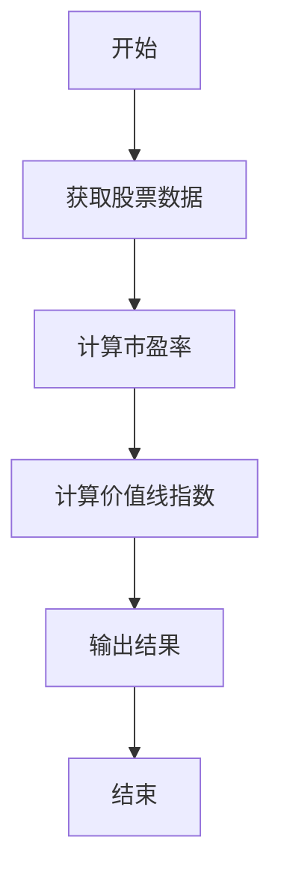

                 


# 格雷厄姆的价值线概念及其应用

---

**关键词**：本杰明·格雷厄姆、价值线、投资理论、市盈率、股票估值、投资分析

---

**摘要**：  
本篇文章深入探讨了格雷厄姆的价值线概念，从其理论基础、数学模型到实际应用进行了系统性分析。通过对比传统投资理论，结合实际案例，揭示了价值线在投资决策中的独特价值，并探讨了其局限性及未来改进方向。文章旨在为投资者提供一种基于价值线的科学投资方法，帮助他们在复杂多变的市场中做出明智决策。

---

# 第1章: 价值线概念概述

## 1.1 价值线的起源与背景

### 1.1.1 投资学中的价值发现问题  
在投资领域，估值问题一直是核心挑战。投资者如何准确评估一只股票的内在价值，从而做出买入或卖出的决策？传统的方法往往依赖市场情绪和短期波动，难以捕捉长期价值。  

### 1.1.2 格雷厄姆的价值投资理论  
本杰明·格雷厄姆作为价值投资之父，提出了“安全边际”和“ intrinsic value（内在价值）”的概念。他认为，股票的价值应基于公司的基本面分析，而非市场情绪。  

### 1.1.3 价值线概念的提出与演进  
价值线概念是格雷厄姆理论的重要组成部分，它通过量化方法，将市场中股票的估值与实际表现进行对比，帮助投资者识别被低估的股票。  

## 1.2 价值线的定义与基本原理

### 1.2.1 价值线的定义  
价值线指数（VLI）是一种衡量市场中股票估值与实际价格差异的指标。它通过计算市盈率（P/E比率）的平均值，判断市场整体的估值水平。  

### 1.2.2 价值线的核心原理  
价值线基于一个简单的假设：市场中大部分股票的市盈率会在一定范围内波动。当市盈率低于平均值时，股票可能被低估；反之，若高于平均值，则可能被高估。  

### 1.2.3 价值线与传统投资分析的区别  
与技术分析不同，价值线注重基本面分析，强调长期价值而非短期波动。与基本面分析相比，价值线提供了一种量化工具，便于投资者快速评估市场整体估值水平。  

## 1.3 价值线的应用范围与边界

### 1.3.1 价值线的主要应用场景  
- 机构投资者用于制定投资策略。  
- 个人投资者用于选股和买卖决策。  
- 用于市场周期分析，判断市场整体估值水平。  

### 1.3.2 价值线的适用边界与限制  
- 适用于成熟市场，新兴市场可能存在数据不足的问题。  
- 无法预测短期市场波动，仅适用于长期投资决策。  

### 1.3.3 价值线与其他投资工具的对比  
通过对比技术分析、基本面分析和行为金融学，价值线的优势在于其量化工具和长期视角。  

---

# 第2章: 价值线的数学模型与算法原理

## 2.1 价值线的数学模型

### 2.1.1 价值线的基本公式  
价值线指数（VLI）的计算公式为：  
$$ VLI = \frac{\sum_{i=1}^{N} \frac{P_i}{E_i}}{N} \times 100 $$  
其中，$P_i$ 为第$i$只股票的价格，$E_i$ 为市盈率，$N$ 为股票总数。  

### 2.1.2 修正的价值线公式  
考虑到行业差异，修正后的价值线公式引入行业基准：  
$$ VLI' = \frac{\sum_{i=1}^{N} \frac{P_i}{E_i \times W_i}}{N} \times 100 $$  
其中，$W_i$ 为行业权重。  

## 2.2 价值线的算法实现

### 2.2.1 算法流程图  


### 2.2.2 Python代码实现  
```python
import pandas as pd

def calculate_value_line(data):
    data['PE'] = data['Price'] / data['Earnings']
    vli = (data['PE'].mean() * 100).round(2)
    return vli

# 示例数据
data = {
    'Price': [50, 60, 70],
    'Earnings': [25, 30, 35]
}
df = pd.DataFrame(data)
result = calculate_value_line(df)
print(f"价值线指数为: {result}%")
```

## 2.3 价值线的数学公式

### 2.3.1 价值线的基本公式  
$$ V = \frac{P}{E} $$
其中，$V$ 表示价值线指数，$P$ 表示股价，$E$ 表示市盈率。  

### 2.3.2 修正的价值线公式  
$$ V' = \frac{P}{E} \times \text{行业基准} $$  

---

# 第3章: 价值线与投资理论的对比分析

## 3.1 价值线与基本面分析的对比

### 3.1.1 基本面分析的核心要素  
基本面分析关注公司的财务状况、盈利能力、行业地位等。  

### 3.1.2 价值线的对比分析  
价值线通过量化市盈率，提供了一种快速评估整体市场估值的方法。  

## 3.2 价值线与技术分析的对比

### 3.2.1 技术分析的核心方法  
技术分析依赖价格走势、成交量等市场数据。  

### 3.2.2 价值线的对比分析  
价值线注重基本面，而技术分析关注市场情绪。  

## 3.3 价值线与其他投资工具的对比

### 3.3.1 对比表格  
| 指标 | 价值线 | 技术分析 | 基本面分析 |
|------|--------|----------|------------|
| 着重 | 市盈率 | 价格走势 | 财务数据    |
| 适用 | 长期估值 | 短期波动 | 公司质量   |

---

# 第4章: 价值线的计算方法与案例分析

## 4.1 价值线的计算步骤

### 4.1.1 数据收集  
收集目标股票的市盈率、股价等数据。  

### 4.1.2 计算平均市盈率  
$$ \text{平均市盈率} = \frac{\sum E_i}{N} $$  

### 4.1.3 计算价值线指数  
$$ VLI = \frac{\sum \frac{P_i}{E_i}}{N} \times 100 $$  

## 4.2 案例分析

### 4.2.1 案例背景  
假设我们有三只股票，数据如下：  

| 股票 | 价格 | 市盈率 |
|------|------|--------|
| A    | 50   | 20     |
| B    | 60   | 30     |
| C    | 70   | 35     |

### 4.2.2 计算过程  
计算每只股票的 $P/E$ 比率：  
- A: $50/20 = 2.5$  
- B: $60/30 = 2$  
- C: $70/35 = 2$  

平均 $P/E$ 比率：  
$$ \frac{2.5 + 2 + 2}{3} = 2.1667 $$  

价值线指数：  
$$ VLI = 2.1667 \times 100 = 216.67 $$  

---

通过以上分析，价值线指数为216.67，低于100，表明市场整体被高估，可能需要谨慎投资。  

---

# 第5章: 价值线的实际应用与案例分析

## 5.1 机构投资者的应用

### 5.1.1 投资策略制定  
机构投资者可以利用价值线指数制定买入或卖出策略。  

### 5.1.2 案例分析  
假设某机构通过价值线指数发现市场低估，大量买入优质股票，获得长期收益。  

## 5.2 个人投资者的应用

### 5.2.1 选股策略  
个人投资者可以根据价值线指数筛选低估股票，构建个人投资组合。  

### 5.2.2 案例分析  
个人投资者通过价值线指数分析，发现某科技股低估，果断买入，获得资本收益。  

---

# 第6章: 价值线的局限性与改进方向

## 6.1 价值线的局限性

### 6.1.1 数据依赖性  
价值线依赖历史数据，新兴市场可能数据不足。  

### 6.1.2 短期波动影响  
价值线无法预测短期市场波动，仅适用于长期投资。  

## 6.2 改进方向

### 6.2.1 结合其他指标  
将价值线与其他指标（如市净率、股息率）结合，提高准确性。  

### 6.2.2 动态调整模型  
根据市场变化，动态调整价值线模型的参数，提高适应性。  

---

# 第7章: 价值线的未来展望

## 7.1 价值线的发展趋势

### 7.1.1 技术进步  
随着大数据和AI的发展，价值线模型将更加精准和自动化。  

### 7.1.2 应用场景拓展  
价值线将应用于更多领域，如私募基金、ETF等。  

## 7.2 价值线的创新方向

### 7.2.1 多因子模型  
将价值线与其他因子结合，构建多因子模型。  

### 7.2.2 智能投资助手  
开发基于价值线的智能投资工具，辅助投资者决策。  

---

# 附录

## A. 术语表  
- 价值线指数（VLI）：衡量市场估值的指标。  
- 市盈率（P/E）：股价与每股收益的比率。  

## B. 数据来源  
- 示例数据来自虚构案例，实际应用需参考真实市场数据。  

## C. 工具推荐  
- Python：数据处理和分析。  
- Pandas：数据分析库。  
- Matplotlib：数据可视化。  

## D. 参考文献  
1. 本杰明·格雷厄姆：《 Intelligent Investor》。  
2. 历史投资文献中对价值线的理论探讨。  

---

**作者：AI天才研究院 & 禅与计算机程序设计艺术**

