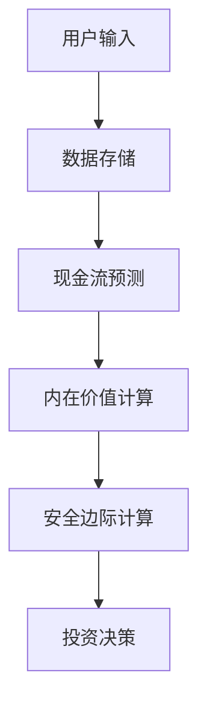

                 


# 格雷厄姆的企业价值计算方法

> 关键词：企业价值计算、格雷厄姆、安全边际、内在价值、投资决策、价值评估、现金流预测

> 摘要：本文详细介绍了格雷厄姆的企业价值计算方法，从核心概念到具体算法，从系统架构到项目实战，深入剖析了格雷厄姆的价值投资理论及其在现代企业价值计算中的应用。文章内容涵盖背景介绍、安全边际、内在价值、计算模型、系统分析、项目实战和总结，旨在为读者提供一个全面的技术视角，帮助读者理解并掌握格雷厄姆的企业价值计算方法。

---

## 第一部分: 格雷厄姆的企业价值计算方法概述

### 第1章: 企业价值计算的背景与重要性

#### 1.1 企业价值计算的核心概念

##### 1.1.1 企业价值计算的定义
企业价值计算是通过对企业未来现金流的预测，结合适当的折现率，估算企业整体价值的过程。它是企业估值的核心方法之一，广泛应用于投资决策、并购评估和财务分析等领域。

##### 1.1.2 企业价值计算的背景与意义
随着全球经济的发展，企业价值的准确评估变得越来越重要。投资者和企业管理者需要通过企业价值计算，了解企业的内在价值，做出合理的投资决策。格雷厄姆作为价值投资的鼻祖，提出了许多经典的理论和方法，为企业价值计算奠定了重要基础。

##### 1.1.3 格雷厄姆在企业价值计算中的贡献
格雷厄姆提出的安全边际概念和内在价值理论，为企业价值计算提供了新的思路。他强调，投资者应关注企业的内在价值，而非市场的短期波动，并通过安全边际来降低投资风险。

#### 1.2 企业价值计算的基本原理

##### 1.2.1 企业价值计算的理论基础
企业价值计算的理论基础主要包括现金流折现模型（DCF模型）和资产重置价值法。格雷厄姆的企业价值计算方法主要基于DCF模型，通过预测企业未来现金流并折现，估算企业的整体价值。

##### 1.2.2 企业价值计算的逻辑框架
企业价值计算的逻辑框架包括以下步骤：
1. 确定企业的核心业务和未来现金流。
2. 估算企业的未来现金流。
3. 确定适当的折现率。
4. 计算企业的内在价值。
5. 考虑安全边际进行投资决策。

##### 1.2.3 格雷厄姆的企业价值计算方法的特点
格雷厄姆的企业价值计算方法具有以下特点：
1. 强调内在价值的重要性。
2. 注重安全边际的应用。
3. 以现金流为基础，结合资产重置价值进行估值。

---

### 第2章: 格雷厄姆的安全边际概念

#### 2.1 安全边际的定义与作用

##### 2.1.1 安全边际的定义
安全边际是格雷厄姆提出的一个重要概念，指的是企业内在价值与其市场价格之间的差距。安全边际越大，投资风险越小。

##### 2.1.2 安全边际在投资中的重要性
安全边际是格雷厄姆投资策略的核心。它可以帮助投资者在市场波动中保持稳健，避免因市场情绪影响投资决策。

##### 2.1.3 安全边际与企业价值计算的关系
在企业价值计算中，安全边际用于衡量企业的市场价格与其内在价值之间的差距。通过安全边际，投资者可以更好地判断企业的投资价值。

#### 2.2 安全边际的计算方法

##### 2.2.1 安全边际的量化指标
安全边际可以通过以下公式计算：
$$ \text{安全边际} = \text{内在价值} - \text{市场价格} $$

##### 2.2.2 安全边际的计算公式
假设某企业的内在价值为 $100，市场价格为 $80，则安全边际为：
$$ \text{安全边际} = 100 - 80 = 20 $$

##### 2.2.3 安全边际的实际应用案例
例如，假设某企业未来现金流预测为 $1000，折现率为 10%，则其内在价值为：
$$ \text{内在价值} = \frac{1000}{1.10} \approx 909.09 $$ 
如果市场价格为 $800，则安全边际为：
$$ \text{安全边际} = 909.09 - 800 = 109.09 $$

---

### 第3章: 格雷厄姆的内在价值计算

#### 3.1 内在价值的定义与计算方法

##### 3.1.1 内在价值的定义
内在价值是指企业在正常经营条件下，未来现金流的现值。它是企业的真实价值，不受市场波动的影响。

##### 3.1.2 内在价值的计算公式
企业内在价值的计算公式如下：
$$ \text{内在价值} = \sum_{t=1}^{n} \frac{\text{现金流}_t}{(1 + r)^t} $$
其中，$r$ 是折现率，$n$ 是预测的现金流期限。

##### 3.1.3 内在价值计算的关键因素
内在价值的计算需要考虑以下关键因素：
1. 未来现金流的预测。
2. 折现率的选择。
3. 企业生命周期的假设。

#### 3.2 内在价值与市场价值的关系

##### 3.2.1 内在价值与市场价值的对比
内在价值与市场价值的区别在于，内在价值是基于企业未来现金流的预测，而市场价值是基于市场的供需关系。内在价值是企业的实际价值，市场价值是市场的反映。

##### 3.2.2 内在价值在投资决策中的作用
内在价值是投资者进行投资决策的重要依据。当市场价格低于内在价值时，企业具有投资价值。

##### 3.2.3 内在价值与企业价值计算的结合
在企业价值计算中，内在价值是核心，通过计算内在价值，投资者可以判断企业的投资价值。

---

### 第4章: 格雷厄姆的企业价值计算模型

#### 4.1 格雷厄姆的企业价值计算模型概述

##### 4.1.1 模型的基本框架
格雷厄姆的企业价值计算模型主要包括以下步骤：
1. 预测企业的未来现金流。
2. 计算企业的内在价值。
3. 考虑安全边际进行投资决策。

##### 4.1.2 模型的核心假设
格雷厄姆的企业价值计算模型假设企业的未来现金流可以预测，并且折现率是已知的。

##### 4.1.3 模型的适用范围
该模型适用于那些现金流稳定、业务模式清晰的企业。

#### 4.2 格雷厄姆企业价值计算的具体步骤

##### 4.2.1 确定企业的核心业务
确定企业的核心业务是企业价值计算的第一步。核心业务是企业未来现金流的主要来源。

##### 4.2.2 估算企业的未来现金流
通过分析企业的历史数据和行业趋势，预测企业的未来现金流。

##### 4.2.3 计算企业的内在价值
使用现金流折现模型（DCF模型）计算企业的内在价值。

##### 4.2.4 考虑安全边际进行投资决策
根据内在价值和市场价格的差距，判断企业的投资价值。

---

### 第5章: 格雷厄姆企业价值计算的系统分析

#### 5.1 企业价值计算的系统架构

##### 5.1.1 系统功能模块划分
企业价值计算系统可以划分为以下功能模块：
1. 数据输入模块。
2. 现金流预测模块。
3. 内在价值计算模块。
4. 安全边际计算模块。
5. 投资决策模块。

##### 5.1.2 系统数据流图


##### 5.1.3 系统架构设计
系统架构采用分层设计，主要包括数据层、业务逻辑层和用户界面层。

#### 5.2 企业价值计算的算法原理

##### 5.2.1 算法的数学模型
企业价值计算的数学模型如下：
$$ \text{内在价值} = \sum_{t=1}^{n} \frac{\text{现金流}_t}{(1 + r)^t} $$

##### 5.2.2 算法的流程图
```mermaid
graph TD
    S1[start] --> P1[预测现金流]
    P1 --> C1[计算内在价值]
    C1 --> M1[计算安全边际]
    M1 --> D1[做出投资决策]
    D1 --> end
```

##### 5.2.3 算法的Python实现
```python
def calculate_intrinsic_value(cash_flows, discount_rate):
    intrinsic_value = 0
    for t in range(len(cash_flows)):
        cash_flow = cash_flows[t]
        intrinsic_value += cash_flow / (1 + discount_rate) ** t
    return intrinsic_value

# 示例数据
cash_flows = [100, 200, 300]
discount_rate = 0.1

iv = calculate_intrinsic_value(cash_flows, discount_rate)
print("内在价值：", iv)
```

---

### 第6章: 格雷厄姆企业价值计算的项目实战

#### 6.1 项目环境与工具安装

##### 6.1.1 环境配置
需要安装Python和相关库（如numpy、pandas）。

##### 6.1.2 工具安装与配置
安装Python和必要的库：
```bash
pip install numpy pandas
```

##### 6.1.3 数据获取与准备
获取企业的历史财务数据和行业数据。

#### 6.2 核心算法实现

##### 6.2.1 现金流预测模型
使用历史数据和行业趋势，预测企业的未来现金流。

##### 6.2.2 内在价值计算
使用现金流折现模型计算企业的内在价值。

##### 6.2.3 安全边际计算
根据内在价值和市场价格，计算安全边际。

#### 6.3 项目实战案例

##### 6.3.1 案例背景
假设某企业未来3年的现金流分别为 $100、$200、$300，折现率为 10%。

##### 6.3.2 内在价值计算
$$ \text{内在价值} = \frac{100}{1.10} + \frac{200}{1.10^2} + \frac{300}{1.10^3} \approx 90.91 + 160.50 + 227.27 \approx 478.68 $$

##### 6.3.3 安全边际计算
假设市场价格为 $400，则安全边际为：
$$ \text{安全边际} = 478.68 - 400 = 78.68 $$

##### 6.3.4 投资决策
由于安全边际为正值，说明市场价格低于内在价值，企业具有投资价值。

---

### 第7章: 格雷厄姆企业价值计算的总结与展望

#### 7.1 格雷厄姆企业价值计算的核心要点
格雷厄姆的企业价值计算方法以内在价值为核心，通过现金流折现模型和安全边际的概念，帮助企业评估其真实价值。

#### 7.2 格雷厄姆方法的局限性
格雷厄姆方法的局限性在于现金流预测的不确定性和折现率的选择。

#### 7.3 格雷厄姆方法的现代发展
现代企业价值计算方法在格雷厄姆的基础上，结合了更多的因素，如市场风险、行业趋势等。

#### 7.4 未来研究方向
未来的研究可以进一步探讨格雷厄姆方法在不同行业中的应用，以及如何结合人工智能技术提高企业价值计算的准确性。

---

## 作者：AI天才研究院/AI Genius Institute & 禅与计算机程序设计艺术 /Zen And The Art of Computer Programming

