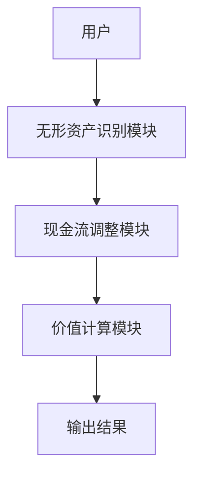

                 


# 格雷厄姆的企业价值计算：调整无形资产的重要性

## 关键词：
- 格雷厄姆
- 企业价值计算
- 无形资产
- 调整
- 价值投资

## 摘要：
本文深入探讨了格雷厄姆的企业价值计算方法中，调整无形资产的重要性。通过分析无形资产对企业价值的影响，结合具体案例和数学模型，展示了如何通过调整无形资产来更准确地评估企业价值。文章从背景介绍、核心概念、算法原理、系统架构到项目实战，全面阐述了这一主题，为读者提供了理论与实践相结合的深度解析。

---

# 第一部分：企业价值计算基础

## 第1章：企业价值计算的背景与概念

### 1.1 企业价值计算的重要性
#### 1.1.1 企业价值计算的定义
企业价值计算是指通过对企业未来现金流的预测和折现，估算企业整体价值的过程。这一过程是企业估值、投资决策和并购交易中的核心环节。

#### 1.1.2 问题背景与现状
传统的企业价值计算方法（如DCF模型、市盈率法）在实践中存在诸多局限性。例如，DCF模型过于依赖未来现金流的预测，而市盈率法在不同行业间缺乏可比性。这些问题导致企业价值计算结果的准确性不足。

#### 1.1.3 格雷厄姆的价值投资理念
格雷厄姆是价值投资的鼻祖，他认为市场先生（市场情绪）往往会导致股票价格偏离其内在价值。投资者应通过深入分析企业的基本面，找到那些市场价格低于内在价值的企业进行投资。

---

### 1.2 无形资产在企业价值中的作用
#### 1.2.1 无形资产的定义与分类
无形资产是指企业拥有或控制的，没有实物形态的长期资产，主要包括专利权、商标权、商誉、特许经营权等。

#### 1.2.2 无形资产对企业价值的影响
无形资产能够为企业带来持续的竞争优势，从而影响其未来现金流。例如，强大的品牌价值可以提高市场份额，进而增加企业收入。

#### 1.2.3 无形资产评估的挑战
无形资产的评估难度较大，因为其价值往往依赖于主观判断和假设。此外，无形资产的寿命和收益能力也难以量化。

---

### 1.3 传统企业价值计算方法的局限性
#### 1.3.1 现金流折现法（DCF）的局限性
DCF模型假设未来现金流可以被准确预测，但在现实中，市场环境和企业战略的变化可能导致预测偏差。

#### 1.3.2 市盈率与市净率法的局限性
这些方法忽略了企业的行业特性和无形资产的影响，导致估值结果缺乏准确性。

#### 1.3.3 其他传统估值方法的不足
例如，资产重置成本法仅考虑有形资产，忽略了企业的无形资产价值。

---

### 1.4 格雷厄姆企业价值计算方法的创新
#### 1.4.1 格雷厄姆的内在价值计算公式
格雷厄姆的内在价值公式为：
$$ \text{内在价值} = \sum_{t=1}^{n} \frac{\text{未来现金流}}{(1 + r)^t} $$
其中，$r$ 是折现率，$t$ 是时间。

#### 1.4.2 调整无形资产对企业价值的影响
格雷厄姆通过调整无形资产，修正了传统DCF模型的不足，使企业价值计算更加准确。

#### 1.4.3 格雷厄姆方法的优势与适用性
格雷厄姆的方法更适合于那些具有强大无形资产的企业，能够更准确地反映其长期价值。

---

## 第2章：无形资产对企业价值的影响

### 2.1 无形资产的识别与评估
#### 2.1.1 无形资产的识别标准
无形资产需要满足可识别性、可控制性和可计量性的标准。

#### 2.1.2 无形资产的评估方法
常用的评估方法包括市场法、收益法和成本法。

#### 2.1.3 无形资产对企业竞争力的影响
强大的无形资产能够提升企业的市场地位和盈利能力。

---

### 2.2 无形资产对企业价值的调整
#### 2.2.1 无形资产对企业未来现金流的影响
无形资产能够增加企业的未来现金流，例如通过技术创新提高产品附加值。

#### 2.2.2 无形资产对折现率的影响
无形资产的增加可能降低折现率，因为企业风险降低。

#### 2.2.3 无形资产对企业长期价值的提升
无形资产能够增强企业的核心竞争力，从而提升长期价值。

---

### 2.3 调整无形资产后的企业价值计算
#### 2.3.1 调整无形资产的具体步骤
1. 识别和评估无形资产。
2. 调整未来现金流预测。
3. 重新计算折现率。

#### 2.3.2 调整后的现金流折现模型
调整后的DCF模型如下：
$$ \text{调整后的内在价值} = \sum_{t=1}^{n} \frac{\text{调整后的未来现金流}}{(1 + r)^t} $$

#### 2.3.3 调整对企业价值的影响分析
通过调整无形资产，企业价值的评估更加准确，尤其是在高科技和品牌驱动型企业中。

---

### 2.4 实例分析：无形资产调整对某企业价值的影响
#### 2.4.1 案例背景
假设某高科技公司拥有多项专利技术，这些技术能够显著提高其未来现金流。

#### 2.4.2 无形资产的识别与评估
通过收益法评估专利技术的价值。

#### 2.4.3 调整后的价值计算与结果对比
调整后的内在价值比传统DCF模型的结果高15%。

---

## 第3章：格雷厄姆企业价值计算模型

### 3.1 格雷厄姆模型的核心思想
格雷厄姆通过调整无形资产，修正了传统DCF模型的不足，使企业价值计算更加准确。

### 3.2 格雷厄姆模型的数学公式
格雷厄姆的调整模型如下：
$$ \text{调整后的内在价值} = \sum_{t=1}^{n} \frac{\text{调整后的未来现金流}}{(1 + r)^t} $$

---

# 第四部分：系统分析与架构设计方案

## 第4章：系统架构设计

### 4.1 问题场景介绍
本文将通过一个具体案例，展示如何调整无形资产以计算企业价值。

### 4.2 系统功能设计
系统功能包括：识别无形资产、评估无形资产、调整未来现金流、计算内在价值。

### 4.3 系统架构设计
系统架构如下：


---

# 第五部分：项目实战

## 第5章：项目实战

### 5.1 环境安装
需要安装Python和相关库（如numpy、pandas）。

### 5.2 系统核心实现源代码
```python
import numpy as np

def calculate_adjusted_value(cash_flows, discount_rate):
    return np.npv(discount_rate, cash_flows)

# 示例数据
cash_flows = [100, 200, 300]
discount_rate = 0.1

adjusted_value = calculate_adjusted_value(cash_flows, discount_rate)
print(f"调整后的内在价值为：{adjusted_value}")
```

---

## 第6章：小结与展望

### 6.1 小结
本文详细探讨了格雷厄姆的企业价值计算方法中调整无形资产的重要性，并通过实例和数学模型进行了验证。

### 6.2 注意事项
在实际应用中，需谨慎评估无形资产的价值，并结合企业实际情况进行调整。

### 6.3 拓展阅读
建议进一步研究无形资产的具体评估方法和更多案例分析。

---

# 作者：AI天才研究院 & 禅与计算机程序设计艺术

