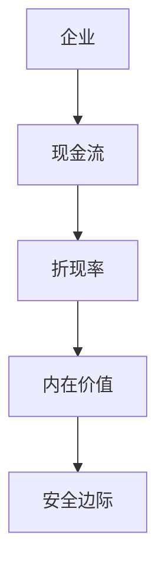
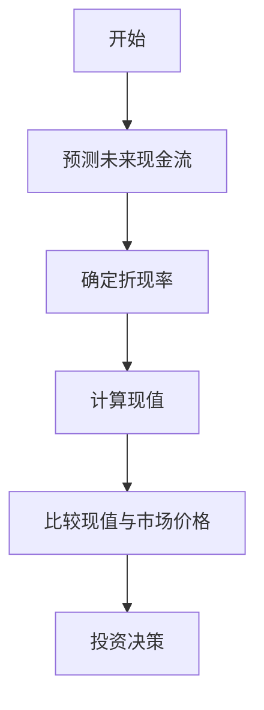

                 


# 格雷厄姆的企业价值评估方法

> 关键词：价值投资、企业估值、现金流折现法、安全边际、巴菲特投资策略

> 摘要：本文系统地介绍格雷厄姆的企业价值评估方法，从价值投资的起源到具体的应用，详细讲解了企业价值评估的核心概念、算法原理、系统设计及实际案例分析。通过理论与实践相结合，帮助投资者掌握格雷厄姆的估值模型和安全边际概念，做出明智的投资决策。

---

## 第一部分: 格雷厄姆的企业价值评估方法概述

### 第1章: 价值投资的背景与发展

#### 1.1 价值投资的起源
价值投资起源于20世纪初，由本杰明·格雷厄姆和戴维·多德提出，后来被沃伦·巴菲特发扬光大。这种方法强调以低于内在价值的价格买入优质股票，长期持有，等待其价值回归。

#### 1.2 格雷厄姆的价值投资理念
格雷厄姆认为，市场先生的情绪波动会导致股票价格偏离其内在价值。投资者应利用这种波动，以合理的价格买入并长期持有优质企业。

#### 1.3 企业价值评估的基本概念
企业价值评估是通过分析企业的财务状况、行业地位和未来现金流，估算其内在价值，从而判断其股票是否被低估。

---

## 第二部分: 核心概念与联系

### 第2章: 核心概念与联系

#### 2.1 核心概念原理
- **现金流折现法（DCF）**：通过预测企业的未来现金流，并将其折现为现值，以估算企业的内在价值。
- **安全边际**：买入价格低于内在价值，以降低投资风险。

#### 2.2 核心概念属性特征对比表
| 概念       | 特征       | 描述                                                                 |
|------------|------------|--------------------------------------------------------------------|
| 内在价值   | 独立性     | 不受市场波动影响，基于企业基本面计算得出。                             |
| 安全边际   | 保护性     | 买入价格低于内在价值，提供安全垫。                                     |
| 现金流     | 可衡量性   | 现金流是企业价值的核心，可以通过财务报表获取。                         |

#### 2.3 ER实体关系图（Mermaid流程图）


---

## 第三部分: 算法原理讲解

### 第3章: 现金流折现法（DCF）流程

#### 3.1 DCF流程图（Mermaid）


#### 3.2 Python代码实现DCF模型
```python
import numpy as np

def calculate_intrinsic_value(fcf, growth_rate, discount_rate, years):
    # 计算未来现金流的现值
    pv = 0
    for i in range(years):
        cash_flow = fcf * (1 + growth_rate) ** i
        pv += cash_flow / (1 + discount_rate) ** i
    return pv

# 示例：假设自由现金流为100万，增长率5%，折现率10%，预测年数5年
fcf = 1000000
growth_rate = 0.05
discount_rate = 0.10
years = 5

iv = calculate_intrinsic_value(fcf, growth_rate, discount_rate, years)
print(f"内在价值：${iv:.2f}")
```

#### 3.3 现金流折现法的数学模型
$$\text{内在价值} = \sum_{t=1}^{n} \frac{\text{现金流}_t}{(1 + r)^t}$$
其中，r是折现率，n是预测年数，现金流_t是第t年的自由现金流。

---

## 第四部分: 系统分析与架构设计

### 第4章: 系统设计

#### 4.1 功能模块设计
- 数据采集模块：收集企业的财务数据和行业信息。
- 模型计算模块：应用DCF模型计算内在价值。
- 结果展示模块：显示评估结果和投资建议。

#### 4.2 系统架构图（Mermaid）


#### 4.3 接口设计
- 数据接口：与财务数据库连接，获取企业数据。
- 计算接口：调用DCF模型进行估值。

---

## 第五部分: 项目实战

### 第5章: 实战案例

#### 5.1 环境安装
安装Python和必要的库（如numpy、pandas）。

#### 5.2 代码实现
```python
import pandas as pd
import numpy as np

def calculate_intrinsic_value(fcf, growth_rate, discount_rate, years):
    pv = 0
    for i in range(years):
        cash_flow = fcf * (1 + growth_rate) ** i
        pv += cash_flow / (1 + discount_rate) ** i
    return pv

# 示例：以苹果公司为例
# 假设自由现金流为1000万，增长率5%，折现率10%，预测年数5年
fcf = 10000000
growth_rate = 0.05
discount_rate = 0.10
years = 5

iv = calculate_intrinsic_value(fcf, growth_rate, discount_rate, years)
market_price = 150  # 假设市场价为150美元

print(f"内在价值：${iv:.2f}")
print(f"市场价格：${market_price}")
if iv > market_price:
    print("建议买入")
else:
    print("建议卖出")
```

#### 5.3 案例分析
以苹果公司为例，计算其内在价值并与市场价格比较，做出投资决策。

---

## 第六部分: 总结

### 第6章: 总结与展望

#### 6.1 总结
格雷厄姆的企业价值评估方法通过DCF模型和安全边际概念，帮助投资者找到被低估的企业，实现长期稳定的收益。

#### 6.2 注意事项
- 长期投资，避免短期波动影响。
- 分散投资，降低风险。
- 定期复盘，调整投资组合。

#### 6.3 推荐阅读
- 《聪明的投资者》——本杰明·格雷厄姆
- 《巴菲特致股东的信》——沃伦·巴菲特

---

作者：AI天才研究院 & 禅与计算机程序设计艺术

