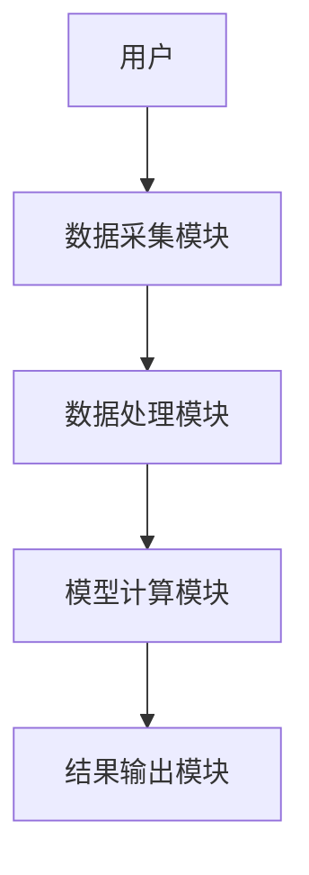
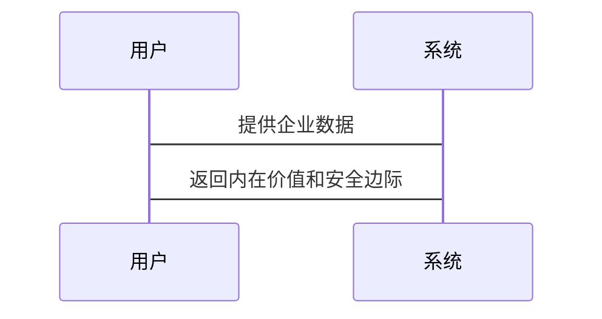

                 


# 格雷厄姆的企业价值评估方法

> 关键词：企业价值评估、格雷厄姆、内在价值、安全边际、股息贴现模型、投资策略

> 摘要：本文深入分析了格雷厄姆的企业价值评估方法，探讨其核心概念、数学模型、系统架构及实际应用。通过详细讲解格雷厄姆的内在价值公式、股息贴现模型（DDM）以及“安全边际”策略，本文旨在为投资者提供一套科学的企业价值评估体系，并通过实际案例分析和系统设计，帮助读者更好地理解和应用这些方法。

---

## 第一部分: 企业价值评估的背景与核心概念

### 第1章: 企业价值评估的定义与背景

#### 1.1 企业价值评估的定义
- **企业价值评估**是通过对企业的财务状况、市场表现和未来盈利能力进行分析，估算其整体价值的过程。
- 格雷厄姆的企业价值评估方法强调**内在价值**和**安全边际**，即基于企业的基本面，找到被市场低估的投资标的。

#### 1.2 企业价值评估的历史发展
- 格雷厄姆是价值投资的鼻祖，他的方法奠定了现代企业价值评估的基础。
- 现代企业价值评估结合了多种模型，如DCF（Discounted Cash Flow）模型和DDM（Dividend Discount Model）。

#### 1.3 企业价值评估的核心要素
- **内在价值**：企业未来现金流的现值。
- **安全边际**：内在价值与市场价格之间的差额，确保投资的安全性。
- **财务指标**：如ROE（净资产收益率）、P/E（市盈率）等。

#### 1.4 企业价值评估与财务分析的关系
- 财务分析是企业价值评估的基础，包括对资产负债表、利润表和现金流量表的分析。
- 格雷厄姆特别关注企业的盈利能力、成长性和财务稳定性。

#### 1.5 本章小结
- 格雷厄姆的企业价值评估方法以内在价值为核心，结合安全边际策略，为投资者提供了科学的评估框架。

---

## 第二部分: 格雷厄姆的企业价值评估方法

### 第2章: 格雷厄姆的价值评估原理

#### 2.1 格雷厄姆的企业价值评估模型
- **内在价值公式**：
  内在价值 = 现金流的现值
  $$ V = \sum_{t=1}^{n} \frac{CF_t}{(1 + r)^t} $$
  其中，\( CF_t \) 是第 \( t \) 年的现金流，\( r \) 是折现率。

- **股息贴现模型（DDM）**：
  $$ DDM = \frac{D_1}{k - g} $$
  其中，\( D_1 \) 是第一年的股息，\( k \) 是折现率，\( g \) 是股息增长率。

#### 2.2 格雷厄姆的"安全边际"策略
- 安全边际 = 内在价值 - 市场价格
  $$ \text{安全边际} = V - P $$
- 安全边际越大，投资风险越小。

#### 2.3 格雷厄姆的价值投资理念
- **长期投资**：避免频繁交易，降低交易成本。
- **逆向投资**：在市场恐慌时寻找低估资产。
- **安全边际**：确保投资标的的价值被市场低估。

#### 2.4 本章小结
- 格雷厄姆的方法强调内在价值和安全边际，为投资者提供了稳健的价值评估框架。

---

## 第三部分: 企业价值评估的数学模型与公式

### 第3章: 格雷厄姆价值评估的数学模型

#### 3.1 内在价值公式
- **单阶段DDM**：
  $$ V = \frac{D_1}{k - g} $$
- **多阶段DDM**：
  $$ V = \sum_{t=1}^{n} \frac{D_t}{(1 + k)^t} + \frac{P_n}{(1 + k)^n} $$
  其中，\( P_n \) 是第 \( n \) 年的终值。

#### 3.2 永续年金
- 永续年金的现值公式：
  $$ V = \frac{C}{r} $$
  其中，\( C \) 是每期现金流，\( r \) 是贴现率。

#### 3.3 案例分析
- 假设某企业预计第一年股息为$1，股息增长率3%，折现率为5%，则内在价值为：
  $$ V = \frac{1}{0.05 - 0.03} = 50 $$

---

## 第四部分: 企业价值评估系统架构设计

### 第4章: 企业价值评估系统的构建

#### 4.1 系统功能模块
- 数据采集：获取企业财务数据。
- 模型计算：应用DDM或DCF模型计算内在价值。
- 安全边际分析：比较内在价值与市场价格。
- 可视化输出：生成报告和图表。

#### 4.2 系统架构图


#### 4.3 接口设计
- 输入接口：企业财务数据。
- 输出接口：内在价值、安全边际、投资建议。

#### 4.4 交互流程


---

## 第五部分: 项目实战

### 第5章: 项目实战与代码实现

#### 5.1 环境安装
- Python 3.8+
- NumPy、Pandas、Matplotlib库。

#### 5.2 核心代码实现
```python
import numpy as np

def ddm_model(dividend, growth_rate, discount_rate):
    return dividend / (discount_rate - growth_rate)

# 示例计算
D1 = 1
g = 0.03
k = 0.05
value = ddm_model(D1, g, k)
print(f"内在价值: {value:.2f}")
```

#### 5.3 案例分析
- 某企业股息为$1，增长率3%，折现率5%，计算内在价值：
  $$ V = \frac{1}{0.05 - 0.03} = 50 $$

#### 5.4 项目小结
- 代码实现了DDM模型，帮助投资者快速评估企业价值。

---

## 第六部分: 最佳实践与总结

### 第6章: 最佳实践与注意事项

#### 6.1 最佳实践
- 结合多种模型进行验证。
- 定期更新财务数据和市场信息。
- 考虑宏观经济环境的影响。

#### 6.2 小结
- 格雷厄姆的方法提供了科学的价值评估框架，但实际应用需结合市场环境和企业具体情况。

#### 6.3 注意事项
- 折现率的选择对结果影响较大，需谨慎处理。
- 安全边际是投资决策的重要参考，但不是唯一标准。

#### 6.4 拓展阅读
- 格雷厄姆的《证券分析》
- 现代投资组合理论

---

## 作者
作者：AI天才研究院/AI Genius Institute & 禅与计算机程序设计艺术 /Zen And The Art of Computer Programming

