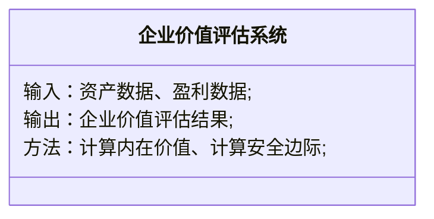
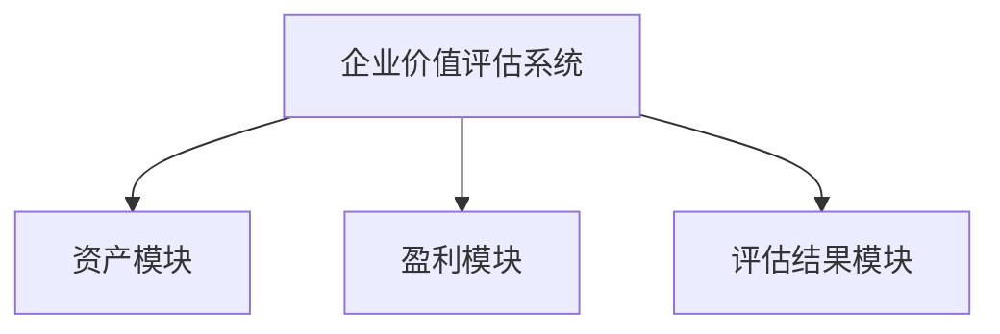
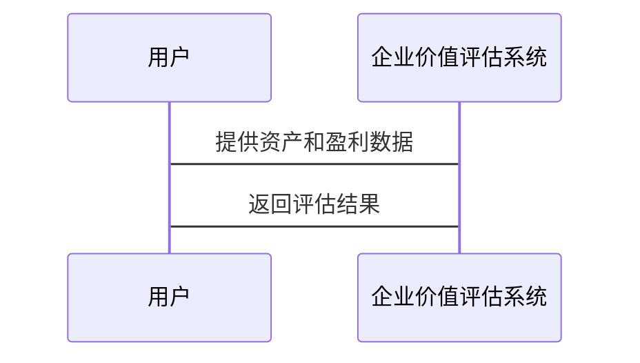

                 


# 格雷厄姆的企业价值评估方法：资产还是盈利？

## 关键词：企业价值评估、格雷厄姆、资产、盈利、投资分析

## 摘要：  
本文深入探讨了格雷厄姆的企业价值评估方法，重点分析了资产与盈利在评估中的作用。通过数学模型和实际案例，详细解释了格雷厄姆的安全边际概念，并提供了系统化的架构设计方案。文章旨在帮助读者理解如何在资产与盈利之间找到平衡，从而做出更明智的投资决策。

---

# 第1章：企业价值评估的背景与重要性

## 1.1 企业价值评估的核心概念

### 1.1.1 企业价值评估的定义  
企业价值评估是指通过对企业的资产、负债、盈利能力等多方面因素的分析，估算其整体价值的过程。它是投资决策的重要依据，帮助投资者判断企业的内在价值。

### 1.1.2 企业价值评估的必要性  
企业价值评估有助于投资者识别被低估的企业，避免盲目投资。同时，它也是企业并购、融资等活动中不可或缺的一部分。

### 1.1.3 格雷厄姆投资理念的起源  
本杰明·格雷厄姆是价值投资的鼻祖，他的投资理念强调安全边际和企业内在价值的计算。他认为，投资者应关注企业的基本面，而非市场的短期波动。

---

## 1.2 资产与盈利的关系

### 1.2.1 资产的定义与分类  
资产是企业拥有的资源，包括流动资产（如现金、应收账款）和非流动资产（如固定资产、无形资产）。

### 1.2.2 盈利的定义与分类  
盈利是企业在一定时期内实现的收益，包括净利润和息税前利润（EBIT）等。

### 1.2.3 资产与盈利的内在联系  
资产是企业价值的基础，而盈利是企业运营能力的体现。资产的规模和质量影响企业的盈利能力，而盈利又决定着资产的增值能力。

---

## 1.3 传统企业价值评估方法的局限性

### 1.3.1 市盈率法的缺陷  
市盈率法仅考虑股价与净利润的比率，忽略了资产的使用效率和负债情况，可能导致评估偏差。

### 1.3.2 市净率法的缺陷  
市净率法依赖于资产的账面价值，忽视了资产的流动性差异和盈利能力的差异。

### 1.3.3 格雷厄姆方法的优势  
格雷厄姆方法综合考虑了资产和盈利，通过内在价值计算，避免了传统方法的局限性。

---

# 第2章：格雷厄姆企业价值评估方法的核心原理

## 2.1 格雷厄姆的企业价值评估模型

### 2.1.1 模型的基本框架  
格雷厄姆的模型基于资产和盈利的综合评估，强调安全边际的重要性。

### 2.1.2 模型的数学表达式  
内在价值公式：
$$
\text{内在价值} = \frac{\text{净利润} + \text{息税前利润}}{2}
$$

### 2.1.3 模型的适用场景  
适用于企业资产清晰、盈利稳定的场景，尤其适合制造业和服务业。

---

## 2.2 资产与盈利的权重分配

### 2.2.1 资产在评估中的权重  
资产的权重取决于其流动性、变现能力以及对企业整体价值的贡献。

### 2.2.2 盈利在评估中的权重  
盈利的权重取决于企业的盈利能力、成长性和行业地位。

### 2.2.3 权重分配的合理性分析  
资产和盈利的权重应根据企业的具体情况动态调整，避免单一因素主导评估结果。

---

## 2.3 格雷厄姆安全边际的概念

### 2.3.1 安全边际的定义  
安全边际是内在价值与市场价值之间的差额，确保投资的安全性和收益性。

### 2.3.2 安全边际的计算方法  
$$
\text{安全边际} = \text{内在价值} - \text{市场价值}
$$

### 2.3.3 安全边际在投资中的作用  
安全边际为投资者提供了风险缓冲，降低了市场波动对企业价值评估的影响。

---

# 第3章：格雷厄姆企业价值评估方法的数学模型与公式

## 3.1 核心公式推导

### 3.1.1 内在价值公式  
$$
\text{内在价值} = \frac{\text{净利润} + \text{息税前利润}}{2}
$$

### 3.1.2 资产评估公式  
$$
\text{资产价值} = \text{资产总额} \times \text{资产质量系数}
$$

---

## 3.2 盈利能力分析公式

### 3.2.1 净利润率  
$$
\text{净利润率} = \frac{\text{净利润}}{\text{营业收入}}
$$

### 3.2.2 资产回报率  
$$
\text{资产回报率} = \frac{\text{净利润}}{\text{总资产}}
$$

---

## 3.3 综合评估公式

### 3.3.1 综合评估指数  
$$
\text{综合评估指数} = \alpha \times \text{资产价值} + \beta \times \text{盈利价值}
$$

---

# 第4章：格雷厄姆企业价值评估方法的系统分析与架构设计

## 4.1 系统功能设计

### 4.1.1 领域模型  


### 4.1.2 系统架构  


### 4.1.3 接口设计  
企业价值评估系统的输入接口包括资产数据和盈利数据，输出接口包括评估结果和安全边际报告。

### 4.1.4 交互流程  


---

# 第5章：项目实战

## 5.1 环境安装

### 5.1.1 安装Python  
使用Python 3.8及以上版本，安装环境包括Jupyter Notebook和Python。

### 5.1.2 安装pandas库  
在终端运行：
```
pip install pandas
```

---

## 5.2 核心代码实现

### 5.2.1 核心代码  
```python
import pandas as pd

def calculate_intrinsic_value(net_profit, ebit):
    return (net_profit + ebit) / 2

def calculate_asset_value(asset_total, asset_quality_coefficient):
    return asset_total * asset_quality_coefficient

# 示例数据
net_profit = 1000000  # 净利润
ebit = 1500000        # 息税前利润
asset_total = 5000000  # 资产总额
asset_quality_coefficient = 0.9  # 资产质量系数

# 计算内在价值
intrinsic_value = calculate_intrinsic_value(net_profit, ebit)
print(f"内在价值: {intrinsic_value}")

# 计算资产价值
asset_value = calculate_asset_value(asset_total, asset_quality_coefficient)
print(f"资产价值: {asset_value}")
```

---

## 5.3 案例分析

### 5.3.1 案例选择  
以某制造企业为例，分析其资产和盈利情况，计算内在价值和资产价值。

### 5.3.2 分析结果  
通过代码计算得出企业内在价值和资产价值，结合市场价值评估其安全边际。

---

## 5.4 项目小结  
通过实际案例分析，验证了格雷厄姆方法的有效性，并展示了如何利用代码实现企业价值评估。

---

# 第6章：格雷厄姆企业价值评估方法的最佳实践

## 6.1 小结  
格雷厄姆的企业价值评估方法强调资产与盈利的综合评估，通过内在价值和安全边际的概念，为投资者提供了科学的决策依据。

## 6.2 注意事项  
在实际应用中，需动态调整资产和盈利的权重，结合市场环境和企业具体情况。

## 6.3 拓展阅读  
推荐阅读格雷厄姆的经典著作《证券分析》，深入理解其投资理念。

---

# 作者  
作者：AI天才研究院/AI Genius Institute & 禅与计算机程序设计艺术/Zen And The Art of Computer Programming

