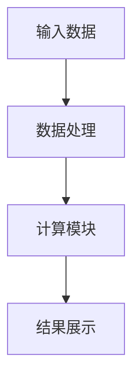

                 


```markdown
# 格雷厄姆的企业内在价值计算方法

> 关键词：格雷厄姆、内在价值、价值投资、投资分析、企业估值、安全边际

> 摘要：本文系统地介绍了格雷厄姆的企业内在价值计算方法，从基本概念到数学模型，从系统架构到项目实战，深入剖析了这一方法的理论基础和实际应用。通过详细分析，读者将掌握如何利用格雷厄姆的方法进行企业估值，从而做出更明智的投资决策。

---

## 第1章: 投资的基本概念与价值投资的起源

### 1.1 投资的基本概念
- 1.1.1 投资的定义与分类
  - 金融资产与实物资产的区分
  - 投资的短期与长期目标
- 1.1.2 价值投资的起源与发展
  - 价值投资的定义与核心理念
  - 历史背景与重要人物
- 1.1.3 格雷厄姆的价值投资理念
  - 格雷厄姆的生平简介
  - 他的主要投资思想与著作

### 1.2 企业内在价值的核心概念
- 1.2.1 企业内在价值的定义
  - 内在价值与市场价值的对比
  - 内在价值的决定因素
- 1.2.2 企业内在价值的计算意义
  - 为何计算内在价值？其在投资决策中的作用
- 1.2.3 格雷厄姆的贡献与方法
  - 他在价值投资领域的开创性工作
  - 他的方法如何影响现代投资理论

### 1.3 价值投资的基本原则
- 1.3.1 安全边际的概念
  - 安全边际的定义与作用
  - 如何通过安全边际降低投资风险
- 1.3.2 股票的内在价值与市场价格的关系
  - 价格波动与价值稳定的关系
  - 识别市场恐慌与市场狂热的重要性
- 1.3.3 价值投资的长期视角
  - 长期投资与短期投机的对比
  - 价值投资如何在长期中创造财富

### 1.4 本章小结
  - 总结本章内容，强调格雷厄姆内在价值计算的重要性及其在价值投资中的地位

---

## 第2章: 格雷厄姆的企业内在价值计算模型

### 2.1 格雷厄姆的计算方法概述
- 2.1.1 格雷厄姆的内在价值公式
  - V = (E + M)/n
    - 其中，E是平均收益，M是边际收益，n是增长率
- 2.1.2 格雷厄姆的计算假设
  - 盈利稳定性的假设
  - 市场的非完美性假设
- 2.1.3 格雷厄姆模型的适用场景
  - 适用于稳定增长的企业
  - 适用于周期性波动企业的调整

### 2.2 格雷厄姆模型的核心公式
- 2.2.1 每股内在价值的计算
  - 如何通过每股收益和市盈率计算内在价值
- 2.2.2 净现值法的应用
  - 未来现金流的贴现计算
  - 折现率的确定方法
- 2.2.3 股息贴现模型的使用
  - 股息的当前价值与未来贴现
  - 模型的优缺点分析

### 2.3 格雷厄姆模型的优缺点
- 2.3.1 模型的优点
  - 简单易懂，便于实际操作
  - 强调安全边际，降低投资风险
- 2.3.2 模型的局限性
  - 假设过于严格，实际应用中可能不准确
  - 忽略了市场情绪和其他非财务因素的影响
- 2.3.3 模型的改进与扩展
  - 如何结合其他模型进行优化
  - 现代投资理论中的应用与发展

### 2.4 本章小结
  - 总结格雷厄姆模型的核心内容，强调其在投资分析中的重要性

---

## 第3章: 格雷厄姆模型的数学推导与公式分析

### 3.1 格雷厄姆模型的数学基础
- 3.1.1 财务报表的基本公式
  - 收入、成本、利润的关系
  - 资产、负债、所有者权益的平衡
- 3.1.2 现金流的计算方法
  - 自由现金流的定义与计算
  - 现金流贴现法的数学基础
- 3.1.3 折现率的确定
  - 折现率的计算方法
  - 市场利率与风险溢价的关系

### 3.2 格雷厄姆模型的公式推导
- 3.2.1 内在价值公式
  - V = (E + M)/n
  - 各变量的数学定义与推导过程
- 3.2.2 股息贴现模型的公式
  - DDM模型的数学表达
  - 如何处理股息增长的不同阶段
- 3.2.3 净现值法的公式
  - NPV的计算公式
  - 现金流贴现的具体步骤

### 3.3 公式之间的关系与对比
- 3.3.1 内在价值公式与股息贴现模型的关系
  - 两者的异同点对比
  - 应用场景的分析
- 3.3.2 净现值法与内在价值公式的关系
  - 如何统一两者的思想
  - 在不同情况下的应用选择

### 3.4 本章小结
  - 总结数学推导的主要成果，明确公式之间的关系

---

## 第4章: 格雷厄姆模型的系统架构设计

### 4.1 系统功能设计
- 4.1.1 数据输入模块
  - 输入企业的财务数据
  - 数据格式与规范
- 4.1.2 数据处理模块
  - 数据的清洗与预处理
  - 财务指标的计算
- 4.1.3 计算模块
  - 内在价值的计算
  - 多种模型的对比分析
- 4.1.4 结果展示模块
  - 可视化结果的呈现
  - 分析报告的生成

### 4.2 系统架构设计
- 4.2.1 分层架构设计
  - 数据层、业务逻辑层、表现层的划分
  - 各层之间的交互与数据流
- 4.2.2 使用mermaid的类图展示
  ```mermaid
  classDiagram
    class 数据输入模块 {
      输入财务数据
      数据验证
    }
    class 数据处理模块 {
      数据清洗
      计算财务指标
    }
    class 计算模块 {
      应用格雷厄姆模型
      其他模型对比
    }
    class 结果展示模块 {
      可视化结果
      输出报告
    }
    数据输入模块 --> 数据处理模块
    数据处理模块 --> 计算模块
    计算模块 --> 结果展示模块
  ```

### 4.3 系统架构设计的mermaid图


### 4.4 本章小结
  - 总结系统架构设计的核心要点，强调模块化设计的重要性

---

## 第5章: 项目实战——格雷厄姆模型的实现

### 5.1 环境安装与准备
- 5.1.1 安装必要的工具与库
  - Python的安装与配置
  - 导入pandas、numpy、matplotlib等库
- 5.1.2 数据来源与获取
  - 从公开数据源获取企业的财务报表
  - 数据清洗与预处理的步骤

### 5.2 核心实现代码
- 5.2.1 内在价值计算函数
  ```python
  def calculate_intrinsic_value(eps, margins, growth_rate):
      return (eps + margins) / growth_rate
  ```
- 5.2.2 股息贴现模型的实现
  ```python
  def dividend_discount_model(dividend, growth_rate, discount_rate):
      return dividend / (discount_rate - growth_rate)
  ```
- 5.2.3 净现值法的实现
  ```python
  def net_present_value(cash_flows, discount_rate):
      return sum(cf / (1 + discount_rate)**i for i, cf in enumerate(cash_flows))
  ```

### 5.3 代码应用与解读
- 5.3.1 以微软为例的分析
  - 数据收集与处理
  - 计算内在价值
  - 对比市场价格
- 5.3.2 结果分析与解读
  - 计算结果的意义
  - 如何指导投资决策

### 5.4 本章小结
  - 总结项目实战的主要步骤与收获，强调代码实现的重要性

---

## 第6章: 格雷厄姆模型的最佳实践与注意事项

### 6.1 小结
- 本章总结了格雷厄姆模型的核心内容及其在实际中的应用

### 6.2 注意事项
- 6.2.1 数据的准确性和完整性
  - 数据来源的可靠性
  - 数据处理的注意事项
- 6.2.2 模型的局限性
  - 格雷厄姆模型的假设是否合理
  - 如何在不同市场环境下调整模型
- 6.2.3 投资决策的综合性
  - 内在价值计算之外的其他因素
  - 综合分析的重要性

### 6.3 拓展阅读
- 6.3.1 推荐的经典书籍
  - 格雷厄姆的《聪明的投资者》
  - 其他价值投资经典著作
- 6.3.2 相关学术研究
  - 格雷厄姆模型的现代发展
  - 结合行为金融学的研究

### 6.4 本章小结
  - 总结最佳实践，强调投资决策中的注意事项

---

## 作者：AI天才研究院 & 禅与计算机程序设计艺术

---

通过以上大纲，读者将能够系统地学习格雷厄姆的企业内在价值计算方法，从理论到实践，从数学公式到系统实现，全面掌握这一经典投资方法的核心思想与实际应用。这不仅有助于提升读者的投资分析能力，还能为他们在复杂多变的市场中做出明智的投资决策提供有力的支持。
```

