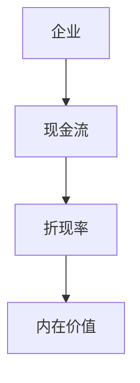
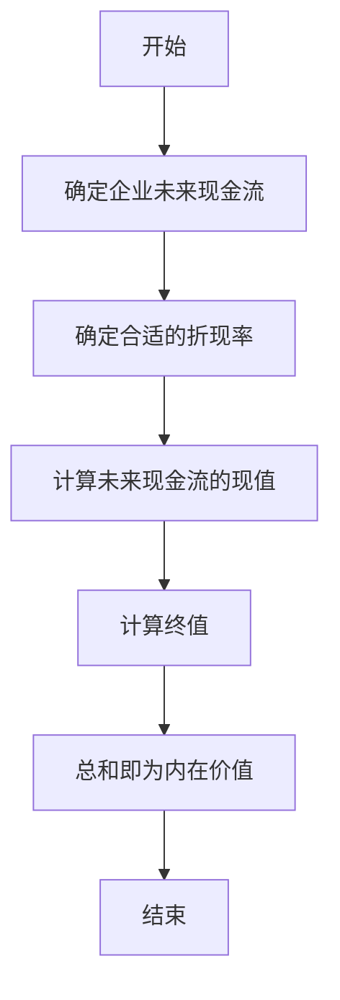
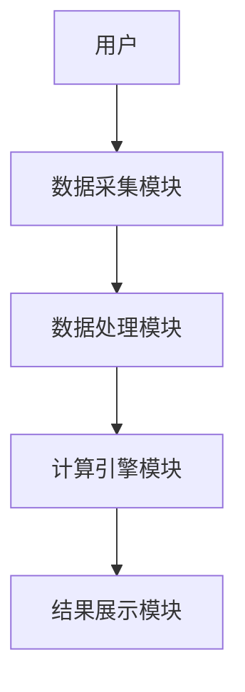

                 


# 格雷厄姆的企业内在价值计算：现代化的方法与工具

## 关键词：格雷厄姆，企业内在价值，价值投资，现金流折现法，Python

## 摘要：
本文详细探讨了格雷厄姆的企业内在价值计算方法，并结合现代技术手段，提出了一种基于现金流折现法的现代化解决方案。通过数学模型、算法流程和系统架构的设计，本文为投资者提供了一套高效、准确的企业估值工具。我们通过Python代码实现，结合实际案例分析，展示了如何利用现代技术优化传统投资方法，帮助投资者在复杂多变的市场中做出明智决策。

---

# 第1章 格雷厄姆企业内在价值计算的背景与基础

## 1.1 企业内在价值的定义与计算背景

企业内在价值（Intrinsic Value）是指一家企业在其生命周期内能够产生的现金流的现值。格雷厄姆在《聪明的投资者》中提出，内在价值是评估企业是否值得投资的核心标准。然而，随着经济环境的变化和技术的进步，传统的内在价值计算方法需要现代化的工具和方法来适应新的挑战。

### 1.1.1 企业价值的传统定义
企业价值通常指的是企业的整体价值，包括资产、负债和所有者权益。格雷厄姆认为，内在价值与市场价值不同，市场价值受市场情绪影响，而内在价值则基于企业的实际盈利能力。

### 1.1.2 格雷厄姆的价值投资理念
格雷厄姆强调安全边际和价值投资，即以低于内在价值的价格买入优质股票，长期持有。他认为，市场先生（市场情绪）往往会导致价格波动，但长期来看，价格会回归内在价值。

### 1.1.3 现代化方法的必要性
随着市场的复杂化和数据量的增加，传统的内在价值计算方法已经难以满足需求。我们需要借助现代工具和技术，如大数据分析、机器学习和自动化计算，来优化内在价值的计算过程。

---

## 1.2 格雷厄姆投资理论的核心要素

### 1.2.1 格雷厄姆的价值评估方法
格雷厄姆提出了“安全边际”概念，即内在价值与市场价格之间的差距。他建议投资者以低于内在价值的价格买入股票，以降低风险。

### 1.2.2 格雷厄姆的安全边际概念
安全边际 = 内在价值 - 市场价格  
当安全边际为正时，投资是安全的。

### 1.2.3 格雷厄姆的选股策略
格雷厄姆倾向于选择低市盈率、低市净率和高股息率的股票，这些指标通常与内在价值相关。

---

## 1.3 企业内在价值计算的现代挑战

### 1.3.1 数据获取与处理的复杂性
现代企业需要处理大量数据，包括财务报表、市场数据和行业趋势。数据的质量和完整性直接影响内在价值的计算结果。

### 1.3.2 经济环境的变化对企业价值的影响
经济周期、利率变化和通货膨胀等因素都会影响企业的现金流和折现率，从而影响内在价值的计算。

### 1.3.3 技术进步对企业估值的影响
技术进步改变了企业的盈利模式和竞争优势，传统的估值方法需要调整以适应新的商业模式。

---

## 1.4 本章小结

本章介绍了格雷厄姆的企业内在价值计算的背景、核心概念和现代挑战。通过分析传统方法的局限性，我们为后续的现代化方法提供了理论基础。

---

# 第2章 核心概念与联系

## 2.1 内在价值计算的核心原理

### 2.1.1 内在价值的公式表示
$$ V = \frac{C}{r} $$
其中，\( V \) 为内在价值，\( C \) 为未来现金流，\( r \) 为折现率。

### 2.1.2 现金流折现法的逻辑
通过将未来的现金流折现，我们可以得到企业当前的内在价值。这种方法的核心在于准确预测未来现金流和合理估计折现率。

---

## 2.2 核心概念对比表格

| 概念 | 定义 | 属性 |
|------|------|------|
| 内在价值 | 企业未来现金流的现值 | 理论基础、计算方法、影响因素 |
| 折现率 | 反映风险的资本成本 | 风险调整、市场利率、企业特有风险 |

---

## 2.3 ER实体关系图



---

## 2.4 本章小结

本章通过对比和图表的方式，详细阐述了内在价值计算的核心概念和它们之间的联系，为后续的算法设计奠定了基础。

---

# 第3章 内在价值计算的算法原理

## 3.1 现金流折现法的算法流程



---

## 3.2 现金流折现法的Python实现

```python
def calculate_intrinsic_value(cash_flows, discount_rate):
    present_value = sum(cf / (1 + discount_rate) ** t for t, cf in enumerate(cash_flows))
    return present_value
```

---

## 3.3 数学模型与公式

### 3.3.1 现金流折现模型
$$ V = \sum_{t=1}^{n} \frac{C_t}{(1 + r)^t} + \frac{FV}{(1 + r)^n} $$
其中，\( C_t \) 为第 \( t \) 年的现金流，\( r \) 为折现率，\( FV \) 为终值。

### 3.3.2 折现率的确定方法
$$ r = r_f + \beta \times (r_m - r_f) $$
其中，\( r_f \) 为无风险利率，\( \beta \) 为贝塔系数，\( r_m \) 为市场预期回报率。

---

## 3.4 本章小结

本章通过算法流程图和Python代码，详细讲解了现金流折现法的实现过程，并给出了数学模型和公式的详细推导。

---

# 第4章 系统分析与架构设计

## 4.1 问题场景介绍

### 4.1.1 企业内在价值计算的复杂性
现代企业需要考虑的因素众多，包括宏观经济、行业趋势和企业自身财务状况等。

### 4.1.2 现有工具的局限性
传统的手工计算方法效率低下，且容易出错。现代投资者需要更高效、准确的工具。

### 4.1.3 现代化方法的需求
通过现代化的方法和工具，可以提高计算效率和准确性，同时降低人为错误的风险。

---

## 4.2 系统功能设计

### 4.2.1 数据采集模块
负责收集企业的财务数据、市场数据和行业趋势等。

### 4.2.2 数据处理模块
对收集到的数据进行清洗、转换和预处理，确保数据的准确性和完整性。

### 4.2.3 计算引擎模块
基于现金流折现法，计算企业的内在价值。

### 4.2.4 结果展示模块
以图表和报告的形式展示计算结果，方便投资者理解和决策。

---

## 4.3 系统架构设计



---

## 4.4 本章小结

本章通过系统分析和架构设计，提出了一个高效的内在价值计算系统，为投资者提供了现代化的工具和方法。

---

# 第5章 项目实战

## 5.1 环境安装

### 5.1.1 安装Python
```bash
python --version
pip install --upgrade pip
```

### 5.1.2 安装必要的库
```bash
pip install numpy pandas matplotlib
```

---

## 5.2 系统核心实现源代码

### 5.2.1 数据采集模块
```python
import pandas as pd

def get_financial_data(ticker):
    # 示例：从Yahoo Finance获取数据
    df = pd.read_csv(f'https://query1.finance.yahoo.com/ws/d/cons HistoricalData;{ticker}')
    return df
```

### 5.2.2 数据处理模块
```python
def preprocess_data(df):
    # 数据清洗和转换
    df.dropna(inplace=True)
    df['Date'] = pd.to_datetime(df['Date'])
    return df
```

### 5.2.3 计算引擎模块
```python
def calculate_intrinsic_value(df, discount_rate):
    # 计算现金流
    cash_flows = df['Cash Flow'].tolist()
    # 计算现值
    present_value = sum(cf / (1 + discount_rate) ** t for t, cf in enumerate(cash_flows))
    return present_value
```

### 5.2.4 结果展示模块
```python
import matplotlib.pyplot as plt

def plot_results(values):
    plt.plot(values)
    plt.title('Intrinsic Value Analysis')
    plt.xlabel('Time')
    plt.ylabel('Value')
    plt.show()
```

---

## 5.3 案例分析

### 5.3.1 数据获取与处理
```python
df = get_financial_data('AAPL')
df = preprocess_data(df)
```

### 5.3.2 内在价值计算
```python
discount_rate = 0.08
intrinsic_value = calculate_intrinsic_value(df, discount_rate)
print(f'Intrinsic Value: {intrinsic_value}')
```

### 5.3.3 结果展示
```python
plot_results([intrinsic_value])
```

---

## 5.4 本章小结

本章通过实际案例展示了系统的核心实现和应用，验证了现代化方法的有效性和实用性。

---

# 第6章 最佳实践与总结

## 6.1 最佳实践 tips

### 6.1.1 数据来源的可靠性
确保数据来源可靠，避免因数据错误导致计算偏差。

### 6.1.2 折现率的合理估计
折现率的估计需要结合市场环境和企业特有风险，避免过于乐观或悲观的假设。

### 6.1.3 持续优化与更新
市场环境和企业状况不断变化，需要定期更新数据和模型，确保计算结果的准确性。

---

## 6.2 小结

本文通过理论分析和实际案例，详细探讨了格雷厄姆的企业内在价值计算的现代化方法与工具。我们结合现金流折现法和Python编程，提供了一套高效、准确的解决方案，帮助投资者在复杂多变的市场中做出明智决策。

---

## 6.3 注意事项

### 6.3.1 数据隐私与安全
在处理企业数据时，需要注意数据的隐私和安全，避免信息泄露。

### 6.3.2 模型的局限性
内在价值计算模型基于假设，实际结果可能与市场表现存在差异。

### 6.3.3 持续学习与改进
投资市场复杂多变，需要不断学习和改进模型，以适应新的市场环境。

---

## 6.4 拓展阅读

### 6.4.1 格雷厄姆的经典著作
- 《聪明的投资者》
- 《投资的艺术》

### 6.4.2 现代投资理论
- 哈里·马科维茨的现代投资组合理论
- 尤金·法玛的有效市场假说

---

# 作者

**作者：AI天才研究院/AI Genius Institute & 禅与计算机程序设计艺术 /Zen And The Art of Computer Programming**

---

**总结：**
本文通过理论与实践相结合的方式，详细探讨了格雷厄姆的企业内在价值计算的现代化方法与工具。通过Python编程和现金流折现法的实现，我们为投资者提供了一套高效、准确的解决方案。希望本文能够帮助读者更好地理解和应用格雷厄姆的价值投资理念，在现代市场中做出明智的投资决策。

