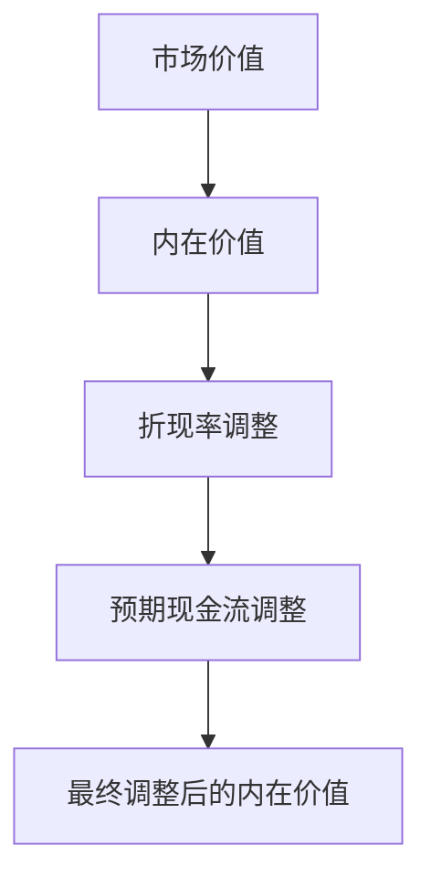

                 

好的，我明白了您的需求。我会按照您提供的大纲和要求，逐步撰写这篇文章。为了确保文章的完整性和专业性，我会先完成第一章和第二章的内容，然后继续后续章节的撰写。以下是第一章和第二章的具体内容：

---

# 第1章: 引言

## 1.1 格雷厄姆及其投资理念

### 1.1.1 格雷厄姆的背景与贡献

 Benjamin Graham 是 20 世纪著名的投资学家，被誉为“价值投资之父”。他在 20 世纪 30 年代提出了保守估值方法，为现代投资理论奠定了基础。他的思想影响了无数投资者，包括沃伦·巴菲特等投资大师。

 格雷厄姆的投资理念强调安全性和稳定性。他认为，投资者应以企业的内在价值为基础，进行长期、稳健的投资。他的方法注重基本面分析，避免短期市场波动的干扰。

### 1.1.2 保守估值方法的核心思想

 格雷厄姆的保守估值方法强调以下几点：

 1. **安全边际**：买入价格应低于企业的内在价值，留有安全边际，以避免市场波动带来的损失。
 2. **基本面分析**：通过对企业财务状况、盈利能力、行业地位等多方面的分析，评估其内在价值。
 3. **长期投资**：避免短期交易，注重长期价值的实现。

### 1.1.3 本书的核心目标

 本书旨在探讨格雷厄姆的保守估值方法在负利率环境下的应用与调整。在负利率环境下，传统的估值方法可能不再适用，因此需要对其进行优化和调整，以适应新的市场环境。

---

## 1.2 负利率环境的背景与挑战

### 1.2.1 负利率的定义与现状

 负利率是指中央银行设定的基准利率为负值，鼓励银行和金融机构增加放贷，从而刺激经济增长。近年来，全球多国央行实施负利率政策，以应对经济衰退和通缩压力。

### 1.2.2 负利率对传统估值方法的影响

 负利率环境下，传统的估值模型面临以下挑战：

 1. **折现率问题**：负利率导致折现率下降，影响现金流的现值计算。
 2. **资产价格扭曲**：负利率可能导致资产价格被高估，增加投资风险。
 3. **债券估值挑战**：负利率下，债券收益率为负，传统估值方法需调整。

### 1.2.3 调整估值方法的必要性

 在负利率环境下，传统的估值方法需要进行调整，以反映新的市场环境。通过调整，投资者可以更好地评估资产的真实价值，避免因利率变化带来的损失。

---

## 1.3 本书的目的与结构

### 1.3.1 核心目标

 本书的核心目标是探讨格雷厄姆的保守估值方法在负利率环境下的应用与调整，帮助投资者在新的市场环境中做出更明智的投资决策。

### 1.3.2 章节安排

 本书分为七章，内容安排如下：

 1. 第1章：引言（已完成）
 2. 第2章：格雷厄姆保守估值方法的理论基础
 3. 第3章：负利率环境下的市场分析
 4. 第4章：保守估值方法在负利率环境中的调整
 5. 第5章：案例分析与实战应用
 6. 第6章：风险管理与投资策略
 7. 第7章：总结与未来展望

### 1.3.3 读者对象与预期收获

 本书适合对价值投资和保守估值方法感兴趣的投资者、金融从业者以及相关领域的研究者。通过阅读本书，读者将能够更好地理解负利率环境下的投资策略，并掌握如何调整估值方法以应对新的市场挑战。

---

# 第2章: 格雷厄姆保守估值方法的理论基础

## 2.1 股票的内在价值

### 2.1.1 内在价值的定义

 内在价值是指一家公司基于其基本面因素（如盈利能力、资产质量、行业地位等）所具有的真实价值，与市场波动无关。

### 2.1.2 内在价值的计算公式

 格雷厄姆提出的内在价值计算公式为：

 $$ 
 \text{内在价值} = \frac{\text{预期现金流}}{\text{折现率}}
 $$

 该公式强调了现金流和折现率的重要性。在负利率环境下，折现率需要进行调整，以反映新的市场环境。

### 2.1.3 内在价值与市场价值的关系

 内在价值与市场价值的关系可以用以下图示表示：

 图中展示了在负利率环境下，市场价值与内在价值的动态调整关系。

---

## 2.2 安全边际的概念

### 2.2.1 安全边际的定义

 安全边际是指买入价格与内在价值之间的差额。格雷厄姆建议投资者以低于内在价值的价格买入资产，以确保投资的安全性。

### 2.2.2 安全边际的计算方法

 安全边际的计算公式为：

 $$ 
 \text{安全边际} = \text{内在价值} - \text{买入价格}
 $$

 在负利率环境下，安全边际的计算需要考虑利率变化对内在价值的影响。

### 2.2.3 安全边际的重要性

 安全边际是保守估值方法的核心要素。它可以帮助投资者在市场波动中保持稳健，避免因短期市场波动带来的损失。

---

## 2.3 资产评估的核心原则

### 2.3.1 资产评估的基本原则

 资产评估的基本原则包括：

 1. **基于基本面**：评估应基于企业的财务状况、盈利能力等基本面因素。
 2. **长期视角**：关注企业的长期发展，而非短期市场波动。
 3. **量化风险**：通过量化分析，评估投资风险并制定相应的风险管理策略。

### 2.3.2 资产评估中的关键因素

 资产评估的关键因素包括：

 1. **现金流**：企业的现金流是评估其内在价值的核心指标。
 2. **折现率**：折现率的变化直接影响资产的现值计算。
 3. **市场环境**：宏观经济环境的变化会影响资产的估值。

### 2.3.3 资产评估与投资决策的关系

 资产评估是投资决策的基础。通过科学的资产评估，投资者可以做出更明智的投资决策，降低投资风险，提高投资收益。

---

 以上是第一章和第二章的内容。接下来，我会继续撰写第三章和后续章节的内容，确保文章的完整性和专业性。如果需要进一步调整或补充，请随时告知。

