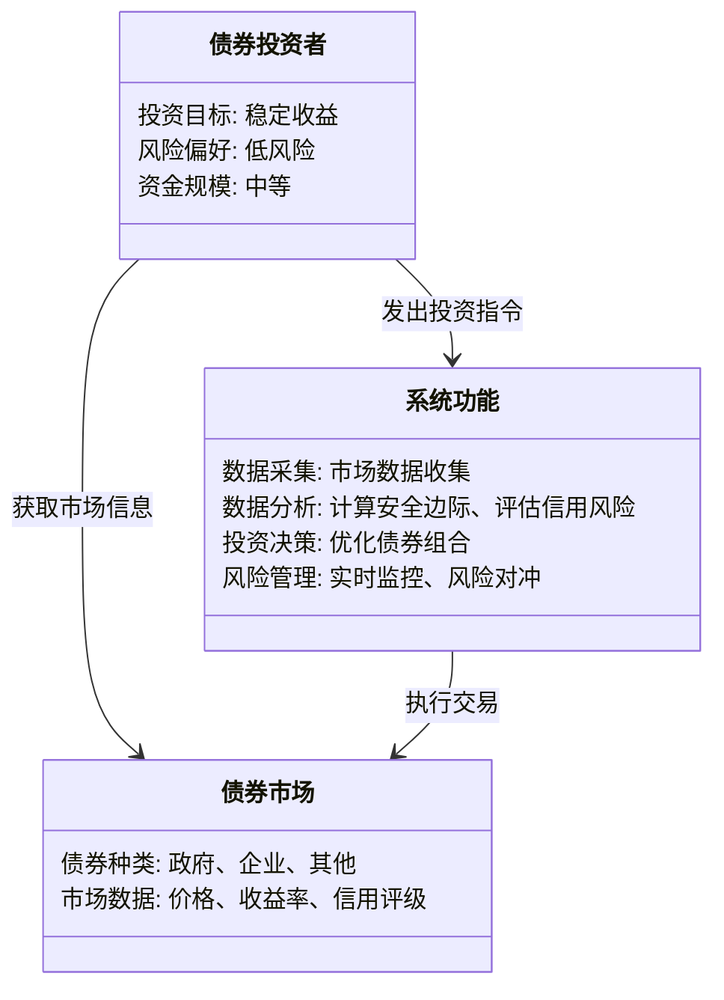
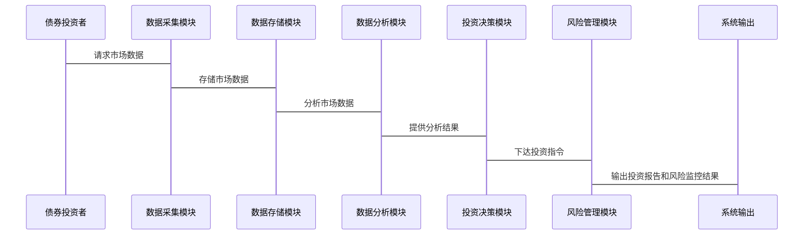

                 


# 格雷厄姆的债券投资策略及其现代应用

## 关键词：债券投资，格雷厄姆，安全边际，风险管理，量化分析，现代应用

## 摘要：本文深入分析了格雷厄姆的经典债券投资策略，探讨其核心原则、历史表现及在现代投资环境中的应用。结合当前市场和技术的变化，本文详细介绍了如何利用量化分析和风险管理优化投资策略，构建高效的投资系统，并通过实际案例展示了策略的实现和应用。

---

## 第1章: 债券投资的基本概念与格雷厄姆的投资理念

### 1.1 债券投资的基本概念

#### 1.1.1 债券的定义与分类

- **定义**：债券是债务工具，发行人承诺在特定时间支付利息和本金。
- **分类**：
  - **政府债券**：由政府发行，信用风险低。
  - **企业债券**：由企业发行，信用风险取决于企业资质。
  - **其他债券**：如可转换债券、垃圾债券等。

#### 1.1.2 债券市场的基本结构与运作机制

- **市场结构**：债券市场由发行者、投资者、承销商和交易商组成。
- **运作机制**：债券通过一级市场发行，二级市场交易，价格受供求关系影响。

#### 1.1.3 债券投资的主要风险与收益特征

- **风险**：利率风险、信用风险、流动性风险。
- **收益**：固定利息收入，资本增值或损失。

### 1.2 格雷厄姆的投资理念

#### 1.2.1 价值投资的起源与发展

- **起源**：20世纪初，格雷厄姆与多德共同提出价值投资理念。
- **发展**：价值投资从股票扩展到债券和其他资产。

#### 1.2.2 格雷厄姆的防御性投资策略

- **防御性投资**：强调本金安全和稳定收益。
- **低风险偏好**：选择高质量债券，避免高风险资产。

#### 1.2.3 安全边际的概念与重要性

- **定义**：债券市场价格低于其内在价值的部分，提供额外的安全空间。
- **重要性**：降低投资风险，确保本金安全。

---

## 第2章: 格雷厄姆债券投资策略的核心原则

### 2.1 格雷厄姆债券投资的核心策略

#### 2.1.1 高质量债券的选择标准

- **信用评级**：选择高信用评级的债券（如AAA级）。
- **期限**：优先选择短期债券，降低利率风险。
- **发行人**：选择信誉良好的政府或企业。

#### 2.1.2 利息收入与资本增值的平衡

- **利息收入**：稳定现金流，抵御通货膨胀。
- **资本增值**：通过价格波动获利，但需谨慎。

#### 2.1.3 债券组合的构建与优化

- **分散投资**：降低单一债券的风险。
- **动态调整**：根据市场变化优化组合。

### 2.2 安全边际的量化与应用

#### 2.2.1 安全边际的计算方法

- **公式**：安全边际 = 债券面值 - 市场价格。
- **应用**：确保债券价格低于其内在价值，降低风险。

#### 2.2.2 安全边际在债券选择中的具体应用

- **案例分析**：某债券面值100，市场价格90，安全边际10，适合投资。

#### 2.2.3 安全边际与投资风险的控制

- **控制风险**：通过安全边际减少市场波动对投资的影响。

---

## 第3章: 格雷厄姆债券投资策略的历史表现与现代应用

### 3.1 格雷厄姆策略的历史表现

#### 3.1.1 格雷厄姆债券投资策略的经典案例

- **案例分析**：20世纪30年代，格雷厄姆通过投资高评级债券实现稳定收益。

#### 3.1.2 策略在不同经济周期中的表现

- **经济繁荣**：债券收益稳定，低于股票，但风险可控。
- **经济衰退**：债券表现优于股票，提供避险功能。

#### 3.1.3 策略的长期有效性分析

- **长期收益**：尽管收益不高，但稳定性强，适合保守投资者。

### 3.2 现代视角下的格雷厄姆债券投资策略

#### 3.2.1 现代债券市场的变化与挑战

- **变化**：市场参与者多元化，交易机制复杂化。
- **挑战**：低利率环境，债券收益率下降，寻找高收益债券困难。

#### 3.2.2 格雷厄姆策略的现代调整与优化

- **调整**：结合量化分析和现代风险管理技术，优化债券组合。
- **优化**：引入动态调整机制，适应市场变化。

#### 3.2.3 格雷厄姆策略的现代演变

- **演变**：从传统防御性投资扩展到量化和主动管理。

---

## 第4章: 现代债券市场的分析与投资策略的演变

### 4.1 现代债券市场的特点与挑战

#### 4.1.1 利率市场化与债券市场的变化

- **利率市场化**：债券收益率受市场供需影响更大。
- **变化**：债券品种多样化，市场规模扩大。

#### 4.1.2 债券市场的流动性与波动性分析

- **流动性**：高流动性债券易于买卖，低流动性债券交易成本高。
- **波动性**：市场波动加剧，投资风险增加。

#### 4.1.3 现代债券市场的参与者与交易机制

- **参与者**：机构投资者、零售投资者、对冲基金等。
- **交易机制**：电子交易平台、做市商制度。

### 4.2 格雷厄姆策略的现代应用

#### 4.2.1 现代债券市场的安全边际计算

- **计算**：考虑债券收益率、信用评级、市场波动等多因素。

#### 4.2.2 现代债券组合的构建与优化

- **构建**：基于量化分析，优化债券组合风险收益比。
- **优化**：利用现代优化算法，动态调整组合。

#### 4.2.3 现代技术在策略应用中的作用

- **技术**：大数据分析、机器学习辅助投资决策。

---

## 第5章: 现代债券投资中的量化分析与风险管理

### 5.1 量化分析在债券投资中的应用

#### 5.1.1 量化分析的基本概念与方法

- **量化分析**：通过数学模型和算法进行投资决策。
- **方法**：统计套利、算法交易、因子分析。

#### 5.1.2 数据分析与债券投资决策

- **数据分析**：利用历史数据预测未来走势。
- **决策支持**：量化模型辅助投资决策。

#### 5.1.3 量化模型在债券组合管理中的应用

- **模型**：构建因子模型，筛选高性价比债券。

### 5.2 风险管理在债券投资中的重要性

#### 5.2.1 债券投资的主要风险类型

- **利率风险**：债券价格受利率波动影响。
- **信用风险**：债券发行人违约风险。

#### 5.2.2 风险管理的基本原则与方法

- **原则**：分散投资、风险定价、动态监控。
- **方法**：VaR模型、信用评分、压力测试。

#### 5.2.3 现代风险管理技术在债券投资中的应用

- **技术**：VaR、CVaR等风险度量方法，信用衍生品对冲信用风险。

---

## 第6章: 现代债券投资中的系统分析与架构设计

### 6.1 系统功能设计

#### 6.1.1 问题场景介绍

- **场景**：投资者需要构建一个基于格雷厄姆策略的债券投资系统。

#### 6.1.2 领域模型设计



### 6.2 系统架构设计


### 6.3 系统接口设计

- **接口1**：数据采集模块与债券市场的接口，获取实时市场数据。
- **接口2**：投资决策模块与风险管理模块的接口，传递投资建议和风险评估结果。

### 6.4 系统交互设计



---

## 第7章: 现代债券投资的项目实战

### 7.1 环境安装

- **工具**：Python、Pandas、NumPy、Matplotlib、Scikit-learn。
- **数据源**：Yahoo Finance API获取债券数据。

### 7.2 核心代码实现

#### 7.2.1 数据采集

```python
import pandas as pd
import requests

def get_bond_data(ticker):
    url = f"https://query1.finance.yahoo.com/ws/fundamentals/v1/{ticker}"
    response = requests.get(url)
    data = response.json()
    return pd.DataFrame(data['result'][0]['annualReports'])
```

#### 7.2.2 安全边际计算

```python
def calculate_margin_of_safety(face_value, market_price):
    return face_value - market_price

# 示例计算
face_value = 100
market_price = 90
margin = calculate_margin_of_safety(face_value, market_price)
print(f"安全边际为: {margin}")
```

#### 7.2.3 风险管理模块

```python
import numpy as np

def portfolio_variance(weights, covariance_matrix):
    return np.dot(weights.T, np.dot(covariance_matrix, weights))

# 示例权重和协方差矩阵
weights = np.array([0.5, 0.5])
covariance_matrix = np.array([[0.04, 0.02], [0.02, 0.04]])

variance = portfolio_variance(weights, covariance_matrix)
print(f"组合方差为: {variance}")
```

### 7.3 案例分析与解读

- **案例分析**：某投资者使用格雷厄姆策略构建债券组合，通过量化分析优化组合，降低风险并提高收益。
- **代码应用**：利用Python代码实现数据采集、分析和风险管理，展示策略的实际应用。

### 7.4 项目小结

- **总结**：通过项目实战，读者可以掌握格雷厄姆策略的现代应用，理解如何结合量化分析和风险管理技术优化投资策略。

---

## 第8章: 总结与展望

### 8.1 总结

- **核心内容**：格雷厄姆的债券投资策略强调安全边际和防御性投资，现代应用结合量化分析和风险管理技术，优化投资组合。
- **重要性**：在当前市场环境下，投资者需要结合传统策略和现代技术，制定科学的投资决策。

### 8.2 展望

- **未来方向**：人工智能和大数据技术在债券投资中的应用将更加广泛，量化分析和风险管理技术将不断进步。
- **挑战**：应对复杂市场环境，投资者需不断提升自身能力，结合技术手段优化投资策略。

---

## 作者：AI天才研究院/AI Genius Institute & 禅与计算机程序设计艺术 /Zen And The Art of Computer Programming

