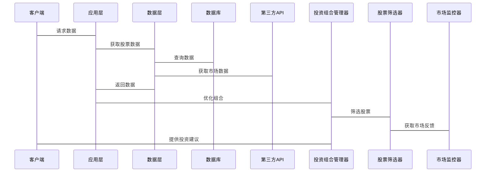

                 


# 格雷厄姆的净净策略在不同市场环境中的应用

> 关键词：格雷厄姆，净净策略，价值投资，市场环境，股票分析

> 摘要：本文深入探讨了本杰明·格雷厄姆提出的净净策略在不同市场环境中的应用。通过分析低市净率股票的投资机会，结合市场周期变化，详细阐述了如何在牛市、熊市和震荡市中优化投资组合。本文还从系统架构设计和算法实现的角度，探讨了如何构建有效的投资系统，并通过具体案例分析了净净策略的实际应用效果。

---

## 第一部分: 格雷厄姆净净策略的背景与基础

### 第1章: 格雷厄姆与净净策略概述

#### 1.1 格雷厄姆的生平与投资理念
- **本杰明·格雷厄姆的简介**：作为价值投资的鼻祖，格雷厄姆是20世纪最伟大的投资思想家之一，他的投资理念深刻影响了巴菲特等一代投资者。
- **格雷厄姆的价值投资理论**：格雷厄姆主张以低于股票内在价值的价格买入股票，长期持有，等待市场重新评估其价值。
- **净净策略的核心思想**：专注于低市净率股票的投资，寻找市场低估的企业，通过安全边际降低投资风险。

#### 1.2 净净策略的定义与特点
- **净净策略的定义**：净净策略是指通过计算股票的资产净值与市价的比率，选择资产净值远高于市价的股票进行投资。
- **净值与市价的对比分析**：当市价低于资产净值时，股票具有投资价值。
- **净净策略与其他投资策略的区别**：与成长型投资不同，净净策略更注重安全性和低估价值，而非企业的成长潜力。

#### 1.3 净净策略的理论基础
- **股票的内在价值与市场价值**：内在价值是企业的真实价值，而市场价值受情绪和市场波动影响。
- **市场先生的非理性与投资机会**：格雷厄姆认为市场先生的情绪波动为理性投资者提供了廉价买入优质资产的机会。
- **安全边际的概念与重要性**：安全边际是指股票的内在价值与市价之间的差额，确保即使市场低估企业价值，投资者仍能获得超额收益。

### 第2章: 净净策略的核心原理

#### 2.1 净值与市价的数学关系
- **净值（N）的计算公式**：
  $$ N = \frac{\text{资产净值}}{\text{发行股份}} $$
- **市价（P）与净值（N）的比较**：
  $$ P < N \Rightarrow \text{投资机会} $$

#### 2.2 净净策略的筛选标准
- **低市净率股票的筛选**：选择市净率低于1的股票。
- **安全边际的计算方法**：
  $$ \text{安全边际} = N - P $$
- **案例分析**：假设某股票的资产净值为$100，发行股份为10，市价为$8，则净净策略认为该股票具有投资价值。

#### 2.3 净净策略的优缺点分析
- **优点**：低估股票的潜在价值，适合长期投资者。
- **缺点**：忽视其他财务指标的影响，如收入增长率和盈利能力。

---

## 第二部分: 不同市场环境下的策略调整

### 第3章: 牛市、熊市与震荡市中的净净策略

#### 3.1 牛市环境中的策略应用
- **高市净率市场的风险**：牛市中市净率偏高，净净策略可能错过部分优质成长股。
- **净净策略在牛市中的局限性**：低市净率股票在牛市中可能表现不佳，需结合其他策略。

#### 3.2 熊市环境中的策略应用
- **净净策略的优势**：熊市中市场情绪低落，低市净率股票往往被低估，是净净策略的最佳时机。
- **低价股票的反弹机会**：熊市后市可能有较大反弹空间，低市净率股票更具弹性。

#### 3.3 震荡市环境中的策略调整
- **灵活调整投资组合**：根据市场波动，动态调整股票组合的市净率分布。
- **优化安全边际的计算**：在震荡市中，需更加严格地筛选股票，确保安全边际足够宽。

---

## 第三部分: 净净策略的系统分析与架构设计

### 第4章: 投资系统的需求分析

#### 4.1 投资目标的确定
- **投资目标**：追求长期稳定的超额收益。
- **市场环境的动态变化**：系统需实时监控市场波动，及时调整策略。

#### 4.2 系统架构设计
- **领域模型（Mermaid类图）**：
  ```mermaid
  classDiagram
  class 股票筛选器 {
    <属性>
    股票代码
    市净率
    资产净值
    <方法>
    计算市净率()
    比较市净率()
  }
  class 投资组合管理器 {
    <属性>
    投资组合
    安全边际
    <方法>
    优化组合()
    调整持仓()
  }
  class 市场监控器 {
    <属性>
    市场指数
    市场情绪
    <方法>
    监控市场()
    提供反馈()
  }
  股票筛选器 --> 投资组合管理器
  投资组合管理器 --> 市场监控器
  ```
- **系统架构图（Mermaid架构图）**：
  ```mermaid
  architectureChart
  客户端 --> 应用层: 请求数据
  应用层 --> 数据层: 获取股票数据
  数据层 --> 数据库: 查询数据
  数据层 --> 第三方API: 获取市场数据
  应用层 --> 投资组合管理器
  投资组合管理器 --> 股票筛选器
  股票筛选器 --> 市场监控器
  ```

#### 4.3 系统接口设计
- **接口1：股票筛选器**：接收股票数据，计算市净率，返回符合条件的股票列表。
- **接口2：投资组合管理器**：接收股票列表，优化投资组合，调整持仓。
- **接口3：市场监控器**：实时监控市场数据，提供市场反馈。

#### 4.4 系统交互（Mermaid序列图）：


---

## 第四部分: 净净策略的实战分析

### 第5章: 净净策略的项目实战

#### 5.1 环境安装与数据准备
- **环境安装**：安装Python、Pandas、Matplotlib等工具。
- **数据准备**：获取股票数据，包括市净率、资产净值等。

#### 5.2 核心算法实现
- **Python源代码实现**：
  ```python
  import pandas as pd
  import matplotlib.pyplot as plt

  def calculate_market_price(company_data):
      return company_data['market_price']

  def calculate_net_value(company_data):
      return company_data['assets_net_value']

  def net_net_strategy(company_data):
      market_price = calculate_market_price(company_data)
      net_value = calculate_net_value(company_data)
      safety_margin = net_value - market_price
      return safety_margin

  # 示例数据
  company_data = {
      'stock_code': ['A', 'B', 'C'],
      'market_price': [8, 10, 12],
      'assets_net_value': [10, 12, 14]
  }

  # 计算并筛选股票
  results = []
  for stock in company_data['stock_code']:
      mp = company_data['market_price'][stock]
      nv = company_data['assets_net_value'][stock]
      sm = nv - mp
      results.append({'stock': stock, 'safety_margin': sm})

  print(results)
  ```

#### 5.3 案例分析与解读
- **案例分析**：以某公司为例，计算其安全边际，判断是否符合净净策略的投资标准。
- **实际案例分析**：分析2020年新冠疫情后的市场，低市净率股票的表现。

#### 5.4 项目小结
- **策略的有效性**：在熊市和震荡市中，净净策略表现优异。
- **策略的局限性**：在牛市中可能错失部分成长股的机会。

---

## 第五部分: 最佳实践与总结

### 第6章: 最佳实践、小结与注意事项

#### 6.1 最佳实践
- **持续学习市场动态**：及时了解市场变化，灵活调整策略。
- **分散投资**：避免过度集中，降低投资风险。
- **长期持有**：耐心等待市场重新评估企业价值。

#### 6.2 小结
- 净净策略是一种有效的价值投资方法，尤其适合在市场低估时期应用。
- 投资者需结合市场环境，灵活调整策略，才能获得长期稳定的收益。

#### 6.3 注意事项
- **风险管理**：设置止损点，避免重大损失。
- **定期复盘**：分析投资组合的表现，优化策略。
- **避免情绪化决策**：坚持理性分析，不被市场波动干扰。

---

## 第六部分: 拓展阅读与进一步学习

### 第7章: 拓展阅读

- **推荐书籍**：
  - 《证券分析》——本杰明·格雷厄姆
  - 《巴菲特投资策略》——彼得·林奇
- **推荐博客与网站**：
  - 投资分析网站（如Seeking Alpha）
  - 价值投资论坛（如雪球财经）

---

## 作者信息

作者：AI天才研究院/AI Genius Institute & 禅与计算机程序设计艺术 /Zen And The Art of Computer Programming

